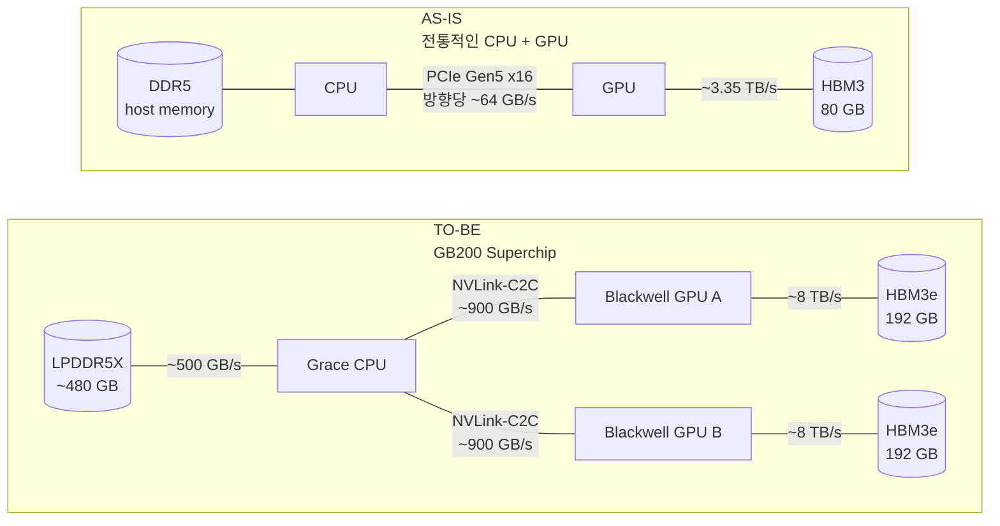
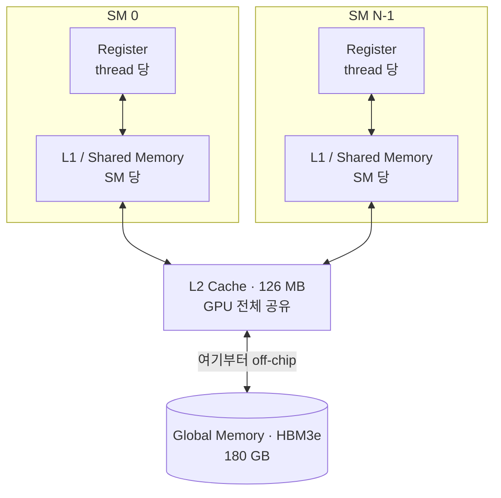
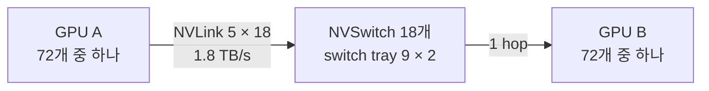

# Introduction

vLLM이나 SGLang으로 서빙을 해보면서 그 아래 hardware가 계속 궁금했다.
필요할 때마다 조금씩 찾아보긴 했어도 막힌 부분만 해결하고 넘어갔지, 작정하고 전체를 들여다본 적은 없었다.

그래서 이번에는 순서를 뒤집어 hardware부터 올라오는 책을 골랐다.
Chris Fregly의 *AI Systems Performance Engineering* (O'Reilly) $\_[$[$\_{1}$](https://github.com/cfregly/ai-performance-engineering)$\_]$인데, hardware와 software, LLM 이 세 가지가 한 권 안에서 맞물려 있는 게 마음에 들었다.
Grace Blackwell 같은 최신 chip에서 출발해 OS와 CUDA kernel, PyTorch를 지나 LLM 추론 최적화까지 올라가는 20장 1,000여 page 짜리 책이다.

이번 글에서는 Chapter 1 (Introduction and AI System Overview)과 Chapter 2 (AI System Hardware Overview)를 다룬다.

<!--More-->

---

# Chapter 1: Introduction and AI System Overview

Model 크기는 수백만에서 수십억으로, 다시 수조 parameter로 뛰었다.
10배씩 커질 때마다 질적으로 새로운 능력이 열렸지만 그만큼 비용과 자원도 같이 폭발했다.

이 규모에 오면 system에서 짜낸 성능 한 조각이 수백만에서 수십억 달러의 절감으로 환산되고, 병목 하나를 없애는 것이 학습 처리량과 추론 지연에 불균형하게 큰 영향을 준다.
그래서 저자는 AI systems performance engineering을 단순히 빠르게 만드는 일이 아니라, 불가능하던 것을 가능하면서 감당할 수 있는 수준으로 만드는 일이라고 정의한다.

## The AI Systems Performance Engineer

AI systems performance engineer는 model과 그 model이 올라가는 system의 성능을 책임지는 역할이다.
OS 수준의 고려사항부터 memory 계층, network 기초, Python과 C++, PyTorch와 OpenAI Triton과 CUDA까지 걸쳐 있어야 해서, 하루는 GPU kernel 효율을 들여다보고 다음 날은 OS thread scheduling을 만지는 식이 된다.

한 가지 인상적인 건 hardware, software, algorithm을 따로 최적화하는 게 아니라 **codesign** 해야 한다는 주장을 책 전체가 반복한다는 점이다.
세 영역 중 하나만 파고들어서는 서로가 서로의 한계를 만들고 있다는 것을 못 보기 때문이다.

### Benchmarking and Profiling

학습과 추론 workload에서 latency, throughput, memory 사용량을 측정하는 것이 출발점이다.
병목을 찾으려면 Nsight Systems와 Nsight Compute, PyTorch profiler를 번갈아 돌려야 하는데, stack의 층마다 보이는 것이 다르기 때문이다.
한 번 재고 마는 게 아니라 자동화된 성능 test를 걸어둬야 성능 회귀를 개발 주기 초반에 잡을 수 있다는 조언도 붙는다.

병목을 찾았으면 근본 원인까지 내려가야 하는데, 비효율적인 CUDA kernel인지, 불필요한 통신 overhead인지, workload 불균형인지에 따라 처방이 완전히 달라진다.
Transformer Engine $\_[$[$\_{2}$](https://docs.nvidia.com/deeplearning/transformer-engine/index.html)$\_]$을 써서 matrix 연산을 바꾸는 것, 병렬도를 올리는 것, attention algorithm의 memory 관리를 손보는 것이 전부 다른 처방이다.

사소한 수정이 큰 결과를 내기도 하는데, Python으로 짠 전처리 한 단계가 전체 학습 pipeline을 붙들고 있다면, 그 부분만 C++로 다시 쓰거나 NumPy를 그대로 대체하면서 array 연산을 CPU와 GPU에 분산시키는 NVIDIA cuPyNumeric $\_[$[$\_{3}$](https://docs.nvidia.com/cupynumeric/)$\_]$으로 바꾸면 병목이 사라진다.

### Scaling Distributed Training and Inference

연구 단계의 작은 workload를 production 규모로 올리는 일이다.
GPU 8장에서 80,000장으로 가면서 overhead와 효율 손실을 최소로 유지해야 한다.

학습에서는 all-reduce 같은 collective를 NCCL $\_[$[$\_{4}$](https://docs.nvidia.com/deeplearning/nccl/user-guide/docs/index.html)$\_]$로 최적화하고, 추론에서는 NIXL (NVIDIA Inference Xfer Library) $\_[$[$\_{5}$](https://github.com/ai-dynamo/nixl)$\_]$이 GPU memory와 storage 계층을 가로지르는 point-to-point 전송을 맡는다.
All-reduce, all-to-all, all-gather 같은 집합 연산은 학습과 추론 양쪽에서 계속 나온다.

Model이 GPU 한 장에 안 들어가면 data, tensor, pipeline parallelism으로 쪼개야 하고, MoE model이라면 expert parallelism이라는 선택지가 추가된다.

### Managing Resources Efficiently

CPU core, GPU memory, interconnect 대역폭, storage I/O를 남김없이 쓰는 일이다.
GPU에 data가 끊기지 않게 밀어넣고, thread를 특정 CPU core에 고정하고, context switch overhead를 줄이고, 대형 model에서 OOM이 나지 않도록 memory 사용을 조율한다.

GPU 한 장을 다 쓸 필요가 없는 job이라면 MIG (multi-instance GPU) $\_[$[$\_{6}$](https://docs.nvidia.com/datacenter/tesla/mig-user-guide/)$\_]$로 GPU를 쪼개서 전체 활용률을 올리는 편이 낫다.

### Cross-Team Collaboration

이 역할은 혼자 완결되지 않아서, 연구자와 data scientist, application 개발자는 물론 network와 storage를 포함한 infra 팀과도 같이 움직여야 한다.

성능을 올리려고 model code를 고치려면 연구자와 조율해야 하고, GPU driver를 새로 올리려면 infra 팀이 필요하다.
CUDA driver나 version을 바꾸는 일 하나에도 DevOps, infra, support 팀이 엮인다.
Performance engineer는 이 교차점에 앉아서 AI와 computer science, systems engineering의 언어를 모두 쓸 줄 알아야 한다.

### Transparency and Reproducibility

가정이 아니라 data를 믿고, 모든 것을 측정하고, 측정한 것을 공개해서 남이 재현하고 그 위에 쌓을 수 있게 하는 것이다.
DeepSeek이 Open-Source Week $\_[$[$\_{7}$](https://github.com/deepseek-ai/open-infra-index)$\_]$에서 infra 최적화를 통째로 공개한 것이 이 태도의 사례로 제시된다.

MLPerf $\_[$[$\_{8}$](https://mlcommons.org/benchmarks/)$\_]$ 같은 산업 benchmark는 codesign의 효과를 세대별로 정량화해준다.
MLPerf Training v5.0 (2025)에서 Blackwell 기반 GB200 NVL72는 동급 Hopper cluster 대비 GPU 당 학습 처리량이 최대 2.6배, MLPerf Inference v5.0에서는 추론 처리량이 약 3.4배 높게 나왔다 $\_[$[$\_{9}$](https://www.nvidia.com/en-us/data-center/resources/mlperf-benchmarks/)$\_]$.
단, MLPerf 자신이 GPU 당 수치는 platform 간 비교의 주 지표가 아니라고 경고한다.
올바른 비교 기준은 system 수준의 end-to-end 처리량이고, GPU 당 숫자는 component 수준 지표로만 봐야 한다.

저자가 경계하는 것은 "이거 바꿨더니 빨라진 것 같다" 수준의 일화적 최적화다.
가설을 세우고, 재현 가능한 benchmark로 측정하고, 고치고, 다시 측정하고, 그 전 과정을 공개하는 것이 이 분야를 진전시키는 방식이라는 주장이다.

## DeepSeek Scales to \~680-Billion Parameter Models Despite US Export Hardware Restrictions in China

책은 DeepSeek 이야기로 시작하는데, 2024년 말 미국의 수출 규제 $\_[$[$\_{10}$](https://www.cnbc.com/2023/10/17/us-bans-export-of-more-ai-chips-including-nvidia-h800-to-china.html)$\_]$ 때문에 DeepSeek은 최신 Blackwell (B200, B300)이나 Hopper (H100, H200)를 쓸 수 없었고, 규제를 준수하는 NVIDIA H800으로 frontier model을 학습해야 했다.

H800은 H100의 수출 규제 대응 판본인데, 책은 "HBM 용량과 대역폭은 유지하고 NVLink와 FP64만 깎았다" 정도로만 서술하고 넘어간다.
같은 PCIe 80GB 폼팩터로 나란히 놓으면 무엇이 잘렸는지가 훨씬 선명하다.

| 항목             | H100 80GB PCIe $\_[$[$\_{11}$](https://lenovopress.lenovo.com/lp1732-thinksystem-nvidia-h100-pcie-gen5-gpu)$\_]$ | H800 80GB PCIe $\_[$[$\_{12}$](https://lenovopress.lenovo.com/lp1814-thinksystem-nvidia-h800-pcie-gen5-gpu)$\_]$ | 비고 |
| ---------------- | ---------------------------------------------------------------------------------------------------------------- | ---------------------------------------------------------------------------------------------------------------- | ---- |
| Memory           | 80 GB HBM2e                                                                                                      | 80 GB HBM2e                                                                                                      | 동일 |
| Memory 대역폭    | 2 TB/s                                                                                                           | 2 TB/s                                                                                                           | 동일 |
| NVLink           | 600 GB/s (SXM \~900 GB/s)                                                                                        | 400 GB/s (SXM \~400 GB/s)                                                                                        | −33% |
| FP64             | 26 TFLOPS                                                                                                        | 0.8 TFLOPS                                                                                                       | 1/32 |
| FP64 Tensor Core | 51 TFLOPS                                                                                                        | 0.8 TFLOPS                                                                                                       | 1/64 |
| FP32             | 51 TFLOPS                                                                                                        | 51 TFLOPS                                                                                                        | 동일 |
| TF32             | 756 TFLOPS                                                                                                       | 756 TFLOPS                                                                                                       | 동일 |
| FP16 / BF16      | 1,513 TFLOPS                                                                                                     | 1,513 TFLOPS                                                                                                     | 동일 |
| FP8 / INT8       | 3,026 TFLOPS                                                                                                     | 3,026 TFLOPS                                                                                                     | 동일 |
| TDP              | 350 W                                                                                                            | 350 W                                                                                                            | 동일 |

Sparsity를 적용한 기준으로 TF32부터 FP8까지 AI 연산에 실제로 쓰는 정밀도는 한 자리도 다르지 않고, memory 용량과 대역폭은 물론 TDP까지 같으니 결국 깎인 것은 NVLink와 FP64 둘뿐이다.
FP64가 26에서 0.8 TFLOPS로 1/32, FP64 Tensor Core는 51에서 0.8 TFLOPS로 1/64까지 내려가는데, HPC 입장에서는 치명적이지만 LLM 학습에서는 FP64를 쓸 일이 없으니 실질적인 타격은 결국 NVLink 쪽이다.

DeepSeek이 실제로 쓴 건 PCIe가 아니라 SXM 판본이고, 책이 드는 수치도 이 기준이다.
H800은 어느 폼팩터든 400 GB/s인데 H100 $\_[$[$\_{13}$](https://www.nvidia.com/en-us/data-center/h100/)$\_]$은 SXM에서 \~900 GB/s까지 올라가므로, 표의 −33%가 아니라 절반 넘게 깎인 셈이 된다.
연산 성능은 그대로 두고 GPU 간 통신만 묶어놓은 chip이라, 다중 GPU 확장성이 곧바로 병목이 되는 구조다.

다만 책을 직접 읽으면 이 지점에서 헷갈릴 수 있다.
"H100은 3.35 TB/s의 memory 대역폭을 제공하는 반면 H800은 throughput이 제한돼 data 전송이 훨씬 느리다"라는 문장이 나와서 memory가 느려진 것처럼 읽히는데, 여기서 말하는 throughput은 그 앞에서 다룬 NVLink 쪽이다.
저자도 같은 문단 앞부분에서는 "HBM capacity and bandwidth largely similar"라고 쓰고 있고, 위 표에서도 memory 대역폭은 양쪽 다 2 TB/s로 같다.

그럼에도 DeepSeek은 이 환경에서 \~680B parameter MoE (mixture of experts) model인 DeepSeek-V3 $\_[$[$\_{14}$](https://huggingface.co/deepseek-ai/DeepSeek-V3)$\_,$[$\_{15}$](https://arxiv.org/abs/2412.19437)$\_]$를 학습시켰다.
Token 하나당 전체 680B가 아니라 약 37B만 활성화되는 구조로, 256개 expert 중 router가 고른 8개와 공유 expert 1개, 총 9개만 쓴다.

그리고 computation과 communication을 겹치는 DualPipe parallelism algorithm을 직접 구현해 H800의 약한 interconnect를 감췄다.
기본 NCCL collective를 우회하는 custom CUDA kernel까지 짜서 data 전송과 연산을 맞물려 돌렸다.

비용을 보면 차이가 더 분명하다.
책은 GPT-4의 학습 비용을 약 \\$100M, Gemini Ultra를 약 \\$191M으로 적는 반면, DeepSeek은 DeepSeek-R1을 \\$6M 미만으로 학습했다고 주장한다.
Stanford HAI의 AI Index 2024 $\_[$[$\_{16}$](https://hai.stanford.edu/ai-index/2024-ai-index-report)$\_]$는 GPT-4를 \\$78M으로 더 낮게 잡지만 Gemini Ultra는 \\$191M으로 같고, 어느 추정을 쓰든 자릿수가 다르다는 점은 그대로다.
물론 이 \\$6M에 단일 training run만 포함된 것인지 실험과 model 개발 pipeline 전체가 빠진 것인지에 대한 의심은 남아 있다.
다만 발표 직후 NVIDIA 주가가 하루에 약 17% 빠졌다는 사실만으로도 이 결과가 시장에 어떤 의미였는지는 충분히 드러난다.

DeepSeek은 2025년 2월 Open-Source Week에 최적화 결과물을 대거 공개했는데, 각각이 stack의 서로 다른 층을 겨냥한다.

- FlashMLA $\_[$[$\_{17}$](https://github.com/deepseek-ai/FlashMLA)$\_]$: CUDA C++로 작성한 attention kernel
- DeepGEMM $\_[$[$\_{18}$](https://github.com/deepseek-ai/DeepGEMM)$\_]$: FP8에 최적화된 matrix multiplication library
- DeepEP $\_[$[$\_{19}$](https://github.com/deepseek-ai/DeepEP)$\_]$: MoE 전용 통신 library
- EPLB (expert parallelism load balancer) $\_[$[$\_{20}$](https://github.com/deepseek-ai/EPLB)$\_]$: 부하가 몰린 expert를 복제해 분산
- DualPipe $\_[$[$\_{21}$](https://github.com/deepseek-ai/DualPipe)$\_]$: forward/backward 연산과 통신을 겹치는 양방향 pipeline parallelism
- 3FS (Fire-Flyer File System) $\_[$[$\_{22}$](https://github.com/deepseek-ai/3FS)$\_]$: 분산 file system

Kernel부터 file system까지 전부 손을 댔는데, 어느 한 층만 최적화해서는 이 정도 결과가 나오지 않는다.

## Toward 100-Trillion-Parameter Models

책이 처음부터 끝까지 끌고 가는 가상의 목표로, 인간 신피질의 시냅스 연결이 약 100조 개로 추정되고, 시냅스 하나를 parameter 하나로 보는 비유에서 나왔다.

Dense model 기준으로 100조 parameter를 29조 token으로 학습시키려면 대략 $1.2 \times 10^{29}$ FLOPS가 필요한데, memory 쪽은 사정이 더 나쁘다.

$$
100\ \text{T} \times 16\ \text{bit} \div 8 = 182\ \text{TB}
$$

16-bit 정밀도로 weight를 올려놓기만 하는 데 182 TB가 드는데, activation memory와 optimizer state, 입력은 아직 계산에 넣지도 않았다.

이걸 Blackwell B200 (192 GB 중 180 GB 가용)으로 채우려면 약 1,000장이 필요하고 node 당 GPU 8장이니 약 125 node가 되는데, 288 GB짜리 B300을 쓰면 약 700장, 약 86 node로 줄어든다.
어느 쪽이든 model을 올려놓기만 하는 데 드는 숫자라 실제로 학습을 돌리려면 여기서 더 올라간다.

그래서 답으로 제시되는 것이 sparsity, 구체적으로는 MoE인데, token마다 일부 expert만 활성화하면 총 parameter가 늘어도 token 당 FLOPS는 거의 일정하게 유지되기 때문이다.
Google의 Switch Transformer $\_[$[$\_{23}$](https://arxiv.org/abs/2101.03961)$\_]$는 1.6T parameter MoE로 dense model과 같은 정확도를 훨씬 적은 연산으로, 7배 빠르게 학습했다.

## NVIDIA's "AI Supercomputer in a Rack"

이 규모를 감당하려고 NVIDIA가 내놓은 것이 rack 단위로 통째로 파는 system이고, 스스로 "rack에 담은 AI supercomputer" $\_[$[$\_{24}$](https://www.nvidia.com/en-us/data-center/gb200-nvl72/)$\_]$라고 부른다.
Grace Blackwell Superchip 36개가 rack 하나에 들어가는데, superchip 하나가 72-core Grace CPU 1개와 Blackwell GPU 2개이므로 rack 전체로는 Grace CPU 36개와 Blackwell GPU 72개가 되고 여기서 NVL72라는 이름이 나온다.

| 항목      | 수치                                                                        |
| --------- | --------------------------------------------------------------------------- |
| 연산      | \~1.44 exaFLOPS (FP4) / \~720 petaFLOPS (FP8), 2:1 structured sparsity 기준 |
| HBM3e     | \~13.5 TB (192 GB × 72)                                                     |
| 총 memory | \~30 TB (Grace CPU memory 포함)                                             |
| 전력      | 120\~132 kW                                                                 |

수치보다 중요한 건 이 72개 GPU가 NVLink와 NVSwitch로 묶여 **하나의 NVLink domain**을 이룬다는 점이다.
학습의 PyTorch든 추론의 vLLM이든 rack 전체를 한 덩어리로 보고 data, tensor, pipeline, expert parallelism을 걸 수 있다는 뜻이라, 72장을 일일이 배선하고 통신을 조율하던 일이 사라진다.

Rack을 여러 대 묶어 ultrascale cluster로 키울 수도 있고, 직접 들여놓을 형편이 아니어도 AWS나 GCP, Azure, CoreWeave 같은 곳에서 클릭 몇 번으로 (그리고 그만큼의 돈으로) 빌릴 수 있다.

GB200 NVL72는 이 계보의 현재 지점일 뿐이라, GB300 NVL72 Ultra가 GPU 당 HBM3e를 288 GB로 올린 채 같은 72-GPU NVLink domain과 \~130 TB/s를 유지하고, 2026년 Vera Rubin VR200과 2028년 Feynman이 같은 방향으로 이어진다.
저자는 책이 Grace Blackwell 세대에 집중하지만 거기서 다루는 최적화 원칙은 이전 세대들에서 축적된 것이고 다음 세대에도 그대로 적용된다고 못박는데, 특정 chip 세대에 매이는 공부가 아니라는 뜻이다.

배선과 topology가 실제로 어떻게 생겼는지는 Chapter 2에서, 세대별 로드맵은 Chapter 2 마지막에서 다룬다.

## Mechanical Sympathy: Hardware-Software Codesign

Mechanical sympathy는 software engineer Martin Thompson이 만든 표현으로, 자기 차의 기계적 특성을 속속들이 알았던 F1 champion Jackie Stewart에서 따왔다.
Computing에서는 **자신이 돌아가는 hardware를 깊이 이해하고 쓴 software**를 의미한다.

대표적인 예가 FlashAttention $\_[$[$\_{25}$](https://arxiv.org/abs/2205.14135)$\_]$으로, Transformer의 attention 연산을 tiling해서 GPU memory에 대한 read/write 횟수를 줄였고, 긴 sequence에서 학습과 추론 모두 2\~4배 빨라졌다.
Memory 사용량까지 줄었기 때문에 거의 하룻밤 사이에 여러 library의 기본값이 됐다.

DeepSeek이 DeepSeek-V2에서 내놓은 MLA (multi-head latent attention) $\_[$[$\_{26}$](https://arxiv.org/abs/2405.04434)$\_]$도 같은 계열인데, NVIDIA memory hierarchy와 Tensor Core를 더 잘 쓰도록 attention 연산을 재구성한 것이다.
2025년에 CUDA kernel로 구현해 공개한 FlashMLA $\_[$[$\_{17}$](https://github.com/deepseek-ai/FlashMLA)$\_]$가 같은 H800에서 FlashAttention보다도 높은 처리량을 냈다.

반대 방향도 그대로 성립하는데, Transformer와 저정밀도 quantization (FP8/FP4)이 유행하자 NVIDIA는 Transformer Engine과 전용 저정밀도 Tensor Core를 hardware에 넣었다.
Attention의 softmax가 병목이 되자 지수 연산을 담당하는 SFU (special function unit)까지 손봤는데, SemiAnalysis는 Blackwell Ultra에서 이 unit이 기존 Blackwell 대비 2.5배 빨라졌다고 전한다 $\_[$[$\_{27}$](https://newsletter.semianalysis.com/p/nvidia-gtc-2025-built-for-reasoning-vera-rubin-kyber-cpo-dynamo-inference-jensen-math-feynman)$\_]$.
Hardware가 algorithm을 낳고, algorithm이 다시 hardware를 낳는 선순환이다.

## Measuring "Goodput" Useful Throughput

이 책에서 가장 중요한 개념으로, FLOPS나 GPU utilization은 높게 나와도 실제로는 통신 대기, idle, 재시작으로 낭비되는 시간이 대부분일 수 있다.
그래서 실제로 유용한 일을 한 처리량만 세자는 게 goodput인데, Meta가 자사 ML cluster 두 곳의 11개월치 job을 분석한 논문 $\_[$[$\_{28}$](https://arxiv.org/abs/2410.21680)$\_]$에서는 이를 effective training time ratio라는 지표로 제시했다.

예를 들어 GPU 8장짜리 node가 100,000 token을 10초에 처리했다면 goodput은 10,000 token/s다.
GPU 한 장의 이론적 최대가 1,500 token/s라면 8장은 12,000 token/s이므로, 이 node의 효율은 83.3%다.

$$
\text{Goodput} = \frac{10,000}{1,500 \times 8} = 0.833
$$

분모가 되는 이론적 최대치를 NVIDIA는 **speed of light** (SOL)라고 부른다.
Nsight Compute $\_[$[$\_{29}$](https://docs.nvidia.com/nsight-compute/ProfilingGuide/index.html)$\_]$를 열면 첫 section 이름이 아예 "GPU Speed Of Light"이고, 각 unit의 throughput을 "achieved percentage of utilization with respect to the theoretical maximum"으로 보고한다.

이 논문이 분석한 cluster는 100% 활용된 것처럼 보였지만, 통신 지연·불충분한 병렬화·data 지연·장애 복구 때문에 연산의 70\~75%가 날아가고 있었다는 분석이다.
Job 선점 (preemption), network hotspot, 복구 불가능한 fault가 주된 원인이었다.

Goodput을 20%만 올려도 대규모 환경에서는 hardware 비용이 수백만 달러 단위로 줄어든다.
Performance engineer라는 직무가 존재하는 이유가 결국 여기에 있다는 것이 저자의 주장이다.

## Book Roadmap and Methodology

1편이니 책 전체가 어디로 가는지도 정리해둔다.

| 구간           | 주제                    | 주요 내용                                                                                                                                                                                |
| -------------- | ----------------------- | ---------------------------------------------------------------------------------------------------------------------------------------------------------------------------------------- |
| Chapter 3\~5   | OS · 네트워크 · storage | CPU/memory pinning, NUMA, hugepage Docker container, Kubernetes orchestration GPU 환경의 network·storage I/O 설정                                                              |
| Chapter 6\~12  | CUDA kernel 최적화      | Occupancy, warp 효율, 산술 강도 Kernel 내부/외부 pipelining, CUDA graph FlashAttention·MLA 같은 hardware-aware algorithm                                                       |
| Chapter 13\~14 | PyTorch와 compiler      | PyTorch profiling·scaling PyTorch compiler, OpenAI Triton, XLA backend 병렬화 (DP, FSDP, TP, PP, CP, MoE) Activation checkpointing, optimizer state sharding, CPU offload |
| Chapter 15\~19 | 추론                    | Disaggregated prefill/decode, KV cache 전송 vLLM·SGLang·TensorRT-LLM, NVIDIA Dynamo와 NIXL Speculative decoding, 4-bit quantization, distillation, pruning                     |
| Chapter 20     | AI 보조 최적화          | AI로 AI system을 최적화하는 시도 자기개선 agent                                                                                                                                     |
| 부록           | Checklist               | 175개가 넘는 성능·비용 최적화 항목                                                                                                                                                       |

Triton과 XLA 같은 compiler에 두 장을 배정한 것은, CUDA kernel을 새로 짜려면 원래 C++를 깊이 알아야 하는데 이 compiler들이 그 문턱을 낮춰 Python만으로도 custom kernel을 만들 수 있게 해주기 때문이다.

서술 방식은 처음부터 끝까지 실측에 붙어 있어서, 실제 실행 기록과 case study, benchmark 결과, profiling data를 펼쳐놓고 병목을 짚은 다음 개선됐는지를 확인하는 순서로 진행된다.
마지막 부록에는 그렇게 축적된 성능·비용 최적화 항목이 175개 넘게 모여 있다.

## Key Takeaways

책이 장 끝에 정리해둔 여섯 가지인데, 대부분 뒤 장들에서 반복해서 돌아오는 원칙이다.

- **Measure goodput**: 순수 FLOPS나 활용률 말고, GPU가 실제로 유용한 연산을 한 시간의 비율을 본다. Nsight Systems/Compute와 PyTorch profiler로 그 비율을 재고 끌어올린다.
- **Prefer skillful engineering optimizations instead of brute-force spending**: Hardware를 더 사는 것은 만능이 아니다. DeepSeek은 interconnect가 제한된 H800으로 frontier model을 훨씬 싸게 학습시켰다.
- **Look for order-of-magnitude impact with incremental optimizations**: 규모가 커지면 몇 %의 효율 개선이 수백만 달러가 되고, 반대로 중복 연산이나 느린 data pipeline 같은 작은 비효율도 조용히 비용을 불린다.
- **Approach performance tuning with a profile-driven mindset**: 연산인지, memory 대역폭인지, latency인지, cache miss인지, 통신 지연인지를 profiler로 특정한 다음 그 병목만 친다.
- **Maintain a holistic view**: GPU, CPU, memory, network 같은 hardware와 algorithm, library 같은 software 중 한 층만 약해도 전체가 막힌다.
- **Stay informed on the latest hardware, software, and algorithms**: 통합 CPU-GPU memory, 더 빠른 interconnect, 새로운 정밀도 형식이 나올 때마다 최적 전략 자체가 바뀐다.

## Conclusion

이 장의 결론은 규모가 커지면 최적화가 선택이 아니라는 것이다.
동작하는 system과 아예 쓸 수 없는 system을 가르는 것이 최적화이고, hardware든 algorithm이든 전통적인 접근은 이 규모에서 무너진다.

Performance engineer의 일은 하루는 GPU profiling, 다음 날은 network topology, 그 다음 날은 algorithm 복잡도를 보는 식으로 다분야에 걸쳐 있다.
저자가 이 역할의 좌우명으로 꼽는 것이 mechanical sympathy다.

---

# Chapter 2: AI System Hardware Overview

Supercomputer 한 대 분량의 AI hardware를 rack 하나에 압축해 넣는다는 것이 이 장의 출발점이다.
NVIDIA가 CPU와 GPU를 어떻게 하나의 superchip으로 융합했고, 그것을 수십 개 묶어 어떻게 상자 하나짜리 AI supercomputer를 만들었는지를 따라간다.

먼저 Grace CPU와 Blackwell GPU라는 기본 블록을 보고, 이들의 긴밀한 통합과 거대한 memory pool이 왜 AI engineer의 삶을 편하게 만드는지 확인한다.
그 다음 GPU 72개를 한 대처럼 묶는 network fabric으로 시야를 넓히면서, 이 hardware가 어떻게 수조 parameter model의 학습과 서빙을 가능하게 만드는지까지 간다.

## The CPU and GPU Superchip

NVIDIA의 확장 전략은 CPU와 GPU를 한 module에 묶는 것에서 시작한다.
Hopper 세대부터 ARM 기반 CPU와 GPU를 같은 package에 넣기 시작했고, 첫 구현인 GH200 (Grace Hopper)은 Grace CPU 1개에 Hopper GPU 1개를, GB200 (Grace Blackwell)은 Grace CPU 1개에 Blackwell GPU 2개를 붙였다.

전통적인 system에서 CPU와 GPU는 memory pool이 분리되어 있고 PCIe 같은 느린 bus로 통신하기 때문에 data를 계속 복사해야 한다.
Superchip은 이 벽을 NVLink-C2C (chip-to-chip) $\_[$[$\_{30}$](https://www.nvidia.com/en-us/data-center/nvlink-c2c/)$\_]$로 없앤다.

NVLink-C2C가 \~900 GB/s인데, PCIe Gen5 x16이 방향당 \~64 GB/s, Gen6 x16이 \~128 GB/s다.
대역폭이 한 자릿수 이상 차이 나고, 여기에 cache coherent라는 성질까지 붙는다.

CPU와 GPU가 항상 같은 값을 보기 때문에 명시적 복사 없이 서로의 memory를 직접 읽고 쓸 수 있다.
NVIDIA는 이를 Unified CPU-GPU Memory 또는 EGM (extended GPU memory)이라 부른다.

Module 하나에 1 TB에 가까운 통합 memory가 붙는 셈이라, 500 GB짜리 model이 단일 GPU HBM에 안 들어가도 superchip 하나 안에서 partitioning 없이 돌릴 수 있다.

단, unified라고 해서 균일한 건 아니어서 NVLink-C2C를 통한 LPDDR5X 접근은 HBM 직접 접근보다 latency가 높고 대역폭은 대략 한 자릿수 배 낮다.
정확성 측면에서는 신경 안 써도 되지만 성능 측면에서는 배치와 이동을 명시적으로 관리해야 하고, `cudaMemPrefetchAsync`와 `cudaMemAdvise`로 page fault stall을 줄이는 게 권장된다.

### NVIDIA Grace CPU

ARM Neoverse V2 기반으로 NVIDIA가 직접 설계한 CPU다.
Clock은 평범하지만 memory 대역폭 (\~500 GB/s)과 cache (L3 100 MB 이상)로 승부한다.

설계 철학은 CPU가 GPU에 data를 밀어넣는 과정에서 병목이 되어서는 안 된다는 것 하나로 요약된다.
Storage에서 data를 stream하거나 tokenization, data augmentation 같은 변환을 즉석에서 수행하고 NVLink-C2C로 GPU에 넘긴다.
Random memory access나 control이 복잡한 code처럼 GPU가 약한 영역은 CPU가 맡는다.

부수 효과로, CPU에서 GPU kernel을 launch할 때 느린 PCIe bus를 건널 필요가 없어서 launch 자체가 훨씬 빠르다.

### NVIDIA Blackwell "Dual-Die" GPU

B200과 B300은 단일 chip이 아니라 GPU die 2개를 한 module에 넣은 MCM (multichip module)이다.
단일 die는 실리콘 제조 한계 때문에 무한정 키울 수 없으니, die를 쪼개고 초고속 interconnect로 붙여 transistor 예산을 두 배로 늘린 것이다.

| 항목          | Hopper H100 | Blackwell B200        |
| ------------- | ----------- | --------------------- |
| Transistor    | \~80B       | \~208B (die 당 104B)  |
| Memory        | 80 GB HBM3  | 192 GB HBM3e          |
| Memory 대역폭 | \~3.35 TB/s | \~8 TB/s (\~2.4배)    |
| L2 cache      | 50 MB       | 126 MB (die 당 63 MB) |

두 die는 NV-HBI (high-bandwidth interface)라는 10 TB/s die-to-die interconnect로 연결되어, software에서는 GPU 한 장으로만 보인다.
HBM3e는 8-Hi stack 구조로, 3 GB짜리 DRAM die 8장을 수직으로 쌓아 stack 당 24 GB, die 당 4 stack씩 총 8 stack으로 192 GB를 구성한다.
이 중 실제로 쓸 수 있는 건 180 GB인데, ECC와 system firmware, 제조상 한계 때문에 192 GB 전체가 노출되지 않는다.
책도 이후로는 180 GB를 기준으로 서술한다.

### NVIDIA GPU Tensor Cores and Transformer Engine

Tensor Core는 각 SM (streaming multiprocessor) 안에 있는 matrix 연산 전용 unit이다.
Blackwell의 Tensor Core는 8-bit, 4-bit 부동소수점까지 지원한다.

정밀도를 낮추면 같은 시간에 더 많은 연산을 할 수 있고, 같은 수를 표현하는 데 bit가 덜 들어가니 memory도 절약된다.
Transformer Engine (TE)은 이 mixed precision을 자동으로 조절한다.
민감한 초기 layer는 FP16/BF16으로, 덜 민감한 후반 layer나 거대한 embedding matrix는 FP8/FP4로 돌리는 식이다.

Hopper 세대의 TE가 FP8을 도입해 FP16 대비 처리량을 2배로 만들었고, Blackwell은 NVFP4라는 4-bit 형식으로 FP8 대비 처리량을 다시 최대 2배까지 끌어올렸다.
Bit 수가 반이 되면 parameter 당 memory도 반이 되므로, 같은 GPU에 더 큰 model이 들어간다.

세대 차이를 가장 극적으로 보여주는 수치가 1.8T parameter MoE model의 추론 성능이다.
H100 기반 system이 GPU 당 \~3.4 token/s에 first token까지 5초를 넘겼는데, GB200 NVL72는 GPU 당 \~150 token/s에 TTFT (time to first token) \~50 ms를 냈다.
약 30배 차이이고, 연산 성능만으로 나온 숫자가 아니라 FP4와 NVLink interconnect가 함께 만든 결과라는 게 저자의 강조점이다.

### Streaming Multiprocessor, Threads, and Warps

성능 tuning을 이해하려면 GPU 내부 계층을 알아야 한다.

SM은 GPU의 "core"에 해당하고, 각 SM은 FP32/INT32 연산 unit, Tensor Core, load/store unit, SFU를 갖는다.
SM은 thread를 **warp**라는 고정 크기 group으로 실행하는데, warp 하나는 정확히 32개 thread로 구성되고 이들은 완전히 같은 명령을 lockstep으로 수행한다.
이 실행 model을 SIMT (single instruction, multiple threads)라 한다.

여기서 핵심은 **latency hiding**인데, SM이 수십 개 warp를 동시에 띄워두고 한 warp가 global memory 접근을 기다리는 동안 다른 warp를 돌려서 memory 대기 시간을 연산으로 덮어버리는 방식이다.

Register와 shared memory는 SM 안에만 있어서 그 SM에 올라온 thread block만 쓸 수 있고, L2부터는 GPU 전체가 공유한다.
Data를 가능한 한 이 계층의 위쪽에 유지하는 게 최적화의 기본이다.
8 TB/s인 HBM조차 모든 연산이 매번 접근하면 off-chip latency 때문에 GPU가 stall한다.
Blackwell이 L2를 2.5배 키운 이유가 이것이다.

## Ultrascale Networking Treating Many GPUs as One

Superchip을 72개 GPU 규모로 묶은 것이 GB200/GB300 NVL72다.
Compute tray 18개에 superchip을 2개씩 (GPU 4 + CPU 2) 담아 GPU 72개와 Grace CPU 36개를 채우고, switch tray 9개에 NVSwitch를 2개씩 넣어 총 18개를 배치한다.

Tray 하나가 곧 node 하나인데, superchip 2개가 좌우 대칭으로 앉고 두 Grace CPU는 tray 안에서 직접 이어진다.
각 superchip에 ConnectX NIC 2장과 local NVMe가 붙어 node 밖으로 나가는 경로를 만들고, GPU 4개는 전부 18개 NVSwitch로 빠진다.

이름의 "NVL"은 NVLink $\_[$[$\_{31}$](https://www.nvidia.com/en-us/data-center/nvlink/)$\_]$에서 온 것인데, GPU 하나가 NVLink 5 port 18개를 노출하고 각 port가 100 GB/s 양방향이므로 GPU 당 1.8 TB/s다.
이 18개 link가 18개 NVSwitch chip에 하나씩 연결되어 full crossbar를 이룬다.

### NVLink and NVSwitch

결과적으로 임의의 GPU가 다른 임의의 GPU에 `GPU → NVSwitch → GPU` 단 1 hop으로 도달한다.
Rack 전체 aggregate bisection 대역폭은 약 130 TB/s다.

### Multi-GPU Programming

GPU 하나가 NVLink로 다른 GPU의 memory에 직접 접근할 수 있고, peer-to-peer나 PGAS (partitioned global address space) model을 쓸 수 있다.
NVIDIA가 OpenSHMEM을 GPU 가속용으로 구현한 NVSHMEM $\_[$[$\_{32}$](https://docs.nvidia.com/nvshmem/api/index.html)$\_]$이 대표적이다.

Global address space는 있지만, **GPU 간에 cache는 globally coherent하지 않다.**
Cache coherent한 경로는 NVLink-C2C를 통한 CPU↔GPU뿐이다.
GPU↔GPU의 정합성과 순서는 hardware가 아니라 NCCL, NVSHMEM 같은 software stack이 보장한다.

Node를 넘어가는 통신에는 RDMA가 쓰이는데, NVIDIA의 구현인 GPUDirect RDMA $\_[$[$\_{33}$](https://docs.nvidia.com/cuda/gpudirect-rdma/)$\_]$는 `nvidia-peermem` driver로 NIC가 GPU memory를 직접 등록하게 해서, host RAM을 경유하지 않고 NIC와 GPU memory 사이에 DMA를 수행한다.
CPU가 개입하지 않으니 node 간 data 교환에서 CPU가 병목이 되지 않는다.

다만 GPUDirect RDMA가 제공하는 건 data 경로일 뿐 atomic API 자체는 아니다.
Remote atomic이나 one-sided 연산은 NVSHMEM 같은 상위 library가 RDMA transport 위에 구현한다.

같은 72 GPU를 H100 서버 9대 (8 GPU × 9)로 구성하고 InfiniBand로 묶으면 어떻게 다른가.

| 항목                   | NVL72 (intra-rack NVLink) | H100 + InfiniBand |
| ---------------------- | ------------------------- | ----------------- |
| GPU 당 대역폭          | 1.8 TB/s                  | 20\~80 GB/s       |
| Latency (소형 message) | 1\~2 µs                   | 5\~10 µs 이상     |
| Collective overhead    | 수 % 수준                 | 수십 % 수준       |

InfiniBand의 저지연조차 NVLink 앞에서는 느린 축에 속하고, 그래서 책이 내리는 실무 지침도 한 문장으로 끝난다.


In short, you should design and implement software that exploits the NVL72 configuration by keeping as much of the workload's communication inside the rack ("intra-rack") as possible to take advantage of the high-speed NVLink and NVSwitch hardware.
Use the slower InfiniBand- or Ethernet-based communication between racks ("inter-rack") only when absolutely necessary to scale beyond the NVL72's compute and memory resources.


### In-Network Aggregations with NVIDIA SHARP

NVSwitch ASIC에는 SHARP (scalable hierarchical aggregation and reduction protocol) $\_[$[$\_{34}$](https://docs.nvidia.com/networking/category/mlnxsharp)$\_]$ engine이 들어 있다.
All-reduce 같은 collective 연산을 GPU가 아니라 switch hardware가 직접 수행한다.

부분 결과가 GPU로 되돌아올 필요 없이 fabric 안에서 합쳐지므로, GPU는 본연의 연산에 집중하고 network를 오가는 data 총량도 줄어든다.
분산 학습에서 gradient 집계와 parameter 동기화의 무거운 작업이 통째로 offload된다.

이름의 hierarchical이 여기서 나온다.
Rack 안에서는 NVSwitch가 합치고, rack을 넘어가는 몫만 InfiniBand switch로 올라가 한 번 더 합쳐진다.

SHARP는 NVIDIA가 2019\~2020년 Mellanox를 인수하며 얻은 기술 중 가장 영향력 있는 것으로 평가된다.

### Multirack and Storage Communication

Rack 내부는 NVLink가 다 처리하지만, rack 밖으로 나가면 전통적인 network hardware가 필요하다.

각 compute node에는 고속 NIC와 DPU (data processing unit)가 붙는다.
BlueField-3 DPU는 line-rate packet 처리, RDMA, NVMe-oF (NVMe over Fabrics)를 담당하면서 network·storage·보안·관리 작업을 host CPU에서 떼어낸다.
대규모 학습에서 storage 서버의 dataset을 streaming할 때 DPU가 전송을 맡아 GPU memory에 직접 꽂아주고, 그동안 Grace CPU는 전처리에 집중할 수 있다.

Node 당 ConnectX-8 800 Gb/s NIC를 4장 달아 node 당 3.2 Tbit/s, rack 당 약 57.6 Tbit/s를 확보한다.
Fabric은 Quantum-X800 InfiniBand나 Spectrum-X800 Ethernet을 쓴다.

Rack 8개 (576 GPU)까지는 NVLink Switch System으로 하나의 NVLink 5 domain을 구성할 수 있고, 그 이상은 InfiniBand로 domain을 잇는다.
NVIDIA는 이런 다중 rack 배포를 **AI factory**라 부른다.

### Preintegrated Rack Appliance

이 복잡한 물건은 사전 통합된 rack appliance로 납품된다.
Compute node 18개, NVSwitch 9 tray, 내부 NVLink 배선, 전원 분배, 냉각계까지 조립·검증된 상태로 도착한다.
Rack 안에서는 compute tray 10개, switch tray 9개, compute tray 8개 순으로 쌓여서 switch가 가운데 오는데, 모든 GPU에서 NVSwitch까지의 배선 길이를 줄이려는 배치다.
시설 전원을 물리고 냉각수 배관을 연결하고 InfiniBand 케이블을 꽂으면 끝이다.
GPU 72개를 손으로 NVLink 배선할 일이 없고, cluster 관리용 Base Command Manager와 SLURM, Kubernetes까지 함께 들어온다.

### Co-Packaged Optics: Future of Networking Hardware

Network 쪽에서는 CPO (co-packaged optics)가 등장한다.
광 송신기를 switch silicon 바로 옆에 통합해 전기 경로를 극단적으로 줄이는 방식으로, rack 수백\~수천 개를 하나의 fabric으로 묶을 때 inter-rack 대역폭이 병목이 되지 않게 하는 것이 목표다.

## Compute Density and Power Requirements

여기서부터는 software engineer에게 낯선 영역인데, 읽어보면 왜 codesign이라는 말을 쓰는지 알게 된다.

NVL72 rack 하나가 최대 부하에서 약 130 kW를 먹는다.
이전 세대 AI rack이 50\~60 kW였으니 두 배 이상이다.

$$
18\ \text{node} \times 6\ \text{kW} + 20\ \text{kW}\ (\text{NVSwitch} + \text{cooling}) \approx 130\ \text{kW}
$$

Rack 8개면 약 1 MW로, 작은 data center 하나의 전체 용량이다.
72개 GPU가 idle에서 full power로 동시에 올라가면 수십 kW를 millisecond 단위로 끌어당기기 때문에, GPU boost clock을 미세하게 시차를 두고 올려 전압 강하를 완화하는 설계까지 들어간다.

## Liquid Cooling Versus Air Cooling

냉각은 공랭으로 감당이 안 된다.
GPU 한 장이 1 kW를 넘게 방출하는 것이 72개면 hurricane 급 기류가 필요한 수준이라, NVL72는 처음부터 전면 액랭으로 설계됐다.
발열의 \~85%를 액랭이 가져가고 나머지 \~15%만 공랭이 맡는다.

| 항목        | 수치                                          |
| ----------- | --------------------------------------------- |
| 공급 냉각수 | 20\~30°C (온수 냉각 시 30°C 유입 / 45°C 배출) |
| 유량        | 150\~200 L/min (10\~12°C 상승 기준)           |
| GPU 온도    | 부하 시 50\~70°C                              |
| 방열 설계   | GPU 1,000 W / CPU 500 W (cold plate 기준)     |
| Rack 무게   | \~1.3\~1.4톤 (냉각수 포함)                    |

Grace Blackwell module과 NVSwitch chip마다 cold plate가 붙고, hose와 manifold, pump가 냉각수를 순환시킨다.
Rack 내부 loop와 data center 냉수 loop 사이에는 CDU (coolant distribution unit)라는 열교환기가 들어간다.

무게 1.4톤은 작은 자동차 한 대를 몇 제곱피트 안에 올려놓는 것과 같아서, 이중 바닥 (raised floor) data center는 하중 검토가 필수다.

## Performance Monitoring and Utilization in Practice

수백만 달러짜리 rack을 놀리지 않으려면 얼마나 쓰고 있는지를 계속 봐야 한다.
모니터링은 DCGM (data center GPU manager) $\_[$[$\_{35}$](https://docs.nvidia.com/datacenter/dcgm/latest/user-guide/index.html)$\_]$으로 GPU 활용률, memory 사용량, 온도, NVLink 처리량을 추적한다.
GPU가 50% 활용률이라면 절반의 시간을 놀고 있다는 뜻이니 data loading 병목이나 동기화 문제를 의심해야 하고, NVLink가 자주 포화된다면 통신이 범인이다.

## Sharing and Scheduling

72개 GPU를 한 job이 다 쓰는 경우는 드물다.
SLURM이나 Kubernetes에 NVIDIA plugin을 붙이면 같은 rack 안에서 8장, 16장, 48장씩 나눠 쓸 수 있다.

여기에 MIG (multi-instance GPU)를 쓰면 물리 GPU 한 장을 hardware 수준에서 분할할 수 있다.
Blackwell GPU 하나당 최대 7개의 완전히 격리된 MIG instance를 만들 수 있어서, 180 GB짜리 GPU 한 장으로 작은 추론 job 여럿을 동시에 서빙하는 게 가능하다.

BlueField DPU가 firewall이자 virtual switch 역할을 해서 job과 사용자별 network traffic을 격리하므로, 부서나 외부 고객이 같은 system의 partition을 안전하게 나눠 쓰는 multitenancy도 성립한다.

## ROI of Upgrading Your Hardware

수백만 달러짜리 장비이니 ROI 계산이 따라붙을 수밖에 없는데, 책은 간단한 사례 하나로 답한다.

지금 H100 100장으로 처리하는 workload가 있다고 하자.
Blackwell은 장당 2배 이상 (FP8/FP4를 쓰면 그 이상) 빠르므로 50장이면 같은 일을 한다.
장당 단가가 H100보다 비싸도 절반만 사면 되니 비용은 중립이거나 유리하다.

전력에서는 차이가 더 벌어져서, H100 100장이 70 kW를 먹는다면 Blackwell 50장은 50 kW로 같은 일을 한다.
1년이면 수만 달러 차이이고, 서버 대수 자체가 줄어드니 그에 딸린 CPU, RAM, network 비용도 함께 줄어든다.
24시간 돌릴 일감만 있다면 1\~2년 안에 회수되는 계산이다.

금액으로 잡히지 않는 이득도 있는데, memory 한계 때문에 model을 여러 GPU에 쪼개던 것을 안 해도 되면 software가 단순해지고 engineering 비용이 줄어든다.

## A Glimpse into the Future: NVIDIA's Roadmap

NVIDIA는 매 세대 무언가를 두 배로 만드는 패턴을 반복한다.

| 세대                         | 시기 | 주요 변화                                                                                                                            |
| ---------------------------- | ---- | ------------------------------------------------------------------------------------------------------------------------------------ |
| Blackwell Ultra (B300/GB300) | 현재 | Memory 288 GB (B200 180 GB 대비 +50%) 연산 1.5배, 추론 처리량 45\~50% 증가 NVLink 5 유지                                   |
| Vera Rubin (VR200)           | 2026 | Vera CPU (TSMC 3nm, LPDDR6 \~1 TB/s) Rubin GPU (HBM \~13\~14 TB/s), die 당 \~200 SM NVLink 6 성능 5배 / 전력 \~600 kW |
| Rubin Ultra (R300)           | 2027 | 4-die module, HBM stack 16개로 module 당 1 TB NVL144 / NVL576 Rack 당 3\~4 exaFLOPS                                        |
| Feynman                      | 2028 | TSMC 2nm, HBM5 die 8개 가능성                                                                                                   |


2027년 이후 항목은 책도 확정된 사실로 쓰지 않는다.
Rubin Ultra의 4-die 구성은 "한 보도에 따르면"이고, Feynman의 8-die와 2 nm 공정은 저자 본인이 추측이라고 명시한다.


### Blackwell Ultra and Grace Blackwell Ultra

B300과 GB300은 NVL72 구조를 그대로 두고 끼워 넣는 drop-in upgrade다.
B300 GPU 한 장의 memory가 288 GB로 B200의 180 GB보다 50% 늘었고, AI 연산 성능은 1.5배이며, attention 연산과 NVFP4를 겨냥한 on-die 가속기가 더 커졌다.
결과적으로 추론 처리량이 B200보다 45\~50% 높다.

GB300 NVL72 한 rack은 Grace Blackwell Ultra module 36개 (GPU 2 + CPU 1)로 구성되고, HBM이 \~20.7 TB (288 GB × 72), DDR이 \~18 TB (500 GB × 36)로 합계 \~38 TB다.
Rack 내부 NVLink와 NVSwitch는 GB200 NVL72와 같은 NVLink 5 세대를 쓴다.
구조를 바꾼 것이 아니라 SM 수, memory, clock을 전부 올린 점진적 개선이다.

### Vera Rubin Superchip (2026)

암흑물질의 증거를 찾은 천문학자의 이름을 딴 세대로, Vera는 Grace를 잇는 ARM CPU, Rubin은 Blackwell을 잇는 GPU이고, VR200은 Vera 1개에 Rubin 2개를 묶어 superchip 개념을 그대로 이어간다.

Vera는 TSMC 3nm 공정에 core 수를 늘리고 LPDDR6를 \~1 TB/s로 물린다.
Rubin은 HBM을 \~13\~14 TB/s까지 끌어올리고, NVLink는 6세대로 가면서 CPU-GPU와 GPU-GPU 대역폭이 다시 두 배가 될 것으로 예상된다.
GB200/GB300 NVL72 8-rack의 576 GPU 한계를 넘어설 수 있다는 관측도 있다.

대부분의 지표가 다시 \~2배씩 오르는 세대이고, Rubin GPU는 die 당 SM이 \~200개까지 늘어난다.
Rack 단위로는 GB200/GB300 NVL72의 5배 성능을 내지만 전력도 5배인 rack 당 \~600 kW에 이른다.

여기에 흥미로운 관측이 하나 붙어 있는데, 288 GB HBM도 대형 model에는 여전히 부족하므로, GPU module 기판에 LPDDR memory를 직접 올려 GPU 전용 2차 memory 계층을 만들 수 있다는 것이다.
그러면 GPU module 하나가 \~550 GB (288 GB HBM + 256 GB LPDDR)의 cache-coherent 통합 memory를 갖게 되고, CPU memory와 GPU memory의 경계는 더 흐려진다.

### Rubin Ultra and Vera Rubin Ultra (2027)

Ultra 판본이 1년 뒤에 나오는 패턴이 여기서도 반복된다.
한 보도에 따르면 이때 4-die GPU module로 넘어가, dual-die Rubin package 두 개를 합쳐 quad-die를 만든다.
R300 module 하나에 die 4개와 HBM stack 16개가 올라가 module 당 HBM이 1 TB가 되고, die가 4개이므로 dual-die B300 대비 core가 두 배다.

Vera Rubin NVL144는 module 36개 × die 4개로 rack 당 144 die를 담고, NVL576은 여기서 GPU 수를 다시 4배로 키운다.
2027년이면 rack 하나가 3\~4 exaFLOPS에 GPU HBM 합계 165 TB (288 GB × 576)까지 갈 수 있다는 계산인데, 아직 추측이 섞인 수치다.

### Feynman GPU (2028) and Doubling Something Every Year

Rubin 다음 세대의 code name이 Feynman이고 2028년으로 예정돼 있다.
알려진 것이 거의 없지만 TSMC 2nm 공정에 HBM5를 쓰고 module 안에 DDR을 더 넣을 가능성이 크며, die 수가 4개에서 8개로 다시 두 배가 될 수도 있다.

2028년이면 추론이 AI workload를 지배할 것으로 본다.
추론 시점 reasoning이 이전 세대 model보다 수백\~수천 배의 연산을 요구하기 때문이다.
그래서 chip 설계도 대규모 추론 효율에 맞춰질 가능성이 크고, 새로운 정밀도 형식과 더 큰 on-chip memory, package에 직접 붙는 광 link가 후보로 거론된다.

결국 NVIDIA는 세대마다 무언가를 두 배로 만든다.
Blackwell은 die를 2개로 늘렸고, NVLink link 당 양방향 대역폭은 \~900 GB/s에서 \~1.8 TB/s로, GPU 당 memory는 Blackwell 180 GB에서 Ultra 세대 \~288 GB로 올라갔다.
몇 세대만 지나도 이 두 배씩의 누적 효과는 엄청나다.

## Key Takeaways

책이 이 장에서 꼽은 여덟 가지인데, 전부 한 부품이 아니라 부품 사이의 연결에서 나오는 이점이다.

- **Integrated superchip architecture**: ARM 기반 Grace CPU와 GPU를 한 superchip에 융합해 통합 memory 공간을 만든다. CPU와 GPU 사이의 수동 data 전송이 사라진다.
- **Unified memory architecture**: Coherent interconnect 덕분에 개발자가 명시적 data 이동을 신경 쓰지 않고 algorithm 개선에 집중할 수 있다.
- **Ultrafast interconnects**: NVLink-C2C와 NVLink 5, NVSwitch로 rack 내부 대역폭과 지연을 극한까지 끌어올려, GPU들이 하나의 큰 processor처럼 통신한다.
- **High-density, ultrascale system (NVL72)**: GPU 72개를 한 rack에 담아 거대한 통합 memory pool과 연산을 동시에 제공한다.
- **Advanced cooling and power management**: Rack 당 \~130 kW를 정교한 액랭과 전원 분배로 감당한다.
- **Significant performance and efficiency gains**: Hopper H100 대비 연산과 memory 대역폭이 \~2\~2.5배이고, FP4 Tensor Core와 Transformer Engine을 쓰면 추론이 최대 30배까지 빨라진다.
- **Modern software stack support**: 통합 memory 관리와 FP8/FP4 native 지원 덕분에 code를 거의 고치지 않고 성능을 끌어낼 수 있다.
- **Future-proof roadmap**: Blackwell Ultra, Vera Rubin, Rubin Ultra, Feynman으로 이어지며 핵심 지표를 계속 두 배씩 올린다.

## Conclusion

Grace Blackwell Superchip과 NVLink fabric, 그리고 액랭까지 NVL72의 모든 부품은 AI workload 가속이라는 하나의 목표로 함께 설계됐다.
CPU와 GPU를 한 덩어리로 묶어 전송 병목을 없애고, 수십 개 GPU를 초고속 network로 묶어 하나의 거대한 GPU처럼 만들고, memory 계층을 넓히고, 전력과 발열까지 한계까지 밀어붙인 결과다.

대가는 만만치 않아서 전용 시설과 전력·냉각 계획, 그리고 이걸 제대로 쓸 software가 모두 갖춰져야 한다.
그 대신 예전 infra에서 한 달 걸리던 학습이 며칠로 줄고, 초 단위였던 추론이 밀리초 단위 실시간이 된다.

책의 주제는 결국 codesign으로 수렴하는데, hardware가 AI를 위해 codesign된 것처럼 우리 software와 방법론도 그 hardware에 맞춰 codesign되어야 한다는 것이 저자의 결론이고, 다음 장부터는 hardware에서 software로 넘어간다.

---

# Conclusion

vLLM이 왜 빠른지는 설명할 수 있었고 그 밑에서 HBM과 L2 사이에 무슨 일이 벌어지는지도 대략은 알고 있었다.
두 장을 읽고 나니 `model.cuda()` 한 줄 아래를 좀 더 상세하게 알게 돼서 좋았다.

다음 글에서는 Chapter 3 (OS, Docker, and Kubernetes Tuning for GPU-Based Environments)을 다룬다.
NUMA와 CPU pinning, hugepage부터 MIG와 Kubernetes Topology Manager까지, GPU를 얹은 Kubernetes에서 건드릴 수 있는 설정들이 나온다.

---



1. [GitHub: cfregly/ai-performance-engineering](https://github.com/cfregly/ai-performance-engineering) <!-- 3485ae5185 -->
2. [NVIDIA: Transformer Engine Documentation](https://docs.nvidia.com/deeplearning/transformer-engine/index.html) <!-- 2e1f8d7074 -->
3. [NVIDIA: cuPyNumeric Documentation](https://docs.nvidia.com/cupynumeric/) <!-- 8d1b10a620 -->
4. [NVIDIA: NCCL User Guide](https://docs.nvidia.com/deeplearning/nccl/user-guide/docs/index.html) <!-- e706a1ce36 -->
5. [GitHub: ai-dynamo/nixl](https://github.com/ai-dynamo/nixl) <!-- 72f3c83620 -->
6. [NVIDIA: Multi-Instance GPU (MIG) User Guide](https://docs.nvidia.com/datacenter/tesla/mig-user-guide/) <!-- 02977a66b6 -->
7. [GitHub: deepseek-ai/open-infra-index](https://github.com/deepseek-ai/open-infra-index) <!-- ffbaf0f4d8 -->
8. [MLCommons: MLPerf Benchmarks](https://mlcommons.org/benchmarks/) <!-- 8b96a4ff44 -->
9. [NVIDIA: MLPerf Benchmarks](https://www.nvidia.com/en-us/data-center/resources/mlperf-benchmarks/) <!-- 912a85df81 -->
10. [CNBC: U.S. curbs export of more AI chips, including Nvidia H800, to China](https://www.cnbc.com/2023/10/17/us-bans-export-of-more-ai-chips-including-nvidia-h800-to-china.html) <!-- ed5d8d9531 -->
11. [Lenovo: ThinkSystem NVIDIA H100 PCIe Gen5 GPUs Product Guide](https://lenovopress.lenovo.com/lp1732-thinksystem-nvidia-h100-pcie-gen5-gpu) <!-- ee7966772f -->
12. [Lenovo: ThinkSystem NVIDIA H800 PCIe Gen5 GPUs Product Guide](https://lenovopress.lenovo.com/lp1814-thinksystem-nvidia-h800-pcie-gen5-gpu) <!-- 83bdd63ecc -->
13. [NVIDIA: H100 Tensor Core GPU](https://www.nvidia.com/en-us/data-center/h100/) <!-- 95ffa075dc -->
14. [Hugging Face: deepseek-ai/DeepSeek-V3](https://huggingface.co/deepseek-ai/DeepSeek-V3) <!-- 1d985c6a65 -->
15. [arXiv 2024: DeepSeek-V3 Technical Report](https://arxiv.org/abs/2412.19437) <!-- 8c77b040b8 -->
16. [Stanford HAI: AI Index Report 2024](https://hai.stanford.edu/ai-index/2024-ai-index-report) <!-- 780b8bf5da -->
17. [GitHub: deepseek-ai/FlashMLA](https://github.com/deepseek-ai/FlashMLA) <!-- a165de2547 -->
18. [GitHub: deepseek-ai/DeepGEMM](https://github.com/deepseek-ai/DeepGEMM) <!-- d00935f224 -->
19. [GitHub: deepseek-ai/DeepEP](https://github.com/deepseek-ai/DeepEP) <!-- e6937d9cbe -->
20. [GitHub: deepseek-ai/EPLB](https://github.com/deepseek-ai/EPLB) <!-- 493ef90c57 -->
21. [GitHub: deepseek-ai/DualPipe](https://github.com/deepseek-ai/DualPipe) <!-- 535189ac51 -->
22. [GitHub: deepseek-ai/3FS](https://github.com/deepseek-ai/3FS) <!-- 34283f244f -->
23. [arXiv 2021: Switch Transformers: Scaling to Trillion Parameter Models with Simple and Efficient Sparsity](https://arxiv.org/abs/2101.03961) <!-- 239eee1b40 -->
24. [NVIDIA: GB200 NVL72](https://www.nvidia.com/en-us/data-center/gb200-nvl72/) <!-- 589cff04e2 -->
25. [NeurIPS 2022: FlashAttention: Fast and Memory-Efficient Exact Attention with IO-Awareness](https://arxiv.org/abs/2205.14135) <!-- 3a745b2c19 -->
26. [arXiv 2024: DeepSeek-V2: A Strong, Economical, and Efficient Mixture-of-Experts Language Model](https://arxiv.org/abs/2405.04434) <!-- bb6c01eacf -->
27. [SemiAnalysis: NVIDIA GTC 2025 - Built For Reasoning, Vera Rubin, Kyber, CPO, Dynamo Inference, Jensen Math, Feynman](https://newsletter.semianalysis.com/p/nvidia-gtc-2025-built-for-reasoning-vera-rubin-kyber-cpo-dynamo-inference-jensen-math-feynman) <!-- b0430a53cf -->
28. [arXiv 2024: Revisiting Reliability in Large-Scale Machine Learning Research Clusters](https://arxiv.org/abs/2410.21680) <!-- a9bee49951 -->
29. [NVIDIA: Nsight Compute Profiling Guide (GPU Speed Of Light)](https://docs.nvidia.com/nsight-compute/ProfilingGuide/index.html) <!-- 7b4002f964 -->
30. [NVIDIA: NVLink-C2C Chip Interconnect Technology](https://www.nvidia.com/en-us/data-center/nvlink-c2c/) <!-- 4805decb16 -->
31. [NVIDIA: NVLink and NVLink Switch](https://www.nvidia.com/en-us/data-center/nvlink/) <!-- 0417cbda5c -->
32. [NVIDIA: NVSHMEM Documentation](https://docs.nvidia.com/nvshmem/api/index.html) <!-- 8e0d5bde76 -->
33. [NVIDIA: GPUDirect RDMA](https://docs.nvidia.com/cuda/gpudirect-rdma/) <!-- ca7193aa74 -->
34. [NVIDIA: Scalable Hierarchical Aggregation and Reduction Protocol (SHARP)](https://docs.nvidia.com/networking/category/mlnxsharp) <!-- 51bac50c7d -->
35. [NVIDIA: Data Center GPU Manager (DCGM) User Guide](https://docs.nvidia.com/datacenter/dcgm/latest/user-guide/index.html) <!-- 012d31c5f1 -->


