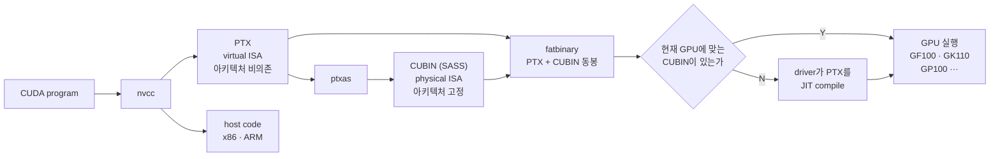

# Introduction

Chris Fregly의 *AI Systems Performance Engineering* $\_[$[$\_{1}$](https://github.com/cfregly/ai-performance-engineering)$\_]$ Chapter 3은 OS와 container runtime, Kubernetes를 GPU에 맞춰 조정하는 방법을 다루는데, GPU를 얹은 Kubernetes를 굴리면서 한 번씩 건드려본 설정들이 대부분 여기 모여 있다.

NUMA pinning이나 hugepage, MIG 같은 것들은 필요할 때 찾아서 적용하고 넘어갔던 것들인데, CPU부터 driver, container, orchestrator까지 한 장 안에 순서대로 놓고 보니 각 설정이 어느 층의 어떤 병목을 겨냥한 것인지가 정리됐다.

이번 글에서는 Chapter 3 (OS, Docker, and Kubernetes Tuning for GPU-Based Environments)을 다룬다.

<!--More-->

---

# Chapter 3: OS, Docker, and Kubernetes Tuning for GPU-Based Environments

GPU code와 library를 아무리 잘 짜도 system 수준 병목이 성능을 붙잡는다.
가장 빠른 GPU도 결국 자기에게 data와 명령을 먹여주는 환경만큼만 빠르다는 것이 이 장의 전제다.

순서는 아래에서 위로 올라간다.
GPU software stack을 먼저 훑고, NUMA affinity와 hugepage 같은 CPU·memory 최적화로 내려갔다가, persistence mode와 MPS, MIG 같은 GPU driver 설정을 보고, 마지막으로 container runtime과 Kubernetes까지 간다.

## Operating System

GPU 서버는 보통 Ubuntu Server LTS나 Red Hat 계열에 최신 GPU hardware를 지원하는 kernel을 올린다.
NVIDIA driver가 kernel module을 설치하면서 GPU마다 `/dev/nvidia0`, `/dev/nvidia1` 같은 device file을 만들고, 여기에 더해 driver 제어용 `/dev/nvidiactl`, unified virtual memory용 `/dev/nvidia-uvm`, mode setting과 buffer 관리를 맡는 `/dev/nvidia-modeset`을 만든다.

OS는 CPU scheduling과 memory, network, storage를 전부 관리하므로 이 모두가 GPU 처리량에 맞춰 조정되어야 한다.
핵심 원칙은 OS가 GPU 작업을 방해하지 않게 만드는 것이고, 그래서 GPU node는 swap을 끄거나 `vm.swappiness`를 0으로 둔다.
GPU에 먹일 data를 쥐고 있는 host memory가 disk로 밀려나면 그 순간부터 RAM이 아니라 disk 속도에 묶이기 때문이다.

GPU 전용 서버라면 추가로 띄워두는 daemon이 몇 개 있다.
NVIDIA Persistence Daemon $\_[$[$\_{2}$](https://docs.nvidia.com/deploy/driver-persistence/persistence-daemon.html)$\_]$은 GPU job이 없을 때도 driver와 hardware context를 올려둔 채로 유지하고, Fabric Manager $\_[$[$\_{3}$](https://docs.nvidia.com/datacenter/tesla/fabric-manager-user-guide/)$\_]$는 GPU interconnect topology를 관리하며, DCGM (data center GPU manager) $\_[$[$\_{4}$](https://github.com/NVIDIA/DCGM)$\_,$[$\_{5}$](https://docs.nvidia.com/datacenter/dcgm/latest/user-guide/index.html)$\_]$은 GPU 상태 지표를 수집한다.

## NVIDIA Software Stack

Multi-petaFLOP GPU cluster를 돌리는 일은 PyTorch code를 짜는 것으로 끝나지 않는다.
그 아래에 여러 층이 깔려 있고 각 층이 성능에 영향을 준다.
책이 정리한 층은 아래와 같고, 내려갈수록 hardware에 가까워진다.

| 계층                      | 구성 요소 |
| ------------------------- | --------- |
| Frameworks and DSLs       | PyTorch $\_[$[$\_{6}$](https://github.com/pytorch/pytorch)$\_]$ · OpenAI Triton $\_[$[$\_{7}$](https://github.com/triton-lang/triton)$\_,$[$\_{8}$](https://triton-lang.org/)$\_]$ · Warp $\_[$[$\_{9}$](https://github.com/NVIDIA/warp)$\_,$[$\_{10}$](https://nvidia.github.io/warp/)$\_]$ |
| SDKs                      | RAPIDS $\_[$[$\_{11}$](https://github.com/rapidsai)$\_,$[$\_{12}$](https://developer.nvidia.com/topics/ai/data-science/cuda-x-for-data-science)$\_]$ · CUDA-Q $\_[$[$\_{13}$](https://github.com/NVIDIA/cuda-quantum)$\_,$[$\_{14}$](https://developer.nvidia.com/cuda-q)$\_]$ |
| Domain-specific libraries | cuPyNumeric $\_[$[$\_{15}$](https://github.com/nv-legate/cupynumeric)$\_,$[$\_{16}$](https://docs.nvidia.com/cupynumeric/)$\_]$ · cuDNN-python $\_[$[$\_{17}$](https://github.com/NVIDIA/cudnn-frontend)$\_]$ |
| Accelerated libraries     | cuda-parallel $\_[$[$\_{18}$](https://github.com/NVIDIA/cccl)$\_]$ · nvmath-python $\_[$[$\_{19}$](https://github.com/NVIDIA/nvmath-python)$\_,$[$\_{20}$](https://docs.nvidia.com/cuda/nvmath-python/)$\_]$ · cuBLAS $\_[$[$\_{21}$](https://docs.nvidia.com/cuda/cublas/)$\_]$ |
| Communication libraries   | mpi4py $\_[$[$\_{22}$](https://github.com/mpi4py/mpi4py)$\_,$[$\_{23}$](https://mpi4py.readthedocs.io/en/stable/)$\_]$ · nvshmem4py $\_[$[$\_{24}$](https://github.com/NVIDIA/nvshmem)$\_,$[$\_{25}$](https://docs.nvidia.com/nvshmem/api/index.html)$\_]$ |
| Device libraries          | cuda-cooperative $\_[$[$\_{18}$](https://github.com/NVIDIA/cccl)$\_]$ · nvmath-python $\_[$[$\_{19}$](https://github.com/NVIDIA/nvmath-python)$\_,$[$\_{20}$](https://docs.nvidia.com/cuda/nvmath-python/)$\_]$ |
| Kernel authoring          | CUDA C++/Python $\_[$[$\_{26}$](https://github.com/NVIDIA/cuda-python)$\_,$[$\_{27}$](https://nvidia.github.io/cuda-python/)$\_,$[$\_{28}$](https://docs.nvidia.com/cuda/cuda-programming-guide/index.html)$\_]$ · cuTile $\_[$[$\_{29}$](https://github.com/NVIDIA/cutile-python)$\_]$ · CUTLASS $\_[$[$\_{30}$](https://github.com/NVIDIA/cutlass)$\_]$ |
| Compiler stack            | nvcc $\_[$[$\_{31}$](https://docs.nvidia.com/cuda/)$\_]$ · NVVM/LLVM $\_[$[$\_{32}$](https://docs.nvidia.com/cuda/nvvm-ir-spec/)$\_]$ · PTX $\_[$[$\_{33}$](https://docs.nvidia.com/cuda/parallel-thread-execution/)$\_]$ |
| Host runtimes and tools   | CUDA runtime $\_[$[$\_{31}$](https://docs.nvidia.com/cuda/)$\_]$ · cuda.core $\_[$[$\_{26}$](https://github.com/NVIDIA/cuda-python)$\_,$[$\_{34}$](https://nvidia.github.io/cuda-python/cuda-core/latest/)$\_]$ · Nsight tools $\_[$[$\_{35}$](https://docs.nvidia.com/nsight-systems/)$\_]$ |

이 표의 맨 아래에 NVIDIA GPU driver와 GPU hardware가 놓인다.

### GPU Driver

가장 아래가 Linux OS와 GPU hardware 사이를 잇는 NVIDIA GPU driver다.
Device memory 할당, GPU core의 task scheduling, 다중 사용자를 위한 GPU 분할 같은 저수준 동작을 맡는다.

Driver를 최신으로 유지하는 것이 중요한데, 새 release마다 성능 개선이 딸려 오고 최신 GPU 아키텍처와 CUDA 기능 지원도 여기서 열리기 때문이다.
Driver와 함께 설치되는 `nvidia-smi` $\_[$[$\_{36}$](https://docs.nvidia.com/deploy/nvidia-smi/)$\_]$로 온도와 활용률, ECC (error-correcting code) 상태를 조회하고 persistence mode 같은 GPU mode를 켠다.

### CUDA Toolkit and Runtime

Driver 위에 CUDA Runtime과 library를 묶은 CUDA Toolkit $\_[$[$\_{31}$](https://docs.nvidia.com/cuda/)$\_]$이 올라간다.
Toolkit에는 CUDA C++ kernel을 compile하는 `nvcc`가 들어 있고, compile된 program은 CUDA runtime (`cudart`)에 link된다.
이 runtime이 driver와 직접 통신해 GPU에 작업을 던지고 memory를 할당한다.

Toolkit은 최적화된 library도 함께 제공한다.
신경망 primitive를 담당하는 cuDNN $\_[$[$\_{37}$](https://docs.nvidia.com/deeplearning/cudnn/latest/)$\_]$, 선형대수의 cuBLAS $\_[$[$\_{21}$](https://docs.nvidia.com/cuda/cublas/)$\_]$, 다중 GPU 통신의 NCCL $\_[$[$\_{38}$](https://github.com/NVIDIA/nccl)$\_,$[$\_{39}$](https://docs.nvidia.com/deeplearning/nccl/user-guide/docs/index.html)$\_]$ 같은 것들이다.
저자는 GPU의 compute capability를 지원하는 최신 Toolkit을 쓰라고 권하는데, compiler 최적화와 GPU별 library가 최신 버전에 들어가기 때문이다.

### CUDA Forward and Backward Compatibility Across GPU Hardware Generations

CUDA programming model의 중요한 성질 하나가 세대 간 호환성이다.
CUDA code를 compile하면 결과 binary에 중간 표현인 PTX (parallel thread execution)와 아키텍처별 기계어가 함께 들어간다.
한 소스 파일에는 CPU에서 도는 host code와 GPU에서 도는 device code가 섞여 있어서, nvcc는 host code를 x86이나 ARM용으로 따로 빼고 device code만 이 경로를 태운다.

| 구분        | 실행 주체 | 예                                   | 컴파일 경로                             |
| ----------- | --------- | ------------------------------------ | --------------------------------------- |
| Host code   | CPU       | `main()`, memory 할당, kernel launch | host compiler (gcc · clang) → x86 · ARM |
| Device code | GPU       | `__global__` · `__device__` 함수     | nvcc → PTX → ptxas → SASS (CUBIN)       |

ISA (instruction set architecture)는 hardware가 이해하는 명령어의 집합인데, PTX도 명령어 집합이라는 점에서는 ISA지만 이것을 직접 실행하는 GPU는 없다.
실제 GPU가 실행하는 것은 SASS (streaming assembler) 명령어이고 PTX는 반드시 거기로 번역되어야 하므로, PTX를 virtual ISA, SASS를 physical ISA라 부른다.
어느 세대의 명령어로도 고정되지 않는다는 점이 PTX를 나중에 다른 세대용으로 다시 번역할 수 있게 만드는 성질이다.



PTX가 들어 있으면 driver가 실행 시점에 새 아키텍처용으로 JIT compile할 수 있어 forward compatibility가 생기는 반면, CUBIN (CUDA binary)은 특정 아키텍처용 SASS 명령이라 미래 세대로는 넘어가지 못한다.
두 표현은 나란히 만들어지는 것이 아니라, nvcc가 CUDA code를 PTX로 낮추면 PTX assembler인 ptxas $\_[$[$\_{40}$](https://docs.nvidia.com/cuda/cuda-compiler-driver-nvcc/)$\_]$가 그것을 다시 특정 아키텍처용 SASS로 낮춰 CUBIN을 만드는 순서다.
Driver가 실행 시점에 하는 JIT compile도 결국 이 변환을 그때 수행하는 것이라, 미리 해두면 CUBIN이 되고 미뤄두면 PTX로 남는 셈이다.

Fatbinary는 이렇게 나온 결과물을 하나로 묶어 실행 파일에 심어두는 container로, 아키텍처별 CUBIN 여러 개와 원본 PTX를 함께 담는다.
이름의 "fat"은 한 binary 안에 여러 target용 code가 겹쳐 들어 있다는 뜻이고 fatbin으로 줄여 쓰기도 한다.

그래서 현재 아키텍처용 SASS와 forward compatibility용 PTX를 같이 담은 fatbinary로 배포하라는 것이 결론이다 $\_[$[$\_{41}$](https://docs.nvidia.com/deploy/cuda-compatibility/latest/)$\_]$.

### C++ and Python CUDA Libraries

CUDA Toolkit library는 대부분 C++인데, Python 쪽 선택지가 계속 늘고 있다.
저수준 driver·runtime 접근을 여는 CUDA Python $\_[$[$\_{26}$](https://github.com/NVIDIA/cuda-python)$\_,$[$\_{27}$](https://nvidia.github.io/cuda-python/)$\_]$, array programming용 cuPyNumeric $\_[$[$\_{15}$](https://github.com/nv-legate/cupynumeric)$\_,$[$\_{16}$](https://docs.nvidia.com/cupynumeric/)$\_]$과 CuTe DSL $\_[$[$\_{42}$](https://github.com/NVIDIA/cutlass/tree/main/python/CuTeDSL)$\_,$[$\_{43}$](https://docs.nvidia.com/cutlass/)$\_]$, cuTile $\_[$[$\_{29}$](https://github.com/NVIDIA/cutile-python)$\_]$, CuPy $\_[$[$\_{44}$](https://github.com/cupy/cupy)$\_,$[$\_{45}$](https://cupy.dev/)$\_]$, 그리고 Python으로 GPU kernel을 쓰는 NVIDIA Warp $\_[$[$\_{9}$](https://github.com/NVIDIA/warp)$\_,$[$\_{10}$](https://nvidia.github.io/warp/)$\_]$가 있다.
CUTLASS $\_[$[$\_{30}$](https://github.com/NVIDIA/cutlass)$\_]$는 Python library가 아니라 cuBLAS 같은 library가 내부에서 쓰는 C++ template library다.

cuTile은 큰 행렬을 tile이라는 작은 부분행렬로 쪼개 다루기 쉽게 만드는 library이고, cuPyNumeric은 `import cupynumeric as np`로 바꿔 끼우는 NumPy 대체재다.
둘 다 2025년 초에 나왔고, Python 개발자가 CUDA로 진입하는 문턱을 낮추는 것이 목표다.

여기에 NVIDIA 것은 아니지만 OpenAI Triton $\_[$[$\_{7}$](https://github.com/triton-lang/triton)$\_,$[$\_{8}$](https://triton-lang.org/)$\_]$이 있다.
Python DSL로 custom GPU kernel을 쓸 수 있게 해줘서 손으로 짜는 CUDA C++의 필요를 상당 부분 줄이고, PyTorch compiler backend에 통합되어 GPU 연산을 자동으로 최적화하고 fusion한다.

### PyTorch and Higher-Level AI Frameworks

CUDA 위에 올라간 Python framework로는 PyTorch $\_[$[$\_{6}$](https://github.com/pytorch/pytorch)$\_]$와 TensorFlow $\_[$[$\_{46}$](https://github.com/tensorflow/tensorflow)$\_,$[$\_{47}$](https://www.tensorflow.org/)$\_]$, JAX $\_[$[$\_{48}$](https://github.com/jax-ml/jax)$\_,$[$\_{49}$](https://docs.jax.dev/en/latest/)$\_]$, Keras $\_[$[$\_{50}$](https://github.com/keras-team/keras)$\_,$[$\_{51}$](https://keras.io/)$\_]$가 있고, 모두 NVIDIA GPU를 쓰면서 deep learning용 고수준 인터페이스를 제공한다.
이 책이 주로 다루는 것은 PyTorch의 compile과 graph 최적화 기능이고, `torch.compile` stack $\_[$[$\_{52}$](https://docs.pytorch.org/docs/stable/torch.compiler.html)$\_]$도 그 안에 들어간다.
PyTorch compiler stack은 TorchDynamo $\_[$[$\_{53}$](https://github.com/pytorch/pytorch/tree/main/torch/_dynamo)$\_,$[$\_{54}$](https://docs.pytorch.org/docs/stable/torch.compiler_dynamo_overview.html)$\_]$와 AOT Autograd $\_[$[$\_{55}$](https://github.com/pytorch/pytorch/tree/main/torch/_functorch)$\_]$, 그리고 TorchInductor $\_[$[$\_{56}$](https://github.com/pytorch/pytorch/tree/main/torch/_inductor)$\_]$나 XLA $\_[$[$\_{57}$](https://github.com/openxla/xla)$\_,$[$\_{58}$](https://openxla.org/xla)$\_]$ 같은 backend로 구성되는데, 가장 흔한 TorchInductor가 내부적으로 Triton을 쓴다.

PyTorch tensor 연산을 GPU에서 수행하면 Python 호출 한 번처럼 보이지만 실제로는 CUDA runtime과 여러 CUDA library 호출로 번역된다.
행렬 곱이라면 PyTorch가 cuBLAS에 넘기는 식이다.

이 모든 층 (OS, GPU driver, CUDA Toolkit, CUDA library, PyTorch)이 함께 맞물려야 GPU 개발 환경이 성립한다.
이 장의 최적화는 각 층을 최대한 효율적으로 만들어서, GPU가 CPU나 memory, disk I/O, 다른 GPU의 동기화를 기다리는 대신 실제 학습·추론 작업으로 바쁘게 만드는 것을 목표로 한다.

System 수준 tuning은 model 최적화에 밀려 간과되기 쉽지만, OS 설정을 조금 손보는 것만으로 두 자릿수 퍼센트 개선이 나오는 경우도 있다.
큰 AI project 규모에서는 수만에서 수십만 달러의 연산 비용에 해당한다.

## Configuring the CPUs and OS for GPU Environments

GPU가 최대 활용률에 도달하지 못하는 가장 흔한 이유는 CPU가 GPU에 일을 제때 먹이지 못하는 것이다.
전형적인 학습 loop에서 CPU는 다음 batch를 준비하고 (disk에서 읽고, tokenize하고, 변환하고) GPU kernel을 dispatch하며 thread와 process를 조율한다.
이 host 쪽 작업이 느리거나 OS가 나쁘게 scheduling하면 비싼 GPU가 놀게 된다.

그래서 이 절에서 다루는 것은 세 갈래다.
CPU affinity를 지정해 cross-NUMA 트래픽을 없애고 제 data를 제 core가 다루게 하는 것, NUMA 페널티를 피하는 memory 할당 전략을 쓰는 것, 그리고 불필요한 지연을 걷어내는 OS 수준 설정을 손보는 것이다.
여기에는 백그라운드 daemon과 OS 작업을 GPU에 data를 먹이는 core에서 떼어내 별도 core에 가두는 일도 포함된다.

### NUMA Awareness and CPU Pinning

현대 서버 CPU는 core가 수십 개이고 여러 NUMA node로 나뉜다.
NUMA (non-uniform memory access) node는 물리적으로 가까이 있는 CPU와 GPU, NIC, memory의 논리적 묶음이고, 같은 node 안 자원 접근이 다른 node 접근보다 빠르다.


A NUMA node is a logical grouping of CPUs, GPUs, network interface controllers (NICs), and memory that are physically close to one another.



NUMA node 0의 CPU에서 도는 process가 node 1의 GPU에 접근하면 node 간 link를 건너야 하므로 지연이 늘어난다.
책이 인용한 실측에서 로컬 memory 접근이 \~80 ns, node를 건너간 접근이 \~139 ns로 약 75% 증가했다.

Linux에도 자동 NUMA balancing이 있지만 성능이 중요한 AI workload에는 대개 부족하다.
기본 설정에서는 process가 node 사이를 옮겨 다닐 수 있고, 옮겨갈 때마다 원격 memory 접근이 붙는다.

해법은 GPU와 같은 NUMA node의 CPU에 process를 묶는 것이고, 이것이 CPU pinning이다.
`numactl` $\_[$[$\_{59}$](https://github.com/numactl/numactl)$\_,$[$\_{60}$](https://man7.org/linux/man-pages/man8/numactl.8.html)$\_]$로 CPU와 memory 정책을 함께 지정하고, node가 아니라 특정 core ID에 직접 묶고 싶다면 `taskset` $\_[$[$\_{61}$](https://man7.org/linux/man-pages/man1/taskset.1.html)$\_]$을 쓴다.

```bash
numactl --cpunodebind=1 --membind=1 python train.py --gpu 4
```

이 예시는 NUMA node ID를 이미 알고 있고 GPU 한 장에만 묶는 경우다.
여러 GPU에 걸치거나 node ID를 모른다면 topology를 조회해서 넘겨야 한다.

```bash
#!/bin/bash
for GPU in 0 1 2 3; do
  # Query NUMA node for this GPU
  NODE=$(nvidia-smi topo -m -i $GPU | awk '/NUMA Affinity/ {print $NF}')

  # Launch the training process pinned to that NUMA node
  numactl --cpunodebind=$NODE --membind=$NODE \
    bash -c "CUDA_VISIBLE_DEVICES=$GPU python train.py --gpu $GPU"
done
```

`nvidia-smi topo -m` $\_[$[$\_{36}$](https://docs.nvidia.com/deploy/nvidia-smi/)$\_]$은 GPU마다 CPU affinity와 NUMA affinity를 함께 출력하므로, 여기서 NUMA Affinity 열의 node ID만 뽑아낸다.
그 값을 `--cpunodebind`와 `--membind`에 함께 걸어 process의 thread와 이후 memory 할당이 모두 GPU의 NUMA domain 안에 머물게 만든다.

Framework 쪽에서도 code로 붙일 수 있는데, PyTorch `DataLoader` $\_[$[$\_{62}$](https://docs.pytorch.org/docs/stable/data.html)$\_]$가 `worker_init_fn`을 열어두고 있어서 worker process가 초기화될 때 CPU affinity를 직접 걸 수 있다.
책은 이 흐름을 100줄짜리 예제로 싣는다.
먼저 NVML (NVIDIA management library) $\_[$[$\_{63}$](https://docs.nvidia.com/deploy/nvml-api/latest/)$\_,$[$\_{64}$](https://pypi.org/project/nvidia-ml-py/)$\_]$로 GPU가 붙은 NUMA node를 알아낸다 (`nvmlDeviceGetNUMANodeId`, 없으면 `nvmlDeviceGetCpuAffinity`, 그것도 없으면 `/sys/bus/pci/devices/<PCI_ID>/numa_node`).
이어서 그 node에 속한 core 목록을 `/sys/devices/system/node/node<N>/cpulist`에서 읽어 `psutil` $\_[$[$\_{65}$](https://github.com/giampaolo/psutil)$\_,$[$\_{66}$](https://psutil.io/)$\_]$로 CPU affinity를 걸고, 마지막으로 `libnuma` $\_[$[$\_{59}$](https://github.com/numactl/numactl)$\_,$[$\_{67}$](https://man7.org/linux/man-pages/man3/numa.3.html)$\_]$의 `numa_run_on_node`와 `numa_set_preferred`로 이후 memory 할당까지 같은 node에 묶는다.

`numactl` 정책은 문서상 자식 process에 상속되지만 launcher나 container runtime, kernel에 따라 전파가 보장되지 않고, `spawn` 방식으로 바뀌거나 새 program을 `exec`하면 아예 끊긴다.
그래서 worker마다 명시적으로 다시 걸어야 한다.

`pin_memory=True`와 host-to-device 복사의 `non_blocking=True`로 page-locked buffer가 올바른 NUMA node에 남게 하고, `persistent_workers=True`로 epoch마다 worker가 재생성되면서 affinity를 잃는 것을 막는 것도 함께 권장된다.
반대로 `worker_init_fn` 안에서는 `torch.cuda.*`를 호출하지 않는다.
DataLoader worker는 Linux에서 기본적으로 fork로 생성되는데, CUDA runtime은 fork start method를 지원하지 않아 subprocess에서 CUDA를 쓰려면 spawn이나 forkserver가 필요하기 때문이다 $\_[$[$\_{68}$](https://docs.pytorch.org/docs/stable/notes/multiprocessing.html)$\_]$.
GPU index가 필요하면 closure나 환경 변수로 넘겨서 worker가 CUDA API를 거치지 않게 한다.

Pinning의 효과는 cross-NUMA 트래픽과 core 이동을 없애는 것만으로 학습 처리량 5\~10% 개선이 나올 수 있는 수준이고, 성능 jitter와 분산도 함께 줄어든다.
고성능 AI 시스템에서는 Intel에서 hyperthreading이라고 부르는 SMT (simultaneous multithreading)를 켤지 따져보고 core당 성능을 더 예측 가능하게 만들려고 아예 끄기도 하는데, 끄는 쪽이 이득인지는 workload에 따라 갈린다.
`isolcpus` kernel parameter $\_[$[$\_{69}$](https://docs.kernel.org/admin-guide/kernel-parameters.html)$\_]$로 core 몇 개를 일반 scheduler에서 떼어내 OS 백그라운드 작업 전용으로 예약하거나, Kubernetes의 CPU 예약 $\_[$[$\_{70}$](https://kubernetes.io/docs/tasks/administer-cluster/reserve-compute-resources/)$\_]$으로 system daemon을 분리해 나머지 core를 학습과 추론 thread에만 쓰게 하는 방법도 있다.

Grace Blackwell 같은 superchip에서는 CPU와 GPU가 NVLink-C2C로 coherent하게 붙어 있어서 전통적인 CPU-GPU 전송 고민이 상당 부분 줄어든다.
다만 Linux는 여전히 CPU DRAM과 GPU HBM을 별도 pool로 모델링하므로, coherence가 software overhead를 줄여주더라도 CPU thread를 로컬 Grace CPU에 묶는 것은 그대로 유효하다.

### NUMA-Friendly Memory Allocation and Memory Pinning

기본적으로 process는 자기가 도는 CPU의 NUMA node에서 memory를 할당한다.
문제는 OS scheduler가 thread를 옮기거나 pinning 전에 이미 할당된 memory가 있는 경우인데, 이러면 node 0에서 도는 process가 node 1의 memory를 쓰게 되어 CPU pinning의 이득이 사라진다.
`numactl --membind`가 특정 node에서만 할당하도록 강제하는 이유다.

여기에 pinned memory, 즉 page-locked memory가 붙는다.
Memory를 pin하면 OS가 그것을 swap하거나 옮기지 못하므로 DMA 전송이 빨라진다.
Pinned host memory에서 GPU로 복사하는 것이 일반 pageable memory보다 2\~3배 빠른데, GPU나 NIC가 직접 DMA를 수행할 수 있기 때문이다.


GPUDirect RDMA $\_[$[$\_{71}$](https://docs.nvidia.com/cuda/gpudirect-rdma/)$\_]$와 GPUDirect Storage $\_[$[$\_{72}$](https://docs.nvidia.com/gpudirect-storage/)$\_]$가 바로 이 성질 위에 서 있다.
전자는 InfiniBand 같은 NIC가 GPU memory와 직접 data를 주고받게 하고, 후자는 NVMe drive가 CPU를 거치지 않고 GPU memory로 data를 흘려보내게 한다.

CUDA utility에 들어 있는 `bandwidthTest --memory=pinned`와 `--memory=pageable`로 두 경우의 전송 대역폭을 직접 재볼 수 있다.

PyTorch에서는 `DataLoader`의 `pin_memory=True` 한 줄이다.
`tensor.to(device)`가 빨라지는데 CUDA driver가 즉석에서 page를 pin할 필요가 없어지기 때문이고, batch가 크거나 iteration마다 읽는 data가 많을수록 효과가 크다.
이 flag 하나만으로 10\~20% 개선을 본 사례가 많다.

주의할 것은 OS가 사용자당 lock 가능한 memory 양을 제한한다는 점이다.
`ulimit -l`로 설정하고, container 환경에서는 security context나 Docker `--ulimit memlock`을 조정한다.
큰 pinned buffer를 쓸 계획이면 이 값을 충분히 크게, 보통은 unlimited로 둔다.

### Transparent Hugepages

Linux는 보통 4 KB page를 쓰는데, 수십에서 수백 GB를 쓰는 process에서 수백만 개의 작은 page를 관리하는 것은 비효율적이다.
Page 크기를 2 MB, 크게는 1 GB까지 키운 hugepage $\_[$[$\_{73}$](https://docs.kernel.org/admin-guide/mm/transhuge.html)$\_]$는 memory chunk를 키워 가상 memory 관리 overhead를 줄이는데, page fault가 줄고 TLB 압력이 낮아지는 것이 주된 이득이다.

TLB (translation lookaside buffer)는 가상 주소를 물리 주소로 변환하는 CPU의 cache다.
Page가 더 크고 개수가 적으면 같은 entry 수로 더 넓은 memory를 덮을 수 있어 miss가 줄어든다.

효과는 대체로 완만해서 처리량 기준 \~3\~5% 수준이다.
Kernel이 큰 할당을 자동으로 2 MB page로 받쳐주므로 THP (transparent hugepages)를 켜는 것 자체는 대부분의 시스템에서 간단한 이득이다.
I/O용으로 미리 잡아두는 pinned buffer처럼 memory pool이 아주 크다면 `vm.nr_hugepages`나 `hugetlbfs`로 hugepage를 명시적으로 할당해 더 예측 가능한 성능을 얻는 선택지도 있다.

문제는 THP의 백그라운드 compaction이 예측 불가능한 정지를 만든다는 점이다.
지연에 민감한 LLM 추론 workload에는 치명적이다.

| Workload                          | 권고                                    |
| --------------------------------- | --------------------------------------- |
| 학습 (처리량 중심)                | THP 켜기                                |
| 추론 (지연 중심)                  | `transparent_hugepage=never` 또는 `madvise` |
| 분산 학습 (여러 rank가 동시 할당) | 지연 민감도에 따라 판단, 기본은 끄는 쪽 |

### Scheduler and Interrupt Affinity

바쁜 시스템에서 data pipeline thread 같은 중요한 thread가 자주 선점되지 않게 해야 한다.
Linux 기본 CFS (completely fair scheduler)로 대부분 충분하지만, GPU에 data를 전송하는 지연 민감 thread에는 real-time FIFO (first in, first out)나 RR (round-robin) priority scheduling을 검토할 수 있다.
다만 real-time thread는 관리를 잘못하면 다른 process를 굶길 수 있고, 애초에 thread를 전용 core에 pin해뒀다면 대개 손댈 필요가 없다.

Core를 격리하는 방법도 있는데, `cset` $\_[$[$\_{74}$](https://github.com/SUSE/cpuset)$\_]$이나 `isolcpus`, `nohz_full` 같은 kernel parameter $\_[$[$\_{69}$](https://docs.kernel.org/admin-guide/kernel-parameters.html)$\_]$, cgroup cpuset 격리를 쓰면 OS scheduler가 해당 core를 건드리지 않는다.
Production에서는 cgroup $\_[$[$\_{75}$](https://docs.kernel.org/admin-guide/cgroup-v2.html)$\_]$ CPU·memory affinity가 강하게 권장되는데, workload마다 물리 core와 memory 영역을 분리해 교차 경합과 NUMA 페널티를 막기 때문이다.

Hardware interrupt에도 같은 원칙이 적용되어, NUMA node 0의 GPU나 NIC가 interrupt를 올리면 node 0의 core가 처리해야 한다.
그렇지 않으면 다른 node의 CPU가 처리하면서 cache coherency 트래픽과 node 간 통신이 생긴다.
성능에 민감한 시스템은 기본 `irqbalance` daemon을 끄거나 별도 규칙으로 돌리고, `/proc/irq/*/smp_affinity`로 각 interrupt의 affinity mask를 직접 지정한다.

### Virtual Memory and Swapping

Process memory의 일부라도 disk로 swap되면 몇 자릿수 단위의 성능 저하가 온다.
GPU program은 data caching용으로 host memory를 많이 할당하는 편이라, 그중 일부가 swap되면 GPU가 그 data를 필요로 할 때 큰 지연을 겪는다.

`vm.swappiness=0`으로 극단적인 memory 압박이 아닌 한 swap하지 않도록 하고, cgroup 제한으로 학습 job의 memory를 격리한다.
`sudo swapoff -a`로 재부팅 전까지 swap을 완전히 끌 수도 있는데, 이 경우 workload에 충분한 RAM이 있는지 확인해야 한다.
그렇지 않으면 OOM killer가 process를 거둬간다.
설정 후에는 `vmstat`이나 `free -m`으로 swap 사용량이 0을 유지하는지 확인한다.

Swap을 막는 데는 pinned memory에서 나왔던 `ulimit -l`도 함께 봐야 한다.
이 값이 낮으면 lock할 수 있는 memory가 모자라 오히려 swap이 심해지므로, memory를 많이 쓰는 AI workload라면 여기서도 충분히 크게, 보통은 unlimited로 둔다.

Container 환경이라면 Docker나 Kubernetes를 통해 cgroup v2로 memory와 CPU를 묶는 것이 권장된다.
그래야 NUMA affinity와 no-swap 정책이 container 안까지 강제된다.

### Filesystem Caching and Write-Back

큰 학습 job은 실패 시 복구를 위해 checkpoint를 자주 쓴다.
그런데 checkpoint를 쓰는 동안 대량의 data가 OS page cache를 채우면서 정지가 발생할 수 있다.

`vm.dirty_ratio`와 `vm.dirty_background_ratio`로 write buffering용 page cache 크기를 조정한다.
수 GB짜리 checkpoint라면 dirty ratio를 높여 OS가 더 많은 data를 RAM에 모았다가 flush하게 하는 편이 학습 loop의 정지를 줄인다.

별도 thread에서 checkpoint를 쓰거나, PyTorch의 분산 checkpoint로 각 node가 자기 partition을 쓰고 불러올 때 합치는 방법도 있다.
지연에 민감한 학습 workflow에서 page cache를 아예 우회하려면, `O_DIRECT`로 파일을 열거나 `io_uring`으로 비동기 I/O를 쓰고 checkpoint를 쓴 뒤 `posix_fadvise(fd, 0, 0, POSIX_FADV_DONTNEED)`로 해당 page를 즉시 cache에서 내려야 한다.

### CPU Frequency and C-states

많은 연산 node가 기본적으로 절전 모드로 동작한다.
CPU를 downclock하거나 유휴 시 재우는 것인데, 새 작업이 도착해 CPU를 깨울 때 추가 지연이 생긴다.

일관된 성능을 원한다면 CPU frequency governor를 performance로 두어 항상 최대 주파수를 유지한다.

```bash
cpupower frequency-set -g performance
```

ACPI (advanced configuration and power interface)가 정의한 절전 모드인 deep C-state를 끄는 것도 같은 맥락이다.
CPU core가 유휴 상태일 때 들어가는 C-state는 C0가 활성 상태이고 번호가 올라갈수록 더 깊은 절전 상태가 되는데, 깊을수록 전력은 아끼지만 깨어나는 데 오래 걸린다.

Data loader thread가 data를 기다리다 CPU가 C6까지 내려가면 깨어나는 데 수 마이크로초가 걸린다.
길지 않아 보여도 이것이 쌓이면 GPU가 CPU의 재개를 기다리는 구간, 즉 bubble이 된다.
서버의 BIOS (basic input/output system)나 UEFI (unified extensible firmware interface)에 이 둘을 한 번에 설정하는 고성능 프로파일이 있는 경우가 많다.

### Tune Host CPU Memory Allocator

잘 조정된 GPU 서버에서 CPU 사용률이 아주 높지는 않지만, GPU 활동과 보조를 맞춰 꾸준해야 한다.
GPU가 현재 batch를 처리하는 동안 CPU는 다음 batch를 준비하고 있어야 한다.

Host의 memory allocator를 jemalloc $\_[$[$\_{76}$](https://github.com/jemalloc/jemalloc)$\_,$[$\_{77}$](https://jemalloc.net/)$\_]$이나 tcmalloc $\_[$[$\_{78}$](https://github.com/google/tcmalloc)$\_]$으로 바꾸고 조정하면 data 준비 과정의 예측 불가능한 정지를 없앨 수 있다.
jemalloc은 CPU별 arena로 할당을 쪼개고 (`narenas`), 백그라운드 purging을 켜고 (`background_thread`), 해제한 page를 바로 OS에 돌려주지 않도록 decay 시간을 늘려 (`dirty_decay_ms`, `muzzy_decay_ms`) lock 경합과 단편화를 줄이는데, 이 값들은 `MALLOC_CONF` 환경 변수 하나에 모아서 넘긴다.

```bash
export MALLOC_CONF="narenas:8,dirty_decay_ms:10000,muzzy_decay_ms:10000,background_thread:true"
```

tcmalloc은 thread별 cache를 키워 작은 할당이 전역 lock과 syscall을 피하게 하고, `TCMALLOC_MAX_TOTAL_THREAD_CACHE_BYTES`와 `TCMALLOC_RELEASE_RATE` 환경 변수로 조정한다.

```bash
export TCMALLOC_MAX_TOTAL_THREAD_CACHE_BYTES=$((512*1024*1024))
export TCMALLOC_RELEASE_RATE=16
```

## GPU Driver and Runtime Settings for Performance

CPU 쪽을 정리했으니 GPU driver와 runtime 차례인데, 여러 GPU를 여러 사용자가 나눠 쓰는 상황에서 특히 효과가 크고 제대로 맞추면 overhead를 줄이면서 여러 workload가 GPU를 나눠 쓰는 방식을 개선할 수 있다.
GPU persistence mode와 GPU를 쪼개는 MPS·MIG, 그리고 clock 설정과 ECC memory, out-of-memory 동작을 차례로 본다.

### GPU Persistence Mode

GPU를 쓰는 application이 없으면 driver가 GPU를 저전력 상태로 내리고 driver context 일부를 내려놓는다.
다음 application이 GPU를 쓰려 할 때 초기화 비용이 발생하는데, driver가 전부 다시 올라오는 데 1\~2초가 걸린다.

Job이 자주 시작하고 끝나는 학습 cluster나, 요청이 드문드문 오는 추론 cluster에서는 이 overhead가 그대로 성능 저하가 된다.
`nvidia-persistenced` daemon $\_[$[$\_{2}$](https://docs.nvidia.com/deploy/driver-persistence/persistence-daemon.html)$\_]$을 띄우면 application이 없어도 driver가 올라가 있고 hardware가 준비 상태로 남는데, 부팅 시점부터 적용하려면 service로 등록해둔다.

```bash
systemctl enable nvidia-persistenced
```

연산 자체가 빨라지는 것은 아니고 job 시작 지연과 cold start를 없애는 설정이다.
대가는 유휴 시 전력 소모가 조금 늘어나는 것뿐이라, AI cluster에서는 부팅 시점에 모든 GPU에 켜두는 것이 일반적이다.
Kubernetes 환경이라면 NVIDIA GPU Operator $\_[$[$\_{79}$](https://github.com/NVIDIA/gpu-operator)$\_,$[$\_{80}$](https://docs.nvidia.com/datacenter/cloud-native/gpu-operator/latest/index.html)$\_]$가 모든 GPU에 자동으로 켜도록 설정할 수 있다.

### MPS

여러 process가 하나의 GPU를 공유하면 GPU scheduler가 그들 사이를 time-slice한다.
Kernel이 짧고 사이에 유휴 구간이 있으면 GPU는 context switch만 왕복하면서 활용률이 떨어진다.

MPS (multi-process service) $\_[$[$\_{81}$](https://docs.nvidia.com/deploy/mps/latest/index.html)$\_]$는 여러 process가 하나의 우산 아래에서 동시에 GPU를 쓰게 만든다.


MPS is a feature that creates a sort of umbrella under which multiple processes can run on the GPU concurrently and without strict time-slicing.
With MPS, the GPU can execute kernels from different processes at the same time as long as the GPU resources (streaming multiprocessors [SMs], Tensor Cores, etc.) are available.


SM이나 Tensor Core 같은 자원이 남아 있으면 서로 다른 process의 kernel이 같은 시각에 실행된다.
Process들의 context를 하나의 scheduler context로 합치는 방식이라 독립 process 사이를 전환하며 노는 비용을 물지 않는다.


40 GB GPU 하나에 5\~10 GB씩, 연산은 30%씩만 쓰는 추론 job 네 개를 올렸다고 하자.
기본 동작이라면 어느 순간에도 한 job의 작업만 실제로 돌고 있어서 GPU가 평균 70% 놀게 된다.
MPS를 켜면 한 job이 memory를 기다리는 동안 다른 job의 kernel이 GPU를 채운다.
각각 40%를 쓰는 process 두 개라면 GPU가 80\~90%까지 올라간다.

Client마다 SM 사용량을 제한하는 기능도 있다.
`CUDA_MPS_ACTIVE_THREAD_PERCENTAGE=50`으로 한 client를 SM 실행 용량의 약 50%로 묶어 QoS를 보장하는 식이다.

한계도 분명한데, MPS는 GPU memory를 분할하지 않아서 모든 process가 전체 memory 공간을 공유한다.
한 process가 memory를 과하게 요청해 OOM을 내면 같은 GPU의 다른 process들이 전부 종료된다.
그리고 한 program이 이미 GPU를 100% 쓰고 있다면 MPS가 더 빠르게 만들어주지는 못한다.
다른 job이 채울 여유가 남아 있을 때만 이득이다.

Kubernetes의 time-slicing은 다른 선택지다.
Device plugin이 같은 GPU에 여러 pod을 시간 단위로 배치하는데, 실행을 겹치지는 않고 driver 기본값보다 빠르게 전환할 뿐이다.
처리량이 중요한 job이라면 MPS로 겹치거나 MIG로 쪼개는 쪽이 대체로 낫다.

### MIG

MIG (multi-instance GPU) $\_[$[$\_{82}$](https://docs.nvidia.com/datacenter/tesla/mig-user-guide/latest/)$\_]$는 GPU를 hardware 수준에서 분할한다.


MIG is a form of virtualization but done in hardware.
This way, the overhead is very low—maybe a few percent—due to the loss of some flexibility.


Hardware로 하는 가상화라 overhead가 몇 퍼센트 수준으로 낮은 대신 유연성을 잃어서, 한 instance가 놀아도 그 자원을 다른 instance에 빌려줄 수 없다.
GPU 하나를 최대 일곱 개의 논리 GPU로 쪼개는데, instance마다 memory와 SM은 물론 제어·data 경로와 L2까지 자기 몫을 따로 갖는다.


Profile 이름 규칙이 두 부분으로 나뉜다.
접두사 `<X>g`는 compute slice 수로 1에서 7까지이고, 각 slice는 전체 SM의 약 1/7에 해당하는 SM group이다.
GPU에 SM이 132개라면 1/7은 약 19개이므로 `1g`는 \~19 SM, `7g`는 \~132 SM이다.
접미사 `<Y>gb`는 그 profile에 예약되는 HBM 용량을 GB로 적은 것이다.

Blackwell B200의 profile은 다음과 같다.

| Profile      | Memory 비율 | SM 비율 | L2 cache | Copy engine | Instance 수 |
| ------------ | ----------- | ------- | -------- | ----------- | ----------- |
| MIG 1g.23gb  | 1/8         | 1/7     | 1/8      | 2           | 7           |
| MIG 1g.45gb  | 2/8         | 1/7     | 2/8      | 2           | 4           |
| MIG 2g.45gb  | 2/8         | 2/7     | 2/8      | 3           | 3           |
| MIG 3g.90gb  | 4/8         | 3/7     | 4/8      | 6           | 2           |
| MIG 4g.90gb  | 4/8         | 4/7     | 4/8      | 8           | 1           |
| MIG 7g.180gb | 전체        | 전체    | 전체     | 16          | 1           |

각 MIG instance는 software 입장에서 별도 GPU처럼 보인다.
자기 memory와 SM, 별도 engine context를 갖기 때문에 격리가 강하고 자원이 보장된다.
10 GB 남짓이면 되는 사용자나 서비스가 여럿이라면 물리 GPU 하나에 몰아넣어도 서로 간섭하지 않는다.

주의할 점이 두 가지인데, 먼저 slice를 다 쓰지 못하면 그대로 낭비다.
7-slice 구성에서 job이 1 slice만 쓰면 나머지 6개를 다른 job으로 채워야 한다.
그리고 MIG mode에서는 NVLink와 PCIe를 포함한 GPU 간 P2P 통신이 비활성화된다.
MIG instance 사이의 통신은 host나 network fabric을 거쳐야 하므로, 대규모 분산 학습이나 MoE expert 추론처럼 GPU 간 통신이 많은 workload에는 맞지 않는다.

정리하면 같은 GPU에서 독립적인 job 여러 개를 강하게 격리해 돌려야 할 때만 켠다.
GPU를 가로지르는 대규모 학습·추론에는 쓰지 않는다.

### GPU Clock Speeds and ECC

GPU Boost가 전력과 발열 한계 안에서 core clock을 자동으로 조절한다.
평소에는 그대로 두면 되지만, benchmark에서는 clock을 고정하는 것이 중요하다.

앞선 실행이 만든 열 때문에 뒤 실행이 throttle되면, 그것을 성능 차이로 잘못 해석할 수 있기 때문이다.
`nvidia-smi -lgc`로 core clock을, `-ac`로 memory clock을 고정한다.
일상적인 학습·추론에서는 auto-boost를 켜두는 쪽이 권장된다.

`nvidia-smi -pl`로 TDP (thermal design power)보다 살짝 낮게 전력 상한을 두는 방법도 있다.
GPU Boost가 thermal throttle 지점 아래로 clock을 자동 조절하므로 최대 발열을 줄이면서 성능 손실은 최소화한다.

ECC는 다른 이야기다.
단일 bit 오류를 즉석에서 정정하고 이중 bit 오류는 감지해 호출한 code에 오류를 던진다.
끄면 검사용 bit만큼 memory가 조금 늘고 몇 퍼센트 성능 이득이 있을 수 있지만, memory 오류 보호가 사라진다.

긴 학습이나 추론에서 memory 오류 하나가 job 전체를 죽이거나, 더 나쁘게는 경고 없이 model을 조용히 망가뜨릴 수 있다.
NVIDIA data center GPU는 기본으로 켜져 있고 켜둔 채로 쓰도록 의도돼 있다.

### GPU Memory Oversubscription, Fragmentation, and Out-of-Memory Handling

CPU RAM과 달리 GPU에는 기본적으로 swap이 없다.
가용량보다 많이 할당하려 하면 OOM 오류와 함께 process가 죽는다.

Framework마다 동작이 다르다.
TensorFlow는 기본적으로 시작 시 GPU memory를 전부 잡고 (`TF_FORCE_GPU_ALLOW_GROWTH=true`로 필요한 만큼 늘려가게 바꿀 수 있다), PyTorch는 필요할 때만 할당한다.
GPU를 공유하는 상황에서는 후자가 훨씬 낫다.

CUDA Unified Memory $\_[$[$\_{28}$](https://docs.nvidia.com/cuda/cuda-programming-guide/index.html)$\_]$는 CPU와 GPU 중 어디에 둘지 미리 정하지 않고 할당하게 해준다.
Hopper와 Blackwell은 Page Migration Engine으로 on-demand paging을 hardware에서 지원해서, GPU memory가 부족하면 page를 host RAM으로 자동 이주시킨다.
다만 CPU memory I/O가 HBM보다 느리므로 여기에 기대는 순간 성능이 떨어진다.
Script가 죽는 대신 느리게라도 도는 안전망으로 보는 것이 맞다.

PyTorch 같은 library는 caching allocator를 써서 해제한 GPU memory를 OS에 바로 돌려주지 않고 재사용한다.
단편화와 반복 할당 overhead를 피하기 위한 것이고, `PYTORCH_ALLOC_CONF` (구 `PYTORCH_CUDA_ALLOC_CONF`) $\_[$[$\_{83}$](https://docs.pytorch.org/docs/stable/notes/cuda.html)$\_]$로 pool 크기를 조정한다.

OOM을 만나면 `torch.cuda.empty_cache()`로 cache를 비워볼 수 있지만, 대개는 workload가 정말로 그만큼의 memory를 필요로 한다는 뜻이다.
`torch.cuda.memory_stats()`와 `torch.cuda.memory_summary()`로 할당량 대비 예약량을 보면 단편화를 진단할 수 있다.

Docker의 `--gpus` flag는 GPU를 container에 노출할 뿐 GPU memory 상한을 설정하지 못한다.
GPU memory나 연산을 강하게 격리하려면 MIG로 device를 쪼개거나 MPS의 active thread percentage로 나눠야 한다.

## Container Runtime Optimizations for GPUs

Container는 CUDA와 library 버전을 포함한 의존성을 일정하게 만들어준다.
약간의 복잡도와 아주 작은 overhead가 붙지만, 제대로 설정하면 GPU workload에서 bare-metal에 가까운 성능이 나온다.

Container는 VM이 아니다.
Host OS kernel을 공유하므로 CPU와 memory 연산이 거의 native 속도로 돌고, NVIDIA Container Toolkit $\_[$[$\_{84}$](https://github.com/NVIDIA/nvidia-container-toolkit)$\_,$[$\_{85}$](https://docs.nvidia.com/datacenter/cloud-native/container-toolkit/latest/index.html)$\_]$을 쓰면 container 안에서의 GPU 접근도 직접적이라 overhead가 없다.
최신 Toolkit 기준으로 제대로 설정된 환경에서는 bare metal과 2% 미만 차이라고 저자는 주장하며, MLPerf Inference v5.0 $\_[$[$\_{86}$](https://mlcommons.org/benchmarks/)$\_]$ 결과가 Red Hat OpenShift와 Kubernetes에서 나왔다는 사실을 근거로 든다.

### NVIDIA Container Toolkit and CUDA Compatibility

Container로 GPU를 쓸 때의 과제는 container 안 CUDA library와 host driver를 맞추는 것이다.
규칙은 host의 NVIDIA driver 버전이 container 안 CUDA 버전이 요구하는 최소 driver 버전 이상이어야 한다는 것 하나다.

| CUDA | 최소 Linux host driver |
| ---- | ---------------------- |
| 13.x | R580 이상              |
| 12.x | R525 이상              |

오래된 driver 위에서 새 CUDA runtime을 쓰면 CUDA 초기화가 실패한다.
가장 단순한 접근은 NGC $\_[$[$\_{87}$](https://catalog.ngc.nvidia.com/)$\_]$나 DockerHub의 NVIDIA 공식 base image를 쓰는 것으로, CUDA runtime과 cuDNN, NCCL 버전이 맞춰진 상태로 묶여 있다.

### NVIDIA Container Runtime

NVIDIA container runtime은 host의 driver library를 container 시작 시점에 주입한다.
그래서 image 안에 NVIDIA driver를 넣을 필요가 없다.

Container 안의 application은 image에 들어 있는 `libcudart.so` 같은 CUDA runtime library를 쓰고, Container Toolkit이 host의 `libcuda.so`와 `libnvidia-ml.so`를 붙여준다.
Hypervisor나 가상화 계층이 끼지 않으므로 kernel이 GPU에서 실행될 때 host에서 실행한 것과 같다.

Toolkit은 Docker뿐 아니라 containerd $\_[$[$\_{88}$](https://github.com/containerd/containerd)$\_,$[$\_{89}$](https://containerd.io/)$\_]$와 Podman에서도 동작한다.
containerd를 기본 runtime으로 쓰는 요즘 Kubernetes 환경에서 의미가 있다.

### Avoiding Container Overlay Filesystem Overhead

Container와 host의 실질적인 차이는 I/O에서 나온다.
Container는 보통 여러 계층을 하나로 겹쳐 보여주는 union filesystem을 쓰는데, OverlayFS $\_[$[$\_{90}$](https://docs.docker.com/engine/storage/drivers/overlayfs-driver/)$\_]$가 대표적이다.

여기에는 두 종류의 overhead가 있다.
파일을 읽을 때 읽기 전용 계층과 쓰기 계층 중 어느 쪽 버전을 돌려줄지 판단하려면 여러 계층을 확인해야 하고, 쓸 때는 copy-on-write가 걸린다.
Base image의 파일을 수정하려면 먼저 쓰기 계층으로 복사한 뒤 그 복사본에 쓰게 된다.

Model 학습은 dataset을 읽고 model을 불러오고 checkpoint를 쓰는 무거운 I/O의 연속이다.
그래서 bind mount로 host 디렉터리나 network filesystem을 container에 직접 붙여 overlay를 우회한다.

```bash
docker run -v /data/dataset:/mnt/dataset:ro ...
```

Container의 쓰기 계층에 무거운 읽기·쓰기를 걸지 않는 것이 원칙이고, 수 TB짜리 dataset을 image 안에 넣지 않고 mount로 가져오는 이유도 같다.

### Reduce Image Size for Faster Container Startup

Image가 크고 network로 당겨와야 하면 시작 시간이 길어진다.
다만 몇 시간에서 몇 달을 도는 학습 loop에서 몇 분의 시작 시간은 무시할 만하다.
그래도 불필요한 build 도구와 임시 파일을 빼서 image를 가볍게 유지하면 디스크도 아끼고 시작도 빨라진다.

HPC 센터에서는 Docker 대신 Apptainer (구 Singularity) $\_[$[$\_{91}$](https://github.com/apptainer/apptainer)$\_,$[$\_{92}$](https://apptainer.org/)$\_]$를 선호하기도 한다.
Root daemon 없이 사용자 공간에서 image를 돌리고 host filesystem을 직접 쓰기 때문에 OS가 이미 가진 것 이상의 overhead가 사실상 없다.

## Kubernetes for Topology-Aware Container Orchestration and Networking

NVIDIA device plugin $\_[$[$\_{93}$](https://github.com/NVIDIA/k8s-device-plugin)$\_]$은 GPU hardware를 scheduler에 광고하는 가벼운 구성 요소다.
`resources.limits`에 `nvidia.com/gpu`를 요청하면 device node를 pod에 mount해준다.
이 plugin은 topology를 인식해서 한 pod에 같은 NVLink Switch나 같은 NUMA node의 GPU를 우선 배정할 수 있다.

NVIDIA GPU Operator $\_[$[$\_{79}$](https://github.com/NVIDIA/gpu-operator)$\_,$[$\_{80}$](https://docs.nvidia.com/datacenter/cloud-native/gpu-operator/latest/index.html)$\_]$는 driver library와 device plugin, Container Toolkit의 설치와 생명주기를 자동화한다.
GPU Feature Discovery로 각 GPU에 NUMA node와 NVLink/NVSwitch ID를 label로 붙이는 것도 이쪽 일이고, DCGM 기반 monitoring도 함께 올린다.

문제는 Kubernetes가 기본적으로 topology를 모른다는 점이다.
GPU를 자원으로 다룰 뿐, GPU 0과 GPU 1이 같은 NUMA node에 있는지 같은 NVLink로 묶여 있는지 알지 못한다.

4개씩 NVLink로 묶인 8-GPU 서버에서 job이 GPU 4장을 요청했다고 하자.
같은 NVLink domain의 4장을 받으면 이상적이지만, 임의로 고르면 한 domain에서 2장, 다른 domain에서 2장을 받게 된다.
이러면 GPU 간 경로에 InfiniBand나 Ethernet 같은 느린 interconnect가 끼어들어 대역폭이 반토막 난다.

NVL72라면 문제가 더 커진다.
72개 GPU가 NVLink 5로 묶여 rack 안에서 \~130 TB/s를 내는데, topology를 모르는 scheduler가 job을 서로 다른 NVLink domain에 흩뿌리면 그 대역폭의 이점이 사라진다.

### Orchestrating Containers with Kubernetes Topology Manager

Topology Manager $\_[$[$\_{94}$](https://kubernetes.io/docs/tasks/administer-cluster/topology-manager/)$\_]$는 GPU 0이 NUMA node 0, NVLink domain A, PCIe bus Z에 붙어 있다는 정보를 scheduler에 제공한다.
다중 GPU job을 Kubernetes에서 돌린다면 topology 인식 scheduling을 켜는 것이 핵심이고, `--topology-manager-policy`를 `best-effort`나 `restricted`, 경우에 따라 `single-numa-node`로 설정한다.

이 정책이 원격 memory 접근을 피하게 해서 OS 수준 NUMA tuning을 보완한다.
다만 topology 인식 GPU scheduling은 아직 성숙하는 중이라, 많은 cluster가 관리자가 직접 node label을 붙여 GPU와 시스템 topology를 표현한다.

### Job Scheduling with Kubernetes and SLURM

다중 node 배포에서는 job scheduler가 필수다.
관례적으로 학습 cluster에는 SLURM (simple Linux utility for resource management) $\_[$[$\_{95}$](https://github.com/SchedMD/slurm)$\_,$[$\_{96}$](https://slurm.schedmd.com/)$\_]$을, 추론 cluster에는 Kubernetes를 쓰는데, 둘을 통합하는 Slinky $\_[$[$\_{97}$](https://github.com/SlinkyProject)$\_]$ 같은 프로젝트도 나와 있다.

SLURM에도 같은 문제가 있다.
GPU를 generic resource로 다루면서 특정 GPU가 특정 NUMA node나 NVLink에 붙어 있다고 정의할 수 있고, job 요청에서 같은 NUMA node의 GPU를 달라고 할 수 있다.
제대로 설정하지 않으면 scheduler가 모든 GPU를 동일하게 취급해 좋지 않은 배치를 내놓는다.

SLURM은 MIG partition을 별도 자원으로 scheduling하는 것도 지원한다.

### Slicing a GPU with MIG

Kubernetes에서 MIG slice를 요청하는 pod 설정은 이렇게 생겼다.

```yaml
resources:
  limits:
    nvidia.com/mig-2g.45gb: "2"
```

한 node에 `2g.45gb` instance가 두 개 비어 있어야 pod이 뜬다.
SM으로 환산하면 132 SM짜리 GPU에서 `2g`는 `2/7 × 132 ≈ 38 SM`이므로 두 개면 \~76 SM이고, memory는 45 GB다.

다만 pod은 여러 node에 걸칠 수 없으므로 scheduler가 이 요청을 node 사이로 쪼개지 못한다.
Cluster 전체를 합치면 MIG 용량이 충분해도, 단일 node가 두 slice를 모두 제공하지 못하면 pod은 계속 `Pending`에 머문다.
그래서 일반적인 workload 크기에 맞춰 MIG 크기를 미리 계획해야 한다.

MIG mode와 일반 mode를 오가려면 GPU reset이나 node 재부팅이 필요해서 scheduler가 job마다 동적으로 바꿀 수 있는 것이 아니다.
보통은 partition을 미리 만들어두고 한동안 유지한다.
Kubernetes라면 GPU Operator의 MIG Manager가 재부팅과 driver 재적재를 넘어 MIG partition을 유지해준다.

MIG를 쓸 때는 persistence mode를 함께 켜는 것이 권장된다.
Job이 없을 때도 MIG 구성이 GPU에 남아 있어서 주기적으로 도는 job마다 slice를 다시 만들지 않아도 되기 때문이다.

### Optimizing Network Communication for Kubernetes

Kubernetes에서는 pod마다 자기 IP가 있고 서로 다른 node의 pod 사이에 overlay network나 NAT이 낄 수 있다.
성능에 민감한 job에서 가장 단순한 해법은 host networking이다.

```yaml
spec:
  hostNetwork: true
```

Container가 host의 network interface를 그대로 써서 InfiniBand interconnect에 host와 동일하게 접근한다.
MPI job에서는 rank마다 port mapping을 설정할 필요가 없어져 특히 유용하다.

보안 정책 때문에 host networking을 못 쓴다면 CNI (container network interface)와 overlay network가 필요한 트래픽을 감당할 수 있는지 확인해야 한다.
NCCL의 handshake와 data 교환을 위해 `NCCL_PORT_RANGE`와 `NCCL_SOCKET_IFNAME` 같은 환경 변수로 특정 port를 열어줘야 할 수도 있다.

RDMA를 쓰려면 Kubernetes RDMA device plugin $\_[$[$\_{98}$](https://github.com/Mellanox/k8s-rdma-shared-dev-plugin)$\_]$을 설치해 InfiniBand와 GPUDirect RDMA endpoint를 pod interface에 노출한다.
InfiniBand나 RoCE가 있다면 NIC가 지원하는 한 NVIDIA driver에서 GPUDirect RDMA를 켜는 것을 잊지 않아야 한다.

### Reducing Kubernetes Orchestration Jitter

Kubernetes를 돌리면 모든 node에 kubelet과 container runtime daemon, monitoring agent가 상주한다.
이들이 쓰는 자원은 단일 core의 몇 퍼센트 수준이라 학습 job에서 눈에 띄게 시간을 뺏지는 않는다.

문제는 같은 node에서 학습과 추론이 섞여 돌 때다.
다른 container가 갑자기 CPU나 I/O를 많이 쓰면 같은 자원을 두고 경쟁하면서 실행 시간과 처리량에 jitter가 생긴다.
학습만, 혹은 추론만 도는 동질적인 workload가 섞인 것보다 디버깅하고 tuning하기 훨씬 쉽다고 저자는 조언한다.

### Improving Resource Guarantees

자원 경합을 막는 수단이 resource request와 limit이다.
학습 job이 CPU 16 core와 RAM 64 GB를 요구한다고 명시하면 Kubernetes가 그만큼을 예약하고 같은 CPU에 다른 pod을 배치하지 않는다.
이 제한은 Linux cgroup으로 강제되므로 container가 할당량을 넘으면 throttle되거나 OOM killer에 종료된다.

또 다른 jitter의 원인은 백그라운드 kernel thread와 interrupt다.
같은 network나 disk를 쓰는 다른 pod이 많은 interrupt와 kernel 작업을 유발하면 내 job의 성능에 영향을 준다.
이상적으로는 GPU node를 job에 통째로 할당하고, 그럴 수 없다면 I/O와 CPU에 대해 cgroup으로 node를 신중히 분할한다.

### Memory Isolation and Avoiding the OOM Killer

Memory 간섭도 마찬가지다.
제약 없는 container가 host memory를 과하게 할당하면 host가 일부를 disk로 swap하게 되고, 더 나아가면 OOM killer가 process를 죽이기 시작한다.

OOM killer는 휴리스틱으로 대상을 고르는데, 때로 가장 큰 pod을 고른다.
GPU에 data를 먹이려고 CPU RAM에 많은 data를 쥐고 있는 학습·추론 job이 정확히 그 대상이다.
그래서 저자는 학습·추론 container에 일부러 엄격한 memory limit을 걸지 않고, 걸더라도 실제 사용량보다 여유 있게 잡으라고 권한다.

| QoS class  | 조건                       | 축출 위험 |
| ---------- | -------------------------- | --------- |
| BestEffort | request와 limit 둘 다 없음 | 가장 높음 |
| Burstable  | limit만 높게 설정          | 중간      |
| Guaranteed | 모든 container가 CPU·memory에 대해 `requests == limits` | 가장 낮음 |

Limit만 높게 잡으면 Guaranteed가 아니라 Burstable이 된다는 점이 자주 놓치는 부분이다 $\_[$[$\_{99}$](https://kubernetes.io/docs/concepts/workloads/pods/pod-qos/)$\_]$.

### Dealing with I/O Isolation

Kubernetes는 CPU와 memory와 달리 I/O 격리를 기본으로 제공하지 않는다.
Linux는 cgroup controller로 I/O 제어를 지원하지만 Kubernetes가 그것을 자동으로 강제하지는 않는다.

GPU node에서 무거운 I/O workload가 서로 간섭하지 않게 하려면 node 수준에서 직접 설정해야 한다.
cgroup v2 I/O controller를 조정하거나 다른 OS 수준 설정으로 I/O 자원을 나누는 식이다.

Container 안에서는 일부 시스템 설정이 host에서 상속된다는 제약도 있다.
Host의 CPU frequency scaling이 performance mode이면 container도 그것을 물려받지만, container가 hugepage 설정이나 CPU governor 같은 kernel parameter를 바꿀 수는 없다.
그래서 host 자체가 조정돼 있어야 하고, Kubernetes라면 GPU Operator로 각 node에 persistence mode와 sysctl 값을 설정하는 방식을 쓴다.

## Key Takeaways

책이 장 끝에 정리한 열네 가지로, OS부터 driver, GPU, CPU, container 층을 가로지른다.

- **Data and compute locality is critical**: Data를 연산 장치와 최대한 가까운 곳에 두고 처리한다. NVMe SSD cache 같은 로컬 고속 storage를 써서 원격 filesystem과 network I/O 의존을 줄인다.
- **Implement NUMA-aware configuration and CPU affinity**: Process와 memory 할당을 GPU와 같은 NUMA node에 맞춘다. `numactl`과 `taskset`으로 pin해서 node를 건너는 memory 접근을 막는다.
- **Maximize GPU driver and runtime efficiency**: Persistence mode로 GPU를 준비 상태로 유지하고, 한 GPU에서 여러 process의 작업을 겹치려면 MPS를, 다중 사용자 환경의 격리에는 MIG를 검토한다.
- **Prefetch and batch data effectively**: Data를 미리 가져오고 작은 I/O를 큰 읽기로 묶는다. PyTorch `DataLoader`의 `prefetch_factor`와 `num_workers`로 batch를 앞당겨 적재한다.
- **Pin memory when data loading**: `pin_memory=True`로 page-locked CPU memory를 써서 GPU로의 비동기 전송을 빠르게 한다. Data 적재와 model 실행이 겹치면서 유휴 시간이 줄어든다.
- **Optimize memory transfers**: Pinned memory와 hugepage로 host와 GPU 사이 전송을 가속한다. 복사 overhead를 줄이고 전송이 연산과 겹칠 수 있게 한다.
- **Overlap communication with computation**: Gradient 동기화나 data staging 같은 memory 작업을 진행 중인 GPU 연산과 겹쳐 대기 시간을 줄인다.
- **Tune and scale the networking stack**: 다중 node 환경에서 RDMA 기반 network를 쓰고 TCP buffer, MTU, interrupt affinity 같은 설정을 조정한다.
- **Use containerization and orchestration for consistency**: NVIDIA Container Toolkit과 GPU Operator, device plugin으로 driver부터 CUDA library, application code까지 node 전반에서 동일하게 유지한다.
- **Eliminate container runtime overhead**: Container의 이점을 살리되 CPU·GPU affinity와 host networking, 자원 격리를 제대로 설정해 overhead를 없앤다.
- **Use orchestration and scheduling best practices**: Topology Manager 같은 고급 scheduling으로 빠른 interconnect로 묶인 GPU가 함께 배정되게 한다.
- **Strive for flexibility through dynamic adaptability and scaling**: Orchestration 계층이 작업을 분배하고 node에 걸쳐 동적으로 관리한다. 학습 확장과 요청 패턴이 변하는 추론 모두에 필요하다.
- **Tune continuously and incrementally**: System 수준 최적화는 한 번으로 끝나지 않는다. 지표를 계속 보면서 affinity와 batch size, prefetch 설정을 workload 변화에 맞춰 조정한다.
- **Reduce bottlenecks across the stack**: OS와 CPU부터 GPU driver와 runtime까지 모든 구성 요소가 조화롭게 동작하게 만든다. 한 층의 병목을 없애면 GPU의 잠재력이 열린다.

## Conclusion

아무리 앞선 GPU라도 주변 환경의 비효율에 발목이 잡힌다는 것이 이 장의 결론이다.
잘 조정된 OS와 container runtime, cluster orchestrator, software stack이 고성능 AI system의 등뼈를 이룬다.

Persistence mode를 켜거나 CPU scheduling을 손보는 것은 하나하나 보면 사소하지만, 합쳐서 큰 GPU cluster 규모로 확대하면 시간과 비용에서 상당한 절감이 된다.
Model이 계속 커지는 만큼 system 수준 tuning의 중요성도 함께 커질 것이라는 전망으로 장을 닫는다.

---

# Conclusion

NUMA나 hugepage는 간접, MPS와 MIG는 직접 사용해봤는데, 관련 문서와 함께 다시 보니 이해가 한결 깊어졌다.
NUMA pinning은 CPU와 GPU 사이의 경로를, persistence mode는 job 시작 지연을, Topology Manager는 GPU 간 통신을 맡는 식으로 층마다 담당이 다르다.

다음 글에서는 Chapter 4 (Tuning Distributed Networking Communication)를 다룬다.
통신과 연산을 겹치는 pipelining부터 RDMA와 NCCL, 그리고 NIXL과 disaggregated 추론까지 이어진다.

---



1. [GitHub: cfregly/ai-performance-engineering](https://github.com/cfregly/ai-performance-engineering) <!-- 0b10ee5825 -->
2. [NVIDIA: Driver Persistence - Persistence Daemon](https://docs.nvidia.com/deploy/driver-persistence/persistence-daemon.html) <!-- 8a39c90e0f -->
3. [NVIDIA: Fabric Manager User Guide](https://docs.nvidia.com/datacenter/tesla/fabric-manager-user-guide/) <!-- 8d18620835 -->
4. [GitHub: NVIDIA/DCGM](https://github.com/NVIDIA/DCGM) <!-- 6a25e0f937 -->
5. [NVIDIA: Data Center GPU Manager (DCGM) User Guide](https://docs.nvidia.com/datacenter/dcgm/latest/user-guide/index.html) <!-- acda832379 -->
6. [GitHub: pytorch/pytorch](https://github.com/pytorch/pytorch) <!-- a606c488d9 -->
7. [GitHub: triton-lang/triton](https://github.com/triton-lang/triton) <!-- 553914e545 -->
8. [OpenAI: Triton](https://triton-lang.org/) <!-- 6c74e986fb -->
9. [GitHub: NVIDIA/warp](https://github.com/NVIDIA/warp) <!-- 441fb2db2c -->
10. [NVIDIA: Warp](https://nvidia.github.io/warp/) <!-- 2562873e18 -->
11. [GitHub: rapidsai](https://github.com/rapidsai) <!-- 9488e0a184 -->
12. [NVIDIA: CUDA-X for Data Science](https://developer.nvidia.com/topics/ai/data-science/cuda-x-for-data-science) <!-- 7b7ed35ddb -->
13. [GitHub: NVIDIA/cuda-quantum](https://github.com/NVIDIA/cuda-quantum) <!-- 72ee213a19 -->
14. [NVIDIA: CUDA-Q](https://developer.nvidia.com/cuda-q) <!-- bd52b3b017 -->
15. [GitHub: nv-legate/cupynumeric](https://github.com/nv-legate/cupynumeric) <!-- bd6394ed02 -->
16. [NVIDIA: cuPyNumeric Documentation](https://docs.nvidia.com/cupynumeric/) <!-- 1b5c49120f -->
17. [GitHub: NVIDIA/cudnn-frontend](https://github.com/NVIDIA/cudnn-frontend) <!-- 5ddcc98d93 -->
18. [GitHub: NVIDIA/cccl](https://github.com/NVIDIA/cccl) <!-- 7e22f6fc87 -->
19. [GitHub: NVIDIA/nvmath-python](https://github.com/NVIDIA/nvmath-python) <!-- 84ab6edd5b -->
20. [NVIDIA: nvmath-python](https://docs.nvidia.com/cuda/nvmath-python/) <!-- f1537176cf -->
21. [NVIDIA: cuBLAS Documentation](https://docs.nvidia.com/cuda/cublas/) <!-- b44aac01d0 -->
22. [GitHub: mpi4py/mpi4py](https://github.com/mpi4py/mpi4py) <!-- 32ffe4e9f6 -->
23. [mpi4py: MPI for Python](https://mpi4py.readthedocs.io/en/stable/) <!-- 425b6e0824 -->
24. [GitHub: NVIDIA/nvshmem](https://github.com/NVIDIA/nvshmem) <!-- 118950cf8a -->
25. [NVIDIA: NVSHMEM Documentation](https://docs.nvidia.com/nvshmem/api/index.html) <!-- d735b60761 -->
26. [GitHub: NVIDIA/cuda-python](https://github.com/NVIDIA/cuda-python) <!-- ae1aada822 -->
27. [NVIDIA: CUDA Python](https://nvidia.github.io/cuda-python/) <!-- 2dcd72629b -->
28. [NVIDIA: CUDA C++ Programming Guide](https://docs.nvidia.com/cuda/cuda-programming-guide/index.html) <!-- 16f949c7d7 -->
29. [GitHub: NVIDIA/cutile-python](https://github.com/NVIDIA/cutile-python) <!-- ffc3007697 -->
30. [GitHub: NVIDIA/cutlass](https://github.com/NVIDIA/cutlass) <!-- 4459688a22 -->
31. [NVIDIA: CUDA Toolkit Documentation](https://docs.nvidia.com/cuda/) <!-- 9143738a68 -->
32. [NVIDIA: NVVM IR Specification](https://docs.nvidia.com/cuda/nvvm-ir-spec/) <!-- 04b2118f07 -->
33. [NVIDIA: Parallel Thread Execution (PTX) ISA](https://docs.nvidia.com/cuda/parallel-thread-execution/) <!-- b5f2436a9c -->
34. [NVIDIA: cuda.core](https://nvidia.github.io/cuda-python/cuda-core/latest/) <!-- 602b99640e -->
35. [NVIDIA: Nsight Systems Documentation](https://docs.nvidia.com/nsight-systems/) <!-- 0e3e5ad2fe -->
36. [NVIDIA: System Management Interface (nvidia-smi)](https://docs.nvidia.com/deploy/nvidia-smi/) <!-- 049377d921 -->
37. [NVIDIA: cuDNN Documentation](https://docs.nvidia.com/deeplearning/cudnn/latest/) <!-- 778da43876 -->
38. [GitHub: NVIDIA/nccl](https://github.com/NVIDIA/nccl) <!-- ddb3abd945 -->
39. [NVIDIA: NCCL User Guide](https://docs.nvidia.com/deeplearning/nccl/user-guide/docs/index.html) <!-- 7f571352d6 -->
40. [NVIDIA: CUDA Compiler Driver NVCC](https://docs.nvidia.com/cuda/cuda-compiler-driver-nvcc/) <!-- 04dd541d2f -->
41. [NVIDIA: CUDA Compatibility](https://docs.nvidia.com/deploy/cuda-compatibility/latest/) <!-- c711324ddf -->
42. [GitHub: NVIDIA/cutlass - CuTe DSL](https://github.com/NVIDIA/cutlass/tree/main/python/CuTeDSL) <!-- 11824e84ca -->
43. [NVIDIA: CUTLASS Documentation](https://docs.nvidia.com/cutlass/) <!-- 3fc7815a66 -->
44. [GitHub: cupy/cupy](https://github.com/cupy/cupy) <!-- c1d3b9b76d -->
45. [CuPy](https://cupy.dev/) <!-- 1ee9d6f8b0 -->
46. [GitHub: tensorflow/tensorflow](https://github.com/tensorflow/tensorflow) <!-- 67637484df -->
47. [TensorFlow](https://www.tensorflow.org/) <!-- e8fcdd7d5f -->
48. [GitHub: jax-ml/jax](https://github.com/jax-ml/jax) <!-- 2a71d731c0 -->
49. [JAX Documentation](https://docs.jax.dev/en/latest/) <!-- 25e40ab9e6 -->
50. [GitHub: keras-team/keras](https://github.com/keras-team/keras) <!-- f75b2e0ac2 -->
51. [Keras](https://keras.io/) <!-- a058f98427 -->
52. [PyTorch: torch.compiler](https://docs.pytorch.org/docs/stable/torch.compiler.html) <!-- 9bec9da2fc -->
53. [GitHub: pytorch/pytorch - torch/_dynamo](https://github.com/pytorch/pytorch/tree/main/torch/_dynamo) <!-- da27da4432 -->
54. [PyTorch: TorchDynamo Overview](https://docs.pytorch.org/docs/stable/torch.compiler_dynamo_overview.html) <!-- db6825af26 -->
55. [GitHub: pytorch/pytorch - torch/_functorch](https://github.com/pytorch/pytorch/tree/main/torch/_functorch) <!-- a5628d56f3 -->
56. [GitHub: pytorch/pytorch - torch/_inductor](https://github.com/pytorch/pytorch/tree/main/torch/_inductor) <!-- b49d4ddc18 -->
57. [GitHub: openxla/xla](https://github.com/openxla/xla) <!-- 206e45d9b8 -->
58. [OpenXLA: XLA](https://openxla.org/xla) <!-- d446b4acbf -->
59. [GitHub: numactl/numactl](https://github.com/numactl/numactl) <!-- a291f3cb00 -->
60. [Linux man-pages: numactl(8)](https://man7.org/linux/man-pages/man8/numactl.8.html) <!-- 8d6e681d0d -->
61. [Linux man-pages: taskset(1)](https://man7.org/linux/man-pages/man1/taskset.1.html) <!-- cac75c8ed5 -->
62. [PyTorch: torch.utils.data](https://docs.pytorch.org/docs/stable/data.html) <!-- 291a80e051 -->
63. [NVIDIA: NVML API Reference](https://docs.nvidia.com/deploy/nvml-api/latest/) <!-- d394e84002 -->
64. [PyPI: nvidia-ml-py](https://pypi.org/project/nvidia-ml-py/) <!-- a6d593cb22 -->
65. [GitHub: giampaolo/psutil](https://github.com/giampaolo/psutil) <!-- 0cd24c1453 -->
66. [psutil Documentation](https://psutil.io/) <!-- 2377370984 -->
67. [Linux man-pages: numa(3)](https://man7.org/linux/man-pages/man3/numa.3.html) <!-- b8e298fb8b -->
68. [PyTorch: Multiprocessing Best Practices](https://docs.pytorch.org/docs/stable/notes/multiprocessing.html) <!-- eea117033d -->
69. [Linux Kernel: The kernel's command-line parameters](https://docs.kernel.org/admin-guide/kernel-parameters.html) <!-- a23bcdf1ae -->
70. [Kubernetes: Reserve Compute Resources for System Daemons](https://kubernetes.io/docs/tasks/administer-cluster/reserve-compute-resources/) <!-- 81daefd5d4 -->
71. [NVIDIA: GPUDirect RDMA](https://docs.nvidia.com/cuda/gpudirect-rdma/) <!-- f415755734 -->
72. [NVIDIA: GPUDirect Storage Documentation](https://docs.nvidia.com/gpudirect-storage/) <!-- e00dd92aca -->
73. [Linux Kernel: Transparent Hugepage Support](https://docs.kernel.org/admin-guide/mm/transhuge.html) <!-- 3a20adbfd0 -->
74. [GitHub: SUSE/cpuset](https://github.com/SUSE/cpuset) <!-- fe66496dbe -->
75. [Linux Kernel: Control Group v2](https://docs.kernel.org/admin-guide/cgroup-v2.html) <!-- 4653a219b3 -->
76. [GitHub: jemalloc/jemalloc](https://github.com/jemalloc/jemalloc) <!-- bb0694d067 -->
77. [jemalloc](https://jemalloc.net/) <!-- e361a63f87 -->
78. [GitHub: google/tcmalloc](https://github.com/google/tcmalloc) <!-- b381daae95 -->
79. [GitHub: NVIDIA/gpu-operator](https://github.com/NVIDIA/gpu-operator) <!-- 5396bb0ecd -->
80. [NVIDIA: GPU Operator Documentation](https://docs.nvidia.com/datacenter/cloud-native/gpu-operator/latest/index.html) <!-- c6a7e24c46 -->
81. [NVIDIA: Multi-Process Service (MPS)](https://docs.nvidia.com/deploy/mps/latest/index.html) <!-- 87f5ff025d -->
82. [NVIDIA: Multi-Instance GPU (MIG) User Guide](https://docs.nvidia.com/datacenter/tesla/mig-user-guide/latest/) <!-- b5ceb754d3 -->
83. [PyTorch: CUDA Semantics](https://docs.pytorch.org/docs/stable/notes/cuda.html) <!-- f15aa14e7a -->
84. [GitHub: NVIDIA/nvidia-container-toolkit](https://github.com/NVIDIA/nvidia-container-toolkit) <!-- 59148ab972 -->
85. [NVIDIA: Container Toolkit Documentation](https://docs.nvidia.com/datacenter/cloud-native/container-toolkit/latest/index.html) <!-- f761298f6e -->
86. [MLCommons: MLPerf Benchmarks](https://mlcommons.org/benchmarks/) <!-- 23dd605757 -->
87. [NVIDIA: NGC Catalog](https://catalog.ngc.nvidia.com/) <!-- 69b9447e3a -->
88. [GitHub: containerd/containerd](https://github.com/containerd/containerd) <!-- 9b53ed4d42 -->
89. [containerd](https://containerd.io/) <!-- e64995802d -->
90. [Docker: OverlayFS Storage Driver](https://docs.docker.com/engine/storage/drivers/overlayfs-driver/) <!-- 695e8a3655 -->
91. [GitHub: apptainer/apptainer](https://github.com/apptainer/apptainer) <!-- 1ee5d74b86 -->
92. [Apptainer](https://apptainer.org/) <!-- f69a1feaef -->
93. [GitHub: NVIDIA/k8s-device-plugin](https://github.com/NVIDIA/k8s-device-plugin) <!-- 2c2d39540f -->
94. [Kubernetes: Control Topology Management Policies on a Node](https://kubernetes.io/docs/tasks/administer-cluster/topology-manager/) <!-- 36be2ead79 -->
95. [GitHub: SchedMD/slurm](https://github.com/SchedMD/slurm) <!-- 1662f269b5 -->
96. [SchedMD: Slurm Workload Manager](https://slurm.schedmd.com/) <!-- 281adef4c1 -->
97. [GitHub: SlinkyProject](https://github.com/SlinkyProject) <!-- 270a988a0b -->
98. [GitHub: Mellanox/k8s-rdma-shared-dev-plugin](https://github.com/Mellanox/k8s-rdma-shared-dev-plugin) <!-- 02c1420582 -->
99. [Kubernetes: Pod Quality of Service Classes](https://kubernetes.io/docs/concepts/workloads/pods/pod-qos/) <!-- 47e22826f5 -->


