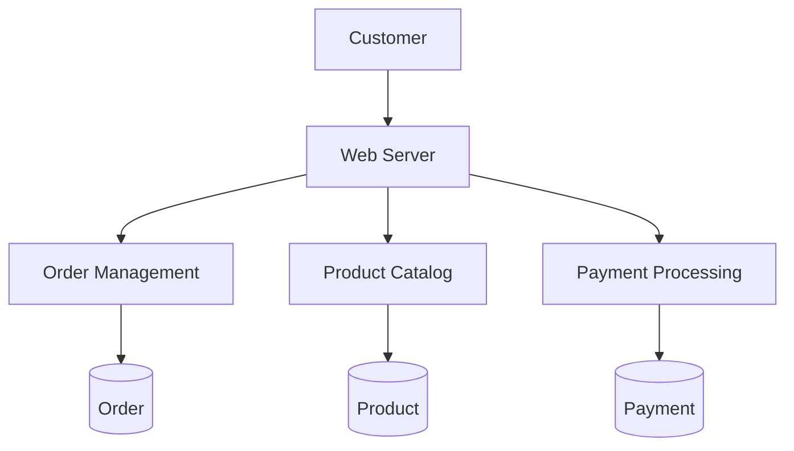
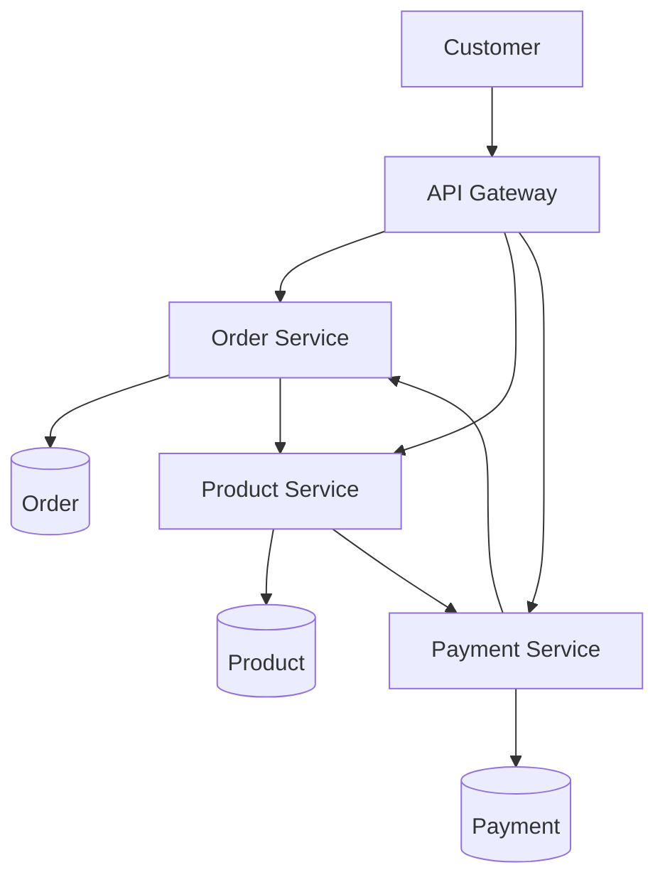

# Introduction

gRPC는 다양한 기업에서 사용하고 있고, 자주 사용했었던 기술인 [Triton Inference Server](https://github.com/triton-inference-server/server)에서도 사용되고 있다.$\_{^{\ [1]}}$
기존에는 REST API 기반 통신을 주로 사용했었는데 어떤 이유로 gRPC를 사용하기 시작한 것일까?
이 글을 통해 gRPC의 탄생 배경, 장단점, Python을 통한 구현 등을 알아보도록 하자!

<!-- More -->

---

# Theoretical Background

gRPC의 탄생 배경을 알아보기 전 MSA와 RPC에 대해 이해해보자.

## MSA

MSA(Micro Service Architecture)는 기존의 monolithic architecture와 달리, service 단위를 작게 나누어 독립적으로 구성함으로써 확장성, 생산성, 유지보수성, 유연성 등 다양한 장점을 제공한다.
다만, MSA를 구축하려면 Kubernetes와 같은 container orchestration 도구에 대한 이해가 필요하며, architecture의 복잡도가 증가하는 단점이 존재한다.
자세한 비교는 아래 표를 통해 알 수 있다.

| Aspect            | Monolithic Architecture                       | Micro Service Architecture                         |
| ----------------- | --------------------------------------------- | -------------------------------------------------- |
| Deployment        | 전체 application을 한 번에 배포               | 각 service를 독립적으로 배포 가능                  |
| Scalability       | 특정 component 확장이 어려움                  | 개별 service 단위로 확장 가능                      |
| Development       | 모든 팀이 동일한 codebase에서 작업            | 각 팀이 독립적인 service에서 병렬 작업 가능        |
| Technology Stack  | 단일 기술 stack으로 제한됨                    | Service별로 다양한 기술 선택 가능                  |
| Fault Tolerance   | 한 부분의 장애가 전체 system에 영향을 미침    | 장애가 개별 service로 제한됨                       |
| Complexity        | 초기 설정 및 관리가 단순                      | Service 간 통신 및 orchestration 복잡성 증가       |
| Performance       | service 간 통신이 적어 overhead가 낮음        | Network 통신으로 인해 추가 지연 발생 가능          |
| Maintenance       | Codebase가 커질수록 유지보수가 어려움         | 작은 단위로 나뉘어 유지보수가 용이함               |
| Time-to-Market    | 높은 의존성으로 기능 개발 및 출시 속도가 느림 | 병렬 작업으로 기능 개발 및 출시 속도 향상          |
| Operational Costs | 단순한 환경에서 운영 비용이 낮음              | Monitoring, 배포, orchestration으로 운영 비용 증가 |
| Data Management   | 단일 database로 관리가 용이                   | 분산 database로 데이터 일관성 관리가 어려움        |

<table>
<tr>
<td style="text-align: center;">Monolithic Architecture</td>
<td style="text-align: center;">Micro Service Architecture</td>
</tr>
<tr>
<td>



</td>
<td>



</td>
</tr>
</table>

## RPC

RPC (Remote Procedure Call)는 network 상의 다른 computer에서 실행되는 함수를 호출하는 방식이다.
Local function과 같이 보이지만 실제로는 network를 통해 다른 server나 process에서 실행된다.
RPC를 통해 분산 system에서 서로 다른 system 간 통신을 저수준의 세부 사항까지 신경쓰지 않고 표준화된 방식으로 구축할 수 있다.
대표적인 RPC로 [gRPC](https://github.com/grpc), [Thrift](https://github.com/apache/thrift), [Dubbo](https://github.com/apache/dubbo) 등이 있다.

## gRPC

gRPC는 Google에서 개발한 대표적인 open source RPC로 HTTP/2를 기반으로 빠른 data 전송과 multiplexing을 지원하며 아래와 같이 binary protocol인 [Protocol Buffers](https://protobuf.dev/overview/)를 사용하여 data 직렬화가 효율적이다.$\_{^{\ [2]}}$

```proto
message Person {
  string name = 1;
  int32 id = 2;
  bool has_ponycopter = 3;
}
```

또한 다양한 언어 (C, C++, Java, Python, Go, Ruby, ...) 지원으로 polyglot 구성이 가능하며 빠르고 효율적인 특징들로 MSA에서 각광받고 있다.
기존의 RESTful API는 주로 HTTP/1.1을 기반으로 사용되며, gRPC는 HTTP/2를 기반으로 하여 두 가지의 차이를 아래 표에서 확인할 수 있다.

| Feature                   | HTTP/1.1                                          | HTTP/2                                                      |
| ------------------------- | ------------------------------------------------- | ----------------------------------------------------------- |
| Protocol                  | Text 기반 (ASCII)                                 | Binary 기반                                                 |
| Header Handling           | 매 요청마다 header를 반복적으로 전송              | Header 압축을 통해 중복을 제거, 효율적인 전송               |
| Connection Management     | 요청마다 새로운 연결을 생성(혹은 Keep-Alive 사용) | 하나의 연결에서 여러 요청/응답을 처리 (Multiplexing)        |
| Performance               | 순차적 처리, 한 번에 하나의 요청만 처리           | Multiplexing으로 여러 요청을 동시에 처리                    |
| Request/Response Handling | 요청-응답 순차적으로 처리                         | 요청-응답 비동기 처리, 서버 푸시 가능                       |
| Latency                   | 높은 지연 시간 (Header 크기 및 연결 지연)         | 낮은 지연 시간 (헤더 압축 및 멀티플렉싱 덕분)               |
| Performance Optimization  | 없음                                              | Streaming, header 압축, multiplexing, server push 등        |
| Overhead                  | 높은 overhead (Header 크기, 연결 수)              | 낮은 overhead (효율적인 data 전송)                          |
| Multiplexing              | 없음                                              | 있음 (하나의 연결에서 여러 요청/응답을 병렬 처리)           |
| Real-time Streaming       | 제한적, 순차적 요청 처리                          | 양방향 streaming, 실시간 data 전송 최적화                   |
| Order Guarantee           | 응답 순서 보장                                    | 응답 순서 보장, 하지만 multiplexing으로 순서가 섞일 수 있음 |
| Conncetion Persistence    | 하나의 연결로 여러 요청 가능 (Keep-Alive 필요)    | 하나의 연결로 다수의 요청 및 응답 처리 가능                 |
| Server Push               | 없음                                              | 있음 (Server가 client 요청 없이 resource를 미리 전송)       |

---

# Experiments

RESTful API (HTTP/1.1) 기반의 backend와 gRPC 기반의 backend의 정량적 차이를 확인하기 위해 대표적인 HTTP/1.1 기반 backend framework인 FastAPI를 사용했다.
정량적인 비교를 위해 response time, RPS (requests per seconds)를 측정했다.

## REST

아주 간단하게 `POST`를 통해 입력 받은 숫자의 factorial 값을 응답하는 API를 아래와 같이 만들었다.

```python rest_server.py
import math
import sys
import time

from fastapi import FastAPI
from pydantic import BaseModel

sys.set_int_max_str_digits(100_000_000)
MOD = 100_000_007

app = FastAPI()


class FactorialRequest(BaseModel):
    number: int


@app.post("/factorial/")
async def calculate_factorial(request: FactorialRequest):
    start_time = time.time()
    result = math.factorial(request.number)
    end_time = time.time()
    return {"result": result % MOD, "time_taken": end_time - start_time}
```

```shell
$ curl -X POST ${HOST} \
    -H 'Content-Type: application/json' \
    -d '{"number": 100000}'
{"result":20163673,"time_taken":0.07894515991210938}
```

## gRPC

gRPC를 사용하는 backend를 구성하기 전 Python 의존성들을 아래와 같이 설치한다.

<!-- markdownlint-disable -->

```shell
$ pip install grpcio grpcio-tools grpc-interceptor
```

<!-- markdownlint-enable -->

이후에 아래와 같이 gRPC의 `service`와 입출력 (`message`)을 정의한다.

```proto item.proto
syntax = "proto3";

package item;

service MathService {
  rpc CalculateFactorial(MathServiceCalculateFactorialRequest) returns (MathServiceCalculateFactorialResponse);
}

message MathServiceCalculateFactorialRequest {
  int32 number = 1;
}

message MathServiceCalculateFactorialResponse {
  int64 result = 1;
  float time_taken = 2;
}
```

위와 같이 작성된 `item.proto`는 아래와 같은 명령을 통해 2개의 Python script로 변환할 수 있다.

```shell
$ python -m grpc_tools.protoc -I. --python_out=. --grpc_python_out=. item.proto
$ head item_pb2.py
# -*- coding: utf-8 -*-
# Generated by the protocol buffer compiler.  DO NOT EDIT!
# NO CHECKED-IN PROTOBUF GENCODE
# source: item.proto
# Protobuf Python Version: 5.28.1
"""Generated protocol buffer code."""
from google.protobuf import descriptor as _descriptor
from google.protobuf import descriptor_pool as _descriptor_pool
from google.protobuf import runtime_version as _runtime_version
from google.protobuf import symbol_database as _symbol_database
$ head item_pb2_grpc.py
# Generated by the gRPC Python protocol compiler plugin. DO NOT EDIT!
"""Client and server classes corresponding to protobuf-defined services."""
import grpc
import warnings

import item_pb2 as item__pb2

GRPC_GENERATED_VERSION = '1.68.1'
GRPC_VERSION = grpc.__version__
_version_not_supported = False
```

Python script로 변환된 gRPC 함수를 이용해 아래와 같이 개발하면 처음 FastAPI로 개발한 것과 같은 역할을 할 수 있다.

```python grpc_server.py
import math
import sys
import time
from concurrent import futures

import grpc
import zerohertzLib as zz

import item_pb2
import item_pb2_grpc

sys.set_int_max_str_digits(100_000_000)
MOD = 100_000_007


class MathService(item_pb2_grpc.MathServiceServicer):
    def __init__(self):
        self.logger = zz.logging.Logger("MathService")

    def CalculateFactorial(self, request, context):
        try:
            start_time = time.time()
            result = math.factorial(request.number)
            end_time = time.time()
            return item_pb2.MathServiceCalculateFactorialResponse(
                result=result % MOD, time_taken=end_time - start_time
            )
        except Exception as e:
            self.logger.error(f"Error occurred: {e}")
            context.set_details(f"Error occurred: {e}")
            context.set_code(grpc.StatusCode.INTERNAL)
        return item_pb2.MathServiceCalculateFactorialResponse()


def serve():
    server = grpc.server(
        futures.ThreadPoolExecutor(max_workers=10),
        options=[
            ("grpc.max_message_length", 10 * 1024 * 1024),
            ("grpc.max_receive_message_length", 10 * 1024 * 1024),
        ],
    )
    item_pb2_grpc.add_MathServiceServicer_to_server(MathService(), server)
    server.add_insecure_port("[::]:1547")
    server.start()
    server.wait_for_termination()


if __name__ == "__main__":
    serve()
```

<!-- markdownlint-disable -->

```shell
$ python grpc_server.py
```

<!-- markdownlint-enable -->

해당 server는 아래와 같이 Python script로 호출할 수 있다.

```python grpc_client.py
import grpc
import item_pb2
import item_pb2_grpc


def run():
    channel = grpc.insecure_channel("${HOST}")
    stub = item_pb2_grpc.MathServiceStub(channel)
    number = 10000
    request = item_pb2.MathServiceCalculateFactorialRequest(number=number)
    response = stub.CalculateFactorial(request)
    print(f"Factorial of {number}: {response.result}")
    print(f"Time taken: {response.time_taken:.6f} seconds")


if __name__ == "__main__":
    run()
```

```shell
$ python grpc_client.py
Factorial of 10000: 6388460
Time taken: 0.001477 seconds
```

## Locust

[Locust](https://github.com/locustio/locust)는 Python 기반의 open source 부하 test 도구로 아래와 같이 사용할 수 있다.


REST, gRPC로 구성된 server들을 정량적으로 test하기 위해서 아래와 같은 `User` 속성을 정의했고, 필요한 data들을 export하기 위해 `@locust.events.request.add_listener`를 사용했다.

```python rest_locustfile.py
import csv
import time

import zerohertzLib as zz
from locust import HttpUser, between, events, task

logger = zz.logging.Logger("REST")
last_time = time.time()


class FastAPIUser(HttpUser):
    wait_time = between(1, 2)

    @task
    def calculate_factorial(self):
        logger.info("REST: Start")
        payload = {"number": 10000}
        self.client.post("/factorial/", json=payload)
        logger.info("REST: End")


def write_to_csv(current_time, rps, avg_response_time, failure_count):
    file_name = "locust_results.csv"
    file_exists = False
    try:
        with open(file_name, "r"):
            file_exists = True
    except FileNotFoundError:
        pass
    with open(file_name, "a", newline="") as csvfile:
        fieldnames = ["Time (s)", "RPS", "Avg Response Time (ms)", "Failure Count"]
        writer = csv.DictWriter(csvfile, fieldnames=fieldnames)
        if not file_exists:
            writer.writeheader()
        writer.writerow(
            {
                "Time (s)": current_time,
                "RPS": rps,
                "Avg Response Time (ms)": avg_response_time,
                "Failure Count": failure_count,
            }
        )


start_time = None
last_time = time.time()
last_count = 0
total_count = 0
rps = 0
total_response_time = 0
failure_count = 0


@events.request.add_listener
def time_series(**kwargs):
    global start_time, last_time, last_count, total_count, rps, total_response_time, failure_count
    total_count += 1
    if kwargs["exception"] is None:
        response_time = kwargs["response_time"]
        total_response_time += response_time
    else:
        response_time = None
        failure_count += 1
    current_time = time.time()
    if current_time - last_time >= 1:
        if start_time is None:
            start_time = current_time
        rps = total_count - last_count
        last_time = current_time
        last_count = total_count
        if total_count > 0:
            avg_response_time = total_response_time / total_count
        else:
            avg_response_time = 0
        logger.info(f"RPS: {rps} requests per second")
        logger.info(f"Avg Response Time: {avg_response_time} ms")
        logger.info(f"Failure Count: {failure_count}")
        write_to_csv(current_time - start_time, rps, avg_response_time, failure_count)
    if kwargs["exception"] is not None:
        logger.exception(
            f"Request {kwargs['name']} failed! Exception: {kwargs['exception']}"
        )
    else:
        logger.info(
            f"Request {kwargs['name']} succeeded! Response time: {response_time} ms"
        )


@events.request.add_listener
def response_time(**kwargs):
    if kwargs["exception"] is not None:
        return
    response_time = kwargs["response_time"]
    with open("response_time.csv", "a") as file:
        file.writelines(str(response_time) + "\n")
```

Locust 공식 문서를 응용하여 아래와 같은 `GRPCUser`를 개발했다.$\_{^{\ [3]}}$

```python grpc_locustfile.py
import csv
import time
from types import NoneType

import grpc
import zerohertzLib as zz
from grpc_interceptor import ClientInterceptor
from locust import User, between, events, task
from locust.exception import LocustError

import item_pb2
import item_pb2_grpc

logger = zz.logging.Logger("GRPC")


class LocustInterceptor(ClientInterceptor):
    def __init__(self, environment, *args, **kwargs):
        super().__init__(*args, **kwargs)

        self.env = environment

    def intercept(self, method, request_or_iterator, call_details):
        response = None
        exception = None
        start_perf_counter = time.perf_counter()
        response_length = 0
        try:
            response = method(request_or_iterator, call_details)
            response_length = response.result().ByteSize()
        except grpc.RpcError as e:
            exception = e
        self.env.events.request.fire(
            request_type="grpc",
            name=call_details.method,
            response_time=(time.perf_counter() - start_perf_counter) * 1000,
            response_length=response_length,
            response=response,
            context=None,
            exception=exception,
        )
        return response


class GRPCUserABC(User):
    abstract = True
    stub_class = None

    def __init__(self, environment):
        super().__init__(environment)
        for attr_value, attr_name in (
            (self.host, "host"),
            (self.stub_class, "stub_class"),
        ):
            if attr_value is None:
                raise LocustError(f"You must specify the {attr_name}.")
        self._channel = grpc.insecure_channel(self.host.replace("http://", ""))
        interceptor = LocustInterceptor(environment=environment)
        self._channel = grpc.intercept_channel(self._channel, interceptor)
        self.stub = self.stub_class(self._channel)


class GRPCUser(GRPCUserABC):
    wait_time = between(1, 2)
    stub_class = item_pb2_grpc.MathServiceStub

    @task
    def calculate_factorial(self):
        logger.info("gRPC: Start")
        self.stub.CalculateFactorial(
            item_pb2.MathServiceCalculateFactorialRequest(number=10000)
        )
        logger.info("gRPC: End")


def write_to_csv(current_time, rps, avg_response_time, failure_count):
    file_name = "locust_results.csv"
    file_exists = False
    try:
        with open(file_name, "r"):
            file_exists = True
    except FileNotFoundError:
        pass
    with open(file_name, "a", newline="") as csvfile:
        fieldnames = ["Time (s)", "RPS", "Avg Response Time (ms)", "Failure Count"]
        writer = csv.DictWriter(csvfile, fieldnames=fieldnames)
        if not file_exists:
            writer.writeheader()
        writer.writerow(
            {
                "Time (s)": current_time,
                "RPS": rps,
                "Avg Response Time (ms)": avg_response_time,
                "Failure Count": failure_count,
            }
        )


start_time = None
last_time = time.time()
last_count = 0
total_count = 0
rps = 0
total_response_time = 0
failure_count = 0


@events.request.add_listener
def time_series(**kwargs):
    global start_time, last_time, last_count, total_count, rps, total_response_time, failure_count
    total_count += 1
    if kwargs["exception"] is None:
        response_time = kwargs["response_time"]
        total_response_time += response_time
    else:
        response_time = None
        failure_count += 1
    current_time = time.time()
    if current_time - last_time >= 1:
        if start_time is None:
            start_time = current_time
        rps = total_count - last_count
        last_time = current_time
        last_count = total_count
        if total_count > 0:
            avg_response_time = total_response_time / total_count
        else:
            avg_response_time = 0
        logger.info(f"RPS: {rps} requests per second")
        logger.info(f"Avg Response Time: {avg_response_time} ms")
        logger.info(f"Failure Count: {failure_count}")
        write_to_csv(current_time - start_time, rps, avg_response_time, failure_count)
    if kwargs["exception"] is not None:
        logger.exception(
            f"Request {kwargs['name']} failed! Exception: {kwargs['exception']}"
        )
    else:
        logger.info(
            f"Request {kwargs['name']} succeeded! Response time: {response_time} ms"
        )


@events.request.add_listener
def response_time(**kwargs):
    if kwargs["exception"] is not None:
        return
    response_time = kwargs["response_time"]
    with open("response_time.csv", "a") as file:
        file.writelines(str(response_time) + "\n")
```

최종적인 test는 아래와 같이 실행하여 진행했다.

```shell
$ locust -f rest_locustfile.py --host=${HOST} --users 100 --spawn-rate 10 --run-time 3m
$ head result.csv
Time (s),RPS,Avg Response Time (ms),Failure Count
0.0,1,53.44699998386204,0
1.0806777477264404,20,53.20742461896901,0
2.234771966934204,20,35.357434947111805,0
3.25295090675354,30,26.738214236028284,0
4.278264999389648,34,22.486146865412593,0
5.336923837661743,42,19.721260822542824,0
6.416055917739868,52,17.647965277671513,0
7.420273780822754,56,16.311546613224873,0
8.4217689037323,67,15.619779782953978,0
$ head locust_results.csv
53.44699998386204
76.67745801154524
76.40829193405807
76.50387496687472
76.47608302067965
76.43645897042006
76.05966599658132
70.90754108503461
77.0382919581607
76.27529208548367
$ locust -f grpc_locustfile.py --host=${HOST} --users 100 --spawn-rate 10 --run-time 3m
```

---

# Conclusion

> Locust를 통한 결과 (좌: REST, 우: gRPC)
> 




| Type | # Requests | Median<br/>[ms] | 95%ile<br/>[ms] | 99%ile<br/>[ms] | Average<br/>[ms] | Min<br/>[ms] | Max<br/>[ms] | Average size<br/>[bytes] |
| :--: | :--------: | :-------------: | :-------------: | :-------------: | :--------------: | :----------: | :----------: | :----------------------: |
| REST |   11,653   |        9        |       13        |       23        |       9.77       |      6       |      77      |          52.75           |
| gRPC |   11,687   |        5        |        6        |       10        |       5.04       |      4       |     180      |            10            |

여기서 average size가 5배 가량 차이나는 점을 확인할 수 있다.
이는 REST의 경우 ASCII 기반으로, gRPC의 경우 binary 기반으로 data를 주고 받기 때문으로 보인다.

각 요청에 따른 response time을 시각화하면 아래와 같은 결과가 도출된다.


확실히 gRPC가 REST에 비해 빠른 response time을 가지는 것을 보인다.

3분 간의 부하 test에 대한 RPS와 평균 response time은 아래와 같다.


RPS는 유사한 경향을 띄지만, response time에 대해서 약 2배 가량 빠른 것을 확인할 수 있다.

이 결과들이 엄밀하게 통제된 환경 속에서 실험된 것도 아니고, 각 backend들의 resource 제어를 한 상태에서 진행한 것도 아니기에 이를 통해 gRPC의 성능이 확실히 좋다고 단정하긴 어렵다.
경향 자체로는 확실히 HTTP/1.1 기반의 REST API에 비해 개선됨을 확인할 수 있었다.
또한 각 backend에 대해 복잡한 요청, 응답과 business logic을 적용하여 비교하면 더 명쾌한 차이를 확인할 수 있을 것으로 보인다.

---



1. [오늘의집: 오늘의집 MSA Phase 1. 백엔드 분리작업](https://www.bucketplace.com/post/2022-01-14-%EC%98%A4%EB%8A%98%EC%9D%98%EC%A7%91-msa-phase-1-%EB%B0%B1%EC%97%94%EB%93%9C-%EB%B6%84%EB%A6%AC%EC%9E%91%EC%97%85/)
2. [gRPC: Introduction to gRPC](https://grpc.io/docs/what-is-grpc/introduction/)
3. [Locust: gRPC](https://docs.locust.io/en/stable/testing-other-systems.html#grpc)


