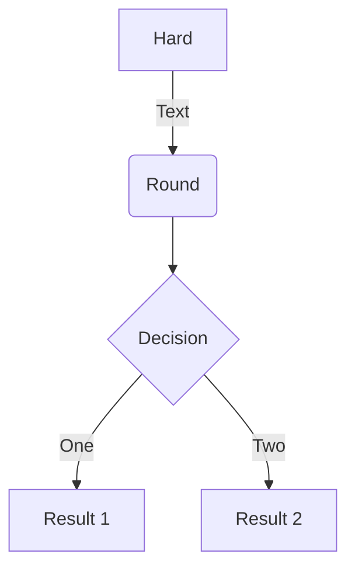
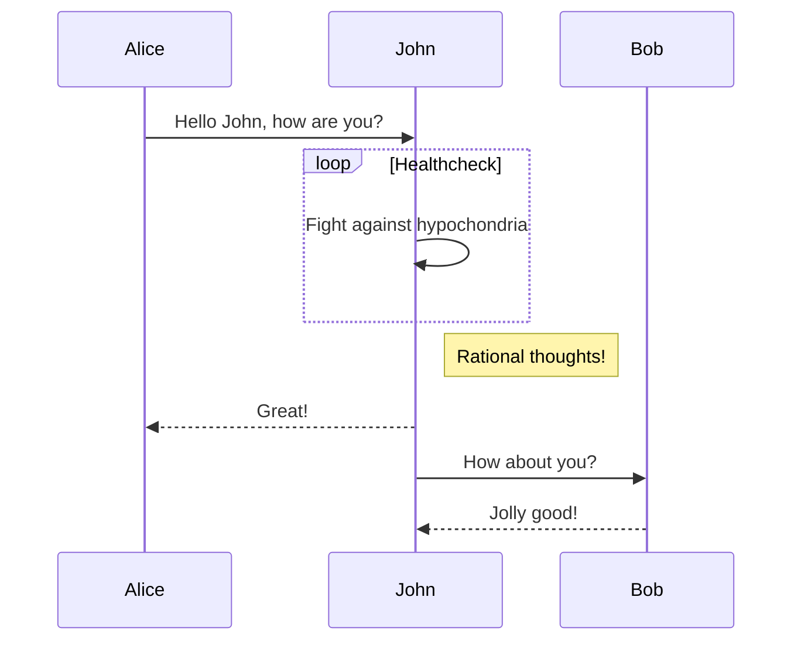
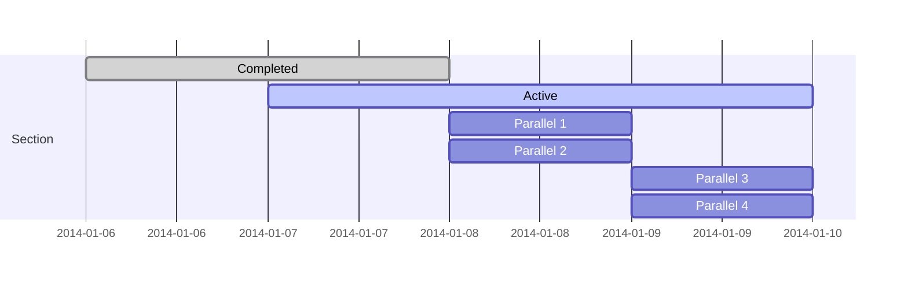
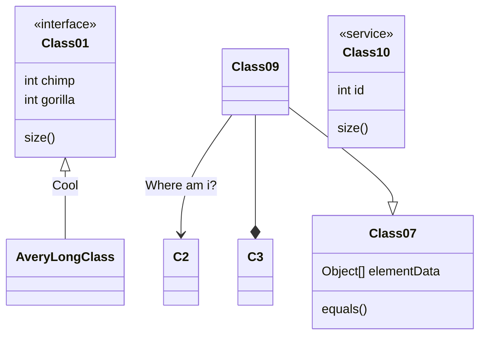
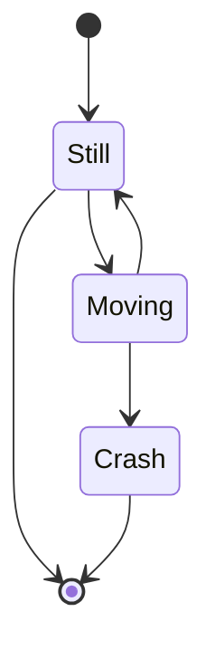
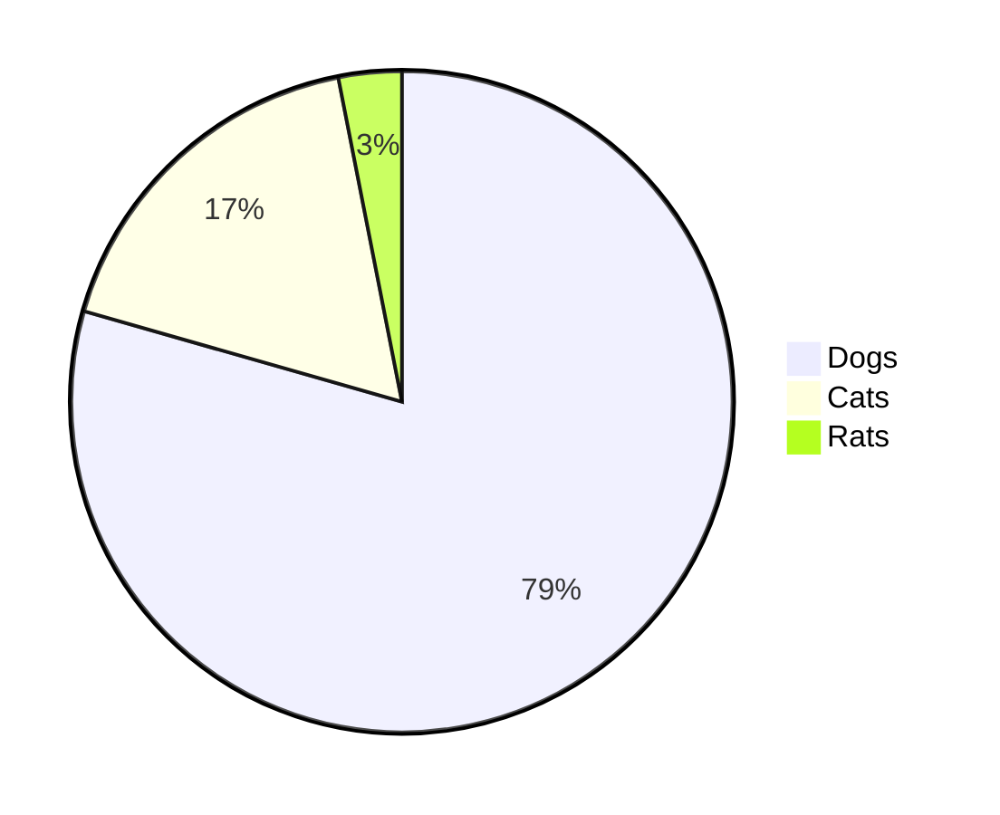

# Quote

```jinja Quote https://hexo.io/docs/tag-plugins#Block-Quote

content

```

```jinja
<!-- markdownlint-disable -->

Every interaction is both precious and an opportunity to delight.

<!-- markdownlint-enable -->
```

<!-- markdownlint-disable -->


Every interaction is both precious and an opportunity to delight.


<!-- markdownlint-enable -->
<br/>

```jinja Centered Quote https://theme-next.js.org/docs/tag-plugins/#Centered-Quote
Something

Something
```

```jinja
Something
```

Something

<!-- more -->

````markdown Code Block https://hexo.io/docs/tag-plugins#Code-Block
```[language] [title] [url] [link text] [additional options]
code snippet
```
````

---

# Video

```jinja Video https://theme-next.js.org/docs/tag-plugins/#Video

```

```jinja
<!-- markdownlint-disable -->

<!-- markdownlint-enable -->
```

<!-- markdownlint-disable -->



<!-- markdownlint-enable -->

---

# Group Pictures

```jinja Group Pictures https://theme-next.js.org/docs/tag-plugins/group-pictures





```

```jinja




```






---

# Mermaid

```yaml _config.yml
highlight:
  exclude_languages:
    - mermaid
```

````jinja Mermaid https://theme-next.js.org/docs/tag-plugins/mermaid



```mermaid
type

```
````

## Graph

````markdown

````


## Sequence Diagram

````markdown

````


## Gantt

````markdown

````


## Class Diagram

````markdown

````


## State Diagram

````markdown

````


## Pie

````markdown

````


---

# Note

```jinja Note https://theme-next.js.org/docs/tag-plugins/note

Any content (support inline tags too).

```

```jinja

No Parameters


Default


Primary


Info


Success


Warning


Danger


Summary

```


No Parameters


Default


Primary


Info


Success


Warning


Danger


Summary


---

# Tabs

```jinja Tabs https://theme-next.js.org/docs/tag-plugins/tabs

<!-- tab [Tab caption] [@icon] -->
Any content (support inline tags too).
<!-- endtab -->

```

````jinja

<!-- tab Python -->
```python main.py
print("Hello, World!")
```
<!-- endtab -->
<!-- tab Java -->
```java Main.java
System.out.print("Hello, World!")
```
<!-- endtab -->
<!-- tab Go -->
```go main.go
fmt.Print("Hello, World!")
```
<!-- endtab -->

````



<!-- tab Python -->

```python main.py
print("Hello, World!")
```

<!-- endtab -->
<!-- tab Java -->

```java Main.java
System.out.print("Hello, World!")
```

<!-- endtab -->
<!-- tab Go -->

```go main.go
fmt.Print("Hello, World!")
```

<!-- endtab -->



---



- [Hexo: Tag Plugins](https://hexo.io/docs/tag-plugins)
- [NexT: Tag Plugins](https://theme-next.js.org/docs/tag-plugins/)


