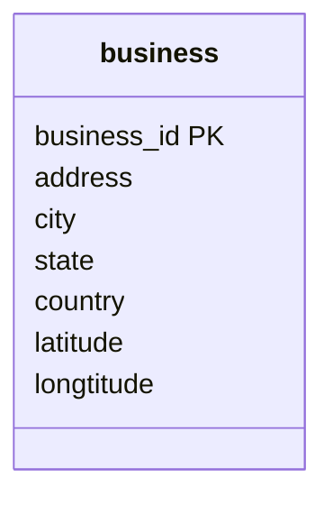
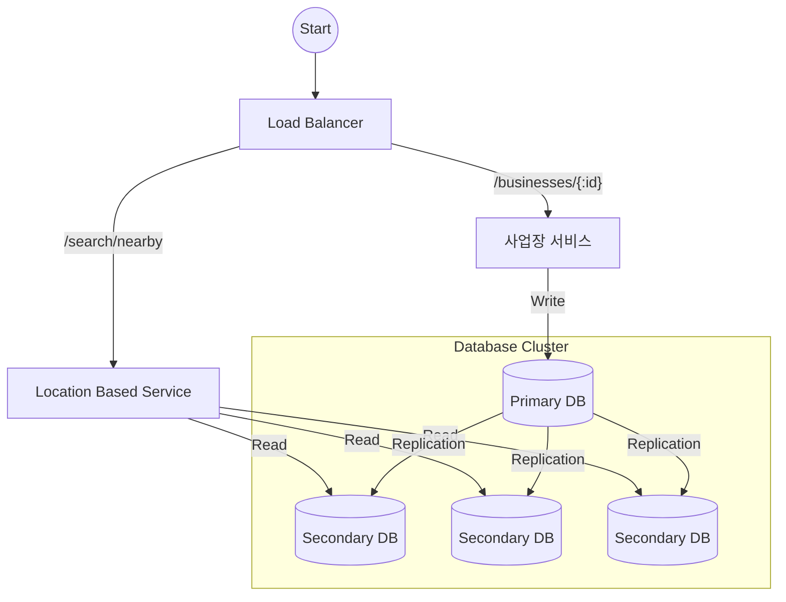
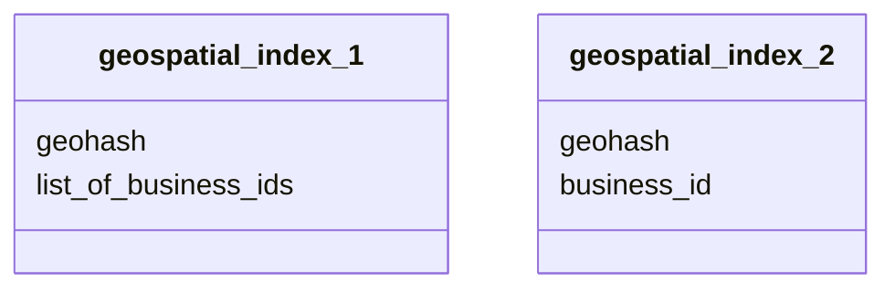
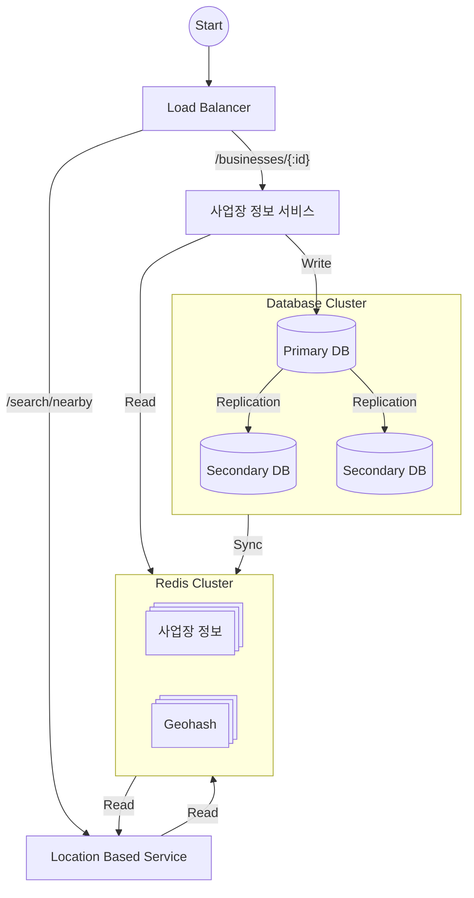
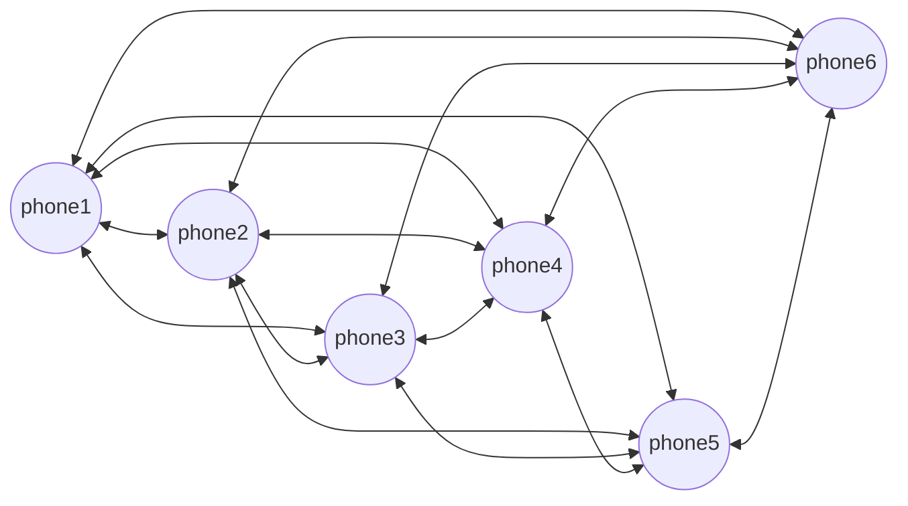
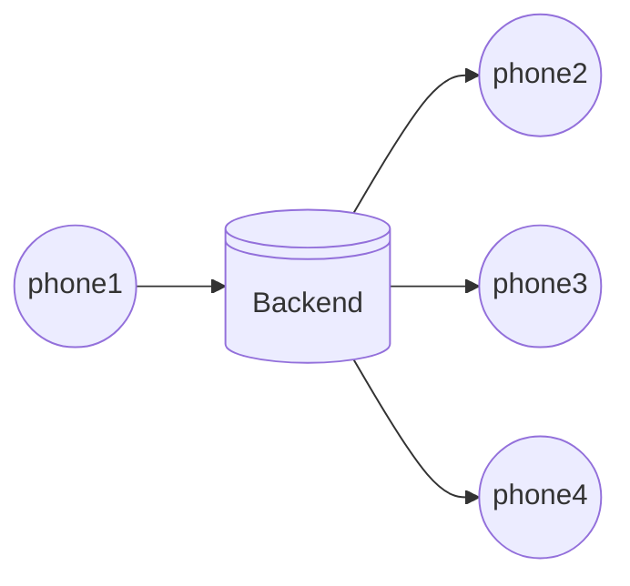
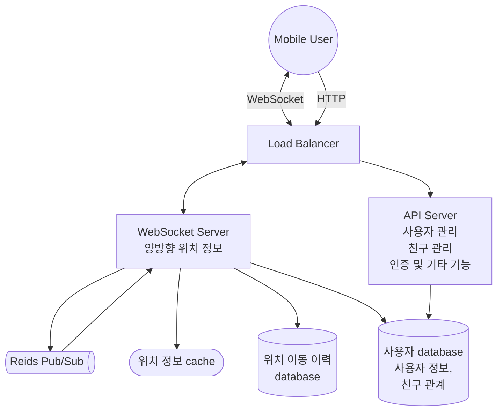
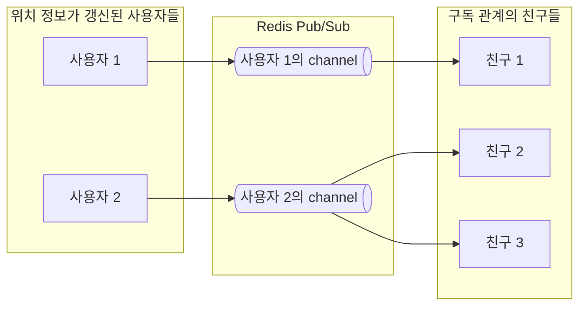
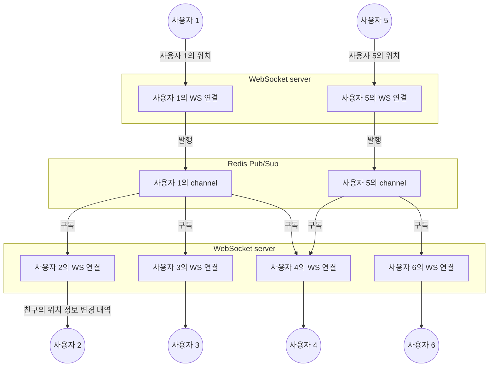

# 근접성 서비스


근접성 서비스 (proximity service): 음식점, 극장 등 현재 위치에서 가까운 시설을 찾는 service


> 예시: [Yelp](https://www.yelp.com/) (주변의 좋은 식당 검색)
> 

<!-- More -->

## 1단계: 문제 이해 및 설계 범위 확정

> 아래 세부 사항은 가상 면접관과의 대화를 통해 문제를 이해하고, 설계 범위를 정의한 내용이다.

- 기능 요구사항
  - 사용자의 경도, 위도 쌍과 검색 반경 정보에 매치되는 사업장 목록 반환
  - 사업장 소유주가 사업장 정보 추가, 삭제, 갱신 (실시간 반영 X)
  - 고객은 사업장의 상세 정보 조회 가능
- 비기능 요구사항 (non-functional requirements)
  - 낮은 응답 지연 (latency): 주변 사업장의 신속한 검색
  - 데이터 보호 (data privacy): 위치 기반 서비스 (Location-Based Service, LBS)는 사용자 정보 보호 방법 모색 필수 (Data 사생활 보호 법안 준수)
    - GDPR: General Data Protection Regulation
    - CCPA: California Consumer Privacy Act
  - 고가용성 (high availability) 및 규모 확장성 (scalability): 인구 밀집 지역에서 이용자 집중 시간에 traffic 감당
- 개략적 규모 (back-of-the-envelope calculation) 추정
  - 일간 능동 사용자 (Daily Active User, DAU): 1억
  - 등록된 사업장 수: 2억



<!-- tab QPS (Query per Second) 계산 -->

- $1 day=24h \times 60m \times 60s=86,400s\backsimeq100,000=10^5$
- 한 사용자 당 하루 5회 검색 시도 가정
- $\therefore\ QPS=(100,000,000\times5)/10^5=5,000$

<!-- endtab -->



## 2단계: 개략적 설계안 제시 및 동의 구하기

### API 설계

> `GET /v1/search/nearby`


Pagination을 고려하면 더욱 좋음!


|    Field    |    설명     |     자료형     |
| :---------: | :---------: | :------------: |
| `latitude`  | 검색할 위도 |    `float`     |
| `longitude` | 검색할 경도 |    `float`     |
|  `radius`   | 검색할 범위 | `int = 5,000m` |

```json GET /v1/search/nearby /v1/search/nearby
{
    "total": 10,
    "data": [place, ...]
}
```

- `place`: 사업장을 표현하는 객체
- 사업장의 사진, 리뷰, 별점 등 추가 정보는 상세 정보 페이지 클릭 시 또 다른 API 호출 필요

### 사업장 관련 API

|  Method  |         API          |             설명             |
| :------: | :------------------: | :--------------------------: |
|  `GET`   | `/v1/businesses/:id` | 특정 사업장의 상세 정보 반환 |
|  `POST`  |   `/v1/businesses`   |      새로운 사업장 추가      |
|  `PUT`   | `/v1/businesses/:id` |    사업장 상세 정보 갱신     |
| `DELETE` | `/v1/businesses/:id` |    특정 사업장 정보 삭제     |

### 데이터 모델

- 읽기/쓰기 비율 (read/write ratio)
  - $write <<< read$ ($\because$ 주변 사업장 검색, 사업장 정보 확인)
  - 읽기 연산이 압도적인 시스템은 MySQL과 같은 RDB가 적합
- 스키마 설계 (schema design)
  - 지리적 위치 색인 테이블 (geospatial index table): 위치 정보 관련 연산의 효율성 향상



### 개략적 설계



- Load balancer: 유입 traffic을 자동으로 여러 service에 분산시키는 component
  - 단일 DNS 진입점 (entry point) 지정 가능
  - URL 경로 분석 후 traffic 전달 service 결정
- Location-based service
  - 쓰기 요청이 없고 읽기 요청만 존재
  - 상대적으로 높은 QPS
  - 인구 밀집 지역의 특정 시간대에 특히 높음
  - 무상태 (stateless) service이므로 수평적 규모 확장 용이
- 사업장 service
  - 사업장 소유주가 사업장 정보를 생성, 갱신, 삭제
  - 쓰기 요청에 대해 상대적으로 낮은 QPS
  - 고객이 사업장 정보 조회
  - 특정 시간대에 높은 QPS
- Database cluster
  - 주-부 (primary-secondary) database 형태
  - Primary database: 쓰기 요청 처리
  - Secondary database: 읽기 요청 처리
  - Data는 primary database에 기록된 후 secondary database에 복사
  - 복제에 소요되는 시간 지연 (delay)에 의해 primary database와 secondary database 간 차이 발생 가능
  - 실시간으로 갱신될 필요가 없기 때문에 문제가 되지 않음

### 주변 사업장 검색 알고리즘

- 위치 기반 service에 주로 사용하는 database
  - [Geohash in Redis](https://redis.io/docs/latest/commands/geohash/)
  - [PostGIS](https://postgis.net/) extension을 설치한 Postgres database
- 2차원 검색
  - 2차원 data이기 때문에 색인을 사용해도 교집합을 구해야하기 때문에 비효율적
  - Database 색인으로는 1차원의 검색 속도만 개선 가능
  - 지리적 정보에 색인 만드는 방법 (지도를 작은 영역으로 분할하고 고속 검색이 가능하도록 색인 생성)
    - Hash 기반 방안
      - 균등 격자 (even grid)
      - Geohash
      - Cartesian tiers
    - Tree 기반 방안
      - Quadtree
      - Google S2
      - R-tree
- 균등 격자: 지리적 영역을 동일한 크기의 격자로 나누어 각 격자에 고유한 ID 부여
  - 장점
    - 구현이 간단하고 직관적
    - 격자의 크기를 조절하여 검색의 정밀도 조절
    - 특정 격자 내의 모든 점을 빠르게 검색 가능
  - 단점
    - 격자의 크기가 고정되어 있어, 밀집된 지역에서는 많은 격자 필요
    - 희소한 지역에서 불필요한 격자 존재 가능
    - 경계에 위치한 점들은 여러 격자에 걸쳐 있을 수 있어, 검색 시 추가적 처리가 필요
- Geohash: 재귀적으로 분할한 지리적 위치를 문자열로 인코딩하는 방법
  - 장점
    - 문자열로 인코딩되어 있어, 비교 및 정렬이 용이
    - 동일한 접두사를 가진 문자열은 인접한 위치를 나타냄
    - 다양한 정밀도로 인코딩 가능
  - 단점
    - 경계에 위치한 점들은 여러 Geohash에 걸쳐 있을 수 있어, 검색 시 추가적 처리가 필요
    - Geohash의 정밀도가 높아질수록 문자열 길이가 길어짐
- Quadtree: 지리적 data를 사분면으로 분할하여 tree 구조로 저장하는 방법
  - 장점
    - 밀집된 지역에서는 더 많은 분할을 통해 정밀한 검색 가능
    - 희소한 지역에서는 적은 분할로 효율적 저장 가능
    - Tree 구조를 통해 빠른 검색 및 삽입 가능
  - 단점
    - 구현이 복잡할 수 있음
    - 경계에 위치한 점들은 여러 노드에 걸쳐 있을 수 있어, 검색 시 추가적 처리가 필요
- Google S2: 지구 표면을 구면체로 간주하고, 이를 정육면체로 분할한 후, 각 면을 다시 분할하여 고유한 ID를 부여하는 방법
  - 장점
    - 지구 표면을 균등하게 분할하여, 왜곡이 적음
    - 다양한 정밀도로 분할 가능
    - 특정 영역 내의 모든 점을 빠르게 검색 가능
  - 단점
    - 구현이 복잡할 수 있음
    - 경계에 위치한 점들은 여러 셀에 걸쳐 있을 수 있어, 검색 시 추가적 처리가 필요

```sql 2_dim_search.sql
SELECT business_id, latitude, longitude,
FROM business
WHERE (latitude BETWEEN {:my_lat} - radius AND {:my_lat} + radius)
AND (longitude BETWEEN {:my_lat} - radius AND {:my_lat} + radius)
```

| Feature           | Geohash                                                                          | Quadtree                                                                         | Google S2                                                                                   |
| ----------------- | -------------------------------------------------------------------------------- | -------------------------------------------------------------------------------- | ------------------------------------------------------------------------------------------- |
| Encoding          | 문자열로 encoding                                                                | 사분면으로 분할하여 tree 구조로 저장                                             | 구면체를 정육면체로 분할하여 고유한 ID 부여                                                 |
| Advantages        | - 비교 및 정렬 용이<br/>- 동일 접두사: 인접 위치<br/>- 다양한 정밀도 인코딩 가능 | - 밀집 지역: 정밀 검색<br/>- 희소 지역: 효율적 저장<br/>- 빠른 검색 및 삽입 가능 | - 균등 분할: 왜곡 적음<br/>- 다양한 정밀도 분할<br/>- 특정 영역 내 모든 점 빠르게 검색 가능 |
| Disadvantages     | - 정밀도 높을수록 문자열 길어짐<br/>- 경계점: 여러 Geohash에 걸침                | - 구현 복잡<br/>- 경계점: 여러 노드에 걸침                                       | - 구현 복잡<br/>- 경계점: 여러 셀에 걸침                                                    |
| Use Cases         | 위치 기반 service, 지리적 data encoding                                          | 지리적 data 저장 및 검색                                                         | 지구 표면의 균등 분할 및 고유 ID 부여                                                       |
| Implementation    | 비교적 간단                                                                      | 복잡할 수 있음                                                                   | 복잡할 수 있음                                                                              |
| Precision Control | 문자열 길이로 조절                                                               | 분할 수준으로 조절                                                               | 분할 수준으로 조절                                                                          |

## 3단계: 상세 설계

### 데이터베이스의 규모 확장성



| Feature          | geospatial_index_1                                                                                                                                                                                                                                       | geospatial_index_2                                     |
| ---------------- | -------------------------------------------------------------------------------------------------------------------------------------------------------------------------------------------------------------------------------------------------------- | ------------------------------------------------------ |
| Data Storage     | 각 geohash에 해당하는 사업장 ID 목록 저장                                                                                                                                                                                                                | 각 geohash에 해당하는 개별 사업장 ID 저장              |
| Read Efficiency  | 특정 geohash에 대한 모든 사업장 ID를 한 번에 읽기 가능                                                                                                                                                                                                   | 특정 geohash에 대한 개별 사업장 ID를 여러 번 읽어야 함 |
| Write Efficiency | - 사업장 추가/삭제 시, 해당 geohash의 목록을 갱신해야 함<br/>- JSON 배열을 모두 읽고 갱신할 사업장 ID를 찾아야 하며, 새 사업장 등록 시 같은 업장 정보가 있는지 모두 살펴야 함<br/>- 병렬 실행 시 갱신 연산 결과로 데이터 소실을 막기 위해 lock 사용 필요 | - 사업장 추가/삭제 시, 개별 record를 갱신해야 함       |
| Storage Space    | 동일 geohash에 많은 사업장이 있을 경우, 저장 공간 절약                                                                                                                                                                                                   | 저장 공간이 더 많이 필요할 수 있음                     |
| Complexity       | 상대적으로 간단                                                                                                                                                                                                                                          | 상대적으로 복잡                                        |
| Use Case         | 특정 geohash에 대한 빠른 조회가 필요한 경우                                                                                                                                                                                                              | 개별 사업장에 대한 세밀한 관리가 필요한 경우           |

- Sharding 시 사업장 ID 기준 사용 $\rightarrow$ 모든 shard에 부하를 고르게 분산 및 운영 용이
- `geohash`와 `business_id`를 복합 키 (compound key)로 사용 시 사업장 정보 추가 및 삭제 용이 ($\because$ Lock을 사용할 필요 X)

### 캐시

- Cache 계층 도입 전, 정말 필요한가? 생각해보기.
  - 처리 부하가 읽기 중심이고 database 크기는 상대적으로 작아서 모든data는 1대 database 서버에 수용 가능 $\rightarrow$ Query 처리 성능은 I/O에 좌우되지 않으므로 memory cache 사용할 때와 비슷
  - 읽기 성능이 병목이라면 secondary database를 증설하여 읽기 대역폭을 늘릴 수 있음
- Cache key: 사용자 위치의 위도 경도?
  - 사용자의 전화기에서 반환되는 위치 정보는 추정치
  - 움직이지 않는다 해도 매 측정마다 조금씩 변화
  - 사용자가 이동하면 위도 및 경도 정보도 미세하게 변경
- Cache data 유형
  - `geohash`: 해당 격자 내의 사업장 ID 목록
  - `business_id`: 사업장 정보 객체
- 격자 내 사업장 ID
  - 사업자 정보는 상대적으로 변경이 빈번하지 않기 때문에 특정 geohash에 해당하는 사업장 ID 목록을 아래와 같이 미리 계산하여 Redis 같은 key-value 저장소에 cache 가능
  - Redis 저장소에 값 (value)를 저장하기 위해 필요한 공간: $8byte\times 200m \times 3\backsimeq5GB$ ($3$: 정밀도 가지수)
  - 하지만 고가용성을 보장하고 대륙 경계를 넘는 traffic의 전송지연을 방지하기 위해서는 Redis cluster를 전 세계 지역별로 두고, 동일 data를 각 지역에 중복하여 저장

```sql
SELECT business_id FROM geohash_index WHERE geohash LIKE `{: geohash}%`
```

```java
public List<String> getNearbyBusinessIds(String geohash) {
    String cacheKey = hash(geohash);
    List<String> listOfBusinessIds = Redis.get(cacheKey);
    if (listOfBusinessIds == null) {
        listOfBusinessIds = "SELECT business_id FROM geohash_index WHERE geohash LIKE `{: geohash}%`";
        Redis.set(cacheKey, listOfBusinessIds, "1d");
    }
    return listOfBusinessIds;
}
```

### 지역 및 가용성 구역

- 사용자와 system 사이 거리 최소화
- Traffic을 인구에 따라 고르게 분산하는 유연성 확보
- 지역에 따른 사생활 보호법 (privacy raw)에 맞는 운영

### 최종 설계도



1. Client app은 사용자의 위치 (위도와 경도)와 검색 반경 (500m)를 load balancer로 전송
2. Load balancer는 요청을 LBS로 전송
3. 사용자 위치와 반경 정보를 통해 LBS는 검색 요건을 만족할 geohash 길이 계산
4. LBS는 인접한 geohash를 계산하고 다음 목록에 추가
5. 인접한 geohash 내에 있는 geohash 각각에 대해 LBS는 'Geohash' Redis server를 호출하여 해당 geohash에 대응하는 모든 사업장 ID를 추출 (병렬적 수행 시 지연시간 단축 가능)
6. 반환된 사업장 ID들을 통해 '사업장 정보' Redis server를 조회하여 각 사업장의 상세 정보 취득
7. 주어진 상세 정보를 통해 사업장과 사용자 간 거리 계산 및 client app에 반환

---

# 주변 친구


주변 친구 (nearby friends): App 사용자 가운데 본인 위치 정보 접근 권한을 허락한 사용자에 한해 인근의 친구 목록을 보여주는 system



'근접성 서비스'의 사업장 주소는 정적이지만 '주변 친구'의 위치는 자주 바뀔 수 있음


## 1단계: 문제 이해 및 설계 범위 확정

> 아래 세부 사항은 가상 면접관과의 대화를 통해 문제를 이해하고, 설계 범위를 정의한 내용이다.

- 기능 요구사항
  - 사용자는 mobile app에서 주변 친구 확인 가능
  - 주변 친구까지의 거리 및 마지막으로 갱신된 시각 (timestamp) 조회
  - 친구 목록의 초 단위 자동 갱신
- 비기능 요구사항
  - 낮은 지연 시간 (low latency): 주변 친구의 위치 변화가 반영되는 데 너무 오랜 시간이 걸리지 않아야 함
  - 안정성: 안정적일수록 좋지만, 몇 개의 data가 유실되는 것은 용인 가능
  - 결과적 일관성 (eventual consistency): 위치 data를 저장하기 위해 강한 일관성 (strong consistency)을 지원하는 data 저장소를 사용할 필요는 없음 (복제본의 data가 원본과 동일하게 변경되기까지 몇 초 소모되는 것은 용인)
- 개략적 규모 추정
  - '주변 친구'는 8km 반경 이내의 친구로 정의
  - 친구 위치 정보는 30초 주기로 갱신 ($\because$ 사람의 걷는 속도는 4~6km/h)
  - 평균적으로 매일 주변 친구 기능 활용하는 사용자는 1억명으로 가정
  - 동시 접속 사용자의 수는 일간 능동 사용자 (Daily Active User, DAU) 수의 10%로 가정 (1000만명)
  - 평균적으로 한 사용자는 400명의 친구를 가지는 것을 가정
  - 사용자 모두 주변 친구 기능을 사용하는 것으로 가정
  - Page 당20명의 주변 친구 표시
  - 사용자의 추가 요청 시 더 많은 주변 친구 노출



<!-- tab QPS (Query per Second) 계산 -->

- $100,000,000 DAU$
- 동시 접속 사용자: $100,000,000\times10\\%=10,000,000$
- 사용자는 30초마다 자신의 위치를 system에 전송
- 위치 정보 갱신 $QPS = \frac{10,000,000}{30}\backsimeq334,000$

<!-- endtab -->



## 2단계: 개략적 설계안 제시 및 동의 구하기


위치 정보를 모든 친구에게 전송 (push)해야 한다는 요구사항 때문에 client와 server 사이 통신 protocol로 단순한 HTTP를 사용하지 못할 수 있음


### 개략적 설계안



- 이론적으로는 순수한 P2P (peer-to-peer)로 해결 가능 (활성 상태인 근방 모든 친구와 항구적 통신 유지)



- 공용 백엔드를 통해 효율화 가능
- 모든 활성 상태 사용자의 위치 변화 내역 수신
- 사용자 위치 변경 내역 수신 시 해당 사용자의 모든 활성 상태 친구를 찾아 그 사용자들의 기기로 변경 내역 전달
- 두 사용자 사이의 거리가 임계치보다 먼 경우 변경 내역 전송 X
- 하지만 활성 상태의 동시 접속 사용자가 대략 10,000,000명 이고 위치 정보를 30초마다 갱신하기에 초당 334,000번의 위치 정보 갱신을 처리해야함
- 평균적으로 1명의 사용자가 400명의 친구를 가지고 그 중 10%가 활성화 상태라면 초당 $334,000\times 400\times 10 \\% =14,000,000$ 건의 위치 정보 갱신 요청을 처리해야함

### 설계안



- Load balancer: RESTful API server 및 양방향 유상태 (stateful) WebSocket server 앞단에 위치
- RESTful API server
  - 무상태 (stateless) API server의 cluster
  - 통상적 요청/응답 traffic 처리
  - 친구 추가/삭제 또는 사용자 정보 갱신 등 부가적 작업 처리
- WebSocket server
  - 친구 위치 정보 변경을 거의 실시간에 가깝게 처리하는 유상태 cluster
  - 각 client는 WebSocket 연결을 지속적으로 유지
  - 검색 반경 내 친구 위치가 변경되면 client로 전송
  - Mobile client 시작 시 online 상태의 모든 주변 친구 위치를 해당 client로 전송하는 역할
- Redis 위치 정보 cache
  - 활성 상태 사용자의 가장 최근 위치 정보 cache
  - TTL (Time-To-Live) 기간이 지나면 해당 사용자 비활성 및 cache에서 삭제
  - Cache에 보관된 정보 갱신 시 TTL도 함께 갱신
- 사용자 database
  - 사용자 data 및 사용자의 친구 관계 정보를 저장
  - SQL, NoSQL 모두 사용 가능
- 위치 이동 이력 database
  - 사용자의 위치 변동 이력 보관
  - 주변 친구 표시와 직접 관계된 기능 X
- Redis Pub/Sub server: 초경량 message bus
  - GB급 memory를 갖춘 최신 Redis server에는 수백만 개의 channel (topic) 생성 가능
  - WebSocket server를 통해 수신한 특정 사용자의 위치 정보 변경 event는 해당 사용자에게 배정된 Pub/Sub channel에 발행
  - 해당 사용자의 친구 각각과 연결된 WebSocket 연결 handler는 해당 channel의 구독자로 설정
  - 특정 사용자의 위치 변경 시 해당 사용자의 모든 친구의 WebSocket 연결 handler 호출
  - 각 hander는 위치 변경 event를 수신할 친구가 활성 상태면 거리 다시 계산
  - 새로 계산한 거리가 검색 반경 이내면 갱신된 위치와 갱신 시각을 WebSocket 연결을 통해 해당 친구의 client app으로 전송



- 주기적 위치 갱신
  - Mobile client는 항구적으로 유지되는 WebSocket 연결을 통해 주기적으로 위치 변경 내역 전송
  - 한 사용자당 평균 400명의 친구가 있으며 그 가운데 10% 가량이 주변에서 online 상태임을 가정했기 때문에 한 사용자의 위치가 변경될 때마다 위치 정보 전송은 대략 40건 발생



### API 설계

- WebSocket: 사용자는 WebSocket protocol을 통해 위치 정보 변경 내역 송수신
  1. Server API: 주기적 위치 정보 갱신
     - request: 위도, 경도, 시각 정보
     - response: X
  2. Client API: Client가 갱신된 친구 위치 수신 API
     - request: 친구 위치 data와 변경된 시각을 나타내는 timestamp
     - response: X
  3. Server API: WebSocket 초기화 API
     - request: 위도, 경도, 시각 정보
     - response: 친구들의 위치 data
  4. Client API: 새 친구 구독 API
     - request: 친구 ID
     - response: 가장 최근의 위도, 경도, 시각 정보
  5. Client API: 구독 해지 API
     - request: 친구 ID
     - response: X
- HTTP 요청: API server는 친구를 추가/삭제하거나 사용자 정보를 갱신하는 등의 작업 처리

### 데이터 모델

|    Key    |       Value        |
| :-------: | :----------------: |
| 사용자 ID | {위도, 경도, 시각} |

- 위치 정보 cache
  - '주변 친구' 기능은 사용자의 현재 위치만을 사용하기 때문에 database 사용 X
  - 빠른 속도와 TTL 지원이 가능한 Redis가 적합
  - 영속성 (durability)을 보장할 필요 X
- 위치 이동 이력 database
  - `user_id`, `latitude`, `longtitude`, `timestamp`로 구성된 schema를 따르는 table에 저장
  - 막대한 쓰기 연산 부하와 수평적 규모 확장에 적합한 database인 Cassandra 사용 가능
  - RDB도 사용 가능은 하지만, 이력 data의 양이 server 한 대에 보관하기에 너무 많을 수 있으므로 sharding이 필요할 수 있음 (사용자 ID를 기준 삼는 sharding 방안이 가장 기본적)

## 3단계: 상세 설계

### 중요 구성요소별 규모 확장성

- WebSocket server
  - 사용률에 따라 규모를 자동으로 늘리는 것은 어렵지 않음
  - 하지만 유상태 server이기 때문에 제거할 때 주의 필요
  - Load balancer가 인식하는 node 상태를 drain으로 변경 뒤 모든 연결 종료 후 제거
- Client 초기화
  1. 위치 정보 cache에 보관된 사용자 위치 갱신
  2. 위치 정보는 계산 시 이용되므로 연결 handler 내의 변수에 저장
  3. 사용자 database를 통해 사용자의 친구 정보 수신
  4. 위치 정보 cache에 일괄 (batch) 요청을 보내 모든 친구의 위치를 한번에 수신
     - Cache에 보관하는 모든 항목의 TTL은 비활성화 timeout 시간 (inactivity timeout period)과 동일한 값으로 설정되어 있음
     - 비활성화 친구의 위치는 cache에 없음
  5. Cache가 돌려준 친구의 각각에 대해 WebSocket server는 친구와 사용자 사이 거리 계산
     - 거리가 검색 반경 이내면 친구의 상세 정보, 위치, 마지막으로 확인된 시각을 WebSocket 연결을 통해 client에 반환
  6. WebSocket server는 각 친구의 Redis server Pub/Sub channel 구독
     - Channel 생성 및 구독 비용이 저렴하기 때문에 사용자는 활성화/비활성화 상태에 관계없이 모든 친구 channel을 구독할 수 있음
     - 비활성화 상태 친구의 Pub/Sub channel을 유지하기 위해 memory가 필요하지만 매우 소량이며 활성화 상태로 전환 전에는 CPU 또는 I/O를 전혀 사용하지 않음
  7. 사용자의 현재 위치를 Redis Pub/Sub server의 전용 channel을 통해 모든 친구에게 전송
- 사용자 database
  - 사용자 상세 정보 data와 친구 관계 data 보관
  - 사용자 ID를 기준으로 data를 sharding하여 수평적 규모 확장 가능
- 위치 정보 cache
  - 10,000,000명의 활성 사용자가 30초마다 변경된위치 정보를 전송하면 Redis server는 초당 334K의 연산 처리 필요
  - 사용자의 위치 정보는 서로 독립적인 data이므로 사용자 ID를 기준으로 여러 server에 sharding하면 부하를 고르게 분배 가능
  - 가용성을 높이려면 각 shard에 보관하는 위치 정보를 대기 (standby) node에 복제 후 주 (primary) node에 장애가 발생하면 대기 node를 신속하게 주 node로 승격시켜 장애시간을 줄일 수 있음
- Redis Pub/Sub server
  - 새 channel은 구독하려는 channel이 없을 때 만들어지고 구독자가 없는 channel로 전송된 message는 그대로 버려지지만 server에 가해지는 부하는 거의 없음 (channel 하나를 유지하기 위해 구독자 관계를 추적하기 위한 hash table과 linked list가 필요하며 이는 매우 소량의 memory만을 사용함)
  - 따라서 '주변 친구' 기능을 활용하는 모든 사용자에게 channel을 부여하고 모든 친구의 channel과 구독 관계를 설정하여 약간의 memory를 사용하여 architecture를 단순화할 수 있음
  - Memory 사용량: $100,000,000\times 20byte\times100/10^9=200GB$
    - 주변 친구 기능을 사용하는 모든 사용자에게 channel을 하나씩 할당하여 1억 (10억 사용자의 10%)개의 channel 가정
    - 한 사용자의 활성화 상태 친구 중 100명이 주변 친구 기능 사용 가정
    - 구독자 한 명을 추적하기 위해 내부 hash table과 linked list에 20byte의 pointer를 저장한다 가정
  - CPU 사용량: $14,000,000/100,000=140$대
    - Pub/Sub server가 구독자에게 전송해야 하는 위치 정보 update 양은 초당 1400만 건
    - 서버 한 대로 100,000명의 구독자를 감당한다 가정
  - $\therefore$ Redis Pub/Sub server의 병목은 memory가 아닌 CPU 사용량이며 이를 해결하려면 분산 Redis Pub/Sub cluster를 사용해야함

### Redis Pub/Sub 외의 대안

- Erlang
  - 고가용성 (High Availability): 시스템의 가용성을 극대화하여 중단 없이 작동 가능
  - 병렬 처리 (Concurrency): 수천 개의 경량 프로세스를 동시에 실행하는 강력한 병렬 처리 기능 제공
  - 분산 시스템 (Distributed Systems): 분산 시스템을 쉽게 구축하고 관리할 수 있는 기능 제공
  - 내결함성 (Fault Tolerance): 오류를 감지하고 자동으로 복구하는 기능 제공

|     Feature      |      Redis Pub/Sub      |                  Erlang                   |
| :--------------: | :---------------------: | :---------------------------------------: |
|       언어       |            C            |                  Erlang                   |
|      확장성      |       높은 확장성       |             매우 높은 확장성              |
|     내결함성     |         제한적          |           매우 강력한 내결함성            |
|   실시간 처리    | 실시간 메시지 처리 가능 |          실시간 메시지 처리 가능          |
| 분산 시스템 지원 |         제한적          |          강력한 분산 시스템 지원          |
|    사용 사례     |   메시지 브로커, 캐시   | 전기통신 시스템, 실시간 채팅, 분산 시스템 |
|      복잡성      |     상대적으로 간단     |              상대적으로 복잡              |
|       성능       |        높은 성능        |                 높은 성능                 |
