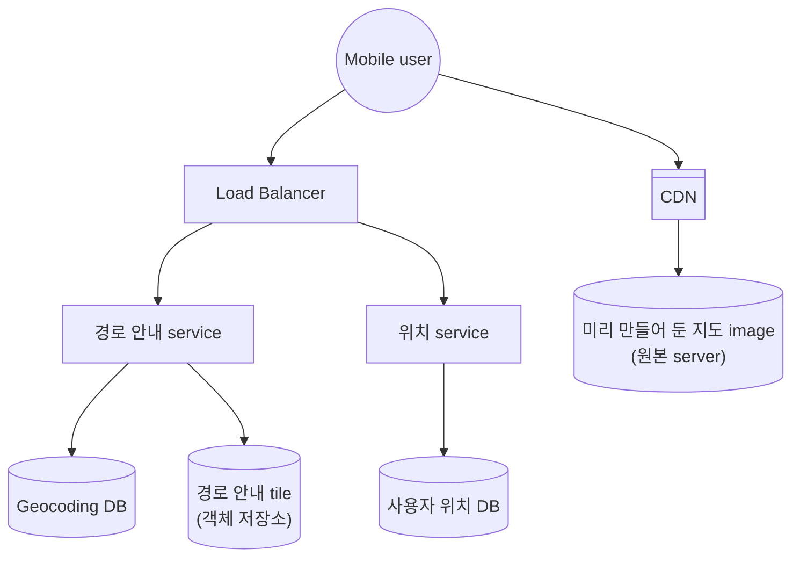
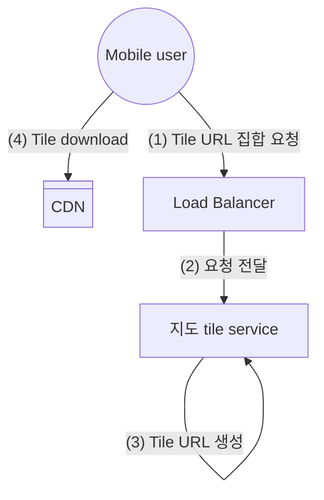
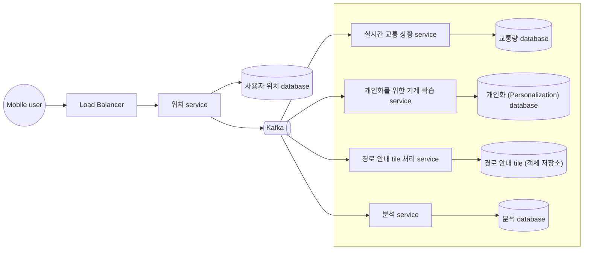
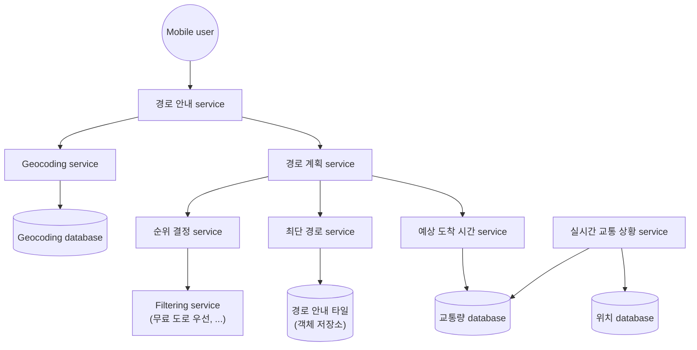
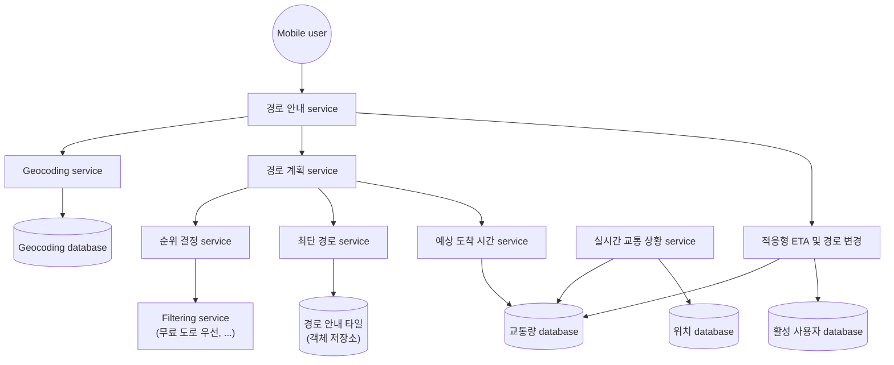

# 구글 맵


Google Maps: 위성 이미지, 거리 뷰, 실시간 교통 상황, 경로 계획 등 다양한 서비스를 제공하고 있다.


## 1단계: 문제 이해 및 설계 범위 확정

> 아래 세부 사항은 가상 면접관과의 대화를 통해 문제를 이해하고, 설계 범위를 정의한 내용이다.

<!-- More -->

- 기능 요구사항
  - 사용자 위치 갱신
  - 경로 안내 서비스 (ETA 서비스 포함)
  - 지도 표시
- 비기능 요구사항 및 제약사항
  - 높은 정확도: 사용자에게 잘못된 경로 안내 X
  - 부드러운 경로 표시: Client를 통해 제공되는 경로 안내 용도의 지도는 화면에 아주 부드럽게 표시 및 갱신
  - Data 및 battery 사용량: Client는 최소한의 data 및 battery 사용
  - 가용성 및 규모 확장성
- 개략적 규모 추정량
  - 저장소 사용
    - 21번 확대 가정 $\rightarrow$ 4.4조개의 tile
    - $256\times 256$ pixel PNG file = 100KB
    - $\therefore 4.4\times 10^{12} \times 100KB = 440PB$
    - 사람이 존재하는 지역 20% 가정 $\rightarrow$ $440PB\times 20\\%=88PB\simeq50PB$
    - 확대 수준이 1 감소될 때 필요한 tile 수 $\frac{1}{4}$ 감소 $\rightarrow$ $50+\frac{50}{4}+\frac{50}{16}+\frac{50}{64}+...\simeq67PB$
  - 서버 대역폭
    - Server 측 처리 요청
      - 경로 안내 요청: Client가 경로 안내 session을 시작할 때 전송
      - 위치 갱신 요청: Client가 경로 안내를 진행하는 동안 변경된 사용자 위치 전송
    - DAU 10억, 경로 안내 기능 주당 35분 사용 가정 $\rightarrow$ 주당 350억 분, 일당 50억 분
    - GPS 좌표 매초 전송 시 하루에 3000억 건 요청 발생 ($\because 5\times10^9\times60$) $\rightarrow$ 3백만 QPS ($\because \frac{3\times 10^{11}}{10^5}=3\times10^6$)
    - GPS 위치 변경 내역을 모아두었다가 15초에 한 번씩 server에 전달 $\rightarrow$ 20만 QPS ($\because \frac{3\times10^6}{15}$)
    - 최대 QPS: 평균치의 5배로 가정 ($200,000\times5=10^6$)

## 2단계: 개략적 설계안 제시 및 동의 구하기

### 개략적 설계안

### 위치 서비스

- Client가 $t$초 마다 자신의 위치를 전송하는 것으로 가정
- 주기적 위치 정보 전송 시 이점
  - Data stream을 활용하여 system을 점차 개선 가능
  - Client가 보내는 위치 정보가 거의 실시간 정보에 가까우므로 ETA를 정확히 산출하거나 교통 상황에 따른 다른 경로 안내 가능
- 위치 이력을 client에 buffering 했다가 일괄 요청 (batch request)하면 전송 빈도 감소 가능
- 그럼에도 불구하고 너무 많은 쓰기 요청 처리 존재 $\rightarrow$ Cassandra, Kafka 사용

> `POST /v1/locations`
>
> - `locs`: JSON으로 encoding한 (위도, 경도, 시각) 순서쌍 배열

### 경로 안내 서비스

- A 지점에서 B 지점으로 가는 합리적으로 빠른 경로를 찾아주는 역할
- 응답까지의 시간 지연 감내 가능
- 계산된 경로가 최단 시간 경로일 필요는 없지만 정확도 보장 필수

> `GET /v1/nav?origin=1355+market+street,SF&destination=Disneyland`

### 지도 표시

- Client가 확대 수준별 지도 tile을 저장하는 것은 실용적이지 않음 $\rightarrow$ Server에서 client의 위치 및 확대 수준에 따라 필요 tile을 가져오도록
- Server $\rightarrow$ Client scenario
  - 사용자가 지도를 확대 또는 이동시키며 주변 탐색
  - 경로 안내가 진행되는 동안 사용자의 위치가 현재 지도 tile을 벗어나 인접한 tile로 이동
- 선택지
  1. Client의 위치 및 확대 수준에 근거하여 필요한 지도 tile 제작
     - 사용자 위치 및 확대 수준 조합은 무한함
     - 모든 지도 tile을 동적으로 만들어야하는 server cluster에 심각한 부하
     - Cache 활용 어려움
  2. 확대 수준별 지도 tile 정의 및 client 제공
     - 각 지도 tile이 담당하는 지리적 영역은 geohashing 같은 분할법 사용 $\rightarrow$ 정적
     - Client는 확대 수준에 근거하여 필요한 지도 tile 집합 결정 후 geohash URL로 변환
     - CDN (Content Delivery Network)를 통해 지도 tile 제공
     - 사용자에게 가장 가까운 POP (Point of Presence)에서 file을 service하기 때문에 규모 확장 용이 및 고성능



<!-- tab Data 사용량 -->

- 사용자: $30km/h$ 속도로 이동
- 1 image: $200m\times200m$ 영역 표시, $256\times256$ pixel ($100KB$)
- $1km\times1km$ 영역 = image 25장 = $25\times100KB=2.5MB$

$\therefore$ 시간당 $75MB$의 data 소진 ($30\times2.5MB$) $\rightarrow$ 분당 $1.25MB$

<!-- endtab -->
<!-- tab CDN을 통해 service되는 traffic 규모 -->

- 매일 50억 분 가량의 경로 안내 처리
- $5\times10^9\times1.25MB=6.25PB/day\simeq62,500MB/sec$
<!-- endtab -->



## 3단계: 상세 설계

### 데이터 모델

- 경로 안내 tile
  - 방대한 양의 도로 및 metadata (이름, 관할구, 위도 경도 등)로 구성
  - 경로 안내 tile 처리 service라 불리는 offline data 가공 pipeline을 주기적으로 실행하여 경로 안내 tile로 변환 ($\because$ Graph 자료 구조 형태로 가공되지 않은 data)
  - S3와 같은 객체 저장소 (object storage)에 file을 보관하고 적극적으로 caching하여 효율적 사용
- 사용자 위치
  - 도로 data 및 경로 안내 tile 갱신, 실시간 교통 상황 data 또는 교통 상황 이력 database 구축에 사용
  - Data stream processing service는 위치 data를 처리하여 지도 data 갱신
  - 사용자 위치 data를 저장하려면 엄청난 양의 쓰기 연산을 처리하며 수평적 규모 확장 가능한 database 필요
- Geocoding database
  - 주소를 위도/경도 쌍으로 변환하는 정보 보관
  - Redis 처럼 빠른 읽기 연산을 지공하는 key-value 저장소가 적합 ($\because$ 쓰기 연산 <<< 읽기 연산)
  - 출발지와 목적지 주소는 경로 계획 service에 전달 전에 geocoding database를 통해 위도/경도 쌍으로 변환
- 미리 계산해둔 지도 tile data
  - 특정 영역의 지도를 요청하면 인근 도로 정보를 취합하여 모든 도로 및 관련 상세 정보가 포함된 image를 만들어야하여 상당이 큰 계산 자원 사용 및 중복 요청 빈번
  - Image를 지도 표시에 사용하는 확대 수준별로 미리 만들어 CDN을 통해 전송

### 서비스

- 위치 service
  - 초당 백만 건의 위치 정보 update가 발생한다는 점을 감안하여 NoSQL key-value database 또는 column-oriented database가 적합
  - 사용자 위치는 계속 변화하고 변경 후에는 이전 정보는 필요치 않으므로 data 일관성 (consistency)보다는 가용성 (availability)이 더 중요
  - 가용성과 분할 내성을 만족시키는 database 중 하나인 Cassandra 사용
  - `user_id` (partition key), `timestamp` (clustering key)의 조합으로 database key 사용
- 사용자 위치 data
  - 새로 개설되었거나 폐쇠된 도로 감지, 지도 data의 정확성을 개선, 실시간 교통 현황을 파악하는 등에 사용 가능
  - 이를 가능하게 하기 위해 database에 기록하는 것과 별개로 Kafka와 같은 message queue에 logging
  - Kafka는 응답 지연이 낮고 많은 data를 동시에 처리할 수 있는 data streaming platform으로 실시간 data feed를 지원하기 위해 고안

### 지도 표시

- 화면에 한 번에 표시 가능한 지도 tile 개수는 달라지지 않으므로 tile을 download하는 데 많은 network 대역폭을 소진하지 않고 설정된 확대 수준에 최적인 크기의 지도 표시 가능
- WebGL 기술을 통해 image 전송 대신 경로 (path), 다각형 (polygon) 등의 vector 정보 전송 $\rightarrow$ 월등한 압축률을 통한 network 대역폭 절약
- Rasterized image를 사용하여 client가 확대 수준을 높이는 순간에 image가 늘어지고 (stretch) pixel이 도드라져 보이는 문제 존재 $\rightarrow$ vector image 사용 시 훨씬 매끄러워진 확대 경험 제공

### 경로 안내 서비스

> 경로 안내 service: 가장 빠른 경로를 안내하는 역할 담당

- Geocoding service: 출발지와 목적지 주소를 위도/경도 쌍으로 변환한 뒤 추후 다른 service 호출에 이용
- 경로 계획 (route planner) service: 현재 교통 상황과 도로 상태에 입각하여 이동 시간 측면에서 최적화된 경로 제안
- 최단 경로 (shortest path) service: 출발지와 목적지의 위도/경도를 입력으로 받아 $k$개 최단 경로를 반환
  - 교통이나 도로 상황 고려 X
  - 도로망 graph는 거의 정적이기 때문에 caching 하면 좋음
  - 객체 저장소에 저장된 경로 안내 tile에 대해 A\* 경로 탐색 algorithm의 한 형태를 실행하여 최단 경로 도출
- 예상 도착 시간 service: 기계 학습을 활용해 현재 교통 상황 및 과거 이력에 근거하여 예상 도착 시간 계산
  - 경로 계획 service는 최단 경로 목록을 수신하면 예상 도착 시간 service를 호출하여 그 경로 각각에 대한 소요 추정치 산출
  - 10, 20분 뒤 교통 상황 또한 예측하는 것이 까다로움
- 순위 결정 service
  - 경로 계획 service가 ETA 예상치를 산출한 뒤 순위 결정 service (ranker)에 관련 정보를 모두 전달하여 사용자가 정의한 filtering 조건 적용
  - Filtering이 끝나고 남은 경로를 소요 시간 순으로 정렬하여 최단 시간 경로 $k$개를 구한 다음 다음 경로 안내 service에 결과 반환
- 중요 정보 갱신 service들: Kafka 위치 data stream을 구독하고 있다가 중요 data를 비동기적으로 update하여 그 상태를 항상 최신으로 유지하는 역할 담당
  - 경로 안내 tile 처리 service: 도로 data에 새로 발견된 도로, 폐쇄되었음이 확인된 도로 정보를 반영하여 경로 안내 tile을 지속적으로 갱신
  - 실시간 교통 상황 service: 활성화 상태 사용자가 보내는 위치 data stream에서 교통 상황 정보 추출
- 적응형 ETA와 경로 변경
  - 현재 경로 안내를 받고 있는 모든 사용자를 추적하며 교통 상황이 달라질 때마다 각 사용자의 ETA 변경
  - 검색 속도를 향상시키기 위해 상위 tile (확대 수준이 더 낮은 tile)을 출발지와 목적지가 모두 포함된 tile을 찾을 때까지 재귀적으로 더하여 보관
  - 현재 경로 안내를 받는 사용자가 이용 가능한 경로의 ETA를 주기적으로 재계산하여 더 짧은 ETA를 갖는 경로가 발견되면 알림
- 전송 protocol
  - Data를 mobile client에 전송할 안정적 방법 필요 $\rightarrow$ mobile push notification, long polling, WebSocket, SSE (Server-Sent Event)
  - Mobile push notification은 보낼 수 있는 message 크기가 매우 제한적이므로 X (iOS 기준 최대 4,096byte)
  - WebSocket은 server에 주는 부담이 크지 않아 일반적으로 long polling보다 좋은 방법
  - WebSocket은 양방향 통신을 지원하기 때문에 SSE 대신 선택

