# 분산 메세지 큐

- Advantages
  - 결합도 완화 (decoupling): Component 사이의 강한 결합이 사라지므로 각각 독립적 갱신 가능
  - 규모 확장성 개선: Message queue에 data를 생산하는 생산자 (producer)와 queue에서 message를 소비하는 소비자 (consumer) system 규모를 traffic 부하에 맞게 독립적으로 scale out 가능
  - 가용성 개선: System의 특정 component에 장애가 발생해도 다른 component는 queue와 계속 상호작용 가능
  - 성능 개선: 손쉬운 비동기 통신 가능 ($\because$ producer는 응답을 기다리지 않고 message 생산, consumer는 읽을 message가 있을 때 소비)
- Message queue vs. Event streaming platform
  - Apache Kafka와 Pulsar는 message queue가 아닌 event streaming platform
  - RocketMQ, ActiveMQ, RabbitMQ, ZeroMQ와 같은 message queue와 비교하여 지원 기능이 점점 비슷해져 차이가 희미해짐

| Feature           | Message Queue (e.g., RabbitMQ, ActiveMQ) | Event Streaming Platform (e.g., Kafka, Pulsar) |
| ----------------- | ---------------------------------------- | ---------------------------------------------- |
| Primary Use Case  | Decoupling producers and consumers       | Real-time data streaming and processing        |
| Message Retention | Short-term, until consumed               | Long-term, configurable retention              |
| Message Ordering  | FIFO (First In, First Out)               | Partition-based ordering                       |
| Scalability       | Limited, vertical scaling                | High, horizontal scaling                       |
| Throughput        | Moderate                                 | High                                           |
| Latency           | Low                                      | Low to moderate                                |
| Fault Tolerance   | Basic                                    | Advanced, with replication                     |
| Consumer Model    | Push-based                               | Pull-based                                     |
| Use Case Examples | Task queues, notification systems        | Log aggregation, real-time analytics           |

<!-- More -->

## 1단계: 문제 이해 및 설계 범위 확정

> 아래 세부 사항은 가상 면접관과의 대화를 통해 문제를 이해하고, 설계 범위를 정의한 내용이다.

- 기능 요구사항
  - 생산자 (producer): Message를 queue에 송신 가능
  - 소비자 (consumer): Queue에서 message 수신 가능
  - Message를 반복적 또는 단 한 번 수신 설정 가능
  - 오래된 이력 data는 삭제 가능
  - Message 크기는 KB 수준
  - Message가 생산된 순서대로 소비자에게 전달 가능
  - Message 전달 방식은 최소 한 번, 최대 한 번, 정확히 한 번 가운데 설정할 수 있어야 함
- 비기능 요구사항 및 제약사항
  - 높은 대역폭과 낮은 전송 지연 가운데 하나를 설정으로 선택 가능
  - 규모 확장성: Message 양이 급증해도 처리 가능 (분산 system)
  - 지속성 및 내구성 (persistency and durability): Data는 disk에 지속적으로 보관 및 여러 node에 복제
- 전통적 message queue와 다른 점
  - 전통적 message queue는 event streaming platform과 같이 message 보관 문제를 중요하게 다루지 않음 (소비자에 전달되기 충분한 기간 동안만 memory에 보관 또는 event streaming platform에 비해 작은 용량의 disk에 보관)
  - Message 전달 순서 보존 X (생산된 순서와 소비되는 순서가 다를 수 있음)

## 2단계: 개략적 설계안 제시 및 동의 구하기

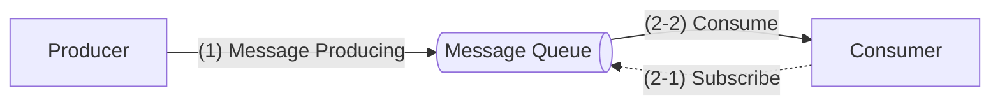

- 생산자는 message를 message queue에 발행
- 소비자는 queue를 구독 (subscribe)하고 구독한 message를 소비
- Message queue는 생산자와 소비자 사이의 결합을 느슨하게 하는 service (생산자와 소비자의 독립적 운영 및 규모 확장을 가능하게 하는 역할)
- Client/server model 관점
  - Client: 생산자, 소비자
  - Server: Message queue

### 메세지 모델



> 가장 널리 쓰이는 message model

- 일대일 (point-to-point)
- 발행-구독 (publish-subscribe)



#### Point-to-point


전통적인 message queue에서 흔히 발견되는 model


- Queue에 전송된 message는 오직 한 소비자만 소비 가능
- 특정 소비자가 message를 가져갔다는 사실을 queue에 알리면 (acknowledge) 해당 message는 queue에서 삭제
- Data 보관 (retention) 지원 X

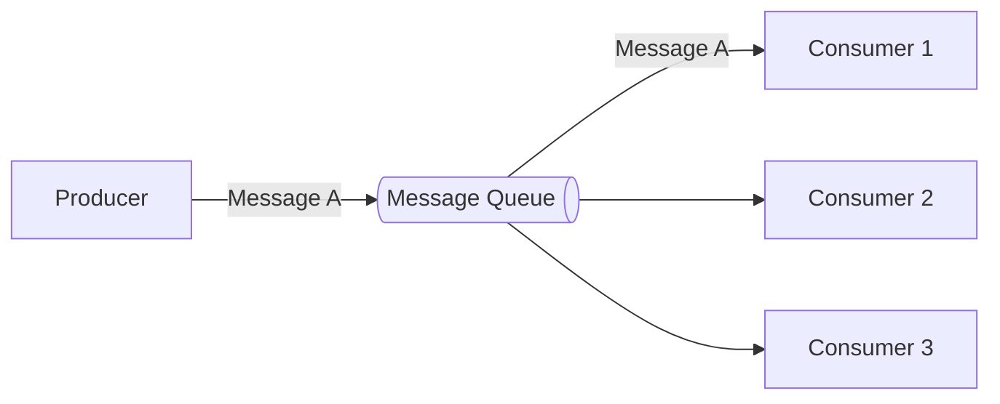

#### Publish-subscribe


Topic은 message를 주제별로 정리하는 데 사용되고, 각 topic은 message queue service 전반에 고유한 이름을 가지며 message를 송수신 할 때 topic을 이용


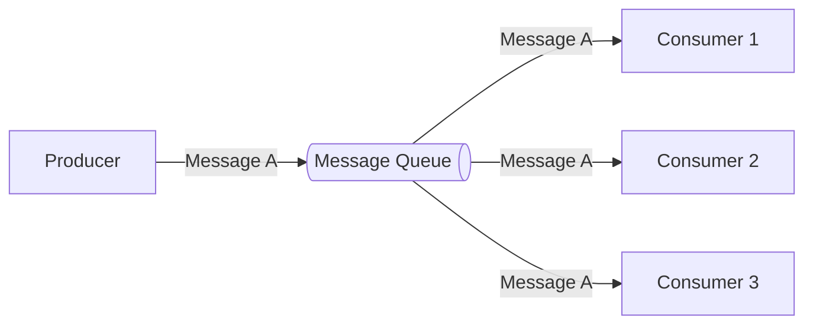

- 일대일 model: 소비자 (consumer) group
- 발행-구독 model: Topic

### 토픽, 파티션, 브로커

- Partition: Topic에 전송할 message의 작은 부분 집합
  - Sharding 기법을 활용하여 topic을 분할
  - Topic을 여러 partition으로 분할하여 message를 균등하게 전송
  - Message queue cluster 내의 server에 고르게 분산 배치
  - Topic의 용량을 확장하고 싶을 때 partition의 개수 증가
  - FIFO (first in, first out) queue와 같이 동작 (동일 partition 내에서는 message 순서 유지)
  - Offset: Partition 내에서의 message 위치
- Broker: Partition을 유지하는 server
- Topic
  - 사용자 ID와 같은 key 값 첨부 가능
  - 같은 key를 가지는 message는 같은 partition으로 전송
  - Key가 없는 message는 무작위로 선택된 partition으로 전송
  - Topic 구독 소비자는 하나 이상의 partition에서 data를 수신
  - Topic을 구독하는 소비자가 여럿일 때, 각 구독자는 해당 topic을 구성하는 partition의 일부를 담당하며, 이 소비자들을 해당 topic의 소비자 (consumer) group라 부름

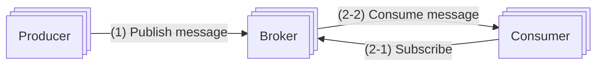

### 소비자 그룹

- 소비자 group 내 소비자는 topic에서 message를 소비하기 위해 서로 협력
- 하나의 소비자 group은 여러 topic을 구독할 수 있고 offset을 별도 관리
- 같은 group 내 소비자는 message를 병렬 소비 가능
- Data를 병렬로 읽으면 대역폭 (throughput) 측면에서 좋지만 partition 내 message를 순서대로 소비 불가
  - 특정 partition의 message는 한 group 내에서는 오직 한 소비자만 수신하도록 하여 해결 가능
  - 하지만 group 내 소비자 수가 구독하는 topic의 partition 수보다 크면 어떤 소비자는 해당 topic에서 data를 읽지 못함
  - 모든 소비자를 같은 소비자 group에 두면 같은 partition의 message는 오직 한 소비자만 수신 가능하기 때문에 일대일 model에 수렴
- Partition은 가장 작은 저장 단위이므로 미리 충분한 partition을 할당해 두면 partition의 수를 동적으로 늘리는 일을 회피 가능
- 처리 용량 향상은 소비자를 추가하여 해결 가능

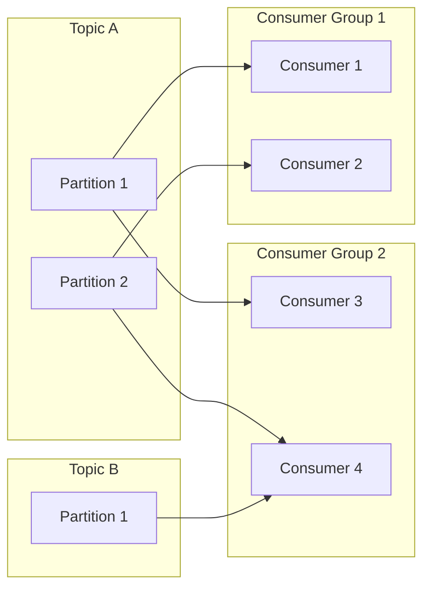

### 개략적 설계안

- Client
  - Producer: Message를 특정 topic으로 전송
  - Consumer group: Topic을 구독하고 message 소비
- 핵심 service 및 저장소
  - Broker
    - Partition 유지
    - 하나의 partition은 특정 topic에 대한 message의 부분 집합 유지
  - 저장소
    - Data 저장소: Message는 partition 내 data 저장소에 보관
    - 상태 저장소: 소비자의 상태 보관
    - Metadata 저장소: Topic 설정, topic 속성 (property) 등 보관
  - 조정 (coordination) service
    - Service 탐색 (discovery): 어떤 broker가 살아있는지 탐색
    - Leader 선출 (election): Broker 가운데 하나는 controller 역할을 해야 하고, 한 cluster에는 반드시 활성 상태 controller가 하나 있어야 함
      - 활성 상태 controller가 partition batch 책임
      - Apache ZooKeeper 또는 ETCD가 controller 선출 담당하는 component로 자주 이용

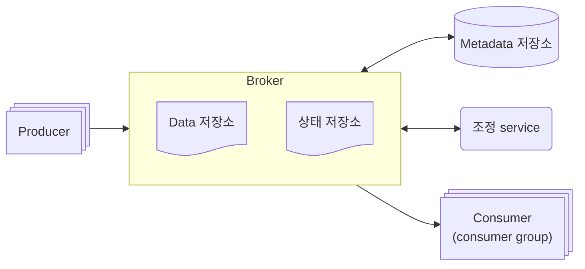

## 3단계: 상세 설계

- 회전 (rotational) disk의 높은 순차 탐색 성능과 현대적 운영체제가 제공하는 적극적 (aggressive) disk cache 전략을 잘 이용하는 disk 기반 자료 구조 (on-disk data structure) 활용
- 전송 data의 양이 막대한 경우 message 복사에 드는 비용을 최소화하기 위해 message가 생산자로부터 소비자에게 전달되는 순간까지 아무 수정 없이 전송 가능한 message 자료 구조를 설계하고 활용
- 일괄 처리 (batching)을 우선하는 system 설계
  - 소규모 I/O가 많을 시 높은 대역폭 지원 어려움
  - 생산자는 message를 일괄 전송
  - Message queue는 그 message들을 더 큰 단위로 묶어 보관
  - 소비자도 가능하면 message를 일괄 수신하도록 변경

### 데이터 저장소

- Message queue의 traffic pattern
  - 빈번한 읽기/쓰기
  - 갱신/삭제 연산 X
    - 전통적 message queue는 message가 신속하게 전달되지 못해 queue가 제때 비워지지 않는 경우를 제외하고 message를 지속적 보관 X
    - Queue에서 message가 제때 소비되면 message에 대한 삭제 연산 발생
    - Data 지속성은 data streaming platform에 관계
  - 순차적 읽기/쓰기가 대부분
- 선택지 1: Database
  - SQL DB
    - Topic 별 table 생성
    - Topic에 보내는 message는 table에 새로운 record로 추가
  - NoSQL DB
    - Topic 별 collection 생성
    - Topic에 보내는 message는 하나의 문서
  - Database는 data 저장 요구사항은 충족할 수 있지만, 읽기/쓰기 연산이 동시에 대규모로 발생 $\rightarrow$ System 병목 발생 가능
- 선택지 2: 쓰기 우선 log (Write-Ahead Log, WAL)
  - 새로운 항목이 추가되기만 하는 (append-only) 일반 file
  - MySQL의 복구 (redo) log, Apache ZooKeeper에서 활용
  - 지속성을 보장해야 하는 message는 disk에 WAL로 보관 가능
    - WAL에 대한 접근 pattern은 읽기/쓰기 모두 순차적
    - 접근 pattern이 순차적일 때 disk는 좋은 성능을 보임
    - 회전식 disk 기반 저장장치는 큰 용량을 저렴한 가격에 제공
  - 새로운 message는 partition 꼬리 부분에 추가되며 offset은 점진적 증가
    - Log file 줄 번호 (line number)를 offset으로 사용
    - File의 크기는 유한하기 때문에 segment 단위로 나누어 저장
    - Segment 사용 시 새 message는 활성 상태의 segment file에만 추가
    - Segment의 크기가 일정 한계에 도달 시 새 활성 segment file 생성, 새로운 message 수용, 종전 활성 segment file의 비활성화 수행
    - 비활성 segment는 읽기 요청만 처리 (오래된 segment는 보관 기한 만료 또는 용량 한계 도달 시 삭제 가능)
- Disk 성능 관련 유의사항
  - 회전식 disk가 정말 느려지는 것은 data 접근 pattern이 무작위 (random)일 때
  - 순차적 data 접근 pattern을 적극 활용하는 disk 기반 자료 구조 사용 시 RAID로 구성된 현대적 disk drive에서 수백 MB/sec 수준의 읽기/쓰기 성능 달성 가능
  - 현대적 운영체제는 disk data를 memory에 적극적으로 cache

### 메시지 자료 구조

> Message 자료 구조: 생산자, message queue, 소비자 사이 계약 (contract)
>
> > Message가 queue를 거쳐 소비자에게 전달되는 과정에서 불필요한 복사가 일어나지 않도록하여 높은 대역폭 달성

| Field name  | Data type |
| :---------: | :-------: |
|    `key`    | `byte[]`  |
|   `value`   | `byte[]`  |
|   `topic`   | `string`  |
| `partition` | `integer` |
|  `offset`   |  `long`   |
| `timestamp` |  `long`   |
|   `size`    | `integer` |
|    `crc`    | `integer` |

- `key`: Partition을 정할 때 사용 (주어지지 않은 message의 partition은 무작위로 결정)
  - `hash(key) % numPartitions` 공식에 따라 partition 결정 (`key` != partition 번호)
  - 더 유연한 설계 필요 시 생산자는 partition 선정 mechanism 정의 가능
  - 문자열, 숫자일 수 있고 business 관련 정보가 담기는 것이 보통
  - Partition 번호는 message queue 내부적으로 사용되는 개념이기 때문에 client에게 노출 X
  - `key`를 partition에 대응시키는 algorithm을 적절히 정의 시 partition의 수가 달라져도 모든 partition에 message가 균등히 분산 가능
  - Message 마다 고유할 필요 X
- `value`: Message의 내용, payload
  - 일반 text 또는 압축된 이진 block
- `topic`: Message가 속한 topic 이름
- `partition`: Message가 속한 partition의 ID
- `offset`: Partition 내 message의 위치
- `timestamp`: Message가 저장된 시각
- `size`: Message의 크기
- `crc`: 순환 중복 검사 (Cyclic Redundancy Check)의 약자, 주어진 data의 무결성 보장하는 데 사용

### 일괄 처리


생산자, 소비자, message queue는 message를 일괄 처리 (batching)하여 system 성능을 높힐 수 있다.


- 일괄 처리를 통한 성능 개선
  - 여러 message를 한 번의 network 요청으로 전송할 수 있도록 하기 때문에 network 왕복 비용 제거
  - Broker가 여러 message를 한 번에 log에 기록하면 더 큰 규모의 순차 쓰기 발생 $\rightarrow$ 운영체제가 관리하는 disk cache에서 더 큰 규모의 연속된 공간 점유 $\rightarrow$ 더 높은 disk 접근 대역폭 달성
- 높은 대역폭, 낮은 응답 지연 (latency)
  - 높은 대역폭 <<< 낮은 응답 지연: 일괄 처리 message 양 축소
  - 높은 대역폭 >>> 낮은 응답 지연: Topic 당 partition의 수 증가 $\rightarrow$ 낮아진 순차 쓰기 연산 대역폭 벌충

### 생산자 측 작업 흐름

> 생산자가 어떤 partition에 message를 전송할 때 routing layer를 도입하여 leader broker에 message 전송

1. 생산자는 message를 routing layer로 전송
2. Routing layer는 metadata 저장소에서 사본 분산 계획 (replica distribution plan)을 읽어 cache에 보관
   Message 도착 시 `Partition 1`의 leader 사본에 전송
3. Leader 사본이 우선 message를 수신하고 leader를 따르는 다른 사본은 leader로부터 data 수신
4. 충분한 수의 사본이 동기화 되면 leader는 data를 disk에 기록 (commit)
   Data가 소비 가능 상태가 되는 시점
   기록을 마치면 생산자에게 회신

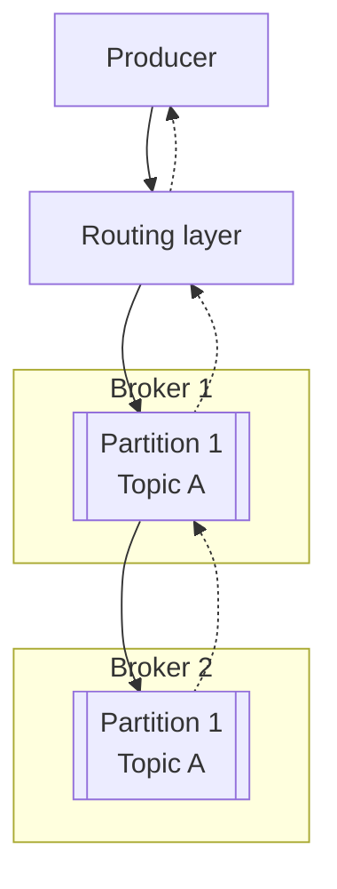

- Leader와 사본이 필요한 이유: 장애 감내 (fault tolerance) 가능한 system을 구축하기 위해
- 현재까지의 설계 문제점
  - Routing layer를 도입하면 거쳐야 할 network node가 하나 더 늘어 overhead가 발생하여 network 전송 지연 증가
  - 일괄 처리 가능 시 효율 증대 가능 하지만 고려 X
- 변경점
  - Routing layer를 생산자 내부로 편입
  - Buffer 도입 (producer client library 일부로 생산자에 설치)
- 변경 후 장점
  - Network를 거칠 필요가 줄어들어 전송 지연 감소
  - 생산자는 emssage를 어느 partition으로 보낼지 결정하는 자신만의 logic 보유 가능
  - 전송할 message를 buffer memory에 보관했다가 목적지로 일괄 전송하여 대역폭 증대 가능

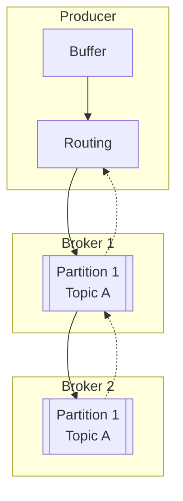

- 일괄 처리 message 양 증가 $\rightarrow$ 대역폭 증가 + 응답 속도 증가 ($\because$ 일괄 처리가 가능할 양의 message가 쌓이길 기다려야 함)
- 일괄 처리 message 양 감소 $\rightarrow$ 대역폭 감소 + 응답 속도 감소

### 소비자 측 작업 흐름


소비자는 특정 partition의 offset을 주고 해당 위치에서부터 event를 묶어 가져옴


### 푸시 vs 풀


Broker가 data를 소비자에게 보낼 것인지, 아니면 소비자가 broker로부터 data를 가져갈 것인지


- Push model
  - Pros
    - 낮은 지연: Broker는 message를 받는 즉시 소비자에게 전송 가능
  - Cons
    - 소비자가 message를 처리하는 속도가 생산자가 message를 만드는 속도보다 느릴 시 소비자에게 큰 부하 발생 가능
    - 생산자가 data 전송 속도를 좌우하기 때문에 소비자는 항상 그에 맞는 처리 가능한 computing 자원 준비 필요
- Pool model
  - Pros
    - Message를 소비하는 속도를 소비자가 알아서 결정
    - Message를 소비하는 속도가 생산 속도보다 느려지면 소비자를 늘리거나 생산 속도를 따라잡을 때까지 기다려 해결 가능
    - 일괄 처리 적합
      - Push model: Broker는 소비자가 message를 바로 처리 가능한지 여부를 알 수 없음 $\rightarrow$ 소비자가 제때 처리하지 못한 message는 buffer에 쌓여 대기
      - Pool model: 소비자는 마지막으로 가져간 log 위치 다음에 오는 모든 message (또는 설정된 최대 개수)를 한 번에 가져갈 수 있음
  - Cons
    - Broker에 message가 없어도 소비자는 계속 data를 끌어가려 시도 $\rightarrow$ 소비자 측 computing 자원 낭비 $\rightarrow$ Long polling mode: 당장 가져갈 message가 없더라도 일정 시간 대기

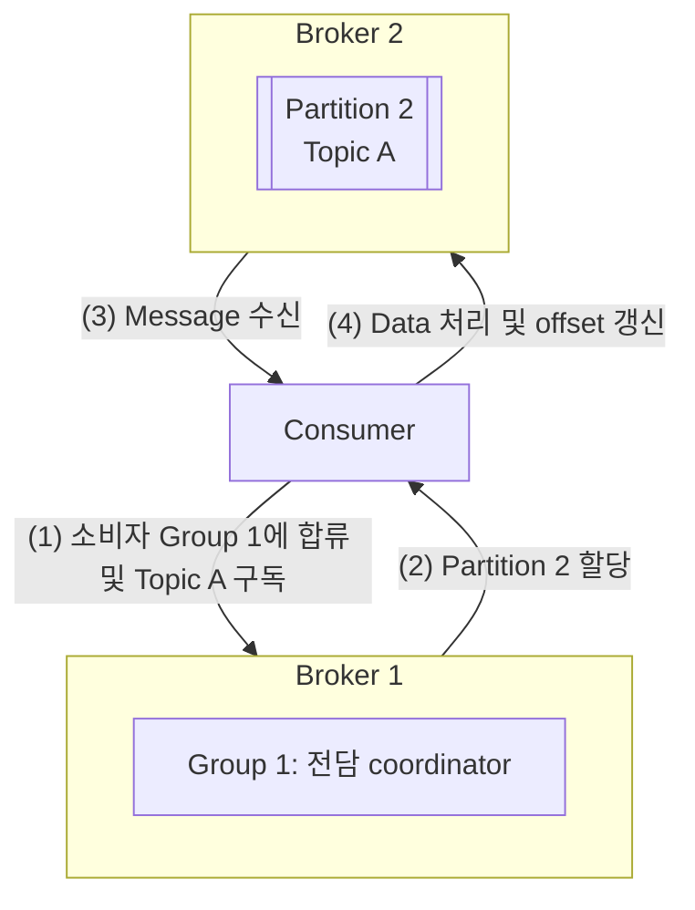

1. `Group 1`에 합류하고 `Topic A`를 구독하기 원하는 새로운 소비자가 있다 가정
   Group 이름을 hashing 하여 접속할 broker node 모색 (같은 group의 소비자는 같은 broker 접속 $\rightarrow$ 소바자 group의 coordinator)
2. Coordinator는 소비자를 group에 참여시키고 `Partition 2`를 소비자에 할당
   Partition 배치 정책에는 round-robin, 범위 (range) 기반 정책 등 다수 존재
3. 소비자는 마지막으로 소비한 offset 이후 message를 가져옴
   Offset 정보는 상태 저장소 (state storage)에 존재
4. 소비자는 message를 처리하고 새로운 offset을 broker에 전송
   Data 처리와 offset 갱신 순서는 message 전송 semantic에 영향

### 소비자 재조정


소비자 재조정 (consumer rebalancing): 어떤 소비자가 어떤 partition을 책임지는지 다시 정하는 process


- Coordinator: 소비자 재조정을 위해 소비자들과 통신하는 broker node
  - 소비자로부터 오는 heartbeat message를 살핌
  - 각 소비자의 partition 내 offset 정보 관리
- 특정 소비자는 특정 group에 속함
  - Group 전담 coordinator는 group 이름을 hashing 하면 찾을 수 있음
  - 같은 group의 모든 소비자는 같은 coordinator에 연결
- Coordinator는 자신이 연결한 소비자 목록 유지
  - 목록의 변화 발생 시 coordinator는 group의 새 leader 선출
- 새 leader는 새 partition 배치 계획 (dispatch plan)을 만들어 coordinator에게 전달 $\rightarrow$ 계획을 group 내 모든 소비자에게 알림

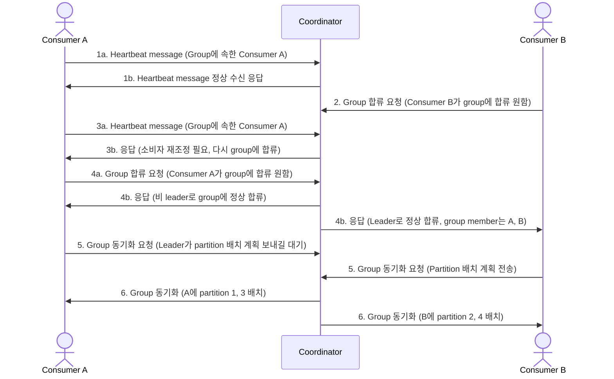

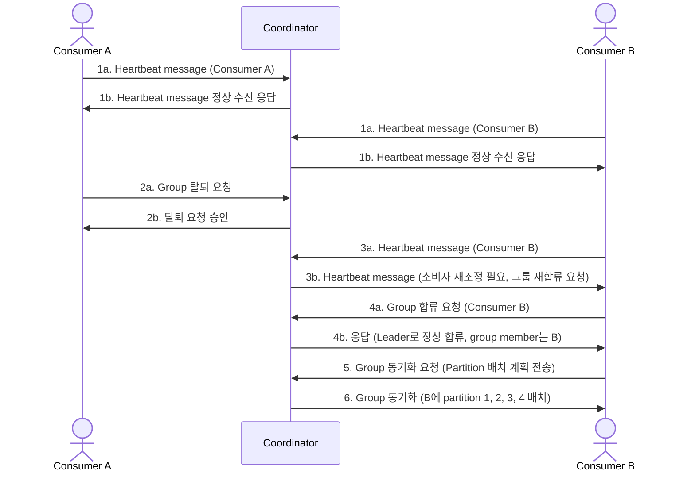

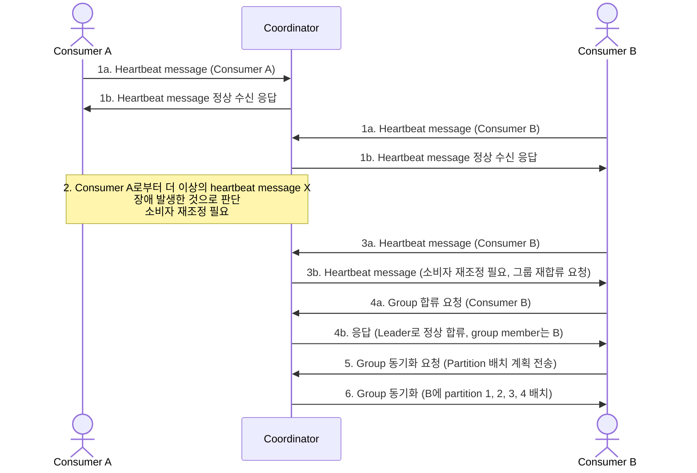

### 상태 저장소

- 상태 저장소 (state storage)의 저장 정보
  - 소비자에 대한 partition의 배치 관계
  - 각 소비자 group이 각 partition에서 마지막으로 가져간 message의 offset
- 소비자 상태 정보 data 이용 pattern
  - 읽기/쓰기가 빈번하게 발생하지만 양이 많지 않음
  - Data 갱신은 빈번하지만 삭제되는 일이 거의 없음
  - 읽기/쓰기 연산이 무작위적인 pattern을 보임
  - Data의 일관성 (consistency)이 중요

### 메타데이터 저장소

- Topic 설정, 속성 정보 저장 (partition 수, message 보관 기간, 사본 배치 정보, ...)
- 자주 변경되지 않고 양도 적음
- 하지만 높은 일관성을 요구 $\rightarrow$ ZooKeeper가 적절

### 주키퍼


Apache ZooKeeper: 계층적 key-value 저장소 (hierarchical key-value store) 기능을 제공하는 분산 system에 필수적 service


- 분산 설정 (distributed configuration) service
- 동기화 (synchronization) service
- 이름 (name) registry

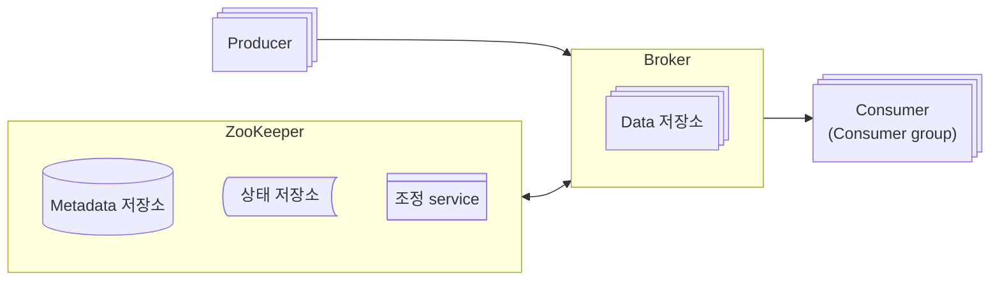

- Metadata와 상태 저장소는 ZooKeeper를 이용해 구현
- Broker는 message data 저장소만 유지하면 됨
- ZooKeeper가 broker cluster의 leader 선출 과정을 도움

### 복제


분산 system에서 hardware 장애로 disk의 손상이나 영구적 장애가 발생하여 data가 사라지는 경우를 해결하고 높은 가용성을 보장하기 위해 복제 (replication)를 사용한다.


1. 생산자는 partition에 message를 보낼 때 leader에게만 전송
2. 다른 사본은 leader에게서 새 message를 지속적으로 가져와 동기화
3. Message를 완전히 동기화 한 사본의 개수가 지정된 임계값을 넘으면 leader는 생산자에게 message를 잘 받았다는 응답 (acknowledgement) 전송

### 사본 동기화

- 특정 node의 장애로 message가 소실되는 것을 막기 위해 message는 여러 partition에 두며, 각 partition은 다시 여러 사본으로 복제
- Message는 leader로만 보내고 다른 단순 사본은 leader에게서 message를 가져가 동기화
- 동기화된 사본 (In-Sync Replicas, ISR): Leader와 동기화된 사본
  - 동기화되었다: Topic의 설정에 따라 달라짐 (`replica.lag.max.messages`)
  - 성능과 영속성 (durability) 사이의 타협점

| Setting   | Description                                               | Pros                            | Cons                |
| --------- | --------------------------------------------------------- | ------------------------------- | ------------------- |
| `ACK=all` | 모든 복제본이 message를 수신하고 동기화될 때까지 대기     | 높은 내구성 및 data 일관성 보장 | 높은 지연 시간      |
| `ACK=1`   | 리더 복제본이 message를 수신하면 즉시 확인 응답           | 빠른 응답 시간                  | Data 손실 가능성    |
| `ACK=0`   | Message를 전송하자마자 확인 응답 없이 즉시 다음 작업 수행 | 매우 빠른 응답 시간             | 높은 data 손실 위험 |

### 규모 확장성

- 생산자: 새로운 생산자를 추가하거나 삭제함으로 쉽게 달성
- 소비자
  - 소비자 group은 서로 독립적이기 때문에 쉽게 추가 및 삭제 가능
  - 같은 소비자 group 내 소비자가 새로 추가/삭제되거나 장애로 제거되어야 할 때 재조정 (rebalancing) mechanism이 처리
  - 소비자 측의 규모 확장성과 결함 내성 (fault tolerance)을 보장하는 것이 소비자 group과 재조정 mechanism
- Broker
  - Broker node가 추가되거나 삭제될 때 사본을 재배치
  - Broker controller로 하여금 한시적으로 system에 설정된 사본 수보다 많은 사본 허용
- Partition
  - Topic의 규모를 늘리거나, 대역폭을 조정하거나, 가용성과 대역폭 사이의 균형을 맞추는 등 운영상의 이유로 partition의 수를 조정
  - 생산자는 broker와 통신할 때 해당 정보를 통보 받으며, 소비자는 재조정 (rebalancing) 시행
  - Partition 수의 조정은 생산자와 소비자의 안정성에 영향을 끼치지 않음

### 메시지 전달 방식

| Delivery Semantics | Description                                                          | Pros                                 | Cons                                         |
| ------------------ | -------------------------------------------------------------------- | ------------------------------------ | -------------------------------------------- |
| At-most once       | Messages are delivered at most once, with no guarantee of delivery.  | Low latency, no duplicates           | Potential message loss                       |
| At-least once      | Messages are delivered at least once, with possible duplicates.      | Guaranteed delivery, no message loss | Potential duplicates, requires deduplication |
| Exactly once       | Messages are delivered exactly once, ensuring no duplicates or loss. | No duplicates, no message loss       | Higher complexity, higher latency            |
