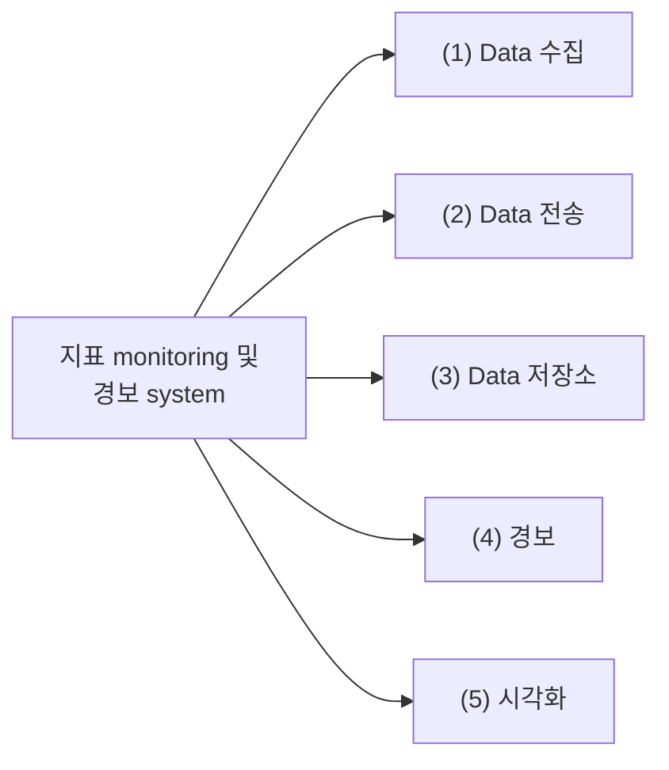
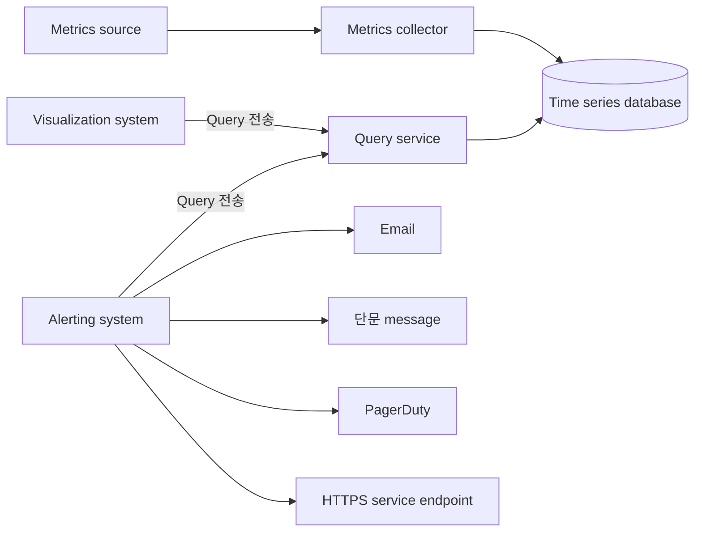
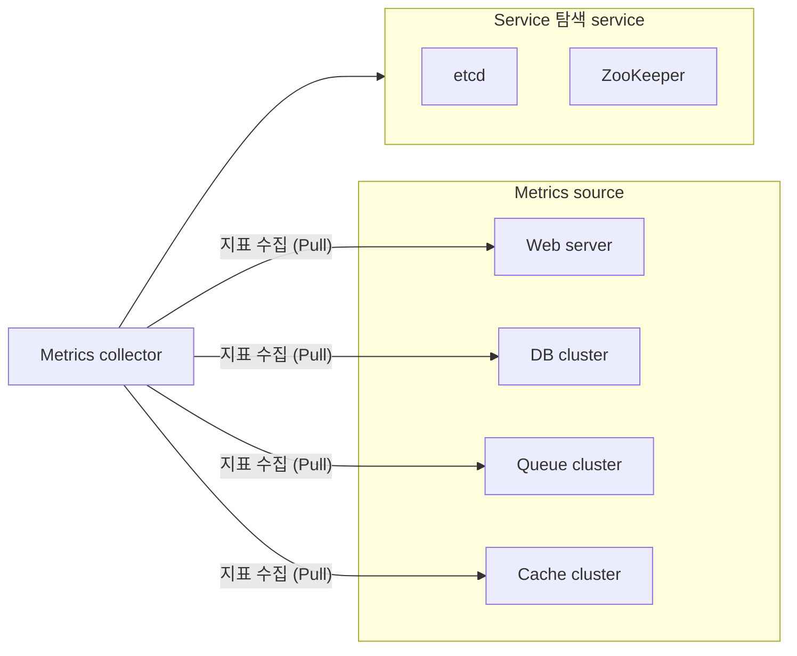
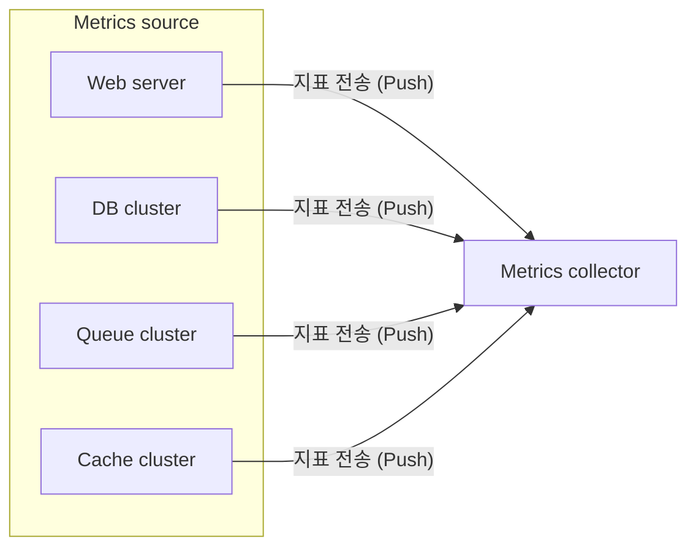
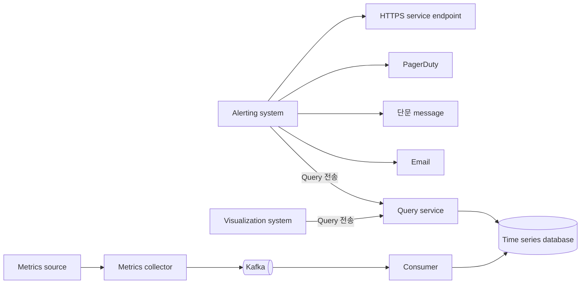
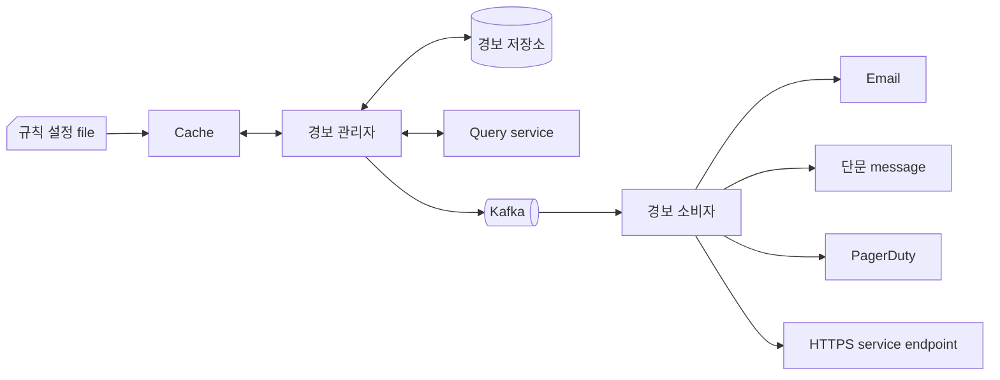

# 지표 모니터링 및 경보 시스템


지표 (metrics) monitoring 및 경보 (alerting) system: Infra의상태를 선명하게 볼 수 있도록 하여 높은 가용성과 안정성을 달성하는 데 중추적 역할 수행


## 1단계: 문제 이해 및 설계 범위 확정

- 개략적 요구사항 및 가정
  - 대규모 infra를 monitoring 해야 함
    - 일간 능동 사용자 수 1억 명 (100 million)
    - Server pool 1,000개, pool당 server 수 100개의 운영 지표 수집 가정
      $\rightarrow$ Monitoring 지표의 수: 약 1,000만개
    - Data 보관 기간: 1년
      - 수집한 raw data 7일 보관
      - 1분 단위 data로 변환 후 30일 보관
      - 1시간 단위 data로 변환 후 1년 보관
  - Monitoring 지표 예시
    - CPU 사용률
    - 요청 수
    - Memory 사용량
    - Message queue 내의 message 수
- 비기능 요구사항 및 제약사항
  - 규모 확장성: 늘어나는 지표 수 및 경보 양에 맞게 확장 가능
  - 낮은 응답 지연: Dashboard와 경보 (alert)를 신속하게 처리할 수 있도록 query에 대한 낮은 응답 지연 보장
  - 안정성: 중요 경보를 놓치지 않도록 높은 안정성 보장
  - 유연성: 기술 변화에 따라 유연한 통합 가능
  - Log monitoring 또는 분산 (distributed) system 추적 (tracing)은 고려 X

<!-- More -->

## 2단계: 개략적 설계안 제시 및 동의 구하기

### 기본적 사항

- Data 수집 (collection): 여러 출처로부터 지표 data 수집
- Data 전송 (transmission): 지표 data를 지표 monitoring system으로 전송
- Data 저장소 (storage): 전송되어 오는 data를 정리 후 저장
- 경보 (alert): 밀려오는 data 분석, 이상 징후 감지, 경보 발생
- 시각화 (visualization): Data를 chart나 graph 등으로 제공

### 데이터 모델

> 지표 data는 통상적으로 시계열 (time series) data 형태로 기록

- Write: 매일 1,000만개의 운영 지표가 기록되기 때문에 매우 큰 부하 발생
- Read: 시각화 또는 경보 확인 pattern에 따라 일시적으로 치솟았다 사라지는 (spiky) 부하

### 데이터 저장소 시스템

- MySQL과 같은 범용 저장소 system을 설계안의 부하 규모에 맞추기 위해선 전문가 수준의 tuning이 필요하여 추천 X
  - RDB는 시계열 data를 대상으로 자주 사용하는 연산에 최적화 X
  - 또한 많은 양의 쓰기 연산이 지속적으로 발생 시 좋은 성능 X
- NoSQL 중 Cassandra 또는 Bigtable을 사용할 수 있지만, 시계열 data를 효과적으로 질의하기 위해서는 확장이 용이한 내부 구조의 해박한 지식 기반 schema를 설계 필요
- OpenTSDB (Open Time Series Database)는 분산 시계열 database지만 Hadoop과 HBase에 기반하여 cluster를 구축하고 운영해야 하므로 복잡
- DB-engines에서 조사한 결과에 따르면 시장에서 가장 인기 있는 시계열 database는 InfluxDB와 Prometheus
  - 다량의 시계열 data를 저장하고 빠른 실시간 분석 지원
  - Memory cache와 disk 저장소를 함께 사용
  - 영속성 (durability) 요건과 높은 성능 요구사항 만족
- 좋은 시계열 database는 막대한 양의 시계열 data를 label (또는 tag) 기준으로 집계하고 분석하는 기능 제공

### 개략적 설계안

- Metrics source: 지표 data가 만들어지는 곳으로 application server, SQL database, message queue 등 어떤 것이든 가능
- Metrics collector: 지표 data를 수집하고 시계열 database에 기록하는 역할
- Time series database: 지표 data를 시계열 data 형태로 보관하는 저장소
- Query service: 시계열 database에 보관된 data를 질의하고 가져오는 과정을 돕는 service (Database의 query interface로 대신 가능)
- Alerting system: 경보를 받아야 하는 다양한 대상으로 경보 알림을 전송하는 역할
- Visualization system: 지표를 다양한 형태의 graph/chart로 시각화하는 기능 제공

## 3단계: 상세 설계

### 지표 수집

- Pull model: 실행 중인 application에서 주기적으로 지표 data를 가져오는 지표 수집기가 흐름의 중심
  - 지표 수집기는 data를 가져올 service 목록을 알아야함
  - etcd 또는 ZooKeeper와 같은 service 탐색 (discovery) 기술을 활용하여 각 service는 가용성 (availability) 관련 정보를 service 탐색 service (SDS)에 기록 및 sercice endpoint 변화 시 지표 수집기에 통보
  - 수천 대 server가 만드는 지표 data를 수집하기위해 안정 (consistent) hash ring을 사용하여 여러 지표 수집 server 간 중재 mechanism 수행

- Push model
  - Monitoring 대상 server에 수집 (collection) agent라 부르는 software 설치
  - 수집 agent는 해당 장비에서 실행되는 service가 생산하는 지표 data를 받아 모은 다음 주기적으로 수집기에 전달
  - Data 집계 (aggregation)는 수집기에 보내는 data 양을 줄이는 효과적 방법
  - 지표 수집기 cluster 자체도 자동 규모 확장이 가능하도록 구성하고 load balancer를 두어 밀려드는 지표 data 처리

| Feature           | Pull Model                                                              | Push Model                                                            |
| ----------------- | ----------------------------------------------------------------------- | --------------------------------------------------------------------- |
| Data Collection   | 실행 중인 application에서 주기적으로 지표 data를 가져오는 수집기가 중심 | Monitoring 대상 서버에 수집 agent 설치, 주기적으로 수집기에 data 전달 |
| Aggregation       | 수집기가 여러 service에서 data를 수집하여 집계                          | 수집 agent가 data를 집계하여 전송                                     |
| Scalability       | 안정적인 hash ring을 사용하여 여러 수집기 간 중재 mechanism 수행        | 수집기 cluster 자동 확장 가능, load balancer를 통해 data 처리         |
| Service Discovery | etcd 또는 ZooKeeper와 같은 service 탐색 기술 사용                       | 필요 없음                                                             |
| Advantages        | 수집기가 data를 직접 가져와서 신뢰성 높음                               | 간단한 설정, 수집 agent가 data 집계 가능                              |
| Disadvantages     | Service 목록을 알아야 하며, service endpoint 변화 시 통보 필요          | 수집 agent 설치 및 관리 필요, network 부하 증가 가능                  |
| Example           | Prometheus                                                              | Amazon CloudWatch, Graphite                                           |

### 지표 전송 파이프라인의 규모 확장

- Pull 및 push model 모두 지표 수집기는 server cluster 형태이며 엄청난 양의 data를 처리해야하기 때문에 시계열 database에 장애 발생 시 data 손실 발생 가능성 존재
- 지표 수집기는 지표 data를 Kafka와 같은 queue system에 전송하고 Apache Storm, Flink, Spark와 같은 소비자 (stream 처리 service)가 해당 data를 받아 시계열 database에 저장
  - Kafka는 고도로 안정적이고 규모 확장성이 뛰어난 분산 message platform
  - Data 수집 component와 처리 component 사이의 결합도 감축
  - Database에 장애가 생겨도 Kafka에 보관하여 data가 소실되지 않음

- Kafka를 통한 규모 확장
  - 대역폭 요구사항에 따라 partition 수 설정
  - 지표 이름에 따라 어느 partition에 배치할지 결정하면 소비자는 지표 이름에 따라 data 집계
  - Tag/Label에 따라 지표 data를 더욱 세분화한 partition으로 분할
  - 중요 지표가 먼저 처리될 수 있도록 지표 분류 및 우선순위 지정
- Kafka의 대안
  - FaceBook의 memory 기반 시계열 database system Gorilla 사용 $\rightarrow$ Kafka와 같은 message queue가 없어도 같은 수준의 안정성 제공 주장 가능

### 데이터 집계 지점

- 수집 agent 집계
  - Client에 설치된 수집 agent는 복잡한 집계 logic 지원 어려움
  - 어떤 counter 값을 분 단위로 집계하여 지표 수집기에 전송 정도 가능
- Data 수집 pipeline에서 집계
  - Data를 저장소에 기록하기 전에 집계할 수 있으려면 Flink 같은 stream processing engine 필요
  - Database에는 계산 결과만 늦게 기록하기 때문에 실제로 기록되는 양은 매우 크게 감소
  - 하지만 늦게 도착하는 지표 data의 처리가 어려우며 원본 data를 보관하지 않으므로 정밀도 또는 유연성 측면에서 손해 발생 가능
- 질의 시 집계
  - Raw data를 그대로 보관 후 질의 시 필요한 시간 구간에 맞춰 집계
  - Data 손실 문제는 없지만 질의 처리 시 전체 dataset를 대상으로 집계 결과를 계산해야 하기 때문에 성능 저하

### 질의 서비스

- 질의 server cluster 형태로 구현
- 시각화 또는 경보 system에서 접수된 요청을 시계열 database를 통해 처리하는 역할
- Client (시각화 또는 경보 system)와 시계열 database 사이의 결합도 감소 $\rightarrow$ 시계열 database를 자유롭게 다른 제품으로 교체 가능
- Cache 계층
  - 질의 결과를 저장할 cache server를 도입하여 시계열 database에 대한 질의 부하를 낮추고 질의 service 성능 향상 가능
- 시계열 database 질의어
  - Prometheus 또는 InfluxDB 같은 널리 사용되는 지표 monitoring system들은 SQL이 아닌 독자적 질의어 제공 ($\because$ SQL로는 시계열 data를 질의하기 까다로움)

### 저장소 계층

- 시계열 database는 신중하게 선택
  - FaceBook의 연구에 따르면 운영 data 저장소에 대한 질의의 85%는 지난 26시간 내 수집 data 대상
- 저장 용량 최적화
  - Data encoding 및 압축: Data를 완전한 형태로 저장하는 대신 기준 값의 차이를 저장
  - Downsampling: Data의 해상도를 낮춰 저장소 요구량 감축
  - 냉동 저장소 (cold storage): 잘 사용되지 않는 비활성 상태 data를 보관

### 경보 시스템

1. 설정 file을 가져와 cache server에 보관
   경보 규칙은 disk에 file 상태로 보관 (YAML을 주로 사용)
2. 경보 관리자 (alert manager)는 경보 설정 내역을 cache에서 가져옴
3. 설정된 규칙에 따라 경보 관리자는 지정된 시간마다 질의 (query) service 호출 및 설정된 임계값 (threshold)을 위반하면 경보 event 생성
   - 경보 filtering, 병합 (merge), 중복 제거 (dedupe): 짧은 시간 동안 같은 instance에서 발생한 경보 병합
   - 접근 제어 (access control): 사람의 실수로 빚어지는 장애를 막고 system의 보안을 유지하기 위해 특정한 경보 관리 작업은 특정 개인만 수행할 수 있도록 제한
   - 재시도 (retry): 경보 관리자는 경보 상태를 확인 후 알림이 최소 한 번은 전달됨을 보장
4. 경보 저장소는 Cassandra와 같은 key-value 저장소이며 모든 경보의 상태 (비활성화, 응답 대기, 경보 발령, 문제 해결 등)가 저장되며 알림이 적어도 한 번 이상 전달되도록 보장
5. 경보 evenet를 Kafka에 전달
6. 경보 소비자는 Kafka에서 경보 event 소비
7. 경보 소비자는 Kafka에서 읽은 경보 event를 처리하여 email, 단문 message, PagerDuty. HTTP service endpoint 등의 다양한 channel로 알림 전송

### 시각화 시스템

- 지표 dashboard에는 지표를 다양한 시간 범위로 표시하고 경보 dashboard에는 다양한 경보의 상태 표시
- 품질 좋은 시각화 system을 구축하는 것을 어렵기 때문에 상용품을 구입해서 쓰자고 주장하는 것이 바람직함 (ex. Grafana)
