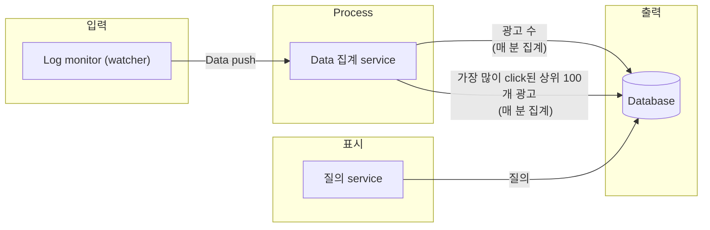
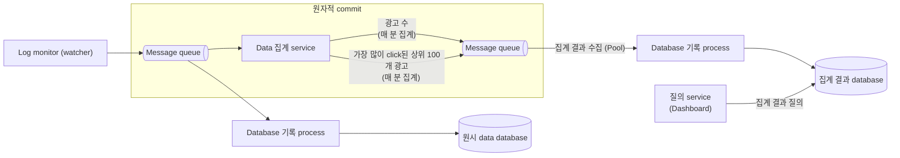
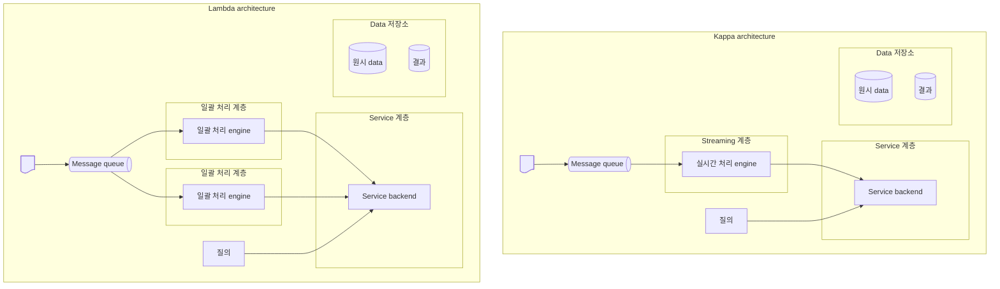
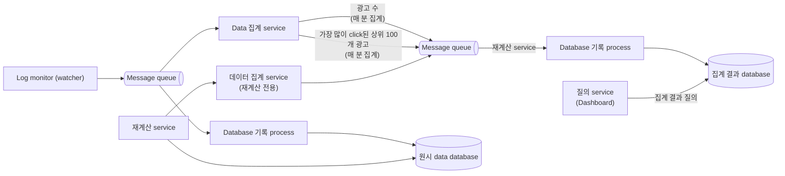

# 광고 클릭 이벤트 집계


Ad click event aggregation system: A system designed to collect, process, and analyze data related to ad click events. It ensures real-time processing and accuracy of data, crucial for digital advertising processes like Real-Time Bidding (RTB), where transactions must be completed within a second.


- RTB (Real-Time Bidding): Digital 광고의 핵심 process, 실시간 경매 절차를 통해 지면 (inventory) 거래
  - 1초 내에 모든 process가 마무리 돼야 함
- Ad click event aggregation
  - Online 광고가 얼마나 효율적이었는지 측정하는 데 결정적 역할 $\rightarrow$ 광고주가 얼마나 많은 돈을 지불할지 영향
  - 결과에 따라 광고 campaign 관리자는 광고 예산을 조정하기도 하고, target group이나 keyword를 변경하는 등 광고 전략을 수정하기도 함
  - 핵심 지표: CTR (Click-Through Rate), CVR (Conversion Rate)

<!-- More -->

## 1단계: 문제 이해 및 설계 범위 확정

- 기능 요구사항
  - 지난 M분 동안의 `ad_id` click 수 집계
  - 매분 가장 많이 click된 상위 100개 광고 id를 반환
  - 다양한 속성에 따른 집계 filtering을 지원
  - Data의 양은 Facebook이나 Google 규모
- 비기능 요구사항
  - 집계 결과 정확성은 data가 RTB 및 광고 과금에 사용되므로 중요
  - 지연되거나 중복된 event를 적절히 처리할 수 있어야 함
  - 견고성 (reliability): 부분적인 장애는 감내할 수 있어야 함
  - 지연 시간 요구사항: 전체 처리 시간은 최대 수 분을 넘지 않아야 함
- 개략적 추정
  - 일간 능동 사용자 (DAU) 수: 10억 명 (1billion)
  - 각 사용자는 하루에 평균 1개 광고를 click한다고 가정 $\rightarrow$ 하루에 10억 건의 광고 click event 발생
  - 광고 click: $QPS=\frac{10^9event}{10^5sec}=10,000$
  - 최대 광고 click QPS는 평균 QPS의 다섯 배 (50,000QPS)로 가정
  - 광고 click event 하나당 0.1KB의 저장 용량이 필요하다 가정
  - 일일 저장소 요구량: $0.1KB\times10^9=100GB$
    $\rightarrow$ 월간 저장 용량 요구량: 약 3TB

## 2단계: 개략적 설계안 제시 및 동의 구하기

### 질의 API 설계

- 지난 M분 동안 각 `ad_id`에 발생한 click 수 집계
  - API: GET `/v1/ads/{:ad_id}/aggregated_count`
  - Input
    - `from` (`long`): 집계 시작 시간 (default: 현재 시각부터 1분 전)
    - `to` (`long`): 집계 종료 시간 (default: 현재 시각)
    - `filter` (`long`): Filtering 전략 식별자
  - Output
    - `ad_id` (`string`): 광고 (ad) 식별자
    - `count` (`long`): 집계된 click 횟수
- 지난 M분 동안 가장 많은 click이 발생한 상위 N개 `ad_id` 목록 반환
  - API: GET `/v1/ads/popular_ads`
  - Input
    - `count` (`integer`): 상위 광고 수
    - `window` (`integer`): 분 단위 window 크기
    - `filter` (`long`): Filtering 전략 식별자
  - Output
    - `ad_ids` (`array`): 광고 식별자 목록

### 데이터 모델

|      | 원시 data만 보관                                                 | 집계 결과 data만 보관                 |
| ---- | ---------------------------------------------------------------- | ------------------------------------- |
| Pros | - 원본 data를 손실 없이 보관 - Data filtering 및 재계산 지원 | - Data 용량 절감 - 빠른 질의 성능 |
| Cons | - 막대한 data 용량 - 낮은 질의 성능                          | - Data 손실                           |

### 개략적 설계안

### 집계 서비스

- Click event 수 집계
  - Map node는 system에 입력되는 event를 `ad_id % 3` 기준으로 분배
  - 분배한 결과는 각 집계 node가 집계
- 가장 많이 click된 상위 N개 광고 반환
  - 입력 event는 `ad_id` 기준으로 분배
  - 각 집계 node는 heap을 내부적으로 사용하여 상위 3개 광고를 효율적으로 식별
  - 마지막 단계의 reduce node는 전달 받은 9개의 광고 가운데 지난 1분간 가장 많이 click된 광고 3개 선정
- Data filtering
  - Data warehouse에서 자주 사용하는 기법인 star schema 사용
  - 결과를 미리 계산해 두는 방식이기 때문에 filtering 기준에 따라 data에 빠르게 접근 가능

## 3단계: 상세 설계

### 스트리밍 vs 일괄 처리

|                | Service (Online system) | 일괄 처리 system (Offline system)       | Streaming system (실시간에 가깝게 처리하는 system) |
| -------------- | --------------------------- | ------------------------------------------- | ------------------------------------------------------ |
| 응답성         | Client에게 빠르게 응답      | Client에게 응답 필요 X                      | Client에게 응답 필요 X                                 |
| 입력           | 사용자의 요청               | 유연한 크기를 갖는 입력. 큰 규모의 data | 입력에 경계 X (무한 stream)                        |
| 출력           | Client에 대한 응답          | 구체화 view, 집계 결과 지표 등              | 구체화 view, 집계 결과 지표 등                         |
| 성능 측정 기준 | 가용성, 지연 시간           | 처리량                                      | 처리량, 지연 시간                                      |
| 사례           | Online shopping             | MapReduce                                   | Flink                                                  |

### 시간

- Event time: 광고 click이 발생한 시각
  - 광고 click 시점을 정확히 아는 것은 client이므로 집계 결과가 보다 정확
  - Client가 생성한 timestamp에 의존하기 때문에 설정된 시각이 조작된 경우 자유 X
- Processing time: 집계 server가 click event를 처리한 system 시각
  - Server timestamp가 client timestamp 보다 안정적
  - Event가 system에 도착한 시각이 한참 뒤인 경우 집계 결과 부정확

### 집계 윈도

- Window 종류: Tumbling (fixed) window, hopping window, sliding window, session window

### 전달 보장

- 집계 결과는 과금 등에 활용될 수 있기 때문에 data의 정확성과 무결성이 매우 중요
  - Event의 중복 처리 회피
  - 모든 event의 처리 보장
  - 이러한 이유로 '최소 한 번 (at-least once)' 방법 권장
- Data 중복 제거
  - 집계 service node (aggregator)에 발생한 장애의 결과로 중복 data 발생 가정 (새 offset이 upstream Kafka에 반영 X)
  - 이러한 문제를 해결하기 위해 HDFS나 S3 같은 외부 file 저장소에 offset 기록
  - 하지만 여전히 집계 service node에 장애가 발생하면 문제 발생
  - Data 손실을 막기 위해 응답을 받은 후에 offset 저장
  - 분산 (distributed) transaction: 여러 node에서 작동하는 transaction으로, 그 안에서 실행하는 작업 중 하나라도 실패 시 모든 작업의 상태를 실행 전으로 되돌림

### 시스템 규모 확장

- 분산 message queue
  - 생산자 (producer): 생산자 instance 수에는 제한 두지 않으므로 확장성은 쉽게 달성 가능
  - 소비자 (consumer): 소비자 group 내 재조정 (rebalancing) mecahnism은 node 추가/삭제를 통해 규모를 쉽게 조정 가능
- Broker
  - Hash key
    - 같은 `ad_id`를 가지는 event를 같은 Kafka partition에 저장하기 위해 `ad_id`를 hash key로 사용
    - 집계 service는 같은 `ad_id`를 갖는 event를 전부 같은 partition에서 구독 가능
  - Partition의 수
    - Partition의 수가 변하면 `ad_id`를 갖는 event가 다른 partition에 기록되는 일 발생 가능
    - 사전에 충분한 partition을 확보하여 production 환경에서 partition의 수가 동적으로 늘어나는 일을 피하는 것이 좋음
  - Topic의 물리적 sharding
    - 보통 하나의 topic만으로 충분한 경우 X
    - 지역 또는 사업 유형에 따라 여러 topic
- 집계 service의 규모 확장
  - Node의 추가/삭제를 통해 수평적 조정 가능
  - `ad_id`마다 별도의 thread를 두거나 집계 service node를 Apache Hadoop YARN과 같은 자원 공급자 (resource provider)에 배포하여 multi-processing 활용하여 집계 service의 처리 대역폭 향상
- Database의 규모 확장
  - Cassandra는 안정 (consistent) hash와 유사한 방식으로 수평적 규모 확장 기본 지원
  - Data는 각 node에 균등하게 분산 (사본도 적당한 수만큼 만들어 분산)
  - 각 node는 hash ring위의 특정 hash 값 구간의 data 보관을 담당하며 다른 가상 node의 data 사본도 보관

### 핫스팟 문제

> Hotspot: 다른 service 또는 shard 보다 더 많은 data를 수신하는 service나 shard

- Event partition을 `ad_id`로 나누기 때문에, 어떤 집계 service node는 다른 node보다 더 많은 광고 click event를 수신하게 될 것이고, 그러다 보면 server 과부하 문제 발생 가능
- 더 많은 집계 service node를 할당하여 완화 가능

### 결함 내성

- 집계는 memory에서 이루어지기 떄문에 집계 node에 장애 발생 시 집계 결과 손실
- Upstream Kafka broker에서 event를 다시 받아오면 그 숫자를 다시 만들 수 있음
- Kafka data를 원점부터 다시 재생하여 집계하면 오랜 시간이 소요되기 때문에 upstream offset 같은 system 상태를 snapshot으로 저장하고 마지막으로 저장된 상태부터 복구해 나가는 것이 바람직
- 지난 M분간 가장 많이 click된 광고 N개 같은 data도 system 상태의 일부로 저장
- Snapshot을 이용하면 집계 service의 복구 절차 단순화

### 데이터 모니터링 및 정확성

- 지속적 monitoring
  - 지연 시간 (latency): Data를 처리하는 각 단계마다 지연시간 추가 가능하므로 system의 중요 부분마다 시각 (timestamp) 추적 활성화하여 기록된 시각 사이의 차이를 지연 시간 지표로 변환하여 monitoring
  - Message queue 크기: Queue의 크기가 갑자기 늘어난다면 더 많은 집계 service node를 추가해야 할 수 있고, Kafka는 분산 commit log 형태로 구현된 message queue이기 때문에 record 처리 지연 지표 (records-lag)를 대신 추적
  - 집계 node의 system 자원: CPU, disk, JVM, ...
- 조정 (reconciliation): 다양한 data를 비교하여 무결성 보증
  - 매일 각 partition에 기록된 click event를 event 발생 시각에 따라 정렬한 결과를 일괄 처리하여 만들어 낸 다음, 실시간 집계 결과아 비교
  - Window 크기에 관계없이 일부 event는 늦게 도착할 수 있으므로 batch 작업 결과가 실시간 집계 결과와 정확히 일치하지 않을 수 있음
