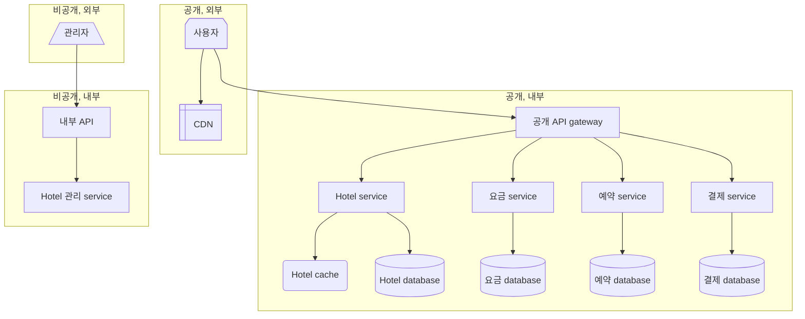
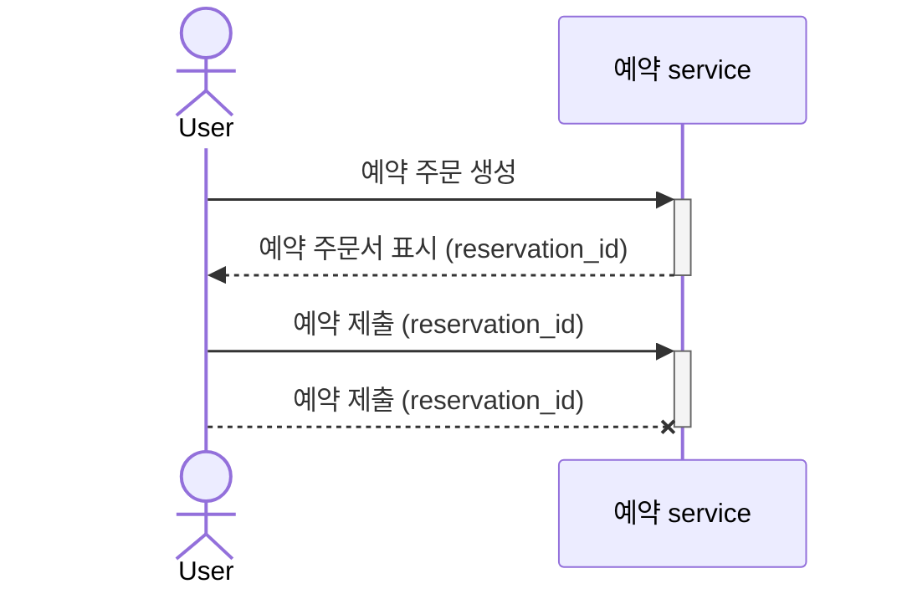
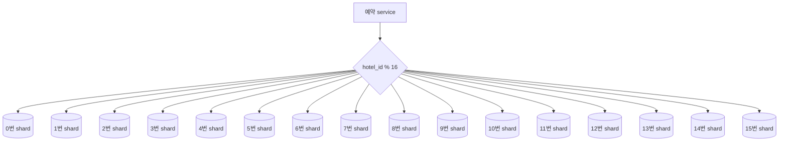
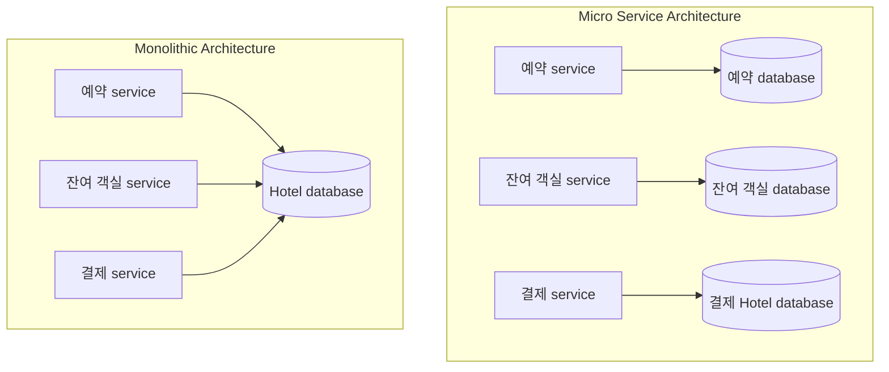

# 호텔 예약 시스템

- Airbnb system 설계
- 항공권 예약 system 설계
- 영화 ticket 예매 system 설계

## 1단계: 문제 이해 및 설계 범위 확정

> 아래 세부 사항은 가상 면접관과의 대화를 통해 문제를 이해하고, 설계 범위를 정의한 내용이다.

- 비기능 요구사항
  - 높은 수준의 동시성 (concurrency): 성수기, 대규모 event 기간에는 일부 인기 hotel의 특정 객실을 예약하려는 고객이 많이 몰릴 수 있음
  - 적절한 지연 시간: 사용자가 예약할 때 응답 시간이 빠르면 이상적이지만 예약 요청 처리에 몇 초 정도 소모되는 것은 괜찮음
- 개략적 규모 추정
  - 총 5,000개 hotel, 100만 개의 객실 가정
  - 평균적으로 객실의 70% 사용, 평균 투숙 기간은 3일로 가정
  - TPS (Transactions Per Second)
    - 일일 예약 건수 $=\frac{10^6\times0.7}{3}=233,333\simeq240,000$
    - 초당 예약 건수 $=\frac{240,000}{10^5}\simeq3$
  - QPS (Queries Per Second)
    - Hotel/객실 상세 page: 사용자가 hotel/객실 정보 확인 (조회 발생)
    - 예약 상세 정보 page: 사용자가 날짜, 투숙 인원, 결제 방법 등의 상세 정보를 예약 전 확인 (조회 발생)
    - 객실 예약 page: 사용자가 '예약' button을 눌러 객실 예약 (Transaction 발생)
    - 대략 10%의 사용자가 다음 단계로 진행, 90%의 사용자는 이탈한다 가정
    - $\therefore$ $3\ (TPS) * 10 * 10 = 300\ (QPS)$

<!-- More -->

## 2단계: 개략적 설계안 제시 및 동의 구하기

### API 설계

| Domain | API                              | 설명                                       |
| ------ | -------------------------------- | ------------------------------------------ |
| Hotel  | `GET /v1/hotels/id`              | Hotel의 상세정보 반환                      |
| Hotel  | `POST /v1/hotels`                | 신규 hotel 추가 Hotel 직원만 사용 가능 |
| Hotel  | `PUT /v1/hotels/id`              | Hotel 정보 갱신 Hotel 직원만 사용 가능 |
| Hotel  | `DELETE /v1/hotels/id`           | Hotel 정보 삭제 Hotel 직원만 사용 가능 |
| 객실   | `GET /v1/hotels/:id/rooms/id`    | 객실 상세 정보 반환                        |
| 객실   | `POST /v1/hotels/:id/rooms`      | 신규 객실 추가 Hotel 직원만 사용 가능  |
| 객실   | `PUT /v1/hotels/:id/rooms/id`    | 객실 정보 갱신 Hotel 직원만 사용 가능  |
| 객실   | `DELETE /v1/hotels/:id/rooms/id` | 객실 정보 삭제 Hotel 직원만 사용 가능  |
| 예약   | `GET /v1/reservations`           | Login 사용자의 예약 이력 반환              |
| 예약   | `GET /v1/reservations/id`        | 특정 예약의 상세 정보 반환                 |
| 예약   | `POST /v1/reservations`          | 신규 예약                                  |
| 예약   | `DELETE /v1/reservations/id`     | 예약 취소                                  |

### 데이터 모델

- SQL vs. NoSQL
  - 관계형 database는 읽기 빈도가 쓰기 연산에 비해 높은 작업 흐름 잘 지원
  - Hotel website/app을 방문하는 사용자의 수는 실제로 객실을 예약하는 사용자에 비해 다수
  - NoSQL database는 대체로 쓰기 연산에 최적화
- ACID: Atomicity, Consistency, Durability, Isolation
  - 예약 system에서 만족하지 못한다면 잔액이 음수가 되는 문제, 이중 청구 문제, 이중 예약 문제 등 방지 어려움
  - ACID가 충족되는 database 사용 시 application code가 훨씬 단순해짐
- Relative entity
  - 관계형 database 사용 시 쉬운 data의 modeling
  - Business data의 구조를 명확히 표현할 수 있고 entity 간 관계를 안정적으로 지원

### 개략적 설계

- CDN (Content Delivery Network)
  - JavaScript code bundle, image, 동영상, HTML 등 모든 정적 contents를 cache하여 website load 성능 개선
- 공개 API gateway
  - 처리율 제한 (rate limiting), 인증 등의 기능을 지원하는 완전 관리형 (fully managed) service
  - Endpoint 기반으로 특정 service에 요청을 전달할 수 있도록 구성
- 내부 API
  - 승인된 hotel 직원만 사용 가능한 API
  - 내부 software나 website를 통해 사용 가능
  - VPN (Virtual Private Network) 등의 기술을 사용해 외부 공격으로부터 보호
- Hotel service
  - Hotel과 객실에 대한 상세 정보 제공
  - Hotel과 객실 data는 일반적으로 정적이기 때문에 쉽게 cache 가능
- 요금 service
  - 특정 시기 객실의 요금 선정을 위한 data를 제공하는 service
  - 해당 날짜에 hotel에 얼마나 많은 손님이 몰리느냐에 따라 상이
- 예약 service
  - 예약 요청을 받고 객실을 예약하는 과정 처리
  - 객실이 예약되거나 취소될 때 잔여 객실 정보 갱신 역할
- 결제 service
  - 고객의 결제를 맡아 처리하고 절차 성공 시 예약 상태를 결제 완료로 갱신
  - 실패 시 승인 실패로 update
- Hotel 관리 service
  - 승인된 hotel 직원만 사용 가능 service
  - 임박한 예약 기록 확인, 고객 객실 예약, 예약 취소 등의 기능 제공

## 3단계: 상세 설계

### 동시성 문제

1. 같은 사용자가 예약 button을 여러 번 누를 수 있음

- Client 측 구현
  - Client가 요청을 전송하고 난 뒤 '예약' button을 회색으로 표시하거나, 숨기거나, 비활성화
  - 하지만 사용자가 JavaScript를 비활성화하면 client 측 확인 절차 우회 가능
- 멱등 (indempotent) API
  - 예약 API 요청에 멱등 key를 추가하는 방안
  - 멱등 API: 몇 번을 호출해도 같은 결과를 내는 API

2. 여러 사용자가 같은 객실을 동시에 예약하려 할 수 있음

- 상황
  - Database transaction 격리 수준이 가장 높은 수준, 즉 직렬화 가능 (serializable) 수준으로 설정되어 있지 않다고 가정
  - `사용자 1`과 `사용자 2`가 동시에 하나 밖에 남지 않은 객실을 예약하려하고 각각의 transaction은 `trasaction 1`, `transaction 2`
  - ACID 중 I (Isolation), 각 transaction은 다른 transaction과 무관하게 작업을 완료해야하기 때문에 두 transaction 모두 성공적으로 database에 반영
- Lock
  - 비관적 lock
    - 여러 code에 lock을 걸면 교착 상태 (deadlock)가 발생할 수 있고 교착 상태가 생기지 않는 application code 작성은 까다로움
    - Transaction이 너무 오랫동안 lock을 해제하지 않고 있으면 다른 transaction은 lock이 걸린 자원에 접근할 수 없기 때문에 확장성이 낮음
    - 이러한 이유로 예약 system에 비관적 lock mechanism을 적용하는 것은 권장 X
  - 낙관적 lock
    - Database 관점에서 lock이 존재하지 않고 version 번호를 통해 data 일관성을 유지할 책임은 application에 존재
    - Data에 대한 경쟁이 치열하지 않은 상황에 적합하기 때문에 예약 QPS가 일반적으로 높지 않은 예약 system에 적합
  - Database의 제약 조건 (constraint)
    - 구현이 쉽고 data에 대한 경쟁이 심하지 않을 때 잘 동작하기 때문에 낮은 QPS인 예약 system에 좋은 선택지

| 구분        | 비관적 lock                                                             | 낙관적 lock                                                                  | Database 제약 조건                                                    |
| ----------- | ----------------------------------------------------------------------- | ---------------------------------------------------------------------------- | --------------------------------------------------------------------- |
| 개념        | 다른 transaction이 간섭할 것이라 가정하고 미리 lock 설정                | 다른 transaction이 간섭하지 않을 것이라 낙관적으로 가정하고 충돌 시에만 처리 | Database level에서 특정 규칙을 적용하여 data integrity 보장           |
| 작동 방식   | 작업 시작 전 record에 lock 획득, 완료 후 해제                           | Version 번호나 timestamp를 사용하여 변경 감지 후 충돌 시 재시도              | 고유성(unique), 참조 무결성(foreign key) 등의 규칙 적용               |
| 장점        | 확실한 동시성 제어 가능 충돌 가능성 원천 차단                       | Lock으로 인한 성능 저하 없음 높은 처리량                                 | 간단한 구현 Database가 규칙 보장                                  |
| 단점        | - 처리량 감소 - Deadlock 가능성 - Lock 유지 overhead            | - 충돌 시 재시도 logic 필요 - 충돌 빈번할 경우 성능 저하                 | - 복잡한 비즈니스 규칙 표현 제한적 - 규칙 위반 시 error 처리 필요 |
| 적합한 상황 | - 높은 경쟁 상황 - 충돌 가능성이 높은 경우 - 중요한 transaction | - 낮은 경쟁 상황 - 읽기 작업이 많은 경우 - 충돌 가능성이 낮은 경우   | - 간단한 무결성 규칙 적용 - 고유 식별자 보장 필요 시              |
| 구현 예     | - `SELECT FOR UPDATE` - 명시적 lock 획득                            | - Version 열 추가하여 검증 - 조건부 업데이트                             | - `UNIQUE` - `FOREIGN KEY` - `CHECK` 제약조건                 |

### 시스템 규모 확장

- Database sharding
  - `hotel_id`를 16개 shard로 분산
  - QPS가 30,000일 때 sharding 후 각 shard는 $\frac{30,000}{16}=1,875QPS$
    (한 대의 MySQL server로 감당 가능한 부하)

- Cache
- 과거의 객실을 예약할 수 없기 때문에 현재와 미래 data가 중에
- Data를 보관할 때 낡은 data는 자동적으로 소멸되도록 TTL (Time-To-Live)을 설정하면 바람직
- Redis: TTL과 LRU (Least Recently Used) cache 교체 정책을 사용하여 memory를 최적으로 활용

### 서비스 간 데이터 일관성

- 아래와 같이 각 service에 따라 database를 구성하는 것은 MSA의 교조주의적 접근일 수 있으며 다양한 data 일관성 문제 야기 가능
- 하나의 transaction으로 data 일관성을 보증하는 기법을 사용할 수 없음

