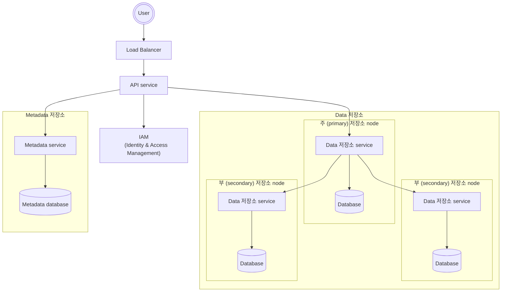
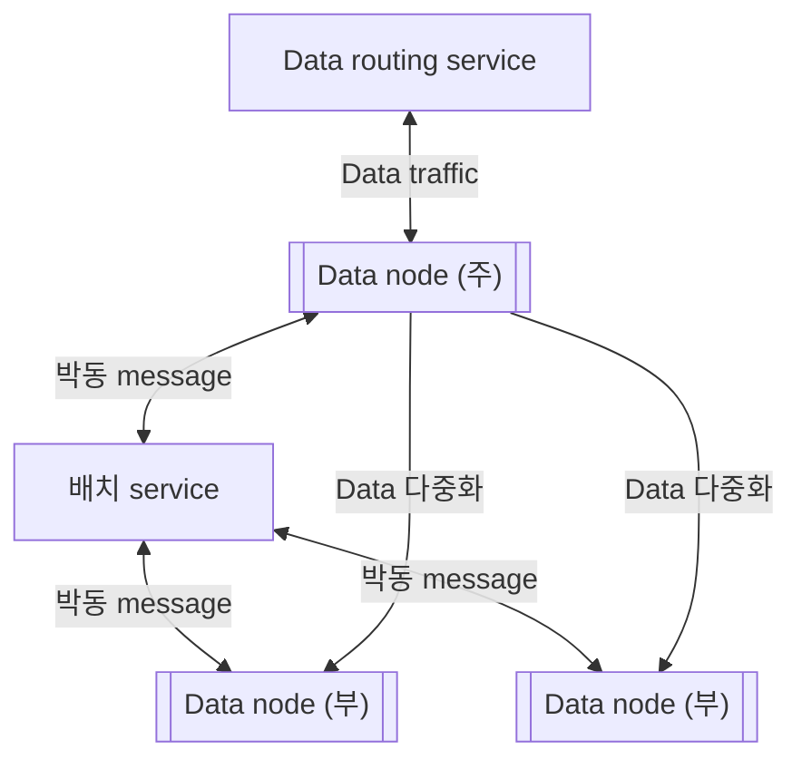
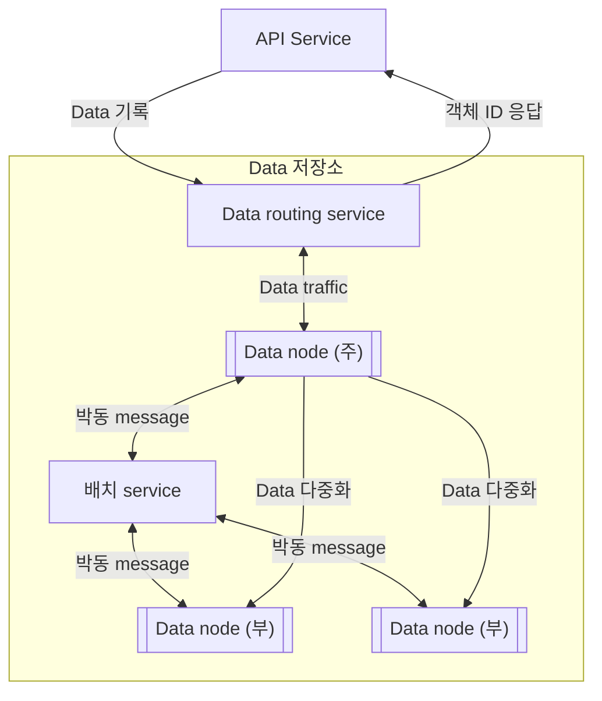

# S3와 유사한 객체 저장소


Amazon S3 (Simple Storage Service): RESTful API 기반 interface로 이용 가능한 객체 저장소


- 2006년 6월: S3 service 시작
- 2010년: Versioning 기능, bucket policy, multipart upload 기능 제공
- 2011년: Server 측 암호화, 여러 객체 삭제, 객체 만료 등 지원
- 2013년: S3에 약 2조 개의 객체 저장
- 2014년 ~ 2015년: Life cycle policy, event notification, cross-region replication 등 기능 도입
- 2021년: S3에 약 100조 개 이상의 객체 저장

<!-- More -->

## 저장소 시스템 101

| 구분           | Block Storage                                                                      | File Storage                                                       | Object Storage                                                                                                            |
| -------------- | ---------------------------------------------------------------------------------- | ------------------------------------------------------------------ | ------------------------------------------------------------------------------------------------------------------------- |
| 기본 단위      | Block                                                                              | File                                                               | Object                                                                                                                    |
| Data 구조      | 구조화되지 않은 원시 block                                                         | 계층적 file system (directory, file)                               | Flat 주소 공간 (bucket 내 객체)                                                                                           |
| 접근 방식      | DAS (Direct-Attached Storage)<br/>SAN (Storage Area Network) - SCSI, Fibre Channel | NAS (Network-Attached Storage)<br/>File System - NFS, SMB/CIFS     | HTTP/S (RESTful API) - GET, PUT, DELETE                                                                                   |
| 특징           | 고성능, 낮은 지연 시간, 직접 block 접근                                            | File 공유 용이, 익숙한 interface, 계층적 구조 관리                 | 대용량 data 저장, 뛰어난 확장성, 풍부한 metadata 활용, version 관리, 수명 주기 관리                                       |
| 성능           | 매우 빠름 (특히 random I/O)                                                        | 중간 (file 크기 및 수에 따라 다름)                                 | 상대적으로 느림 (특히 작은 file 다수 처리 시), 순차 I/O에 적합                                                            |
| 확장성         | 제한적 (일반적으로 수직 확장)                                                      | 중간 (수평 확장 가능하나 복잡도 증가)                              | 매우 높음 (수평 확장 용이)                                                                                                |
| 일관성 model   | 강력한 일관성                                                                      | 강력한 일관성 (일부 분산 file system은 최종 일관성)                | 최종 일관성 (Strong Read-After-Write 가능)                                                                                |
| Metadata       | 최소한의 metadata (block 주소 등)                                                  | File system metadata (이름, 크기, timestamp 등)                    | 사용자 정의 가능한 풍부한 metadata (객체 tag, 속성 등)                                                                    |
| 주요 사용 사례 | Database (Oracle, MySQL)<br/>운영 체제 (OS) booting disk<br/>Virtual machine disk  | 공유 문서<br/>Home directory<br/>Web content hosting<br/>개발 환경 | Backup 및 archive<br/>Big data 분석 (data lake)<br/>Cloud native application<br/>정적 website hosting<br/>Media streaming |
| 비용           | 상대적으로 고가                                                                    | 중간                                                               | 상대적으로 저렴 (특히 대용량 저장 시)                                                                                     |
| 예시           | HDD, SSD, SAN storage array                                                        | NFS server, SMB/CIFS 공유 folder, NAS appliance                    | Amazon S3, Azure Blob Storage, Google Cloud Storage, Ceph, MinIO                                                          |

- Bucket
  - 객체를 보관하는 논리적 container
  - Bucket 이름은 전역적으로 유일 (globally unique)
- 객체 (object)
  - Bucket에 저장하는 개별 data
  - Data (payload)와 metadata를 가짐
- Versioning
  - 한 객체의 여러 version을 같은 bucket 안에 둘 수 있도록 하는 기능
  - 실수로 지웠거나 덮어 쓴 객체를 복구할 수 있도록 함
- URI (Uniform Resource Identifier)
  - 객체 저장소는 bucket과 객체에 접근 가능한 RESTful API 제공
  - 각 객체는 해당 API URI를 통해 고유하게 식별 가능
- SLA (Service-Level Agreement)
  - Service 제공자와 client 사이에 맺어지는 계약
  - Amazon S3 Standard-IA (Standard-Infrequent Access) 저장소 class는 아래 SLA 만족
    - 여러 가용성 구역 (availability zone)에 걸쳐 99.999999999%의 객체 내구성을 제공하도록 설계
    - 하나의 가용성 구역 전체가 소실되어도 data 복원 가능
    - 연간 99.9%의 가용성 제공

## 1단계: 문제 이해 및 설계 범위 확정

- 비기능 요구사항
  - 100PB data
  - Six nines (99.9999%) 수준의 data 내구성
  - Four nines (99.99%) 수준의 service 가용성
  - 저장소 효율성: 높은 수준의 안정성과 성능은 보증하되 저장소 비용은 최대한 낮춰야 함
- 대략적인 규모 추정
  - Disk 용량 또는 초당 disk IO (IOPS)가 병목이 될 가능성이 높음
    - Disk 용량 가정
      - 객체의 20%: 1MB 미만의 작은 객체
      - 객체의 60%: 1MB ~ 64MB 크기의 중간 크기 객체
      - 객체의 20%: 64MB 이상의 대형 객체
    - IOPS: SATA interface를 탑재하고 7200rpm을 지원하는 hard disk 하나가 초당 100 ~ 150회의 임의 data 탐색을 지원할 수 있다 가정 (100 ~ 150 IOPS)
  - 가정 기반 system이 저장 가능한 객체 수
    - $100PB=100\times1000\times1000\times1000MB=10^{11}MB$
    - $\frac{10^{11}\times0.4}{0.2\times0.5MB+0.6\times32MB+0.2\times200MB}=6.8\times10^{8}$
    - 모든 객체의 metadata 크기가 대략 1KB 정도라고 가정하면 모든 metadata 정보를 저장하기 위해 0.68TB 정도의 공간 필요

## 2단계: 개략적 설계안 제시 및 동의 구하기

- 객체 불변성 (object immutability)
  - 객체 저장소와 다른 두 가지 유형의 저장소 system의 가장 큰 차이는 객체 저장소에 보관되는 객체들은 변경이 불가능
  - 삭제한 다음 새 version 객체로 완전히 대체할 수는 있어도 그 값을 점진적 변경 불가
- Key-value 저장소 (store)
  - 객체 저장소를 사용하는 경우 해당 객체의 URI를 사용하여 data를 가져올 수 있음
  - URI는 key이고 data는 값에 해당
- 1회 저장, 다회 읽기
  - LinkedIn에서 조사한 바에 따르면 객체 저장소 요청 가운데 95% 가량이 읽기 요청
- 소형 및 대형 객체 동시 지원
  - 다양한 크기의 객체를 문제 없이 저장 가능

### 개략적 설계안



- Load balancer
  - RESTful API에 대한 요청을 API server들에 분산하는 역할 담당
- API service
  - IAM (Identity & Access Management) service, metadata service, 저장소 service에 대한 호출 조율
  - 무상태 (stateless) service 이므로 수평적 규모 확장 가능
- IAM service
  - 인증 (authentication), 권한 부여 (authorization), 접근 제어 (access control) 등을 중앙에서 처리
  - 인증: 호출 주체가 누구인지 확인하는 작업
  - 권한 부여: 인증된 사용자가 어떤 작업을 수행할 수 있는지 검증하는 과정
- Data 저장소
  - 실제 data를 보관하고 필요할 때마다 읽어가는 장소
  - 모든 data 관련 연산은 객체 ID (UUID)를 통함
- Metadata 저장소
  - 객체 metadata를 보관하는 장소

### 객체 업로드

1. Client는 `bucket-to-share` bucket을 생성하기 위한 `HTTP PUT` 요청을 보내 API service로 전달
2. API service는 IAM을 호출하여 해당 사용자가 `WRITE` 권한을 가졌는지 확인
3. API service는 metadata database에 bucket 정보를 등록하기 위해 metadata 저장소 호출 및 bucket 정보 생성 시 message를 client로 전를
4. Bucket이 만들어지고 나면 client는 `script.txt` 객체를 생성하기 위한 `HTTP PUT` 요청 전송
5. API service는 해당 사용자 신원 및 `WRITE` 권한 소유 여부 확인
6. 확인 결과 문제 없을 시 API service는 `HTTP PUT` 요청 body에 실린 객체 data를 data 저장소로 전송 후 data 저장소가 해당 data를 객체로 저장 및 객체의 UUID 반환
7. API service는 metadata 저장소를 호출하여 새로운 항목 (`object_id`, `bucket_id`, `object_id`) 등록

### 객체 다운로드

1. Client는 `GET /bucket-to-share/script.txt` 요청을 load balancer로 보내고 load balancer는 이 요청을 API server로 전송
2. API service는 IAM을 질의하여 사용자가 해당 bucket에 READ 권한을 가지고 있는지 확인
3. 권한이 있음을 확인하면 API service는 해당 객체의 UUID를 metadata 저장소에서 가져옴
4. API service는 해당 UUID를 사용해 data 저장소에서 객체 data를 가져옴
5. API service는 `HTTP GET` 요청에 대한 응답으로 해당 객체 data를 반환

## 3단계: 상세 설계

### 데이터 저장소



- Data routing service
  - Data node cluster에 접근하기 위한 RESTful 또는 gRPC service 제공
  - 더 많은 service를 추가하여 쉽게 규모를 확장할 수 있는 무상태 (stateless) service
  - 배치 (placement) service를 호출하여 data를 저장할 최적의 data node를 판단
  - Data node에서 data를 읽어 API service에 반환
  - Data node에 data 기록
- 배치 service
  - 어느 data node에 data를 저장할지 결정하는 역할
  - Data node에는 주 (primary) data node와 부 (secondary) data node 존재
  - 내부적으로 virtual cluster map을 유지 (cluster의 물리적 형상 정보 보관)
  - 모든 data node와 지속적으로 박동 message를 주고받으며 상태 monitoring
  - Paxos나 Raft와 같은 합의 (consensus) protocol을 구축하여 일부 node에 장애가 생겨도 service를 지속할 수 있도록 보장
- Data node
  - 실제 객체 data가 보관되는 곳
  - 여러 node에 data를 복제함으로써 data의 안정성과 내구성 보증 (replication group)
  - 박동 message
    - Data node에 부착된 disk drive (HDD/SSD)의 수
    - 각 drive에 저장된 data의 양
  - 배치 service가 등록되지 않은 data node에게서 박동 message를 수신 시 ID 부여 후 virtual cluster map에 추가 후 아래 정보 반환
    - 해당 data node에 부여한 고유 식별자
    - Virtual cluster map
    - Data 사본을 보관할 위치

### 데이터 저장 흐름



1. API service 객체 data를 data 저장소로 forwarding
2. Data routing service는 해당 객체에 UUID를 할당하고 배치 service에 해당 객체를 보관할 data node 질의 및 배치 service는 virtual cluster map를 확인하여 data를 보관할 주 data node 반환
3. Data routing service는 저장할 data를 UUID와 함께 주 data node에 직접 전송
4. 주 data node는 data를 자기 node에 지역적으로 저장하고 두 개의 부 data node에 다중화한 뒤 주 data node는 data를 모든 부 data node에 성공적으로 다중화 후 data routing service에 응답 전송
5. 객체의 UUID, 즉 객체 ID를 API service에 반환

### 데이터는 어떻게 저장되는가

- 각 객체를 개별 file로 저장 시 작은 file이 많아지면 성능 저하 발생
  - 낭비되는 block 수 증가
  - System의 inode 용량 한계 초과
- 작은 객체들을 큰 file 하나로 모아서 해결 가능
  - 개념적으로 WAL (Write-Ahead Log)과 같이 객체를 저장할 때 이미 존재하는 file에 추가하는 방식
  - 용량 임계치에 도달한 file은 읽기 전용 file로 변경하고 새로운 file 생성
  - 읽기-쓰기 file에 대한 연산은 순차적으로 이뤄져야 객체가 file에 일렬로 저장됨
  - File에 객체를 기록하기 위해 순서를 기다리지 않는다면 많은 core를 가지는 현대적 server system의 경우 쓰기 대역폭이 심각하게 줄어들 수 있음

### 객체 소재 확인

- UUID로 객체 위치를 찾기 위해 필요한 정보
  - 객체가 보관된 data file
  - Data file 내 객체 offset
  - 객체 크기

| Field          | 설명                        |
| -------------- | --------------------------- |
| `object_id`    | 객체의 UUID                 |
| `file_name`    | 객체를 보관하는 file의 이름 |
| `start_offset` | 파일 내 객체의 시작 주소    |
| `object_size`  | 객체의 byte 단위 크기       |

- RocksDB 같은 file 기반 key-value 저장소를 이용하는 방법
  - SSTable 기반
  - 쓰기 연산 성능은 아주 좋지만 읽기 성능 저조
- 관계형 database를 이용하는 방법

  - B+ tree 기반 저장 engine을 이용
  - 읽기 연산 성능은 아주 좋지만 쓰기 성능 저조

- Data는 한 번 기록 후 변경되지 않고 읽기 연산은 아주 빈번하게 발생
- 읽기 연산 성능이 좋은 관계형 database가 더 나은 선택
- 하나의 거대 cluster에 모든 data node를 저장하는 방안도 가능하겠지만 관리가 용이하지 않음
  - Data node에 저장되는 위치 data를 다른 data node와 공유 필요 X
  - SQLite를 통해 data node 마다 관계형 database 설치 가능

### 개선된 데이터 저장 흐름

1. API service는 새로운 객체를 저장하는 요청을 data node service에 전송
2. Data node service는 새로운 객체를 읽기-쓰기 file `/data/c`의 마지막 부분에 추가
3. 해당 객체에 대한 새로운 record를 `object_mapping` table에 추가
4. Data node service는 API service에 해당 객체의 UUID 반환

### 데이터 내구성

- Hardware 장애와 장애 domain
  - 회전식 drive의 연간 장애율이 0.81%라 가정
  - Data를 3중 복제하면 내구성은 $1-0.0081^3\simeq0.999999$
  - 장애 domain: 중요한 service에 문제가 발생했을 때 부정적인 영향을 받는 물리적 또는 논리적 구획
  - 가용성 구역 (Availability Zone, AZ): 다른 data center와 물리적 infra를 공유하지 않는 독립적 data center
- 소거 (erasure) code
  - Data를 작은 단위로 분할하여 다른 server에 배치하고 그 가운데 일부가 소실되었을 때 복구하기 위한 parity라는 정보를 만들어 중복성 (redundancy) 확보

| 구분          | 다중화                                                                                   | 소거 code                                                                                                                                      |
| ------------- | ---------------------------------------------------------------------------------------- | ---------------------------------------------------------------------------------------------------------------------------------------------- |
| 내구성        | 99.9999% (3중 복제의 경우)                                                               | 99.999999999% (8+4 소거 code를 사용하는 경우)<br/>따라서 내구성은 소거 code가 우월                                                             |
| 저장소 효율성 | 200%의 저장 용량 overhead                                                                | 50%의 저장 용량 overhead<br/>따라서 소거 code가 우월                                                                                           |
| 계산 자원     | 계산이 필요 없음. 따라서 다중화가 우월                                                   | Parity 계산에 많은 계산 자원 소모                                                                                                              |
| 쓰기 성능     | Data를 여러 node에 복제<br/>추가로 필요한 계산 X<br/>따라서 쓰기 성능은 다중화 쪽이 우월 | Data를 disk에 기록하기 전에 parity 계산이 필요하므로 쓰기 연산의 응답 지연 증가                                                                |
| 읽기 성능     | 장애가 발생하지 않은 node에서 data를 읽음<br/>다중화 쪽의 성능이 우월                    | data를 읽어야 할 때마다 cluster 내의 여러 node에서 data를 가져와야 함<br/>장애가 발생한 경우 빠진 data를 먼저 복원하여야 하므로 지연 시간 증가 |

### 정확성 검증

- 소거 code를 사용하여 적당한 비용으로 높은 data 내구성 달성
- 하지만 대규모 system의 경우 data 훼손 문제는 disk에만 국한되지 않고 memory의 data가 망가질 수 있음
- Process 경계에 checksum을 두어 해결
- Checksum: Data error를 발견하는데 사용되는 작은 크기의 data block
- 새로 계산한 checksum이 원본 checksum과 다르면 data가 망가진 것
- 같은 경우에는 높은 확률로 data는 온전하다고 볼 수 있지만 100%는 아님
- MD5, SHA1, HMAC 등 존재

### 메타데이터 데이터 모델

- Schema: 다음 3가지 질의를 지원할 수 있어야 함
  1. 객체 이름으로 객체 ID 찾기
  2. 객체 이름에 기반하여 객체 삽입 또는 삭제
  3. 같은 접두어를 갖는 bucket 내의 모든 객체 목록 확인
- `bucket` table의 규모 확장
  - 보통 한 사용자가 만들 수 있는 bucket의 수 제한 → 작은 크기의 table
  - 고객이 1,000,000명이고 고객마다 100개의 bucket을 갖고 있고 한 record의 크기는 10KB라 가정
  - 10GB ($1000000\times10\times1KB$)의 저장 공간이 필요하므로 전체 table은 최신 database server 한 대에 충분히 저장 가능
  - 하지만 모든 읽기 요청을 처리하기에는 CPU 용량이나 네트워크 대역폭이 부족할 수 있음 → database 사본을 만들어 읽기 부하 분산
- `object` table의 규모 확장
  - 객체 metadata 보관
  - 현재 규모에서는 server 한 대에 보관이 불가능하기 때문에 sharding 사용
    - `bucket_id`를 기준으로 삼아 같은 bucket 내 객체는 같은 shard에 배치
      - Bucket 안에 수십억 개의 객체가 있는 hotspot shard 지원 불가
    - `object_id`를 기준으로 sharding
      - 부하를 균등하게 분산
      - URI를 기준으로 하는 질의 1과 2를 효율적으로 지원 X
    - `bucket_name`과 `object_name`을 결합해 sharding
      - 대부분의 metadata 관련 연산이 객체 URI 기준
      - `bucket_name`과 data를 균등하게 분산하려면 `object_name`의 순서쌍을 hashing 값을 sharding key로 사용

### 버킷 내 객체 목록 확인

- 객체 저장소는 객체를 file system처럼 계층적 구조로 보관 X
- 객체는 `s3://<bucket 이름>/<객체 이름>` 의 수평적 경로로 접근
- 접두어 (prefix): 객체 이름의 시작 부분 문자열
- 접두어를 잘 사용하여 directory 비슷하게 data 정리 가능
- AWS S3가 제공하는 목록 출력 명령어는 다음 용도로 주로 사용
  - 어떤 사용자가 가진 모든 bucket 목록 출력
  - 주어진 접두어를 가진, 같은 bucket 내 모든 객체 목록 출력
  - 주어진 접두어를 가진, 같은 bucket 내 모든 객체를 재귀적 출력

### 단일 데이터베이스 서버

- 특정 사용자가 가진 모든 bucket을 출력하려면 다음 질의 실행

```sql
SELECT * FROM bucket WHERE owner_id={id}
```

- 같은 접두어를 갖는, bucket 내 모든 객체를 출력하려면 다음 질의 실행

```sql
SELECT * FROM object WHERE bucket_id = "123" AND object_name LIKE `abc/%`
```

- 더 많은 `/` 기호가 포함된 이름을 가진 객체들을 directory처럼 보이도록 묶는 작업은 application 담당

### 분산 데이터베이스

- Metadata table을 샤딩하면 어떤 shard에 데이터가 있는지 모르기 때문에 목록 출력 기능 구현이 어려움
- 가장 단순한 해결책: 검색 질의를 모든 shard에 실행 후 다음 결과 취합

1. Metadata service는 모든 shard에 다음 질의를 실행

```sql
SELECT * FROM object
WHERE bucket_id = "123" AND object_name LIKE `a/b/%`
```

2. Metadata service는 각 shard가 반환한 객체들을 취합하여 그 결과를 호출 client에 반환

- Page 나눔 (partition) 기능 구현 복잡

```sql
SELECT * FROM object
WHERE bucket_id = "123" AND object_name LIKE `a/b/%`
ORDER BY object_name OFFSET 0 LIMIT 10
```

- Database가 sharding되어 있는 경우, 객체가 여러 shard에 나눠져 있으므로 shard마다 반환하는 객체 수는 제각각
- Application code는 모든 shard의 질의 결과를 받아 취합한 다음 정렬하여 그 중 10개만 추려야 함
- 이번에 반환할 page에 포함되지 못한 객체는 다음에 다시 고려
  - Shard마다 추적해야 하는 offset이 달라질 수 있음
  - Server는 모든 shard의 offset을 추적하여 cursor에 결부시킬 수 있어야 함
  - Shard의 개수가 수백개라면, 추적해야 할 offset은 수백개
- 이 문제를 해결할 방법이 있긴 하지만 손해 보는 부분 존재
  - 객체 저장소는 규모와 내구성 최적화에 치중하고, 객체 목록 출력 명령의 성능을 보장하는 것은 우선순위가 높지 않음
  - 이 사실을 감안하면, bucket ID로 sharding하는 별도 table에 목록 data를 비정규화하는 것도 가능

### 객체 버전

- 객체 version: Bucket 안에 한 객체의 여러 version을 둘 수 있도록 하는 기능
- Version 기능이 없는 경우: 이전 문서는 삭제된 것으로 표시되고, garbage collector가 회수
- Version 기능이 있는 경우: 객체 저장소는 해당 문서의 모든 이전 version을 metadata 저장소에 유지하고, 이전 version에 삭제 표시를 한다거나 하지 않음

1. Client는 `script.txt` 객체를 upload하기 위한 `HTTP PUT` 요청 전송
2. API service는 사용자의 신원을 확인하고 해당 사용자가 해당 bucket에 쓰기 권한 확인
3. 확인 결과 문제가 없으면 API service는 data를 data 저장소에 upload하고 data 저장소는 새 객체를 만들어 data를 영속적으로 저장하고 API service에 새로운 UUID 반환
4. API service는 metadata 저장소를 호출하여 새 객체의 metadata 정보 보관
5. Version 기능을 지원하기 위해 metadata 저장소의 객체 테이블에는 `object_version` 이라는 이름의 열 존재
   - 이 열은 version 기능이 활성화 되었을 경우에만 사용
   - 기존 record를 덮어쓰는 대신, `bucket_id`와 `object_name`은 같지만 `object_id`, `object_version` 은 새로운 값인 레코드를 추가하는 것
   - `object_id`: 3단계에서 반환된 새 객체의 UUID
   - `object_version`: 새로운 레코드가 테이블에 추가될 때 만들어지는 `TIMEUUID` 값
   - Metadata 저장소로 어떤 database를 선택하건, 특정 객체의 현재 version을 조회하는 연산은 효과적으로 처리될 수 있어야 함
   - 같은 `object_name`을 갖는 항목 가운데 `object_version`에 기록된 `TIMEUUID` 값이 가장 큰 것이 최신 version

- Version이 다른 객체를 upload하는 것 뿐 아니라 삭제도 가능해야 함
  - 객체를 삭제할 때는 해당 객체의 모든 version을 bucket 안에 그대로 둔 채 단순히 삭제 표식 (delete marker)만 추가
  - 삭제 표식은 객체의 새로운 version
  - 따라서 삽입되는 순간에 해당 객체의 새로운 현재 version이 됨
  - 그 상태에서 현재 version 객체를 가져오는 `GET` 요청을 보내면 `404 Object Not Found` 오류 반환

### 큰 파일의 업로드 성능 최적화

> Multipart: 큰 객체 upload 시, 큰 객체는 작게 쪼갠 다음 독립적으로 upload하고, 모든 조각이 upload되고 나면 객체 저장소는 그 조각을 모아서 원본 객체를 복원한다.

1. Client가 multipart upload를 시작하기 위해 객체 저장소 호출
2. 데이터 저장소가 `uploadID` 반환, 해당 upload를 유일하게 식별할 ID
3. Client는 file을 작은 객체로 분할한 뒤에 upload 시작
   File 크기는 1.6GB이고 client가 이 파일을 8조각으로 나눈다고 가정하면 조각 하나의 크기는 200MB
   Client는 각 part를 2단계에서 받은 `ETag`와 함께 데이터 저장소에 올림
4. 조각 하나가 upload 될 때마다 데이터 저장소는 `ETag`를 반환
   `ETag`는 기본적으로 해당 조각에 대한 MD5 hash checksum
   Multipart upload가 정상적으로 되었는지 검사할 때 이용
5. 모든 조각을 upload하고 나면 client는 multipart upload를 종료하라는 요청을 보내는데, 이 요청에는 `uploadID`, 조각 번호 목록, 그리고 `ETag` 목록이 포함되어야 함
6. Data 저장소는 전송 받은 조각 번호 목록을 사용해 원본 객체 복원
   객체의 크기가 정말 크기 때문에 복원에는 몇 분 가량 소요 가능
   복원이 끝나면 client로 성공 message 반환

객체 조립이 끝난 뒤에는 조각들은 쓸모가 없기 때문에 조각을 삭제하는 쓰레기 수집 process 구현 필요

### 쓰레기 수집

> 쓰레기 수집 (garbage collection): 더 이상 사용되지 않는 data에 할당된 저장 공간을 자동으로 회수하는 절차

- 다음 같은 경우에 쓰레기 data 발생 가능
  - 객체의 지연된 삭제 (lazy object deletion): 삭제했다고 표시는 하지만 실제로 지우지는 않음
  - 갈 곳 없는 데이터 (orphaned data): 반쯤 upload된 data, 또는 취소된 multipart upload data
  - 훼손된 데이터 (corrupted data): Checksum 검사에 실패한 data
- 쓰레기 수집기는 객체를 data 저장소에서 바로 지우지 않음
  - 삭제된 객체는 정리 (compaction) mechanism을 주기적으로 실행하여 삭제

1. 쓰레기 수집기는 `/data/b`의 객체를 `/data/d`로 복사
   - '객체 2'와 '객체 5'는 삭제된 객체임을 알리는 flag 값이 참인 객체이기 때문에 생략
2. 모든 객체를 복사한 다음 쓰레기 수집기는 `object_mapping` table 갱신
   - 예를 들어 '객체 3'의 경우, `object_id` 그리고 `object_size`의 값은 변하지 않음
   - 하지만 `file_name`과 `start_offset`의 값은 새 위치를 가리키도록 수정
   - Data의 일관성을 보장하기 위해 `file_name`과 `start_offset`에 대한 갱신 연산은 같은 transaction 안에서 수행하는 것이 바람직

- 정리 후 새 file 크기는 종전보다 작음
- 쓰레기 수집기는 작은 file을 많이 만들지 않기 위해 압축할 읽기 전용 file이 많아질 때까지 대기
