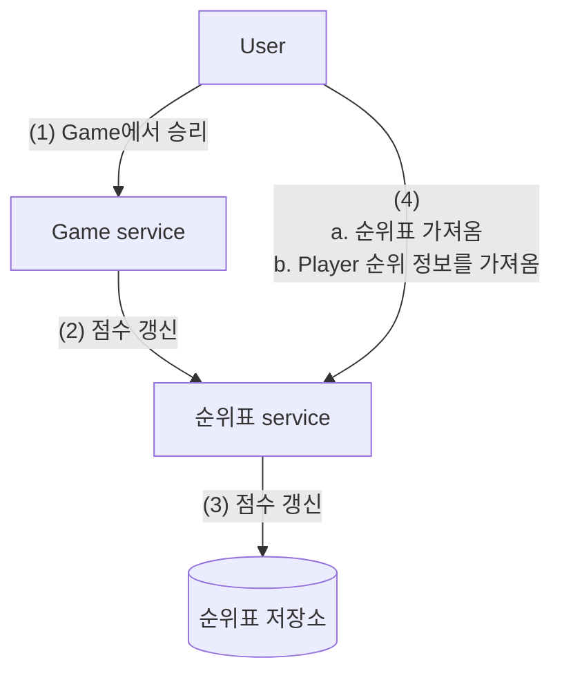
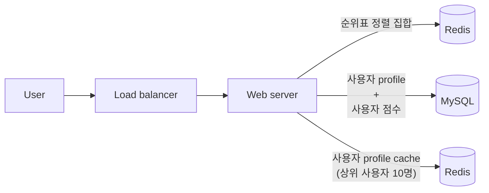
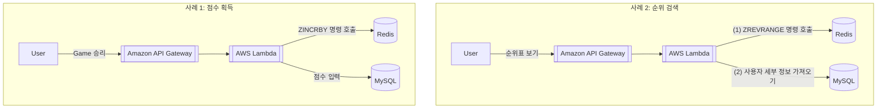

# 실시간 게임 순위표


순위표: Leaderboard of an online mobile game


## 1단계: 문제 이해 및 설계 범위 확정

- 기능 요구사항
  - 순위표에 상위 10명의 player 표시
  - 특정 사용자의 순위 표시
  - 어떤 사용자보다 4순위 위와 아래에 있는 사용자 표시
- 비기능 요구사항
  - 점수 update는 실시간으로 순위표에 반영
  - 일반적인 확장성, 가용성 및 안정성 요구사항
- 개략적 규모 추정
  - Game을 하는 사용자가 24시간 동안 고르게 분포 가정
    - DAU가 5,000,000명인 경우 초당 평균 50명 game play
    - $\because\frac{5,000,000DAU}{10^5sec}\simeq50$
  - 하지만 그렇게 균등한 경우는 존재하지 않고 북미 지역 기준 저녁 시간이 peak 시간대일 가능성이 높음
    - 최대 부하는 평균의 5배라 가정
    - $\therefore$ 초당 최대 250명의 사용자를 감당할 수 있어야 함
  - 사용자 점수 획득 QPS
    - 한 사용자가 하루 평균 10개 game play 가정
    - $\therefore 50\times10\times5=2,500$
  - 상위 10명 순위표 가져오기 QPS
    - 각 사용자가 하루에 한 번 game을 열고 상위 10명 순위표는 사용자가 처음 게임을 열 때만 표시한다고 가정
    - 초당 평균 50명이 game play하기 때문에 QPS는 약 50

<!-- More -->

## 2단계: 개략적 설계안 제시 및 동의 구하기

### API 설계

- `POST /v1/scores`
  - Request
    - `user_id`: Game에서 승리한 사용자
    - `points`: 사용자가 game에서 승리하여 획득한 point 수
  - Response
    - `200 OK`: 사용자의 점수를 성공적 갱신한 경우
    - `400 Bad Request`: 잘못된 인자가 전달되어 사용자 점수를 갱신할 수 없었던 경우
- `GET /v1/scores`
  - Response: 순위표에서 상위 10명의 player를 가져옴
- `GET /v1/scores/{:user_id}`
  - Request
    - `user_id`: 순위 정보를 가져올 사용자 ID
  - Response: 사용자의 점수 및 순위 정보

### 개략적 설계안



1. 사용자가 game에서 승리하면 client는 game service에 요청 전송
2. Game service는 해당 승리가 정당하고 유효한 것인지 확인 후 순위표 service에 점수 갱신 요청 전송
3. 순위표 service는 순위표 저장소에 기록된 해당 사용자의 점수 갱신
4. 해당 사용자의 client는 순위표 service에 직접 요청하여 다음과 같은 data 수신
   1. 상위 10명의 순위표
   2. 해당 사용자 순위

- Client가 순위표 service와 직접 통신해야 하나?
  - 대안으로 client가 점수를 정하는 방식 존재
  - 하지만 사용자가 proxy를 설치하고 점수를 마음대로 바꾸는 중간자 공격 (man-in-the-middle attack)을 할 수 있어 보안상 안전 X
  - Online poker와 같이 server가 game 전반을 통솔하는 경우 client가 점수를 설정하기 위해 game server를 명시적으로 호출할 필요 없을 수 있음
- Game service와 순위표 server 사이에 message queue가 필요한가?
  - Game 점수가 다른 곳에서도 이용되거나 여러 기능을 지원해야 한다면 Kafka에 data를 넣는 것이 합리적일 수 있음
  - 순위표 service, 분석 (analytics) service, push 알림 service 등 여러 소비자가 동일한 data를 사용할 수 있기 때문

### 데이터 모델

- 관계형 database

  - 각 월별 순위표는 사용자 ID와 점수 열을 갖는 database table로 표현 가능
  - 사용자가 경연에서 승리하면 신규 사용자에게 1점을 주고 기존 사용자에게는 원래 점수에 1을 더함
  - 사용자가 점수를 얻은 경우

    ```sql
    INSERT INTO leaderboard (user_id, score) VALUES ('mary1934', 1);
    UPDATE leaderboard set score=score + 1 where user_id='mary1934';
    ```

  - 특정 사용자 순위 검색

    ```sql
    SELECT (@rownum := @rownum + 1) AS rank, user_id, score FROM
    leaderboard
    ORDER BY score DESC;
    ```

  - 이러한 방안은 data가 많지 않을 때 효과적이지만 record가 수백만 개 정도로 많아지면 성능 저하가 너무 큼
    - 사용자의 순위를 파악하려면 모든 player를 순위표의 정확한 위치에 정렬해야 함
    - SQL database는 지속적으로 변화하는 대량의 정보를 신속하게 처리 불가 (data가 지속적으로 변하기에 cache 도입도 불가)
  - 색인 (index)을 추가하고 `LIMIT` 절을 사용하여 scan할 page 수 제한

    ```sql
    SELECT (@rownum := @rownum + 1) AS rank, user_id, score FROM
    leaderboard
    ORDER BY score DESC
    LIMIT 10
    ```

  - 하지만 규모 확장성이 좋지 않음
    - 특정 사용자의 순위를 알아내려면 기본적으로 전체 table 조회 필수
    - 순위표 상단에 있지 않은 사용자의 순위를 간단히 찾기 어려움

- Redis: Memory 기반 key-value 저장소 system
  - 정렬 집합 (sorted set)
    - 각 원소는 점수 (고유하지도 않을 수 있음)에 연결되어 있음
    - 내부적으로 hash table과 skip list라는 두 가지 자료 구조 사음
    - Hash table: 사용자의 점수를 저장하기 위해
    - Skip list: 특정 점수를 딴 사용자들의 목록을 저장하기 위해
  - 정렬 집합을 사용한 구현
    - $n$: 정렬 집합의 크기, $m$: 가져올 항목 수
    - `ZADD`: 기존 사용자가 아닐 시 집합 삽입, 기존 사용자일 시 점수 update ($O(\log{(n)})$)
    - `ZINCBY`: 사용자 점수를 지정된 값만큼 증가 ($O(\log{(n)})$)
    - `ZARANGE` / `ZREVRANGE`: 점수에 따라 정렬된 사용자 중 특정 범위에 드는 사용자 조회 ($O(\log{(n)}+m)$)
    - `ZRANK` / `ZREVRANK`: 오름차순/내림차순 정렬 시 특정 사용자의 위치 조회 ($O(\log{(n)})$)
- 저장소 요구사항
  - Memory
    - 최소한 사용자 ID와 점수는 저장
    - 최악의 scenario로 월간 활성 사용자 25,000,000명 모두 최소 한 번 이상 game에서 승리하여 모두 월 순위표에 오른다 가정
    - ID는 24자 문자열, 점수는 16bit 정수 $\rightarrow$ 순위표 한 항목당 26byte
    - $26byte\times25,000,000=650,000,000byte\simeq650MB$
    - $\therefore$ 최신 Redis server 한 대로 data 충분히 저장
  - CPU & I/O
    - 최대 QPS는 2,500이므로 단일 Redis server로 충분히 감당
  - Data Persistence
    - Redis 내 disk에 영속적 보관 옵션 지원
    - Disk에서 data를 읽어 대규모 Redis instance를 재시작 시 너무 많은 시간 소모
    - $\therefore$ Redis에 읽기 사본을 두어 주 server에서 장애 발생 시 읽기 사본을 승격시켜 주 server로 만들고 새로운 읽기 사본을 연결

## 3단계 상세 설계

### 클라우드 서비스 사용 여부

- 자체 service 이용
  - 매월 정렬 집합을 생성 후 해당 기간의 순위표 저장 (사용자 및 점수 정보 저장)
  - 이름 및 profile image와 같은 사용자 세부 정보는 MySQL database에 저장
  - 순위표를 가져올 때 API server는 순위 data와 database에 저장된 사용자 이름과 profile image도 가져오며 너무 비효율적일 시 상위 사용자 10명의 세부 정보를 저장하는 profile cache를 두어 해결 가능



- Cloud service 이용
  - [Amazon API Gateway](https://aws.amazon.com/api-gateway/): RESTful API의 HTTP endpoint를 정의하고 backend와 service에 연결 가능
  - [AWS Lambda](https://aws.amazon.com/lambda/): 가장 인기 있는 serverless computing platform 중 하나로 server를 직접 준비하거나 관리할 필요 없이 code 실행 가능
    - 필요할 때만 실행되어 traffic에 따라 규모 자동 확장



### 레디스 규모 확장

> 5,000,000 DAU 정도라면 1대의 Redis cache server로 충분하지만 100배인 500,000,000 DAU를 처리한다 가정
> (저장 용량: 65GB, QPS: 250,000)

- Data sharding
  - 고정 partition: 사전에 정의된 고정 key 범위나 물리적 위치에 따라 data를 여러 node로 분할하는 방법
  - Hash partition: Hash 함수를 사용하여 key를 계산하고 그 결과에 따라 data를 여러 node에 분산시키는 방법
- Redis node 크기 조정
  - 쓰기 작업이 많은 application에는 많은 memory 필요 (장애에 대비해 snapshot을 생성할 때 필요한 모든 쓰기 연산을 감당하기 위해)
  - Redis가 제공하는 [redis-benchmark](https://github.com/redis/redis/blob/unstable/src/redis-benchmark.c)를 사용하여 여러 client가 동시에 여러 질의를 실행하는 것을 simulation하여 주어진 hardware로 초당 얼마나 많은 요청을 처리할 수 있는지 측정

| 구분        | 고정 partition                         | Hash partition                         |
| ----------- | -------------------------------------- | -------------------------------------- |
| 개념        | 지정된 범위나 위치로 data 분할         | Hash 함수를 사용하여 data 분산         |
| 구현 방식   | 고정된 기준 (예: A-M, N-Z)으로 분할    | Hash 함수로 key를 계산하여 server 할당 |
| 장점        | 구현 간단, 직관적인 분할               | Data가 고르게 분산됨, 확장성 좋음      |
| 단점        | Data 불균형 발생 가능<br/>Hotspot 문제 | Hash 충돌 가능성<br/>재분배 시 복잡    |
| 적합한 경우 | Data 분포를 미리 알고 있는 경우        | Data 분포가 예측 불가능한 경우         |
| 확장성      | 제한적, 새 node 추가 시 재분배 복잡    | 뛰어남, 일관된 hash로 확장 용이        |

### 대안: NoSQL

- 이상적인 database
  - 쓰기 연산에 최적화
  - 같은 partition 내의 항목을 점수에 따라 효율적 정렬 가능
- 좋은 후보
  - [Amazon DynamoDB](https://aws.amazon.com/dynamodb/)
  - [Apache Cassandra](https://github.com/apache/cassandra)
  - [MongoDB](https://github.com/mongodb/mongo)
