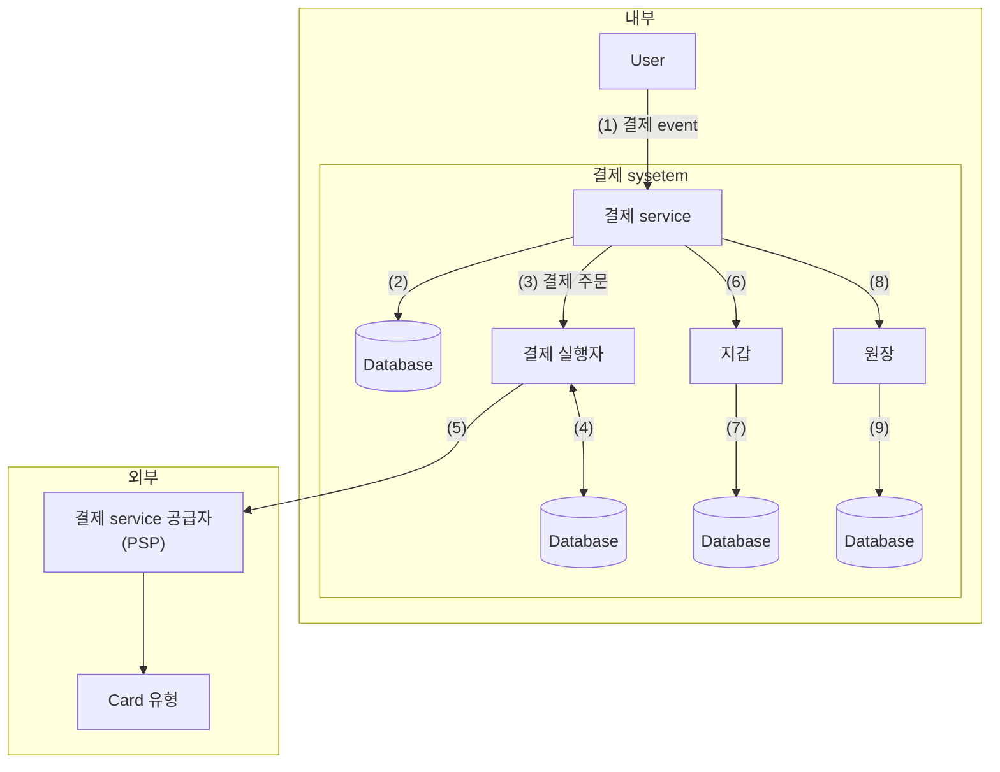
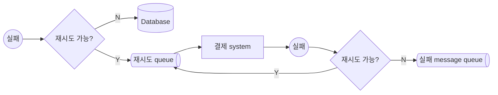

# 결제 시스템


결제 (payment) system: 금전적 가치의 이전을 통해 금융 거래를 정산하는 데 사용되는 모든 system


## 1단계: 문제 이해 및 설계 범위 확정

- 기능 요구사항
  - 대금 수신 (pay-in) 흐름: 결제 system이 판매자를 대신하여 고객으로부터 대금 수령
  - 대금 정산 (pay-out) 흐름: 결제 system이 전 세계의 판매자에게 제품 판매 대금 송금
- 비기능 요구사항
  - 신뢰성 및 내결함성: 결제 실패는 신중하게 처리
  - 내부 service (결제 system, 회계 system)와 외부 service (결제 servcice 제공업체) 간의 조정 process: System 간의 결제 정보가 일치하는지 비동기적으로 확인
- 개략적인 규모 추정
  - 하루에 100만 건의 transaction 처리
  - $1,000,000/10^5=10TPS$
  - 10TPS는 일반적 database로 문제 없이 처리 가능하기 때문에 처리 대역폭 대신 결제 transaction의 정확한 처리에 초점

<!-- More -->

## 2단계: 개략적 설계안 제시 및 동의 구하기

- 대금 수신 흐름: 구매자 $\rightarrow$ 전자상거래 platform의 은행계좌
- 대금 정산 흐름: 전자상거래 platform의 은행계좌 $\rightarrow$ 판매자의 은행계좌

### 대금 수신 흐름

- 결제 (payment) service
  - 사용자로부터 결제 event를 수락하고 결제 process 조율
  - 일반적으로 AML/CFT와 같은 규정 준수하는지, 자금 세탁이나 범죄 행위 증거 평가를 위한 위험 점검 (risk check) 먼저 수행
- 결제 실행자 (payment executor)
  - 결제 service 공급자 (PSP)를 통해 결제 주문 (payment order) 하나 실행
  - 하나의 결제 event에는 여러 결제 주문 포함 가능
- 결제 service 공급자 (Payment Service Provider, PSP)
  - A 계정에서 B 계정으로 돈 옮기는 역할
- 원장 (ledger)
  - 결제 transaction에 대한 금융 기록
  - 전자상거래 website의 총 수익을 계산하거나 향후 수익을 예측하는 등, 결제 후 분석 (post-payment analysis)에서 매우 중요한 역할
- 지갑 (wallet)
  - 판매자 (merchant)의 계정 잔액 기록
  - 특정 사용자가 결제한 총 금액 기록 가능

#### 결제 서비스 API

- `POST /v1/payments`: 결제 event 실행
  - `buyer_info` (`json`): 구매자 정보
  - `checkout_id` (`string`): 해당 결제 event를 식별하는 전역적으로 고유한 ID
  - `credit_card_info` (`json`): 암호화된 신용 card 정보 또는 결제 token (PSP 마다 다른 값)
  - `payment_orders` (`list`): 결제 주문 목록
    - `seller_account` (`string`): 대금을 수령할 판매자
    - `amount` (`string`): 해당 주문으로 전송되어야 할 대금
    - `currency` (`string` ISO 4217): 주문에 사용된 통화 단위
    - `payment_order_id` (`string`): 해당 주문을 식별하는 전역적으로 고유한 ID
- `GET /v1/payments/{:id}`: `payment_order_id`이 가르키는 단일 결제 주문의 실행 상태 반환

#### 결제 서비스 데이터 모델

> 일반적으로 NoSQL/NewSQL 보다 ACID transaction을 지원하는 전통적 관계형 database 선호

- 결제 (payment) event
  - `checkout_id` (`string`, PK)
  - `buyer_info` (`string`)
  - `seller_info` (`string`)
  - `credit_card_ifno` (Card 제공업체에 따라 상이)
  - `is_payment_done` (`boolean`)
- 결제 주문 (payment order)
  - `payment_order_id` (`string`, PK)
  - `buyer_account` (`string`)
  - `amount` (`string`)
  - `currency` (`string`)
  - `checkout_id` (`string`, FK)
  - `payment_order_status` (`string`)
  - `ledger_updated` (`boolean`)
  - `wallet_updated` (`boolean`)

#### 복식부기 원장 시스템

> 복식부기 (double-entry): 모든 결제 system에 필수 요소로 모든 결제 거래를 두 개의 별도 원장 계좌에 같은 금액으로 기록

### 대금 정산 흐름

- 대금 정산 (pay-out) 흐름의 구성 요소는 대금 수신 흐름과 유사
- PSP를 사용하여 구매자의 신용 card에서 전자상거래 website 은행 계좌로 돈을 이체하는 대신 정산 흐름에서는 타사 정산 service를 사용하여 전자상거래 website 은행 계좌에서 판매자 은행 계좌로 돈을 이체하는 점이 다름
- 결제 system은 대금 정산을 위해 Tipalti와 같은 외상매입금 (accounts payable) 지급 service 제공업체 이용

## 3단계: 상세 설계

### PSP 연동

- 회사가 민감한 결제 정보를 안전하게 저장할 수 있다면 API를 통해 PSP와 연동
- 복잡한 규정 및 보안 문제로 인해 민감한 결제 정보를 저장하지 않기로 결정한 경우 PSP는 card 결제 세부 정보를 수집하여 PSP에 안전하게 저장할 수 있도록 외부 결제 page 제공

### 조정

- System 구성 요소가 비동기적으로 통신하는 경우 message가 전달되거나 응답이 반환된다는 보장 X
  - System 성능을 높이기 위해 비동기 통신을 자주 사용하는 결제 관련 사업의 일반적 문제
- 이를 해결하기 위해 관련 service 간 상태를 주기적으로 비교하여 일치하는지 확인하는 조정 사용
- 매일 밤 PSP나 은행은 고객에게 은행 계좌의 잔액과 하루 동안 해당 계좌에서 발생한 모든 거래 (transaction) 내역이 기재된 정산 (settlement) file 전송
- 조정 system은 정산 file의 세부 정보를 읽어 원장 system과 비교
- 결제 system 내부의 일관성을 확인할 때도 사용

### 결제 지연 처리

- 결제 요청이 평소보다 오래 걸리게 되는 사례
  - PSP가 해당 결제 요청의 위험성이 높다고 보고 담당자 검토 요구 시
  - 신용 card사가 구매 확인 용도로 card 소유자의 추가 정보를 요청하는 3D 보안 인증 (3D Secure Authentication) 같은 추가 보호 장치 요구 시
- 구매 page가 외부 PSP에 hosting 되는 경우 PSP의 처리 방법
  - PSP는 결제가 대기 (pending) 상태임을 알리는 상태 정보를 client에 반환하고 client는 이를 사용자에게 표기
    Client는 고객이 현재 결제 상태를 확인할 수 있는 page 제공
  - PSP는 회사를 대신하여 대기 중인 결제 진행 상황 추적 후 상태가 바뀌면 PSP에 등록된 webhook을 통해 결제 service에 알림
- 결제 요청이 최종적으로 완료되면 PSP는 사전 등록된 webhook 호출 (polling을 통한 주기적 확인을 사용하기도 함)

### 내부 서비스 간 커뮤니케이션

- 동기식 통신
  - HTTP와 같은 동기식 통신은 소규모 system에서는 잘 작동하지만 규모가 커지면 단점 분명
  - 동기식 통신에서 한 요청에 응답을 만드는 처리 주기 (cycle)는 service가 많을수록 길어짐
  - 성능 저하: 요청 처리와 관계된 service 가운데 하나에 발생한 성능 문제가 전체 system의 성능에 영향
  - 장애 격리 곤란: PSP 등 service에 장애 발생 시 client는 더 이상 응답 받지 못함
  - 높은 결합도: 요청 발신자는 수신자를 알아야만 함
  - 낮은 확장성: Queue를 buffer로 사용하지 않고서는 갑작스러운 traffic 증가에 대응할 수 있도록 system 확장 어려움
- 비동기 통신
  - 단일 수신자: 각 요청 (message)은 하나의 수신자 또는 service가 처리
    - 일반적으로 공유 message queue를 사용해 구현
    - Queue에는 복수의 구독자가 있을 수 있으나 처리된 message는 queue에서 바로 제거
  - 다중 수신자: 각 요청 (message)은 여러 수신자 또는 server가 처리
    - Kafka가 적합
    - 소비자가 수신한 message는 kafka에서 바로 사라지지 않음
    - 따라서 동일한 message를 여러 service가 받아 처리 가능

### 결제 실패 처리

- 결제 상태 추적: 실패가 일어날 때마다 결제 거래의 현재 상태 파악 후 재시도 또는 환불이 필요한지 여부 결정
- 재시도 queue 및 실패 message queue
  - 재시도 queue: 일시적 오류 같은 재시도 가능 오류는 재시도 queue에 전송
  - 실패 message queue: 반복적으로 처리에 실패한 message는 결국에 실패 message queue로 전송
    문제가 있는 message를 debugging하고 격리하여 성공적으로 처리되지 않은 이유를 파악하기 위한 검사에 유용

### 정확히 한 번 전달

> 결제 system에 발생 가능한 가장 심각한 문제 중 하나: 고객에게 이중으로 청구 (결제 주문이 정확히 한 번만 실행되도록 결제 system을 설계하는 것이 중요)

- 다음 요건 충족 시 주어진 연산은 정확히 한 번 실행
  1. 최소 한 번은 실행
  2. 최대 한 번 실행
- 재시도
  - 재시도 mechanism을 활용하면 어떤 결제가 최소 한 번은 실행되도록 보장 가능
  - 재시도 mechanism을 도입할 때는 얼마나 간격을 두고 재시도할지 정하는 것이 중요
  - 재시도 간격 전략
    - 즉시 재시도 (immediate retry)
      - Client는 즉시 요청을 다시 전송
    - 고정 간격 (fixed interval)
      - 재시도 전에 일정 시간 기다리는 방안
    - 증분 간격 (incremental interval)
      - 재시도 전에 기다리는 시간을 특정한 양 만큼 점진적으로 늘려 나가는 방안
    - 지수적 (exponential) backoff
      - 재시도 전에 기다리는 시간을 직전 재시도 대비 두 배씩 늘려 나가는 방안
    - 취소 (cancel)
      - 요청을 철회하는 방안
      - 실패가 영구적이거나 재시도를 하더라도 성공 가능성이 낮은 경우에 흔히 사용되는 방안
  - 적절한 재시도 전략을 결정하는 것은 어려움
    - 일반적으로 적용 가능한 지침은 network 문제가 단시간 내에 해결될 것 같지 않다면 지수적 backoff를 사용하는 것
    - Error code를 반환할 때는 `Retry-After` header를 같이 붙여 보내는 것이 바람직
  - 재시도 시 발생 가능한 잠재적 문제: 이중 결제
    - Scenario 1: 결제 system이 외부 결제 page를 통해 PSP와 연동하는 환경에서 client가 결제 button을 두 번 중복 click
    - Scenario 2: PSP가 결제를 성공적으로 하였으나 network 오류로 인해 응답이 결제 system에 도달하지 못하여 사용자가 '결제' button을 다시 click하거나 client가 결제 다시 시도
- 멱등성: 이중 결제 방지를 위해 결제는 '최대 한 번'
  - API 관점에서의 멱등성: Client가 같은 API 호출을 여러 번 반복해도 항상 동일한 결과 출력
  - Client와 server 간의 통신을 위해 일반적으로 client가 생성하고 일정 시간이 지나면 만료되는 고유한 값을 멱등 key로 사용
  - 결제 요청의 멱등성을 보장하기 위해서 HTTP header를 `<멱등 key: 값>`의 형태로 멱등 key 추가
  - Scenario 1: 고객이 '결제' button을 빠르게 두 번 click하는 경우
    - 사용자가 '결제'를 click하면 멱등 key가 HTTP 요청의 일부로 결제 system에 전송
    - 전자상거래 website에서 멱등 key는 일반적으로 결제가 이루어지기 직전의 장바구니 ID
    - 결제 system은 두 번째 요청이 오는 경우 이전에 받은 적이 있는 멱등 key이기 때문에 재시도로 처리하는데, 그런 경우 결제 system은 이전 결제 요청의 가장 최근 상태 반환
    - 동일한 멱등 key로 동시에 많은 요청을 받으면 결제 service를 하나만 처리하고, 나머지에 대해서는 `429 Too Many Requests` 상태 code 반환
    - 멱등성을 지원하는 한 가지 방법: Database의 고유 key 제약 조건 (unique key constraint) 활용
    - 예시: Database table의 기본 key를 멱등 key로 사용
      1. 결제 system은 결제 요청을 받으면 database table에 새 record를 넣으려 시도
      2. 새 record 추가에 성공했다는 것은 이전에 처리한 적이 없는 결제 요청
      3. 새 record 추가에 실패했다는 것은 이전에 받은 적이 있는 결제 요청 (중복 요청 처리 X)
  - Scenario 2: PSP가 결제를 성공적으로 처리했지만 network 오류로 응답이 결제 system에 전달되지 못하여, 사용자가 '결제' button을 다시 click하는 경우
    - 결제 서비스는 PSP에 비중복 난수를 전송하고, PSP는 해당 난수에 대응되는 token 반환
    - 이 난수는 결제 주문을 유일하게 식별하는 구실을 하며, 해당 token은 그 난수에 일대일 대응 (token 또한 결제 주문을 유일하게 식별 가능)
    - 사용자가 '결제' button을 다시 누른다 해도 결제 주문이 같으니 PSP로 전송되는 token도 동일, PSP는 token을 멱등 key로 사용 → 이중 결제로 판단하고 종전 실행 결과 반환

### 일관성

- 결제 실행 과정에서 상태 정보를 유지 관리하는 여러 service 호출
  1. 결제 service는 비중복 난수, token, 결제 주문, 실행 상태 등의 결제 관련 data를 유지 관리
  2. 원장은 모든 회계 data 보관
  3. 지갑은 판매자의 계정 잔액 유지
  4. PSP는 결제 실행 상태 유지
  5. Data는 안정성을 높이기 위해 여러 database 사본에 복제될 수 있음
- 분산 환경: Service 간 통신 실패로 data 불일치가 발생 가능
  - 내부 service 간 data 일관성 유지: 요청이 '정확히 한 번 처리' 되도록 보장
  - 내부 service와 외부 service (PSP) 간 data 일관성 유지: 멱등성과 조정 process 활용
  - 외부 service가 멱등성을 지원하는 경우, 결제를 재시도할 때 같은 멱등 key 사용
  - 그러나 외부 service가 멱등 API를 지원하더라도 외부 system이 항상 옳다고 가정할 수 없으므로 조정 절차 생략 불가
- Data 다중화하는 경우 복제 지연으로 인해 기본 database와 사본 data가 불일치하는 일 발생 가능
  1. 주 database에서만 읽기와 쓰기 연산 처리
     - 장점
       - 설정 쉬움
     - 단점
       - 규모 확장성이 떨어짐
       - 사본은 data 안정성 보장에만 활용되고 traffic 처리 X (자원 낭비)
  2. 모든 사본 항상 동기화
     - Paxos, Raft 같은 합의 algorithm 사용
     - YugabyteDB, CockroachDB와 같은 합의 기반 분산 database 사용

### 결제 보안

| 문제                                            | 해결책                                                                            |
| ----------------------------------------------- | --------------------------------------------------------------------------------- |
| 요청/응답 도청 (request/response eavesdropping) | HTTPS 사용                                                                        |
| Data 변조 (tempering)                           | 암호화 및 무결성 강화 monitoring                                                  |
| 중간자 공격 (man-in-the-middle attack)          | 인증서 고정 (certificate pinning)과 함께 SSL 사용                                 |
| Data 손실                                       | 여러 지역에 걸쳐 database 복제 및 snapshot 생성                                   |
| 분산 service 거부 공격 (DDoS)                   | 처리율 제한 및 방화벽                                                             |
| 카드 도난                                       | Token화 (tokenization), 실제 카드 번호를 사용하는 대신 token 저장하고 결제에 사용 |
| PCI 규정 준수                                   | PCI DSS는 브랜드 신용 카드를 처리하는 조직을 위한 정보 보안 표준                  |
| 사기 (fraud)                                    | 주소 확인, Card 확인번호(CVV), 사용자 행동분석 등                                 |
