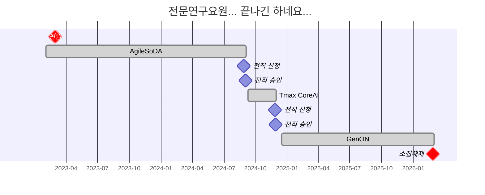

# Introduction

드디어... 1095일이 지났습니다.
[전문연구요원 기간](/tags/전문연구요원/) 동안 우여곡절 끝에 소집해제를 드디어 하게되었습니다!

<!-- More -->

# 소집해제

2026년 1월 31일 토요일에 병무청으로부터 아래 문자가 왔었습니다.

소집해제 당일인 2026년 2월 27일 금요일에 [산업지원 병역일터](https://work.mma.go.kr/caisBYIS/main.do)에서 로그인을 시도했으나 서버의 장애가 존재했는지 다른 전문연구요원 분들의 접속도 불가하여 가장 빠른 평일인 2026년 3월 3일 화요일에 다시 시도를 했었습니다.
처음의 장애와는 다르게 `"예비군 및 군입영자는 회원가입 할 수 없습니다."`라는 문구와 함께 접속 자체가 불가했습니다.

혹시 모르니 병적증명서 발급을 통해 `"복무를 마친 사람"`임을 확인했습니다.

마지막으로 혹시 또 모르니 병무청 담당자와의 통화로 2026년 3월 3일 퇴직이 문제 없음도 확인을 받았습니다.

# Retrospective

전문연구요원의 타임라인은 아래와 같습니다.
전문연구요원은 산업기능요원의 일반적인 승인전직 기간인 6개월과 다르게 1년 6개월로 제약이 있어, 일반적으로 최대 2개의 회사에서 재직 후 소집해제가 됩니다.
저의 경우 [임금체불](/technical-research-personnel-no-pay/)로 인해 세 곳의 회사에서 복무를 진행했습니다.

## Difficulties

전문연구요원 복무 3년, 1095일 동안 쉽지 않았던 것 같습니다.
제가 어려웠던 포인트는 2가지였던 것 같습니다.

1. AI/CS 전공자가 아닌, 비전공자로서 증명을 해나가야하는 과정
2. AI 사업의 획일화된 형태
3. ~~임금체불 (돈내놔...)~~

현재까지 구직을 위한 모든 면접에서 가장 공통되었던 질문은 "기계공학이 아니라 AI/CS 분야를 택한 이유"였던 것 같습니다.
제 블로그 내에 해당 질문에 대해 답이 없는 것 같아 이번 기회에 정리해보자면 아래와 같습니다.

> 저는 무언가를 상상하고, 그것을 현실로 만들어내는 과정을 깊이 사랑하는 사람입니다.
> '사랑'이라는 단어가 다소 거창하게 들릴 수도 있겠지만, 제가 걸어온 길을 되돌아보면 적절한 표현이라고 생각합니다.
> 컴퓨터 프로그래밍과의 첫 만남은 학부 1학년 때 배운 C언어였습니다.
> 이후 학부 2학년 때 해당 과목 교수님의 연구실에 학부연구생으로 합류하여 [Unreal Engine](/tags/unreal-engine/)을 활용한 가상현실 프로젝트를 수행하며 개발의 매력을 느꼈습니다.
> 이후 AI 기술에 대한 호기심이 커져 석사 과정에 진학했고, [Roll-to-Roll 공정](https://github.com/Zerohertz/Lateral-Dynamics-due-to-Roll-Misalignment)의 AI 기반 진단 연구를 수행했습니다.
> 이 과정에서 프로그래밍을 깊이 접하며 더 큰 갈증을 느꼈고, [빅데이터 동아리 BOAZ](https://www.bigdataboaz.com/) 활동을 통해 본격적으로 AI/CS 분야에 뛰어들었습니다.
> BOAZ에서 처음 접해본 [BOJ](https://www.acmicpc.net/)를 2주 동안 몰입해서 [100문제 해결 및 골드 달성](https://solved.ac/profile/zerohertz/history)을 했고, [10개 이상의 스터디 참여](https://github.com/stars/Zerohertz/lists/99-boaz)도 했습니다.
> 특히 가장 흥미로웠고, 해보고 싶었던 것은 MLOps였습니다.
> 진로를 결정하며 '전공을 살린 안정적인 길 (기계공학)'과 '보장되진 않지만 가슴 뛰는 길 (AI/CS)' 사이에서 깊이 고민했습니다.
> 최종적으로는 몰입의 즐거움이 있는 AI/CS 분야를 선택했고, 지금도 그 선택에 후회는 없습니다.

물론 결정만 한다고 다 되면 좋겠지만, 제가 풀어야할 가장 큰 숙제는 시장 내에서 "전공자 대신 비전공자를 고용해야할 이유"였습니다.
이러한 이유의 답을 만들기 위해 알고리즘 및 오픈소스 공부, 개인 프로젝트 등을 많이 했고, 결과적으로 유효했던 것 같습니다.
추가적으로 병무청에도 업무연관성을 소명해야하기에 석사학위에서 수강했던 수업과 업무연관 확인서 등을 작성해야했습니다.
이로인해 편입이 약간 늦어지는 등의 이슈는 있었지만, 큰 문제가 되진 않았습니다.

전문연구요원 특성상 복무가 가능한 회사는 대부분 중소기업이다보니 AI 기반 수익화가 중요했습니다.
하지만 AI를 기반으로 일반적인 소비자들에게 수익을 창출하는 것은 쉽지 않기에 ($\because$ OpenAI의 ChatGPT, Google의 Gemini 등) 전문연구요원이 가능하며 제가 원하는 분야를 채용하는 회사들은 폐쇄망 B2B 형태의 회사가 대부분이였습니다.
그렇다보니 제가 열심히 빚은 모델들이 고객사로 배포가 원활히 이뤄지지 않거나, 어떠한 개선이 이뤄졌는지 피드백을 얻기 어려운 점이 아쉬웠습니다.

## Conclusion

전문연구요원 기간동안 겪었던 사건, 업무, 사람 모두 저를 좋은 사람 및 개발자로 성장할 수 있게 만들어준 경험이라 생각합니다.
예를 들어, 임금체불 당시는 심적으로 어려움이 많았지만 관련 법령들을 하나씩 차분히 읽어보며 앞으로 비슷한 상황을 겪더라도 더 빠르게 잘 일어날 수 있을거란 자신감이 생겼습니다. (~~물론 돈은 아직 못받았지만...~~)
물론 앞선 이미지와 같이 국외여행의 번거로움이나 재택이 불가한 점 등의 한계점은 존재하지만, 이는 충분히 감수할 수 있는 (감수해야하는...) 것들이라 생각합니다.

소집해제가 무사히 잘 이뤄져서 다행이고, 행복합니다 (매우).
사실 큰 제약이 있는 것은 아니지만, 그럼에도 제약은 분명 존재하기 때문에 복무를 진행하며 은근한 스트레스를 받았던 것 같습니다.

전문연구요원을 목표로 두고 계시거나, 전직을 알아보고 계신다면 제 GitHub repository인 [awesome-jmy](https://github.com/Zerohertz/awesome-jmy)를 이용해보시면 약소하지만 도움이 될 것이라 생각합니다.
관련하여 어려운 부분이 있으시거나 고민되는 부분이 있다면 댓글로 남겨주세요! (또는 [커피챗](https://cal.com/zerohertz?redirect=false)도 늘 환영합니다!)
아래와 같이 제가 아는 부분에 대해서는 최대한 공유드릴 수 있도록 하겠습니다.

지금까지 전문연구요원에 관련된 제 글들에 관심을 가져주시고, 읽어주셔서 감사합니다.
