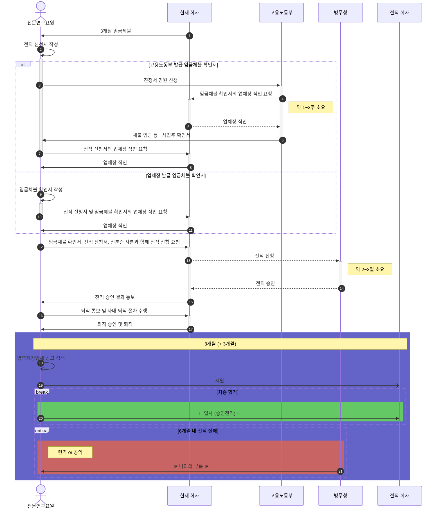
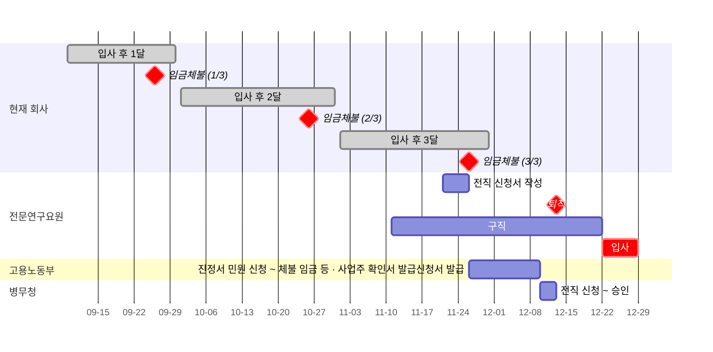
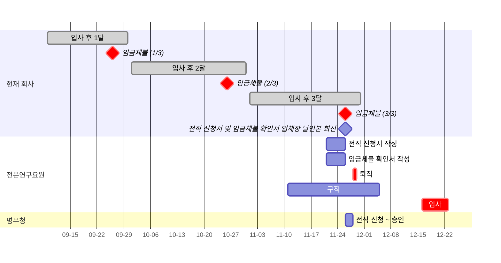
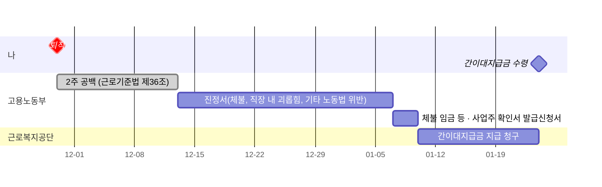

# Introduction

[이전 글](https://zerohertz.github.io/technical-research-personnel-career-change/)과 같이 승인전직을 무사히 마쳤지만... 3개월 임금체불로 인하여 또 다시 승인전직을 진행하게 됐다.
본 글에서 3개월 임금체불 시 어떤 관련 법률이 있는지 알아보고 승인전직, 실업급여, 대지급금이 어떤 절차로 진행되는지 알아보겠다.

[그렇게 됐습니다...](https://biz.sbs.co.kr/article/20000193046)

<!-- More -->

---

# 관련 법률

## 전문연구요원

### [병역법 시행령](<https://www.law.go.kr/법령/병역법 시행령>)

#### [제83조: 전문연구요원 및 산업기능요원이 복무할 해당 분야 등](<https://www.law.go.kr/법령/병역법 시행령/(20240517,34492,20240507)/제83조>)

- 제2항: 전문연구요원이나 산업기능요원은 의무복무기간 중 병역지정업체가 경영악화 등으로 3개월 이상 임금이 체불되거나 부도발생 등으로 인하여 조업이 중단되어 제1항에 따른 해당 분야에 복무할 수 없을 때에는 그 사유가 발생한 날부터 30일 이내에 관할 지방병무청장에게 신고하여야 한다.

#### [제85조: 전문연구요원 및 산업기능요원의 전직](<https://www.law.go.kr/법령/병역법 시행령/(20240517,34492,20240507)/제85조>)

- 제3항: 전문연구요원이나 산업기능요원이 법 제39조제3항제3호에 따라 다음 각 호의 어느 하나에 해당하는 경우에는 관할 지방병무청장의 승인을 받아 해당 분야의 다른 병역지정업체(병무청장이 정하여 고시하는 대기업 연구기관은 제외한다)에 옮겨 복무할 수 있다. 이 경우 제1호나목에 따른 병역지정업체의 변경은 의무복무기간을 통틀어 2회로 한정한다.
  - 제5호: 복무 중인 병역지정업체가 경영악화 등으로 통틀어 3개월 이상 임금이 체불된 경우 또는 휴업하거나 영업정지처분을 받은 경우
- 제5항: 법 제39조제3항 각 호 외의 부분 단서에 따라 병역지정업체를 변경하려는 전문연구요원 또는 산업기능요원은 그 사유가 발생한 날이나 승인을 받은 날(승선복무자의 경우는 하선한 날)부터 3개월(제3항제1호 · 제2호 및 제7호의 경우에는 14일) 이내에 다른 병역지정업체로 옮겨 복무해야 하며, 병역지정업체 변경을 위한 대기기간은 해당 분야에 복무한 기간으로 본다. 다만, 관할 지방병무청장은 부득이한 사유로 병역지정업체 변경을 위한 대기기간의 연장이 필요하다고 인정되는 경우에는 3개월의 범위에서 대기기간을 연장할 수 있다

#### [제89조: 의무복무기간의 계산](<https://www.law.go.kr/법령/병역법 시행령/(20240517,34492,20240507)/제89조>)

- 제1항: 전문연구요원 및 산업기능요원의 의무복무기간은 전문연구요원 및 산업기능요원에 편입한 날(수산업 또는 해운업 분야 승선예정자로 산업기능요원에 편입된 사람은 그 승선하는 날)부터 기산한다.
- 제2항: 전문연구요원 및 산업기능요원의 의무복무기간 중 다음 각 호의 기간은 의무복무기간에 산입하지 않는다. 다만, 제3호의 경우 산업기능요원이 시설장비의 운용 등을 위하여 실제로 근무한 기간과 제4호의 경우 전문연구요원이 해당 분야와 관련되는 공동연구 · 기술연수 · 기술지도 등 병무청장이 정하는 사유에 해당하여 국외여행허가를 받은 경우에 그 국외여행기간은 의무복무기간에 산입한다.
  - 제7호: 병역지정업체 변경을 위한 대기기간 중 3개월(제85조제3항제1호, 제2호 및 제7호의 경우에는 14일)을 초과하는 기간(법 제37조제4항에 따른 유예기간 중에 있는 박사과정전문연구요원이 법 제39조제3항제2호 또는 이 영 제85조제3항제2호에 해당하여 다른 병역지정업체로 옮기는 경우에는 대기기간 전부)

### [전문연구요원 및 산업기능요원의 관리규정](<https://www.law.go.kr/행정규칙/전문연구요원 및 산업기능요원의 관리규정>)

#### [제19조: 복무관리 부실업체 등에 대한 인원배정 제한 등](<https://www.law.go.kr/행정규칙/전문연구요원 및 산업기능요원의 관리규정/(2056,20240313)/제19조>)

- 제2항: 병무청장은 병역지정업체가 다음 각 호의 어느 하나에 해당하는 경우에는 각 호의 기준에 따라 다음 해부터 인원배정을 제한할 수 있다. 다만, 매년 1월 1일부터 8월 31일까지 기간에 제6호 또는 제7호에 해당되어, 그 해의 편입인원(채용하여 편입예정인 인원을 포함한다)이 없는 경우에는 그 해부터 인원배정을 제한한다.
  - 제13호: 영 제85조제3항제5호에 따른 전직사유 중 통틀어 3개월 이상 임금체불 사유에 해당하는 업체 : 2년

#### [제39조: 전직절차 등](<https://www.law.go.kr/행정규칙/전문연구요원 및 산업기능요원의 관리규정/(2056,20240313)/제39조>)

- 제1항: 병역지정업체의 장은 영 제85조에 따라 연구요원 및 기능요원으로부터 전직승인신청서를 접수받은 때에는 접수일로부터 14일(영 제85조제3항제6호 또는 제8호부터 제13호까지의 규정에 따른 경우에는 7일)이내에 관할지방병무청장에게 제출하여야 한다. 이 경우 전직에 부동의하는 경우에는 별지 제29호서식의 전직 의견서를 첨부하여야 한다.
- 제2항: 관할지방병무청장은 병역지정업체의 장이 전직승인신청서를 접수받고도 제1항의 기간에 제출하지 아니한 때에는 전직하고자 하는 연구요원이나 기능요원으로부터 직접 접수받아 처리할 수 있다. 이 경우 병역지정업체의 장의 전직 의견서를 별도로 제출받아 처리하여야 하며, 병역지정업체의 장이 지정한 기간에 전직 의견서를 제출하지 아니한 때에는 전직에 대한 의견이 없는 것으로 보아 처리할 수 있다.
- 제3항: 연구요원이나 기능요원이 영 제85조제3항제6호 또는 제8호부터 제13호까지의 규정에 따라 병역지정업체를 옮겨 복무하려는 경우에는 전직 사유 발생일부터 60일 이내에 복무하고 있는 병역지정업체의 장 또는 관할 지방병무청장에게 전직승인신청서를 제출하여야 한다. 다만, 영 제85조제3항제10호의 경우는 요양기간 종료일 이후 60일 이내까지 제출할 수 있다.
- 제4항: 영 제85조제3항제9호의 "병역지정업체의 장을 대신하여 복무관리를 담당하는 사람"이란 병역지정업체 인사담당자, 상급자 등을 말하며, 「근로기준법」위반행위 중 폭력의 경우에는 사법기관에 신고한 것을 고용노동부장관이나 근로감독관에게 통보한 것으로 갈음한다.

#### [제42조: 전직 대기기간의 연장](<https://www.law.go.kr/행정규칙/전문연구요원 및 산업기능요원의 관리규정/(2056,20240313)/제42조>)

- 제1항: 영 제85조제5항 단서규정의 부득이한 사유란 다음 각 호의 어느 하나와 같다.
  - 제1호: 법 제39조제3항제2호 또는 영 제85조제1항에 따라 다른 병역지정업체로 옮겨 복무하여야 할 사람.
  - 제2호: 영 제85조제3항제1호, 제2호 또는 제7호 규정 이외의 사유로 다른 병역지정업체로 옮겨 복무하여야 할 사람.
  - 제3호: 기타 부득이하게 전직대기기간의 연장이 필요하다고 인정되는 사람.

#### [제43조: 전직제한](<https://www.law.go.kr/행정규칙/전문연구요원 및 산업기능요원의 관리규정/(2056,20240313)/제43조>)

- 제2항: 관할지방병무청장은 영 제85조제3항제1호, 제2호 및 제7호에 해당하는 연구요원 및 기능요원이 다른 병역지정업체로 옮겨 복무하고자 하는 경우 옮겨 복무할 병역지정업체가 결정되지 않은 때에는 전직을 승인하여서는 아니 된다. 이 경우 연구요원 및 기능요원은 옮겨 갈 병역지정업체의 장이 1개월 이내에 발행한 별지 제20호서식의 채용동의서를 제출하여야 한다.

## 실업급여

### [근로기준법](https://www.law.go.kr/법령/근로기준법)

#### [제2조: 정의](<https://www.law.go.kr/법령/근로기준법/(20211119,18176,20210518)/제2조>)

- 제1항: 이 법에서 [사용하는 용어의 뜻](https://www.law.go.kr/LSW//oneViewImg.do?oneviewPttninfSeq=2323219900001&flGubun=1)은 다음과 같다.
  - 제1호: "근로자"란 직업의 종류와 관계없이 임금을 목적으로 사업이나 사업장에 근로를 제공하는 사람을 말한다.
  - 제2호: "사용자"란 사업주 또는 사업 경영 담당자, 그 밖에 근로자에 관한 사항에 대하여 사업주를 위하여 행위하는 자를 말한다.
  - 제3호: "근로"란 정신노동과 육체노동을 말한다.
  - 제4호: "근로계약"이란 근로자가 사용자에게 근로를 제공하고 사용자는 이에 대하여 임금을 지급하는 것을 목적으로 체결된 계약을 말한다.
  - 제5호: "임금"이란 사용자가 근로의 대가로 근로자에게 임금, 봉급, 그 밖에 어떠한 명칭으로든지 지급하는 모든 금품을 말한다.
  - 제6호: "평균임금"이란 이를 산정하여야 할 사유가 발생한 날 이전 3개월 동안에 그 근로자에게 지급된 임금의 총액을 그 기간의 총일수로 나눈 금액을 말한다. 근로자가 취업한 후 3개월 미만인 경우도 이에 준한다.
  - 제7호: "1주"란 휴일을 포함한 7일을 말한다.
  - 제8호: "소정(所定)근로시간"이란 제50조, 제69조 본문 또는 「산업안전보건법」 제139조제1항에 따른 근로시간의 범위에서 근로자와 사용자 사이에 정한 근로시간을 말한다.
  - 제9호: "단시간근로자"란 1주 동안의 소정근로시간이 그 사업장에서 같은 종류의 업무에 종사하는 통상 근로자의 1주 동안의 소정근로시간에 비하여 짧은 근로자를 말한다.
- 제2항: 제1항제6호에 따라 산출된 금액이 그 근로자의 통상임금보다 적으면 그 통상임금액을 평균임금으로 한다.

### [고용보험법](https://www.law.go.kr/법령/고용보험법)

#### [제2조: 정의](<https://www.law.go.kr/법령/고용보험법/(20240517,19591,20230808)/제2조>)

- 제1항: 이 법에서 사용하는 용어의 뜻은 다음과 같다.
  - 제1호: "피보험자"란 다음 각 목에 해당하는 사람을 말한다.
    - 가목: 「고용보험 및 산업재해보상보험의 보험료징수 등에 관한 법률」(이하 "고용산재보험료징수법"이라 한다) 제5조제1항 · 제2항, 제6조제1항, 제8조제1항 · 제2항, 제48조의2제1항 및 제48조의3제1항에 따라 보험에 가입되거나 가입된 것으로 보는 근로자, 예술인 또는 노무제공자
    - 나목: 고용산재보험료징수법 제49조의2제1항 · 제2항에 따라 고용보험에 가입하거나 가입된 것으로 보는 자영업자(이하 "자영업자인 피보험자"라 한다)
  - 제2호: "이직(離職)"이란 피보험자와 사업주 사이의 고용관계가 끝나게 되는 것(제77조의2제1항에 따른 예술인 및 제77조의6제1항에 따른 노무제공자의 경우에는 문화예술용역 관련 계약 또는 노무제공계약이 끝나는 것을 말한다)을 말한다.
  - 제3호: "실업"이란 근로의 의사와 능력이 있음에도 불구하고 취업하지 못한 상태에 있는 것을 말한다.
  - 제4호: "실업의 인정"이란 직업안정기관의 장이 제43조에 따른 수급자격자가 실업한 상태에서 적극적으로 직업을 구하기 위하여 노력하고 있다고 인정하는 것을 말한다.
  - 제5호: "보수"란 「소득세법」 제20조에 따른 근로소득에서 대통령령으로 정하는 금품을 뺀 금액을 말한다. 다만, 휴직이나 그 밖에 이와 비슷한 상태에 있는 기간 중에 사업주 외의 자로부터 지급받는 금품 중 고용노동부장관이 정하여 고시하는 금품은 보수로 본다.

#### [제37조: 실업급여의 종류](<https://www.law.go.kr/법령/고용보험법/(20240517,19591,20230808)/제37조>)

- 제1항: 실업급여는 구직급여와 취업촉진 수당으로 구분한다.
- 제2항: 취업촉진 수당의 종류는 다음 각 호와 같다.
  - 제1호: 조기(早期)재취업 수당
  - 제2호: 직업능력개발 수당
  - 제3호: 광역 구직활동비
  - 제4호: 이주비

#### [제40조: 구직급여의 수급 요건](<https://www.law.go.kr/법령/고용보험법/(20240517,19591,20230808)/제40조>)

- 제1항: 구직급여는 이직한 근로자인 피보험자가 다음 각 호의 요건을 모두 갖춘 경우에 지급한다. 다만, 제5호와 제6호는 최종 이직 당시 일용근로자였던 사람만 해당한다.
  - 제1호: 제2항에 따른 기준기간(이하 "기준기간"이라 한다) 동안의 피보험 단위기간(제41조에 따른 피보험 단위기간을 말한다. 이하 같다)이 합산하여 180일 이상일 것
  - 제2호: 근로의 의사와 능력이 있음에도 불구하고 취업(영리를 목적으로 사업을 영위하는 경우를 포함한다. 이하 이 장 및 제5장에서 같다)하지 못한 상태에 있을 것
  - 제3호: 이직사유가 제58조에 따른 수급자격의 제한 사유에 해당하지 아니할 것
  - 제4호: 재취업을 위한 노력을 적극적으로 할 것
  - 제5호: 다음 각 목의 어느 하나에 해당할 것
    - 가목: 제43조에 따른 수급자격 인정신청일이 속한 달의 직전 달 초일부터 수급자격 인정신청일까지의 근로일 수의 합이 같은 기간 동안의 총 일수의 3분의 1 미만일 것
  - 제6호: 최종 이직 당시의 기준기간 동안의 피보험 단위기간 중 다른 사업에서 제58조에 따른 수급자격의 제한 사유에 해당하는 사유로 이직한 사실이 있는 경우에는 그 피보험 단위기간 중 90일 이상을 일용근로자로 근로하였을 것

#### [제41조: 피보험 단위기간](<https://www.law.go.kr/법령/고용보험법/(20240517,19591,20230808)/제41조>)

- 제1항: 근로자의 피보험 단위기간은 피보험기간 중 보수 지급의 기초가 된 날을 합하여 계산한다. 다만, 자영업자인 피보험자의 피보험 단위기간은 제50조제3항 단서 및 제4항에 따른 피보험기간으로 한다.
- 제2항: 제1항에 따라 피보험 단위기간을 계산할 때에는 최후로 피보험자격을 취득한 날 이전에 구직급여를 받은 사실이 있는 경우에는 그 구직급여와 관련된 피보험자격 상실일 이전의 피보험 단위기간은 넣지 아니한다.

#### [제42조: 실업의 신고](<https://www.law.go.kr/법령/고용보험법/(20240517,19591,20230808)/제42조>)

- 제1항: 구직급여를 지급받으려는 사람은 이직 후 지체없이 직업안정기관에 출석하여 실업을 신고하여야 한다. 다만, 「재난 및 안전관리 기본법」 제3조제1호의 재난으로 출석하기 어려운 경우 등 고용노동부령으로 정하는 사유가 있는 경우에는 「고용정책 기본법」 제15조의2에 따른 고용정보시스템을 통하여 신고할 수 있다.
- 제2항: 제1항에 따른 실업의 신고에는 구직 신청과 제43조에 따른 수급자격의 인정신청을 포함하여야 한다.
- 제3항: 제1항에 따라 구직급여를 지급받기 위하여 실업을 신고하려는 사람은 이직하기 전 사업의 사업주에게 피보험 단위기간, 이직 전 1일 소정근로시간 등을 확인할 수 있는 자료(이하 "이직확인서"라 한다)의 발급을 요청할 수 있다. 이 경우 요청을 받은 사업주는 고용노동부령으로 정하는 바에 따라 이직확인서를 발급하여 주어야 한다.

#### [제43조: 수급자격의 인정](<https://www.law.go.kr/법령/고용보험법/(20240517,19591,20230808)/제43조>)

- 제1항: 구직급여를 지급받으려는 사람은 직업안정기관의 장에게 제40조제1항제1호부터 제3호까지 · 제5호 및 제6호에 따른 구직급여의 수급 요건을 갖추었다는 사실(이하 "수급자격"이라 한다)을 인정하여 줄 것을 신청하여야 한다.
- 제2항: 직업안정기관의 장은 제1항에 따른 수급자격의 인정신청을 받으면 그 신청인에 대한 수급자격의 인정 여부를 결정하고, 대통령령으로 정하는 바에 따라 신청인에게 그 결과를 알려야 한다.
- 제3항: 제2항에 따른 신청인이 다음 각 호의 요건을 모두 갖춘 경우에는 마지막에 이직한 사업을 기준으로 수급자격의 인정 여부를 결정한다. 다만, 마지막 이직 당시 일용근로자로서 피보험 단위기간이 1개월 미만인 사람이 수급자격을 갖추지 못한 경우에는 일용근로자가 아닌 근로자로서 마지막으로 이직한 사업을 기준으로 결정한다.
  - 제1호: 피보험자로서 마지막에 이직한 사업에 고용되기 전에 피보험자로서 이직한 사실이 있을 것
  - 제2호: 마지막 이직 이전의 이직과 관련하여 구직급여를 받은 사실이 없을 것
- 제4항: 직업안정기관의 장은 제2항 및 제3항에 따라 신청인에 대한 수급자격의 인정 여부를 결정하기 위하여 필요하면 신청인이 이직하기 전 사업의 사업주에게 고용노동부령으로 정하는 바에 따라 이직확인서의 제출을 요청할 수 있다. 이 경우 요청을 받은 사업주는 고용노동부령으로 정하는 바에 따라 이직확인서를 제출하여야 한다.

#### [제44조: 실업의 인정](<https://www.law.go.kr/법령/고용보험법/(20240517,19591,20230808)/제44조>)

- 제1항: 구직급여는 수급자격자가 실업한 상태에 있는 날 중에서 직업안정기관의 장으로부터 실업의 인정을 받은 날에 대하여 지급한다.
- 제2항: 실업의 인정을 받으려는 수급자격자는 제42조에 따라 실업의 신고를 한 날부터 계산하기 시작하여 1주부터 4주의 범위에서 직업안정기관의 장이 지정한 날(이하 "실업인정일"이라 한다)에 출석하여 재취업을 위한 노력을 하였음을 신고하여야 하고, 직업안정기관의 장은 직전 실업인정일의 다음 날부터 그 실업인정일까지의 각각의 날에 대하여 실업의 인정을 한다. 다만, 다음 각 호에 해당하는 사람에 대한 실업의 인정 방법은 고용노동부령으로 정하는 기준에 따른다.

#### [제45조: 급여의 기초가 되는 임금일액](<https://www.law.go.kr/법령/고용보험법/(20240517,19591,20230808)/제45조>)

- 제1항: 구직급여의 산정 기초가 되는 임금일액[이하 "기초일액(基礎日額)"이라 한다]은 제43조제1항에 따른 수급자격의 인정과 관련된 마지막 이직 당시 「근로기준법」 제2조제1항제6호에 따라 산정된 평균임금으로 한다. 다만, 마지막 이직일 이전 3개월 이내에 피보험자격을 취득한 사실이 2회 이상인 경우에는 마지막 이직일 이전 3개월간에 그 근로자에게 지급된 임금 총액을 그 산정의 기준이 되는 3개월의 총 일수로 나눈 금액을 기초일액으로 한다.
- 제2항: 제1항에 따라 산정된 금액이 「근로기준법」에 따른 그 근로자의 통상임금보다 적을 경우에는 그 통상임금액을 기초일액으로 한다. 다만, 마지막 사업에서 이직 당시 일용근로자였던 사람의 경우에는 그러하지 아니하다.
- 제3항: 제1항과 제2항에 따라 기초일액을 산정하는 것이 곤란한 경우와 보험료를 고용산재보험료징수법 제3조에 따른 기준보수(이하 "기준보수"라 한다)를 기준으로 낸 경우에는 기준보수를 기초일액으로 한다. 다만, 보험료를 기준보수로 낸 경우에도 제1항과 제2항에 따라 산정한 기초일액이 기준보수보다 많은 경우에는 그러하지 아니하다.
- 제4항: 제1항부터 제3항까지의 규정에도 불구하고 이들 규정에 따라 산정된 기초일액이 그 수급자격자의 이직 전 1일 소정근로시간에 이직일 당시 적용되던 「최저임금법」에 따른 시간 단위에 해당하는 최저임금액을 곱한 금액(이하 "최저기초일액"이라 한다)보다 낮은 경우에는 최저기초일액을 기초일액으로 한다. 이 경우 이직 전 1일 소정근로시간은 고용노동부령으로 정하는 방법에 따라 산정한다.
- 제5항: 제1항부터 제3항까지의 규정에도 불구하고 이들 규정에 따라 산정된 기초일액이 보험의 취지 및 일반 근로자의 임금 수준 등을 고려하여 대통령령으로 정하는 금액을 초과하는 경우에는 대통령령으로 정하는 금액을 기초일액으로 한다.

#### [제46조: 구직급여일액](<https://www.law.go.kr/법령/고용보험법/(20240517,19591,20230808)/제46조>)

- 제1항: 구직급여일액은 다음 각 호의 구분에 따른 금액으로 한다.
  - 제1호: 제45조제1항부터 제3항까지 및 제5항의 경우에는 그 수급자격자의 기초일액에 100분의 60을 곱한 금액
  - 제2호: 제45조제4항의 경우에는 그 수급자격자의 기초일액에 100분의 80을 곱한 금액(이하 "최저구직급여일액"이라 한다)
- 제2항: 제1항제1호에 따라 산정된 구직급여일액이 최저구직급여일액보다 낮은 경우에는 최저구직급여일액을 그 수급자격자의 구직급여일액으로 한다.

#### [제47조: 구직급여일액](<https://www.law.go.kr/법령/고용보험법/(20240517,19591,20230808)/제47조>)

- 제1항: 수급자격자는 실업의 인정을 받으려 하는 기간(이하 "실업인정대상기간"이라 한다) 중에 고용노동부령으로 정하는 기준에 해당하는 취업을 한 경우에는 그 사실을 직업안정기관의 장에게 신고하여야 한다.
- 제2항: 직업안정기관의 장은 필요하다고 인정하면 수급자격자의 실업인정대상기간 중의 취업 사실에 대하여 조사할 수 있다.

#### [제50조: 소정급여일수 및 피보험기간](<https://www.law.go.kr/법령/고용보험법/(20240517,19591,20230808)/제50조>)

- 제1항: 하나의 수급자격에 따라 구직급여를 지급받을 수 있는 날(이하 "소정급여일수"라 한다)은 대기기간이 끝난 다음날부터 계산하기 시작하여 피보험기간과 연령에 따라 [별표 1](https://www.law.go.kr/LSW//lsBylInfoPLinkR.do?lsiSeq=253517&lsNm=%EA%B3%A0%EC%9A%A9%EB%B3%B4%ED%97%98%EB%B2%95&bylNo=0001&bylBrNo=00&bylCls=BE&bylEfYd=20240517&bylEfYdYn=Y)에서 정한 일수가 되는 날까지로 한다.
- 제3항: 피보험기간은 그 수급자격과 관련된 이직 당시의 적용 사업에서 고용된 기간으로 한다. 다만, 자영업자인 피보험자의 경우에는 그 수급자격과 관련된 폐업 당시의 적용 사업에의 보험가입기간 중에서 실제로 납부한 고용보험료에 해당하는 기간으로 한다.

#### [제55조의2: 국민연금 보험료의 지원](<https://www.law.go.kr/법령/고용보험법/(20240517,19591,20230808)/제55조의2>)

- 제1항: 고용노동부장관은 「국민연금법」 제19조의2제1항에 따라 구직급여를 받는 기간을 국민연금 가입기간으로 추가 산입하려는 수급자격자에게 국민연금 보험료의 일부를 지원할 수 있다.
- 제2항: 제1항에 따른 지원금액은 「국민연금법」 제19조의2제3항에 따른 연금보험료의 100분의 25의 범위로 한다.
- 제3항: 제1항에 따른 지원 절차 · 방법, 제2항에 따른 지원금액 등에 필요한 사항은 대통령령으로 정한다.

#### [제64조: 조기재취업 수당](<https://www.law.go.kr/법령/고용보험법/(20240517,19591,20230808)/제64조>)

- 제1항: 조기재취업 수당은 수급자격자가 안정된 직업에 재취직하거나 스스로 영리를 목적으로 하는 사업을 영위하는 경우로서 대통령령으로 정하는 기준에 해당하면 지급한다.
- 제3항: 조기재취업 수당의 금액은 구직급여의 소정급여일수 중 미지급일수의 비율에 따라 대통령령으로 정하는 기준에 따라 산정한 금액으로 한다.
- 제4항: 조기재취업 수당을 지급받은 사람에 대하여 이 법의 규정(제61조 및 제62조는 제외한다)을 적용할 때에는 그 조기재취업 수당의 금액을 제46조에 따른 구직급여일액으로 나눈 일수분에 해당하는 구직급여를 지급한 것으로 본다.

### [고용보험법 시행령](<https://www.law.go.kr/법령/고용보험법 시행령>)

#### [제61조: 구직신청과 수급자격 인정신청](<https://www.law.go.kr/법령/고용보험법시행령/(20240701,34601,20240625)/제61조>)

- 제1항: 법 제42조에 따라 실업을 신고하려는 사람은 전산망을 통하여 「직업안정법」 제9조에 따른 구직신청을 해야 한다.
- 제2항: 제1항에 따라 구직신청을 한 사람은 수급자격 인정신청서를 자신의 거주지를 관할하는 직업안정기관의 장에게 제출하되, 다음 각 호의 어느 하나에 해당하는 경우에는 해당 직업안정기관의 장에게 제출할 수 있다.
  - 제1호: 취업을 희망하는 지역 관할 직업안정기관의 장에게 제출하려는 경우
  - 제2호: 이직 전 사업장 관할 직업안정기관의 장에게 제출하려는 경우
  - 제3호: 거주지 관할 직업안정기관보다 교통이 편리하다고 인정되는 인근 지역 관할 직업안정기관의 장에게 제출하려는 경우
- 제3항: 제1항에 따라 실업을 신고하려는 사람이 법 제42조제3항에 따라 사업주로부터 이직확인서를 발급받은 경우에는 이를 소재지 관할 직업안정기관의 장에게 제출해야 한다.
- 제4항: 제2항에 따라 수급자격 인정신청서를 받은 직업안정기관(이하 "신청지 관할 직업안정기관"이라 한다)의 장은 법 제44조제2항에 따라 직업안정기관에 출석하여 실업의 인정을 받아야 할 날(이하 "실업인정일"이라 한다)을 지정하여 해당 신고인에게 알려야 한다.

#### [제62조: 수급자격의 인정](<https://www.law.go.kr/법령/고용보험법시행령/(20240701,34601,20240625)/제62조>)

- 제1항: 직업안정기관의 장은 제61조에 따라 수급자격 인정신청서를 받은 경우에 그 신청인이 법 제43조제1항에 따른 구직급여의 수급자격이 인정되면 최초의 실업인정일에 보험 수급자격증(이하 "수급자격증"이라 한다)을 내주어야 한다.
- 제5항: 제1항에 따라 수급자격증을 발급받은 사람은 수급자격 인정의 근거가 된 수급자격 인정명세서를 발급하여 줄 것을 해당 수급자격을 인정한 직업안정기관의 장에게 청구할 수 있다.

#### [제63조: 실업의 인정](<https://www.law.go.kr/법령/고용보험법시행령/(20240701,34601,20240625)/제63조>)

- 제1항: 수급자격자가 법 제44조제2항에 따라 실업의 인정을 받으려면 실업인정일에 신청지 관할 직업안정기관에 출석하여 실업인정신청서에 직전 실업인정일의 다음 날부터 해당 실업인정일까지의 재취업활동 내용을 적은 후 수급자격증을 첨부하여 제출하여야 한다.
- 제2항: 직업안정기관의 장은 제1항에 따라 실업을 인정한 경우에는 그 사실을 수급자격증에 적어 반환하여야 한다.
- 제3항: 제1항에 따른 재취업활동 인정기준은 고용노동부령으로 정한다.

#### [제75조: 구직급여의 지급절차](<https://www.law.go.kr/법령/고용보험법시행령/(20240701,34601,20240625)/제75조>)

- 제1항: 수급자격자는 신청지 관할 직업안정기관에 출석하는 최초의 실업인정일에 구직급여를 받기를 원하는 금융기관과 계좌(법 제37조의2제1항 본문에 따라 구직급여를 실업급여수급계좌로 받으려는 경우에는 실업급여수급계좌를 말한다. 이하 이 조에서 같다)를 지정하여 신고하여야 한다. 신고한 금융기관 또는 계좌를 변경하려는 경우에도 또한 같다.
- 제2항: 구직급여는 수급자격자가 지정한 금융기관의 계좌에 입금하는 방법으로 지급한다.

#### [제84조: 조기재취업 수당의 지급기준](<https://www.law.go.kr/법령/고용보험법시행령/(20240701,34601,20240625)/제84조>)

- 제1항: 법 제64조제1항에서 "대통령령으로 정하는 기준"이란 법 제42조에 따른 실업의 신고일부터 14일이 지난 후 재취업한 수급자격자가 재취업한 날의 전날을 기준으로 법 제50조에 따른 소정급여일수를 2분의 1 이상 남기고 재취업한 경우로서 다음 각 호의 어느 하나에 해당하는 경우를 말한다.
  - 제1호: 12개월 이상 계속하여 고용된 경우이거나 이직일 당시 65세 이상인 사람(65세 전부터 65세가 될 때까지 피보험자격을 유지한 사람만 해당한다. 이하 이 조 및 제86조에서 같다)으로서 6개월 이상 계속하여 고용될 것으로 고용노동부장관이 정하는 바에 따라 직업안정기관의 장이 인정하는 경우. 다만, 수급자격자가 다음 각 목의 어느 하나에 해당하는 경우는 제외한다.
    - 나목: 법 제42조에 따른 실업의 신고일 이전에 채용을 약속한 사업주에게 고용된 경우
    - 라목: 조기재취업 수당 제도의 취지 및 근로자 평균 근로소득 등을 고려하여 [고용노동부장관이 정하여 고시하는](<https://www.law.go.kr/행정규칙/조기재취업수당지급제외대상에해당하는임금액고시/(2023-67,20240101)>) 임금액 이상을 받는 경우

#### [제85조: 조기재취업 수당의 청구 등](<https://www.law.go.kr/법령/고용보험법시행령/(20240701,34601,20240625)/제85조>)

- 제1항: 수급자격자가 법 제64조에 따른 조기재취업 수당을 지급받으려면 조기재취업 수당청구서에 고용노동부령으로 정하는 서류를 첨부하여 신청지 관할 직업안정기관의 장에게 제출하여야 한다.
- 제2항: 제1항에 따른 조기재취업 수당청구서는 법 제64조제1항에 따라 안정된 직업에 재취직하거나 스스로 영리를 목적으로 사업을 시작한 날부터 12개월 이후에 제출해야 한다. 다만, 이직일 당시 65세 이상인 사람은 재취직하거나 사업을 시작한 날부터 조기재취업 수당청구서를 제출할 수 있다.
- 제3항: 조기재취업 수당의 지급절차에 관하여는 제75조를 준용한다.

### [고용보험법 시행규칙](<https://www.law.go.kr/법령/고용보험법 시행규칙>)

#### [제82조의2: 이직확인서의 발급 등](<https://www.law.go.kr/법령/고용보험법시행규칙/(20240701,00420,20240701)/제82조의2>)

- 제1항: 실업을 신고하기 위하여 이직하기 전 사업의 사업주에게 법 제42조제3항에 따른 이직확인서(이하 "이직확인서"라 한다)의 발급을 요청하려는 사람은 [별지 제75호의3서식](https://www.law.go.kr/LSW//lsBylInfoPLinkR.do?lsiSeq=263763&lsNm=%EA%B3%A0%EC%9A%A9%EB%B3%B4%ED%97%98%EB%B2%95+%EC%8B%9C%ED%96%89%EA%B7%9C%EC%B9%99&bylNo=0075&bylBrNo=03&bylCls=BF&bylEfYd=20240701&bylEfYdYn=Y)에 따른 이직확인서 발급요청서를 작성하여 해당 사업주에게 제출해야 한다.
- 제1항에 따라 이직확인서 발급요청서를 제출받은 사업주는 제출받은 날부터 10일 이내에 [별지 제75호의4서식](https://www.law.go.kr/LSW//lsBylInfoPLinkR.do?lsiSeq=263763&lsNm=%EA%B3%A0%EC%9A%A9%EB%B3%B4%ED%97%98%EB%B2%95+%EC%8B%9C%ED%96%89%EA%B7%9C%EC%B9%99&bylNo=0075&bylBrNo=04&bylCls=BF&bylEfYd=20240701&bylEfYdYn=Y)에 따른 피보험자 이직확인서를 발급해야 한다. 다만, 이직확인서 발급요청서를 제출받은 사업주가 해당 피보험자 이직확인서를 직업안정기관의 장에게 제출하거나 해당 사업주 또는 하수급인이 영 제7조제1항 후단에 따라 별지 제7호서식의 일용근로자의 근로내용 확인신고서를 고용노동부장관에게 제출한 경우에는 해당 피보험자 이직확인서를 발급한 것으로 본다.

#### [제101조: 이직 사유에 따른 수급자격의 제한 기준](<https://www.law.go.kr/법령/고용보험법시행규칙/(20240701,00420,20240701)/제101조>)

- 제2항: 법 제58조제2호다목에서 "고용노동부령으로 정하는 정당한 사유"란 [별표 2](https://www.law.go.kr/LSW//lsBylInfoPLinkR.do?lsiSeq=263763&lsNm=%EA%B3%A0%EC%9A%A9%EB%B3%B4%ED%97%98%EB%B2%95+%EC%8B%9C%ED%96%89%EA%B7%9C%EC%B9%99&bylNo=0002&bylBrNo=00&bylCls=BE&bylEfYd=20240701&bylEfYdYn=Y)를 말한다
  1. 다음 각 목의 어느 하나에 해당하는 사유가 이직일 전 1년 이내에 2개월 이상 발생한 경우
     가. 실제 근로조건이 채용 시 제시된 근로조건이나 채용 후 일반적으로 적용받던 근로조건보다 낮아지게 된 경우
     나. 임금체불이 있는 경우
     다. 소정근로에 대하여 지급받은 임금이 「최저임금법」에 따른 최저임금에 미달하게 된 경우
     라. 「근로기준법」 제53조에 따른 연장 근로의 제한을 위반한 경우마. 사업장의 휴업으로 휴업 전 평균임금의 70퍼센트 미만을 지급받은 경우
- 제3항: 영 제61조제1항 및 제2항에 따라 실업을 신고하려는 사람이 사업주로부터 제2항 본문에 따른 기간 내에 피보험자 이직확인서를 발급하지 못한 경우에는 법 제43조제1항에 따른 수급자격의 인정 신청을 관할하는 직업안정기관의 장에게 제출하지 않을 수 있다.
- 제4항: 직업안정기관의 장은 제3항에 따라 피보험자 이직확인서가 제출되지 않은 경우 법 제43조제4항에 따라 수급자격의 인정 여부를 결정하기 위하여 필요하면 신청인이 이직하기 전 사업의 사업주에게 피보험자 이직확인서의 제출을 요청할 수 있다.
- 제5항: 제4항에 따라 제출 요청을 받은 사업주는 그 요청을 받은 날부터 10일 이내에 [별지 제75호의4서식](https://www.law.go.kr/LSW//lsBylInfoPLinkR.do?lsiSeq=263763&lsNm=%EA%B3%A0%EC%9A%A9%EB%B3%B4%ED%97%98%EB%B2%95+%EC%8B%9C%ED%96%89%EA%B7%9C%EC%B9%99&bylNo=0075&bylBrNo=04&bylCls=BF&bylEfYd=20240701&bylEfYdYn=Y)에 따른 피보험자 이직확인서를 제출해야 한다. 다만, 해당 사업주나 하수급인이 영 제7조제1항 후단에 따라 별지 제7호서식의 일용근로자의 근로내용 확인신고서를 고용노동부장관에게 제출한 경우에는 해당 피보험자 이직확인서를 제출한 것으로 본다.

## 대지급금

### [근로기준법](https://www.law.go.kr/법령/근로기준법)

#### [제36조: 금품 청산](<https://www.law.go.kr/법령/근로기준법/(20211119,18176,20210518)/제36조>)

> 사용자는 근로자가 사망 또는 퇴직한 경우에는 그 지급 사유가 발생한 때부터 14일 이내에 임금, 보상금, 그 밖의 모든 금품을 지급하여야 한다. 다만, 특별한 사정이 있을 경우에는 당사자 사이의 합의에 의하여 기일을 연장할 수 있다.

### [임금채권보장법](https://www.law.go.kr/법령/임금채권보장법)

#### [제2조: 정의](<https://www.law.go.kr/법령/임금채권보장법/(20240807,20233,20240206)/제2조>)

- 제1항: 이 법에서 사용하는 용어의 뜻은 다음과 같다.
  - 제1호: "근로자"란 「근로기준법」 제2조에 따른 근로자를 말한다.
  - 제2호: "사업주"란 근로자를 사용하여 사업을 하는 자를 말한다.
  - 제3호: "임금등"이란 「근로기준법」 제2조 · 제34조 · 제46조 및 제74조제4항에 따른 임금 · 퇴직금 · 휴업수당 및 출산전후휴가기간 중 급여를 말한다.
  - 제4호: "보수"란 「고용보험 및 산업재해보상보험의 보험료징수 등에 관한 법률」 제2조제3호에 따른 보수를 말한다.

#### [제5조: 국고의 부담](<https://www.law.go.kr/법령/임금채권보장법/(20240807,20233,20240206)/제5조>)

> 국가는 매 회계연도 예산의 범위에서 이 법에 따른 임금채권보장을 위한 사무집행에 드는 비용의 일부를 일반회계에서 부담하여야 한다.

#### [제7조: 퇴직한 근로자에 대한 대지급금의 지급](<https://www.law.go.kr/법령/임금채권보장법/(20240807,20233,20240206)/제7조>)

- 제1항: 고용노동부장관은 사업주가 다음 각 호의 어느 하나에 해당하는 경우에 퇴직한 근로자가 지급받지 못한 임금등의 지급을 청구하면 제3자의 변제에 관한 「민법」 제469조에도 불구하고 그 근로자의 미지급 임금등을 사업주를 대신하여 지급한다.
  - 제1호: 「채무자 회생 및 파산에 관한 법률」에 따른 회생절차개시의 결정이 있는 경우
  - 제2호: 「채무자 회생 및 파산에 관한 법률」에 따른 파산선고의 결정이 있는 경우
  - 제4호: 사업주가 근로자에게 미지급 임금등을 지급하라는 다음 각 목의 어느 하나에 해당하는 판결, 명령, 조정 또는 결정 등이 있는 경우
  - 제5호: 고용노동부장관이 근로자에게 제12조에 따라 체불임금등과 체불사업주 등을 증명하는 서류(이하 "체불 임금등 · 사업주 확인서"라 한다)를 발급하여 사업주의 미지급임금등이 확인된 경우
- 제2항: 제1항에 따라 고용노동부장관이 사업주를 대신하여 지급하는 체불 임금등 대지급금(이하 "대지급금"이라 한다)의 범위는 다음 각 호와 같다. 다만, 대통령령으로 정하는 바에 따라 제1항제1호부터 제3호까지의 규정에 따른 대지급금의 상한액과 같은 항 제4호 및 제5호에 따른 대지급금의 상한액은 근로자의 퇴직 당시의 연령 등을 고려하여 따로 정할 수 있으며 대지급금이 적은 경우에는 지급하지 아니할 수 있다.
  - 제1호: 「근로기준법」 제38조제2항제1호에 따른 임금 및 「근로자퇴직급여 보장법」 제12조제2항에 따른 최종 3년간의 퇴직급여등
  - 제2호: 「근로기준법」 제46조에 따른 휴업수당(최종 3개월분으로 한정한다)
  - 제3호: 「근로기준법」 제74조제4항에 따른 출산전후휴가기간 중 급여(최종 3개월분으로 한정한다)
- 제3항: 제2항 각 호에 따른 근무기간, 휴업기간 또는 출산전후휴가기간에 대한 대지급금의 지급은 다음 각 호의 구분에 따른다.
  - 제3호: 제1항제1호부터 제3호까지 중 어느 하나에 해당하여 대지급금을 지급한 경우에는 그에 해당하는 금액을 공제하고, 같은 항 제4호 또는 제5호에 해당하는 대지급금을 지급할 것
  - 제4호: 제1항제4호 또는 제5호에 해당하여 대지급금을 지급한 경우에는 그에 해당하는 금액을 공제하고, 같은 항 제1호부터 제3호까지 중 어느 하나에 해당하는 대지급금을 지급할 것

#### [제12조: 체불 임금등의 확인](<https://www.law.go.kr/법령/임금채권보장법/(20240807,20233,20240206)/제12조>)

- 제1항: 임금등을 지급받지 못한 근로자는 다음 각 호의 어느 하나에 해당하는 경우 고용노동부장관에게 체불 임금등 · 사업주 확인서의 발급을 신청할 수 있다.
  - 제1호: 제7조제1항제4호 · 제5호 또는 제7조의2제1항에 따른 대지급금의 지급 청구 절차를 진행하기 위하여 필요한 경우
  - 제2호: 「법률구조법」 제22조에 따른 법률구조의 절차 등에 따라 소송 제기를 위하여 필요한 경우
- 제2항: 제1항에 따른 신청이 있을 경우 고용노동부장관은 근로감독사무 처리과정에서 확인된 체불 임금등 · 사업주 확인서를 제1항의 근로자, 「산업재해보상보험법」 제10조에 따른 근로복지공단 또는 「법률구조법」 제8조에 따른 대한법률구조공단에 발급할 수 있다.
- 제2항에 따른 서류의 발급절차 및 발급방법 등에 관하여 필요한 사항은 고용노동부령으로 정한다.

### [임금채권보장법 시행령](<https://www.law.go.kr/법령/임금채권보장법 시행령>)

#### [제6조: 체불 임금등 대지급금 상한액의 결정 · 고시](<https://www.law.go.kr/법령/임금채권보장법시행령/(20240807,34812,20240806)/제6조>)

- 제1항: 법 제7조제1항 및 제7조의2제1항에 따라 고용노동부장관이 사업주를 대신하여 지급하는 체불 임금등 대지급금(이하 "대지급금"이라 한다)의 종류는 다음 각 호와 같다.
  - 제1호: 법 제7조제1항제1호부터 제3호까지의 규정에 따른 대지급금(이하 "도산대지급금"이라 한다)
  - 제2호: 법 제7조제1항제4호 · 제5호 및 법 제7조의2제1항에 따른 대지급금(이하 "간이대지급금"이라 한다)
- 제2항: 대지급금의 상한액은 법 제7조제2항 단서 및 제7조의2제3항에 따라 근로자의 임금이나 소득 수준, 물가상승률, 기금의 재정상황 및 근로자의 퇴직 당시 연령(근로자의 퇴직 당시 연령은 법 제7조제1항에 따른 대지급금의 상한액을 정하는 경우만 해당한다) 등을 고려하여 고용노동부장관이 기획재정부장관과 협의하여 정한다.
- 제3항: 고용노동부장관은 제2항에 따라 정한 대지급금 상한액의 내용을 관보 및 인터넷 홈페이지에 [고시해야 한다](<https://www.law.go.kr/행정규칙/체불임금등대지급금상한액고시/(2021-81,20211014)>).

#### [제7조: 대지급금 지급대상 근로자](<https://www.law.go.kr/법령/임금채권보장법시행령/(20240807,34812,20240806)/제7조>)

- 제2항: 간이대지급금 중 법 제7조제1항제4호 및 제5호에 따른 대지급금은 다음 각 호의 구분에 따른 퇴직 근로자에게 지급한다.
  - 제1호: 법 제7조제1항제4호에 따른 대지급금: 사업에서 퇴직한 날의 다음 날부터 2년 이내에 법 제7조제1항제4호 각 목에 해당하는 판결, 명령, 조정 또는 결정 등(이하 "판결등"이라 한다)에 관한 소송 등(이하 "소송등"이라 한다)을 제기한 근로자
  - 제2호: 법 제7조제1항제5호에 따른 대지급금: 사업에서 퇴직한 날의 다음 날부터 1년 이내에 임금등의 체불을 이유로 해당 사업주에 대한 진정 · 청원 · 탄원 · 고소 또는 고발 등(이하 "진정등"이라 한다)을 제기한 근로자
- 제3항: 간이대지급금 중 법 제7조의2제1항에 따른 대지급금은 다음 각 호의 기준을 모두 충족한 재직 근로자에게 지급한다.
  - 제2호: 해당 사업주와 근로계약에서 정한 임금액이 [고용노동부장관이 정하여 고시하는](<https://www.law.go.kr/행정규칙/체불임금등대지급금지급대상이되는재직근로자의임금액기준/(2021-84,20211014)>) 금액 미만일 것

#### [제8조: 사업주의 기준](<https://www.law.go.kr/법령/임금채권보장법시행령/(20240807,34812,20240806)/제8조>)

- 제3항: 법 제7조제1항제5호에 따른 대지급금은 다음 각 호의 기준을 모두 충족한 사업주에게 고용되었던 퇴직 근로자로 한정하여 지급한다.
  - 제1호: 법 제3조에 따라 법의 적용 대상이 되어 해당 근로자가 퇴직한 날까지 6개월 이상 해당 사업을 했을 것
  - 제2호: 법 제12조에 따라 고용노동부장관으로부터 발급받은 체불 임금등 · 사업주 확인서(이하 "체불임금등 · 사업주확인서"라 한다)로 미지급 임금등이 확인되었을 것

#### [제9조: 대지급금의 청구와 지급](<https://www.law.go.kr/법령/임금채권보장법시행령/(20240807,34812,20240806)/제9조>)

- 제1항: 대지급금을 지급받으려는 사람은 다음 각 호의 구분에 따른 기간 이내에 고용노동부장관에게 대지급금의 지급을 청구해야 한다.
  - 제3호: 법 제7조제1항제5호에 따른 대지급금의 경우: 체불임금등 · 사업주확인서가 최초로 발급된 날부터 6개월 이내

### [임금채권보장법 시행규칙](<https://www.law.go.kr/법령/임금채권보장법 시행규칙>)

#### [제5조: 대지급금의 지급 청구](<https://www.law.go.kr/법령/임금채권보장법시행규칙/(20240807,00423,20240806)/제5조>)

- 제2항: 영 제9조제1항제2호부터 제4호까지의 규정에 따라 법 제7조제1항제4호 · 제5호 및 법 제7조의2제1항에 따른 대지급금(이하 "간이대지급금"이라 한다)의 지급을 청구하려는 사람은 [별지 제3호의2서식](https://www.law.go.kr/LSW/lsBylInfoPLinkR.do?lsiSeq=264777&lsNm=%EC%9E%84%EA%B8%88%EC%B1%84%EA%B6%8C%EB%B3%B4%EC%9E%A5%EB%B2%95+%EC%8B%9C%ED%96%89%EA%B7%9C%EC%B9%99&bylNo=0003&bylBrNo=02&bylCls=BF&bylEfYd=20240807&bylEfYdYn=Y)의 간이대지급금 지급청구서에 다음 각 호의 구분에 따른 서류를 첨부하여 공단에 제출해야 한다.
  - 제2호: 간이대지급금 중 법 제7조제1항제5호에 해당하는 경우 또는 법 제7조의2제1항에 따라 법 제7조제1항제5호에 해당하는 경우: 제9조의2에 따라 대지급금 청구를 위한 용도로 발급받은 체불 임금등 · 사업주 확인서의 원본 또는 사본

#### [제8조: 대지급금의 지급](<https://www.law.go.kr/법령/임금채권보장법시행규칙/(20240807,00423,20240806)/제8조>)

- 제2항: 제5조제2항에 따라 간이대지급금 지급청구서를 제출받은 공단은 특별한 사유가 없으면 그 지급청구서를 제출받은 날부터 14일 이내에 다음 각 호의 사항을 확인하여 간이대지급금의 지급 여부를 결정하고 청구인에게 지급할 간이대지급금을 지급해야 한다.
  - 제1호: 청구인이 영 제7조제2항 또는 제3항에 따른 대지급금 지급대상인 퇴직 근로자 또는 재직 근로자 기준을 충족하는지 여부
  - 제2호: 청구인이 영 제9조제1항제2호부터 제4호까지의 규정에 따른 기간 이내에 간이대지급금 지급청구서를 공단에 제출하였는지 여부
  - 제4호: 법 제7조제2항제1호부터 제3호까지 또는 법 제7조의2제2항제1호부터 제3호까지의 규정에 해당하는 임금등 중 미지급액
  - 제5호: 지급받아야 할 간이대지급금의 금액
  - 제6호: 해당 사업주가 영 제8조제2항부터 제4항까지의 규정에 따른 사업주 기준에 해당하는지 여부
- 제3항: 제1항 또는 제2항에 따라 공단이 대지급금 지급 여부를 결정한 경우에는 [별지 제6호서식](https://www.law.go.kr/LSW/lsBylInfoPLinkR.do?lsiSeq=264777&lsNm=%EC%9E%84%EA%B8%88%EC%B1%84%EA%B6%8C%EB%B3%B4%EC%9E%A5%EB%B2%95+%EC%8B%9C%ED%96%89%EA%B7%9C%EC%B9%99&bylNo=0006&bylBrNo=00&bylCls=BF&bylEfYd=20240807&bylEfYdYn=Y)의 대지급금 지급 · 일부지급 · 부지급 통지서에 대지급금 지급 · 일부지급 · 부지급 결정 내용을 적어 해당 사업주(대지급금을 지급 또는 일부지급하기로 결정한 경우로 한정한다) 및 청구인에게 우편으로 통지해야 한다. 다만, 공단이 대지급금을 지급하기로 결정한 경우에는 우편 또는 문자메시지 중 청구인이 원하는 방법으로 청구인에게 대지급금 지급결정 사실을 통지할 수 있다.

#### [제9조의2: 체불 임금등 · 사업주 확인서의 발급](<https://www.law.go.kr/법령/임금채권보장법시행규칙/(20240807,00423,20240806)/제9조의2>)

- 제1항: 법 제12조제1항에 따라 체불 임금등과 체불사업주 등을 증명하는 서류(이하 "체불 임금등 · 사업주 확인서"라 한다)의 발급을 신청하려는 사람은 [별지 제7호의2서식](https://www.law.go.kr/LSW/lsBylInfoPLinkR.do?lsiSeq=264777&lsNm=%EC%9E%84%EA%B8%88%EC%B1%84%EA%B6%8C%EB%B3%B4%EC%9E%A5%EB%B2%95+%EC%8B%9C%ED%96%89%EA%B7%9C%EC%B9%99&bylNo=0007&bylBrNo=02&bylCls=BF&bylEfYd=20240807&bylEfYdYn=Y)의 체불 임금등 · 사업주 확인서 발급신청서를 관할지방고용노동관서의 장에게 제출하여야 한다. 다만, 체불 임금등과 체불사업주 등을 확인하는 근로감독사무 처리과정에서 체불 임금등 · 사업주 확인서 발급을 희망하는 의사가 확인된 경우에는 체불 임금등 · 사업주 확인서 발급의 신청이 있는 것으로 본다.
- 제2항: 제1항에 따라 체불 임금등 · 사업주 확인서 발급을 신청받은 관할지방고용노동관서의 장은 다음 각 호의 사항이 근로감독사무 처리과정에서 모두 확인된 경우에는 신청일(체불 임금등과 체불사업주 등을 확인하는 근로감독사무 처리과정에서 발급 신청서를 제출하거나 발급을 희망하는 의사가 확인된 경우에는 근로감독사무 처리를 완료한 날을 말한다)부터 3일 이내에 [별지 제7호의3서식](https://www.law.go.kr/LSW/lsBylInfoPLinkR.do?lsiSeq=264777&lsNm=%EC%9E%84%EA%B8%88%EC%B1%84%EA%B6%8C%EB%B3%B4%EC%9E%A5%EB%B2%95+%EC%8B%9C%ED%96%89%EA%B7%9C%EC%B9%99&bylNo=0007&bylBrNo=03&bylCls=BF&bylEfYd=20240807&bylEfYdYn=Y)의 체불 임금등 · 사업주 확인서를 발급해야 한다.
  - 제1호: 체불 임금등에 관한 다음 각 목의 사항
    - 가목: 체불 근로자의 성명 · 주민등록번호 및 주소
    - 나목: 근무기간
    - 다목: 사업주와 근로계약에서 정한 임금액(재직 근로자의 경우만 해당한다)
    - 라목: 체불 기간 및 임금등
    - 마목: 그 밖의 체불 금품 내역 및 금액
  - 제2호: 체불사업주(「근로기준법」 제44조의2에 따라 하수급인과 연대하여 임금을 지급할 책임을 지는 직상 수급인을 포함한다)에 대한 다음 각 목의 사항
    - 가목: 사업장의 명칭 및 소재지
    - 나목: 사업자등록번호
    - 다목: 대표자의 성명 · 주민등록번호 및 주소
    - 라목: 사업의 종류 및 사업기간

---

# 절차

> 아래 일정은 전직 신청 전 대략적인 조율을 위해 계획한 것이다.
> 



- 신분증 사본
- [체불 확인서](https://law.go.kr/flDownload.do?gubun=&flSeq=125880293)
  - ["진정서(체불, 직장 내 괴롭힘, 기타 노동법 위반)" 민원신청](https://labor.moel.go.kr/minwonApply/minwonFormat.do?searchVal=SN001)
    - 근로계약서
    - 급여명세서
    - 급여계좌 거래내역서 (은행 발급)
    - 4대보험 가입 확인서
    - 사업주 발급 체불 확인서
  - ["체불 임금 등 · 사업주 확인서 발급신청서" 민원신청](https://labor.moel.go.kr/minwonApply/minwonFormat.do?searchVal=AG096)
- [전직 신청서](https://www.law.go.kr/LSW/lsBylInfoPLinkR.do?lsiSeq=263947&lsNm=%EB%B3%91%EC%97%AD%EB%B2%95+%EC%8B%9C%ED%96%89%EA%B7%9C%EC%B9%99&bylNo=0062&bylBrNo=00&bylCls=BF&bylEfYd=20240710&bylEfYdYn=Y)
  

---

# 후기

임금체불 사태가 처음으로 시작되고 (== 첫 월급날...) 열심히 알아보며 몇 가지 새롭게 알게된 것들이 있다.



<!-- tab 대한법률구조공단 -->

전문연구요원 편입 당시에 제출한 ["성실복무 · 약정근로조건 이행 서약서"](https://www.law.go.kr/LSW/lsBylInfoPLinkR.do?lsiSeq=263947&lsNm=%EB%B3%91%EC%97%AD%EB%B2%95+%EC%8B%9C%ED%96%89%EA%B7%9C%EC%B9%99&bylNo=0064&bylBrNo=00&bylCls=BF&bylEfYd=20240710&bylEfYdYn=Y)의 "유의사항" 란을 확인해보면 아래와 같이 쓰여있다.

> 성실복무 · 약정근로조건 이행 서약서: 전문연구요원 또는 산업기능요원은 부당노동행위나 임금체불 등의 불이익처분을 받은 경우 [대한법률구조공단](https://www.klac.or.kr/)을 통해 법률구조(상담)를 받을 수 있습니다.

<!-- endtab -->
<!-- tab 권익보호상담관 지정 · 운영 -->

아래와 같이 전문연구요원의 권익을 지켜주기위한 "권익보호상담관"이 각 지방청마다 계신다.

> [권익보호상담관 지정 · 운영](https://www.mma.go.kr/contents.do?mc=mma0000768)
>
> 권익보호상담관은 부당노동행위 등에 대한 고충상담 및 「근로기준법 위반 등 부당노동행위 접수・처리부」를 관리하고, 권익침해 여부를 조사(필요시 고용노동청 등 유관기관과 협조)하여, 권익침해가 사실대로 확인될 경우 화해, 전직 등 실효적인 조치를 취함.

| 지방청              | 전화번호                       | 지방청           | 전화번호                 |
| ------------------- | ------------------------------ | ---------------- | ------------------------ |
| 서울지방병무청      | 02-820-4563, 4411, 4412, 4425  | 충북지방병무청   | 043-270-1311, 1352       |
| 부산·울산지방병무청 | 051-667-5322, 5323, 5254, 5258 | 전북지방병무청   | 063-281-3312, 3157       |
| 대구·경북지방병무청 | 053-607-6313, 6282, 6284       | 경남지방병무청   | 055-279-9314             |
| 경인지방병무청      | 031-240-7287, 7258, 7379, 7259 | 제주지방병무청   | 064-720-3255, 3217       |
| 광주·전남지방병무청 | 062-230-4315, 4254, 4355       | 인천병무지청     | 032-454-2313, 2283       |
| 대전·충남지방병무청 | 042-250-4314, 4256, 4453       | 경기북부병무지청 | 031-870-0810, 0253, 0342 |
| 강원지방병무청      | 033-240-6309, 6255, 6266       | 강원영동병무지청 | 033-649-4216             |

<!-- endtab -->



하지만 큰 도움을 받지는 못했고 제일 어려웠던 점은 마지막 달의 체불이 불투명했던 것과 아래의 법률에서 말하는 3개월의 정의가 지급일을 기준으로 "3개월"인지, "3번"인지, "체불"의 정의는 무엇인지 명쾌하게 알 수 없는 것이였다.


병역법 시행령 제85조제3항제5호:
복무 중인 병역지정업체가 경영악화 등으로 통틀어 3개월 이상 임금이 체불된 경우 ...


결론적으로 병무청 측에서는 3개월 임금체불에 대한 서식도 없고, 따로 관리를 하는 것이 아니며, 위의 법률 또한 해석의 여지가 있기에 논의 후 알려드리겠다는 말과 모호하게 끝났다...

그래도 감사하게도 중부지방고용노동청성남지청과 경인지방병무청이 너무나 친절하게 잘 도와주셔서 문제 없이 마무리했다.
마지막 달 지급일의 일주일 전에 경인지방병무청으로부터 아래와 같은 안내를 받았다.

위의 [절차](#절차)에서 쓴 것과 같이 임금체불 확인서를 고용노동부를 통해 (감독관의 조사를 마친 뒤) 발급 받을 수 있다.
하지만 그렇게 진행한다면 재직 중에 조사를 받기에 간이대지급의 서류로도 이용할 수 없고 그렇기 때문에 조사를 두 번 해야하여 시간 소모가 클 것이다.
감사하게도 중부지방고용노동청성남지청에서 아래 양식 (업체장 발급 임금체불 확인서)을 직접 메일로 공유해주셨고 해당 양식에 나의 정보를 기재 후 업체장의 직인을 받아 전직 신청을 진행했다.

처음에 계획했던 일정은 아래와 같았다.





최종적으로는 아래와 같은 일정으로 진행했으며 현재는 새로운 회사에 입사했다.

1.5년 승인전직과 같이 병무청에서 전직 승인이 되면 아래와 같이 카카오톡을 통해 통보되며 [병무청: 병무민원](https://mwpt.mma.go.kr/) 또는 [산업지원 병역일터: 병역정보](https://work.mma.go.kr/)에서 아래와 같이 확인할 수 있다.

임금체불을 내가 겪게 될거라 생각도 하지 못했고 (심지어 입사 첫 달 부터...) 생각보다 심적으로 힘들었다.
새로운 도전을 위한 3~4개월 동안의 노력과 과정이 모두 부정당하는 기분이 들어서 더욱 힘들었다.
그럼에도 불구하고 결국 잘 이겨냈고 이를 통해 더 성장했다고 생각한다!
특히 현재 회사에 오기까지 주변에서 많은 도움을 주셨고 내 주변에 그렇게 멋진 분들이 계신다는 점과 그 분들이 나에 대해 긍정적으로 생각해주신다는 점에 감사했고, 더욱 열심히 해야겠다고 느꼈다.

~~이제 전직글은 끝이겠죠? 제발...~~

---

# FAQ

> 아래는 법규나 규정에서 애매한 부분에 대해 병무청에 전화로 문의한 답변이다. (전화번호는 [병무청: 조직안내](https://www.mma.go.kr/contents.do?mc=mma0001001)에서 확인할 수 있다.)

1. Q: 3개월 임금체불 승인전직을 승인 받기위해 필요한 서류들은 어떤게 있나요?
   A: 임금체불 확인서 (고용노동부에서 발급 또는 업체장의 직인), 전직 신청서 (업체명과 업체장 직인) 그리고 신분증 사본이 필요합니다.
2. Q: 9월 9일 입사 및 월급 지급일이 매달 25일이고 9월 25일, 10월 25일, 11월 25일 모두 체불될 경우 11월 26에 노동포털에서 "체불 임금 등 · 사업주 확인서 발급신청서" 신청 후 체불 확인서를 발급 받아 전직 신청서와 함께 병무청에 신청하면 되나요?
   A: 임금체불 확인서는 [고용노동부로의 신고](https://labor.moel.go.kr/minwonApply/minwonFormat.do?searchVal=AG096)를 통해 발급받으면 오래 걸릴 수 있으니 업체장을 통하여 발급받는 것이 빠릅니다. ([체불임금등 사업주확인서 (임금채권보장법 시행규칙 별지 제7호의3서식)](https://law.go.kr/flDownload.do?gubun=&flSeq=125880293) 참고)
3. Q: 3개월 임금체불로 인한 전직 시 아래와 같은 절차로 진행하면 될까요?
   3개월 임금체불 → 임금체불 확인서 (고용노동부 신고 or 업체장 직인) 발급 → 전직 신청 → 전직 승인→ 퇴직 → 6개월 내 전직 회사 합격 (복무는 최대 3개월만 인정) → 입사 → 전직 신청
   A: 네 맞습니다. 하지만 입사 후 증빙은 사측과 병무청이 진행하므로 전문연구요원은 따로 진행하지 않아도 됩니다.
4. Q: 병역법 시행령 제83조제2항에 따르면 3개월 이상 임금체불 시 관할 지방병무청에 신고하여야 하는데, 이 절차가 병역법 시행령 제85조제3항제3호의 3개월 임금체불로 인한 승인전직 신청을 위하여 필수 조건인가요?
   A: 전직 신청 시 필요 서류들은 함께 제출되기 때문에 전문연구요원이 별도 조치를 취할 필요는 없습니다.
5. Q: 첫 달을 만근하지 않았는데 이 또한 1개월 체불로 인정되나요?
   A1: 보통 만근 (30일) 기준으로 산정하지만 본청에 문의가 필요합니다.
   A2: 만근하지 않아도 체불 인정합니다.
6. Q: 3개월 임금체불 시 3개월의 전직 대기기간이 주어지는데, 이는 전직 성공 시에만 복무일로 산정되나요?
   A: 모든 병역지정업체 변경을 위한 대기기간은 병역지정업체 변경 후 복무일 포함입니다.
7. Q: 3개월 병역지정업체 변경을 위한 대기기간 내에 병역지정업체로 입사를 하지 못한다면 어떻게 되나요?
   A1: 복무일로 산정되지 않는 추가적인 3개월이 주어질 수 있지만 당연전직 뿐만 아니라 승인전직 또한 포함되는지 확인이 필요합니다. (병역법 시행령 제85조제5항)
   A2: 추가적인 3개월 연장은 가능하지만 복무일 산정은 불가합니다.
8. Q: 6개월의 병역지정업체 변경을 위한 대기기간에 실업급여 및 간이대지급금을 수령해도 될까요?
   A: 병무청 내에 위 사항에 관련된 규칙은 따로 존재하지 않습니다.
9. Q: 1년 6개월 사유의 승인전직과 3개월 임금체불로 인한 승인전직을 모두 진행한 뒤 다시 3개월 임금체불이 발생한다면 또 승인전직이 가능한가요?
   A: 가능합니다.
10. Q: 3개월 임금체불 발생 후 전직 신청을 원할 때 신청해도 되나요?
    A: 별도의 규정은 없지만 통상적으로 최근 3개월 이내의 정보를 바탕으로 합니다. 또한 임금체불 확인서의 유효기관은 고용노동부가 관리하기 때문에 본청으로의 질의가 필요합니다.
11. Q: 임금체불 확인서를 업체장의 직인으로 증빙할 경우 "임금채권보장법 시행규칙 별지 제7호의3서식"을 사용하라고 하셨는데, 해당 문서 내에 "업체장의 주민등록번호" 또는 "상시 근로자수"와 같은 개인이 취득하기 어려운 정보들이 포함되어 있습니다. 이러한 경우 해당 정보들은 공란으로 두고 제출해도 증빙이 되나요?
    A: 해당 서류를 발급하는 과정은 병무청의 관여 사항이 아니며 위 정보들은 업체장에게 작성을 요청해야합니다.
12. Q: 현재 "벤처기업부설연구소"에서 복무 중인 전문연구요원인 경우 병역법 시행령 제85조제3항제7호에 의해 "중소기업부설연구소"로 전직할 수 있나요?
    A: 해당 조항의 "중소기업의 부설 연구기관 외의 연구기관"은 중견기업부설연구소 또는 대학부설연구소를 의미하기 때문에 불가능합니다.
13. Q: 병역법 시행령 제85조제3항제5호의 "통틀어 3개월 이상 임금이 체불"의 의미는 고용보용법 시행규칙 제101조제2항의 의미와 비슷한 것으로 보이는데, 맞다면 [아래의 계산](https://www.moel.go.kr/minwon/fastcounsel/fastcounselView.do?inetDcssMngId=202302211025130551000)에 의해서 복무기간 동안 중복을 제외한 연체 일수를 종합하여 3개월 일까요?
    ✅ 임금 전액이 체불된 경우에는 이직 전 1년 동안 미지급 또는 지연지급이 발생한 기간을 모두 합산하여 이직 전 1년 이내에 2개월이 넘으면 정당한 이직사유로 인정합니다. (1개월은 30일)
    ✅ <임금 지급일이 매월 1일인 사람의 전액 체불 사례>
    ㅇ 예시: 5.1. 임금을 7.1.까지 지급받지 못하고 7.2.에 이직 → 5월 임금이 2개월 체불되었으므로 인정
    ㅇ 예시: 5.1. 임금을 6.1.에, 6.1. 임금을 7.1.에 받고 7.2.에 이직 → 5월 임금이 1개월, 6월 임금이 1개월 총 2개월 체불되었으므로 인정
    ㅇ 예시: 5월 임금 10일 지연지급, 6월 임금 10일 지연지급 등 5월부터 11월까지 임금을 매달 10일씩 총 6번 지연지급받고 12.2.에 이직 → 지연지급 기간이 10일씩 6번 총 60일(2개월) 체불되었으므로 인정
    A: 해당 질문은 지방청과 본청 모두에게 여러번의 질의를 진행했으나... 법률적 해석이 필요하다는 답변만 돌아올 뿐 정확한 답을 받지 못했다.

---

<!--markdownlint-disable-->

# Etc.

<!--markdownlint-enable-->

## 실업급여

실업급여는 결과적으로 신청하지 않았다.
퇴직 전후로 채용 전형이 바쁘게 진행되기도 했고, 임금체불 증빙부터 실업급여 수령까지 또다른 일을 만들어 스트레스를 받는 것보다 빠르게 입사하여 월급을 받는 것이 더 좋다고 판단했기 때문이다.

## 간이대지급금

전직을 완료하면 금전적인 문제를 해결해야 하는데 퇴직 이후에 임금체불이 계속될 경우 [임금채권보장법 시행령 제7조제2항제2호](<https://www.law.go.kr/법령/임금채권보장법시행령/(20240807,34812,20240806)/제7조>)에 따라 간이대지급금을 받을 수 있다.
(재직자도 간이대지급금을 신청할 수 있지만 [체불 임금등 대지급금 지급대상이 되는 재직 근로자의 임금액 기준](<https://www.law.go.kr/행정규칙/체불임금등대지급금지급대상이되는재직근로자의임금액기준/(2021-84,20211014)>)에 따라 통상임금의 평균 금액이 최저임금의 110% 미만일 경우만 해당된다.)

[근로기준법 제36조](<https://www.law.go.kr/법령/근로기준법/(20211119,18176,20210518)/제36조>)에 따라 퇴직 후 14일 뒤에 [고용노동부 노동포털: 진정서(체불, 직장 내 괴롭힘, 기타 노동법 위반)](https://labor.moel.go.kr/minwonApply/minwonFormat.do?searchVal=SN001)를 신청할 수 있다.
진정 조사를 마치면 [고용노동부 노동포털: 체불 임금 등 · 사업주 확인서 발급신청서](https://labor.moel.go.kr/minwonApply/minwonFormat.do?searchVal=AG096)를 신청하여 체불 임금등 · 사업주확인서를 발급받고, [정부24: 간이대지급금 지급 청구](https://www.gov.kr/mw/AA020InfoCappView.do?HighCtgCD=A09003&CappBizCD=14920000064)를 신청하면 된다.

---



- [9. 전문연구요원 전직 (당연 전직, 승인전직, 1년 6개월, 임금체불 등)](https://harryp.tistory.com/571)
- [Chanhyun Park: 임금체불로 인한 전문연 전직 경험담](https://harryp.tistory.com/572)
- [Chanhyun Park: 임금 체불 신고 부터 배당 까지 정리 (임금체불 민사 소송, 가압류, 압류, 추심, 공탁, 배당, 법률공단, 고용노동부, 근로복지공단, 실업급여 등)](https://harryp.tistory.com/732)


