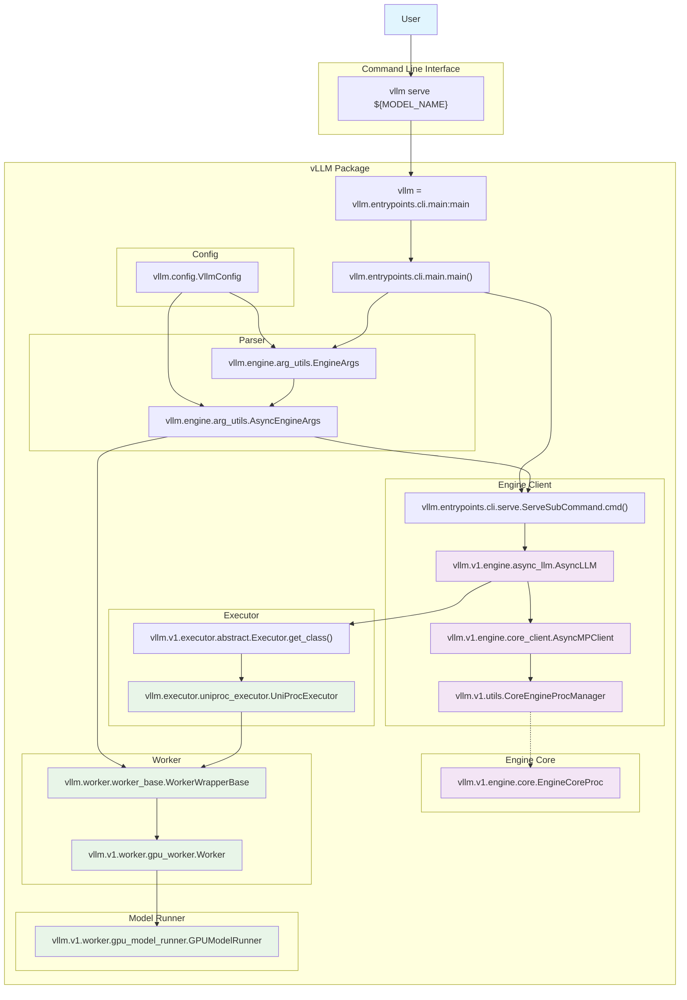

# Introduction


vLLM $\_[$[$\_{1}$](https://github.com/vllm-project/vllm)$\_,$[$\_{2}$](https://www.redhat.com/en/topics/ai/what-is-vllm)$\_]$ is a fast and easy-to-use library for LLM inference and serving.
Originally developed in the [Sky Computing Lab](https://sky.cs.berkeley.edu/) at UC Berkeley, vLLM has evolved into a community-driven project with contributions from both academia and industry. $\_[$[$\_{3}$](https://docs.vllm.ai/en/v0.9.0.1/)$\_]$


The rapid advancement of Large Language Models (LLMs) has brought efficient model serving and inference optimization to the forefront of MLOps concerns.
In response to these challenges, vLLM has emerged as a leading solution, garnering significant attention with 49.2k stars on GitHub as of June 9, 2025.
As demonstrated in the star history graph below, vLLM has established itself as the most prominent LLM serving framework among various competing solutions.

<a href="https://www.star-history.com/#deepspeedai/DeepSpeed-MII&huggingface/text-generation-inference&lm-sys/FastChat&vllm-project/vllm&bentoml/OpenLLM&InternLM/lmdeploy&NVIDIA/TensorRT-LLM&sgl-project/sglang&Date">
  
</a>

A particularly noteworthy aspect is the standardized API interface provided by OpenAI's GPT series.
With countless developers already building applications based on this API specification, ensuring compatibility has become crucial for any LLM serving solution.
This article provides a comprehensive analysis of vLLM's core technological foundations and examines the internal implementation processes that enable OpenAI-compatible server deployment when executing the `vllm serve` command.

<!-- More -->


This article is based on vLLM version `v0.9.0.1`.
Implementation details and API specifications may vary in newer versions.


---

# Theoretical Background

## PagedAttention


vLLM utilizes *PagedAttention*, our new attention algorithm that effectively manages attention keys and values.
vLLM equipped with *PagedAttention* redefines the new state of the art in LLM serving: it delivers up to 24x higher throughput than HuggingFace Transformers, without requiring any model architecture changes.



*PagedAttention* divides the request's KV cache into blocks, each of which can contain the attention keys and values of a fixed number of tokens.
In *PagedAttention*, the blocks for the KV cache are not necessarily stored in contiguous space.
Therefore, we can manage the KV cache in a more flexible way as in OS's virtual memory: one can think of blocks as pages, tokens as bytes, and requests as processes.


### Core Concepts and Motivation

*PagedAttention* represents one of the fundamental technological breakthroughs that distinguishes vLLM from other LLM serving frameworks.
This innovative approach addresses the critical memory management challenges inherent in large-scale language model deployment.

Traditional attention mechanisms in transformer models face significant memory inefficiencies when handling variable-length sequences.
The primary challenges include:

1. **Memory Fragmentation**: Pre-allocated contiguous memory blocks for maximum sequence length
2. **Inefficient Utilization**: Wasted memory when actual sequences are shorter than pre-allocated space
3. **Static Batching**: Limited flexibility in request batching and scheduling
4. **Poor Scalability**: Memory requirements grow quadratically with sequence length

### Virtual Memory Paradigm

*PagedAttention* revolutionizes memory management by implementing a virtual memory system inspired by operating system design principles.
The key innovation lies in treating attention computation similarly to how operating systems manage virtual memory:

- **Pages → Blocks**: Fixed-size memory blocks containing attention keys and values
- **Bytes → Tokens**: Individual tokens within each block
- **Processes → Requests**: Individual inference requests with their own virtual address spaces

### Technical Implementation

The conventional approach allocates contiguous memory blocks for each sequence, leading to substantial memory fragmentation and inefficient GPU utilization.
*PagedAttention* breaks this paradigm by:

- **Block-based Memory Management**: Dividing attention computation into fixed-size blocks
- **Dynamic Memory Allocation**: Enabling efficient memory reuse across different requests
- **Reduced Memory Fragmentation**: Minimizing wasted memory through intelligent block allocation
- **Copy-on-Write Semantics**: Sharing identical prefixes across multiple requests
- **Non-contiguous Storage**: Blocks can be stored anywhere in memory, linked through logical addressing

### Performance Benefits

*PagedAttention* delivers remarkable memory efficiency gains, typically achieving 2-4x improvement in memory utilization compared to traditional approaches, directly translating to higher throughput and reduced infrastructure costs. $\_[$[$\_{5}$](https://arxiv.org/pdf/2309.06180)$\_]$

The performance improvements stem from several key optimizations:

1. **Memory Efficiency**: Reduced memory footprint through dynamic allocation
2. **Throughput Enhancement**: Higher concurrent request handling capacity
3. **Latency Reduction**: Faster memory access patterns and reduced copying overhead
4. **Scalability**: Linear scaling with hardware resources rather than memory-bound limitations

### Comparative Analysis

| Aspect                   | Traditional Attention                     | *PagedAttention*                               |
| ------------------------ | ----------------------------------------- | ---------------------------------------------- |
| **Memory Allocation**    | Contiguous blocks per sequence            | Fixed-size blocks (non-contiguous)             |
| **Memory Utilization**   | Pre-allocated for max sequence length     | Dynamic allocation as needed                   |
| **Memory Fragmentation** | High fragmentation when sequences end     | Minimal fragmentation through block reuse      |
| **Prefix Sharing**       | Not supported                             | Efficient sharing of common prefixes           |
| **Batch Management**     | Static batching                           | Continuous batching with dynamic scheduling    |
| **Memory Efficiency**    | Baseline                                  | 2-4x improvement                               |
| **Throughput**           | Limited by memory constraints             | Up to 24x higher than HuggingFace Transformers |
| **GPU Utilization**      | Suboptimal due to fragmentation           | Optimized through intelligent block allocation |
| **Scalability**          | Limited by contiguous memory requirements | High scalability with virtual memory approach  |


Note: A comprehensive mathematical analysis of *PagedAttention*'s algorithmic foundations will be covered in an upcoming paper review post, where I'll dive deeper into the theoretical underpinnings and formal proofs of its efficiency guarantees.


## OpenAI-Compatible Server

The OpenAI API has become the de facto standard for LLM interactions, establishing a unified interface that countless applications and services depend upon. $\_[$[$\_{6}$](https://platform.openai.com/docs/api-reference/introduction)$\_]$
vLLM's OpenAI-compatible server implementation represents a critical bridge between high-performance serving capabilities and industry-standard API compatibility.

vLLM implements the essential OpenAI API endpoints with full compatibility:

| Endpoint               | HTTP Method | OpenAI Compatible | Description                           |
| ---------------------- | ----------- | ----------------- | ------------------------------------- |
| `/v1/models`           | `GET`       | ✅                | List available models                 |
| `/v1/completions`      | `POST`      | ✅                | Text completions for single prompts   |
| `/v1/chat/completions` | `POST`      | ✅                | Chat completions with message history |
| `/v1/embeddings`       | `POST`      | ✅                | Generate text embeddings              |
| `/health`              | `GET`       | ❌                | vLLM-specific health check            |
| `/tokenize`            | `POST`      | ❌                | vLLM-specific tokenization            |
| `/detokenize`          | `POST`      | ❌                | vLLM-specific detokenization          |
| `/metrics`             | `GET`       | ❌                | Prometheus-compatible metrics         |

## Hands-On

This section demonstrates how to deploy and interact with vLLM's OpenAI-compatible server in practice.
I'll walk through the installation process, server startup, and explore the automatically generated API documentation.

### Installation

vLLM can be installed with different backend configurations depending on your hardware setup $\_[$[$\_{7}$](https://docs.vllm.ai/en/v0.9.0.1/getting_started/installation/index.html)$\_]$:

```bash
# CPU-only installation
$ uv pip install vllm

# GPU installation with automatic PyTorch backend detection
$ uv pip install vllm --torch-backend=auto
```

### Server Deployment

Launch the vLLM server with a lightweight model for demonstration purposes $\_[$[$\_{8}$](https://docs.vllm.ai/en/v0.9.0.1/serving/openai_compatible_server.html)$\_]$:

```bash
$ vllm serve Qwen/Qwen3-0.6B --max-model-len 8192
...
INFO 06-09 23:16:17 [api_server.py:1336] Starting vLLM API server on http://0.0.0.0:8000
INFO 06-09 23:16:17 [launcher.py:28] Available routes are:
INFO 06-09 23:16:17 [launcher.py:36] Route: /openapi.json, Methods: GET, v0.9.0.1
INFO 06-09 23:16:17 [launcher.py:36] Route: /docs, Methods: GET, v0.9.0.1
INFO 06-09 23:16:17 [launcher.py:36] Route: /docs/oauth2-redirect, Methods: GET, v0.9.0.1
INFO 06-09 23:16:17 [launcher.py:36] Route: /redoc, Methods: GET, v0.9.0.1
INFO 06-09 23:16:17 [launcher.py:36] Route: /health, Methods: GET
INFO 06-09 23:16:17 [launcher.py:36] Route: /load, Methods: GET
INFO 06-09 23:16:17 [launcher.py:36] Route: /ping, Methods: POST
INFO 06-09 23:16:17 [launcher.py:36] Route: /ping, Methods: GET
INFO 06-09 23:16:17 [launcher.py:36] Route: /tokenize, Methods: POST
INFO 06-09 23:16:17 [launcher.py:36] Route: /detokenize, Methods: POST
INFO 06-09 23:16:17 [launcher.py:36] Route: /v1/models, Methods: GET
INFO 06-09 23:16:17 [launcher.py:36] Route: /version, Methods: GET
INFO 06-09 23:16:17 [launcher.py:36] Route: /v1/chat/completions, Methods: POST
INFO 06-09 23:16:17 [launcher.py:36] Route: /v1/completions, Methods: POST
INFO 06-09 23:16:17 [launcher.py:36] Route: /v1/embeddings, Methods: POST
INFO 06-09 23:16:17 [launcher.py:36] Route: /pooling, Methods: POST
INFO 06-09 23:16:17 [launcher.py:36] Route: /classify, Methods: POST
INFO 06-09 23:16:17 [launcher.py:36] Route: /score, Methods: POST
INFO 06-09 23:16:17 [launcher.py:36] Route: /v1/score, Methods: POST
INFO 06-09 23:16:17 [launcher.py:36] Route: /v1/audio/transcriptions, Methods: POST
INFO 06-09 23:16:17 [launcher.py:36] Route: /rerank, Methods: POST
INFO 06-09 23:16:17 [launcher.py:36] Route: /v1/rerank, Methods: POST
INFO 06-09 23:16:17 [launcher.py:36] Route: /v2/rerank, Methods: POST
INFO 06-09 23:16:17 [launcher.py:36] Route: /invocations, Methods: POST
INFO 06-09 23:16:17 [launcher.py:36] Route: /metrics, Methods: GET
INFO:     Started server process [16355]
INFO:     Waiting for application startup.
INFO:     Application startup complete.
```

### Interactive API Documentation

vLLM automatically generates interactive API documentation accessible via Swagger UI:


The Swagger interface provides:

- **Interactive Testing**: Direct API endpoint testing from the browser
- **Schema Documentation**: Complete request/response schema definitions
- **Parameter Validation**: Real-time parameter validation and examples
- **Authentication Setup**: Easy API key configuration for testing

### Practical API Usage Examples

Once the server is running, you can interact with it using standard OpenAI-compatible clients:

```python
>>> import openai
>>> client = openai.OpenAI(base_url="http://localhost:8000/v1")
>>> client.models.list()
SyncPage[Model](data=[Model(id='Qwen/Qwen3-0.6B', created=1749651810, object='model', owned_by='vllm', root='Qwen/Qwen3-0.6B', parent=None, max_model_len=8192, permission=[{'id': 'modelperm-8bc1b4000ad84fac81f2de0addc81ef6', 'object': 'model_permission', 'created': 1749651810, 'allow_create_engine': False, 'allow_sampling': True, 'allow_logprobs': True, 'allow_search_indices': False, 'allow_view': True, 'allow_fine_tuning': False, 'organization': '*', 'group': None, 'is_blocking': False}])], object='list')
>>> client.chat.completions.create(model="Qwen/Qwen3-0.6B", messages=[{"role": "user", "content": "Hello, vLLM!"}])
ChatCompletion(id='chatcmpl-d4ecd72df87c4b13a8b9d47ddcb75ccc', choices=[Choice(finish_reason='stop', index=0, logprobs=None, message=ChatCompletionMessage(content='<think>\nOkay, the user just said "Hello, vLLM!" so I need to respond in a friendly and helpful way. Let me start by acknowledging their greeting. Maybe say something like "Hello! How can I assist you today?" to show I\'m here to help. I should keep the tone positive and open-ended so they can ask more questions. Let me check if there\'s anything else they might need, like setup instructions or support. I\'ll make sure to offer assistance in both technical and general ways. Alright, that should cover it.\n</think>\n\nHello! How can I assist you today? 😊', refusal=None, role='assistant', annotations=None, audio=None, function_call=None, tool_calls=[], reasoning_content=None), stop_reason=None)], created=1749651812, model='Qwen/Qwen3-0.6B', object='chat.completion', service_tier=None, system_fingerprint=None, usage=CompletionUsage(completion_tokens=126, prompt_tokens=14, total_tokens=140, completion_tokens_details=None, prompt_tokens_details=None), prompt_logprobs=None, kv_transfer_params=None)
```

### Monitoring and Metrics

vLLM supports Prometheus-based metrics collection through the `/metrics` endpoint. $\_[$[$\_{9}$](https://docs.vllm.ai/en/v0.9.0.1/usage/metrics.html)$\_,$[$\_{10}$](https://docs.vllm.ai/en/v0.9.0.1/design/v1/metrics.html)$\_]$
This enables real-time monitoring through Grafana dashboards. $\_[$[$\_{11}$](https://docs.vllm.ai/en/v0.9.0.1/examples/online_serving/prometheus_grafana.html)$\_,$[$\_{12}$](https://github.com/vllm-project/vllm/blob/v0.9.0.1/examples/online_serving/prometheus_grafana/grafana.json)$\_]$

```bash
$ curl http://localhost:8000/metrics
# HELP vllm:num_preemptions_total Cumulative number of preemption from the engine.
# TYPE vllm:num_preemptions_total counter
vllm:num_preemptions_total{model_name="Qwen/Qwen3-0.6B"} 0.0
# HELP vllm:prompt_tokens_total Number of prefill tokens processed.
# TYPE vllm:prompt_tokens_total counter
vllm:prompt_tokens_total{model_name="Qwen/Qwen3-0.6B"} 28.0
...
```


---

# Server Initialization

This section reviews the entire process from when a user starts an OpenAI-compatible server through `vllm serve` until the server reaches its ready state.

## CLI

When the `vllm serve` command is executed in the terminal, it runs the `main()` function from `vllm/entrypoints/cli/main.py` through the `vllm` command defined in the `project.scripts` section of `pyproject.toml`.

```toml pyproject.toml https://github.com/vllm-project/vllm/blob/v0.9.0.1/pyproject.toml#L42-L43
...
[project.scripts]
vllm = "vllm.entrypoints.cli.main:main"
...
```

Subsequently, the `main()` function recognizes the `serve` command through the `subparser` and executes the `dispatch_function`, which is the `ServeSubcommand.cmd()` function.

```python vllm/entrypoints/cli/main.py https://github.com/vllm-project/vllm/blob/v0.9.0.1/vllm/entrypoints/cli/main.py#L32-L58
...
def main():
    cli_env_setup()

    parser = FlexibleArgumentParser(
        description="vLLM CLI",
        epilog=VLLM_SERVE_PARSER_EPILOG,
    )
    parser.add_argument('-v',
                        '--version',
                        action='version',
                        version=vllm.version.__version__)
    subparsers = parser.add_subparsers(required=False, dest="subparser")
    cmds = {}
    for cmd_module in CMD_MODULES:
        new_cmds = cmd_module.cmd_init()
        for cmd in new_cmds:
            cmd.subparser_init(subparsers).set_defaults(
                dispatch_function=cmd.cmd)
            cmds[cmd.name] = cmd
    args = parser.parse_args()
    if args.subparser in cmds:
        cmds[args.subparser].validate(args)

    if hasattr(args, "dispatch_function"):
        args.dispatch_function(args)
    else:
        parser.print_help()
...
```

The user-specified `args` are then passed to the `run_server()` function, and the OpenAI-compatible server begins operation through the `uvloop.run()` function.

```python vllm/entrypoints/cli/serve.py https://github.com/vllm-project/vllm/blob/v0.9.0.1/vllm/entrypoints/cli/serve.py#L33-L42
...
class ServeSubcommand(CLISubcommand):
...
    @staticmethod
    def cmd(args: argparse.Namespace) -> None:
        # If model is specified in CLI (as positional arg), it takes precedence
        if hasattr(args, 'model_tag') and args.model_tag is not None:
            args.model = args.model_tag

        if args.v0.9.0.1less:
            run_v0.9.0.1less(args)
        else:
            uvloop.run(run_server(args))
...
```

## Engine

### Client

For resource lifecycle management, the `engine_client` is created with `async with`.

```python vllm/entrypoints/openai/api_server.py https://github.com/vllm-project/vllm/blob/v0.9.0.1/vllm/entrypoints/openai/api_server.py#L1324-L1325
...
async def run_server(args, **uvicorn_kwargs) -> None:
...
    async with build_async_engine_client(args) as engine_client:
        app = build_app(args)
...
```

Based on the user-configured `args`, it determines whether to use the V0 engine or V1 engine and provides the created engine.

```python vllm/entrypoints/openai/api_server.py https://github.com/vllm-project/vllm/blob/v0.9.0.1/vllm/entrypoints/openai/api_server.py#L145-L155
...
@asynccontextmanager
async def build_async_engine_client(
        args: Namespace) -> AsyncIterator[EngineClient]:

    # Context manager to handle engine_client lifecycle
    # Ensures everything is shutdown and cleaned up on error/exit
    engine_args = AsyncEngineArgs.from_cli_args(args)

    async with build_async_engine_client_from_engine_args(
            engine_args, args.disable_frontend_multiprocessing) as engine:
        yield engine
...
```

```python vllm/entrypoints/openai/api_server.py https://github.com/vllm-project/vllm/blob/v0.9.0.1/vllm/entrypoints/openai/api_server.py#L158-L197
...
@asynccontextmanager
async def build_async_engine_client_from_engine_args(
    engine_args: AsyncEngineArgs,
    disable_frontend_multiprocessing: bool = False,
) -> AsyncIterator[EngineClient]:
    """
    Create EngineClient, either:
        - in-process using the AsyncLLMEngine Directly
        - multiprocess using AsyncLLMEngine RPC

    Returns the Client or None if the creation failed.
    """

    # Create the EngineConfig (determines if we can use V1).
    usage_context = UsageContext.OPENAI_API_SERVER
    vllm_config = engine_args.create_engine_config(usage_context=usage_context)

    # V1 AsyncLLM.
    if envs.VLLM_USE_V1:
        if disable_frontend_multiprocessing:
            logger.warning(
                "V1 is enabled, but got --disable-frontend-multiprocessing. "
                "To disable frontend multiprocessing, set VLLM_USE_V1=0.")

        from vllm.v1.engine.async_llm import AsyncLLM
        async_llm: Optional[AsyncLLM] = None
        try:
            async_llm = AsyncLLM.from_vllm_config(
                vllm_config=vllm_config,
                usage_context=usage_context,
                disable_log_requests=engine_args.disable_log_requests,
                disable_log_stats=engine_args.disable_log_stats)

            # Don't keep the dummy data in memory
            await async_llm.reset_mm_cache()

            yield async_llm
        finally:
            if async_llm:
                async_llm.shutdown()
...
```

During this process, an `AsyncMPClient` is created to manage and communicate with the core engine.

```python vllm/v1/engine/async_llm.py https://github.com/vllm-project/vllm/blob/v0.9.0.1/vllm/v1/engine/async_llm.py#L118-L121
...
class AsyncLLM(EngineClient):
...
    def __init__(
        self,
        vllm_config: VllmConfig,
        executor_class: type[Executor],
        log_stats: bool,
        usage_context: UsageContext = UsageContext.ENGINE_CONTEXT,
        mm_registry: MultiModalRegistry = MULTIMODAL_REGISTRY,
        use_cached_outputs: bool = False,
        log_requests: bool = True,
        start_engine_loop: bool = True,
        stat_loggers: Optional[list[StatLoggerFactory]] = None,
    ) -> None:
...
        # EngineCore (starts the engine in background process).
        core_client_class = AsyncMPClient if (
            vllm_config.parallel_config.data_parallel_size
            == 1) else DPAsyncMPClient

        self.engine_core = core_client_class(
            vllm_config=vllm_config,
            executor_class=executor_class,
            log_stats=self.log_stats,
        )
...
```

```python vllm/v1/engine/core_client.py https://github.com/vllm-project/vllm/blob/v0.9.0.1/vllm/v1/engine/core_client.py#L729-L739
...
class AsyncMPClient(MPClient):
    """Asyncio-compatible client for multi-proc EngineCore."""

    def __init__(self, vllm_config: VllmConfig, executor_class: type[Executor],
                 log_stats: bool):
        super().__init__(
            asyncio_mode=True,
            vllm_config=vllm_config,
            executor_class=executor_class,
            log_stats=log_stats,
        )
...
```

```python vllm/v1/engine/core_client.py https://github.com/vllm-project/vllm/blob/v0.9.0.1/vllm/v1/engine/core_client.py#L400-L413
...
class MPClient(EngineCoreClient):
...
    def __init__(
        self,
        asyncio_mode: bool,
        vllm_config: VllmConfig,
        executor_class: type[Executor],
        log_stats: bool,
    ):
...
            # Start local engines.
            if local_engine_count:
                # In server mode, start_index and local_start_index will
                # both be 0.
                self.resources.local_engine_manager = CoreEngineProcManager(
                    EngineCoreProc.run_engine_core,
                    vllm_config=vllm_config,
                    executor_class=executor_class,
                    log_stats=log_stats,
                    input_address=input_address,
                    on_v0.9.0.1_node=True,
                    local_engine_count=local_engine_count,
                    start_index=start_index,
                    local_start_index=local_start_index)
...
```

The `AsyncMPClient` manages the core engine process through `CoreEngineProcManager` and communicates using ZMQ IPC socket.
The actual core engine runs as a separate background process for improved isolation and performance.

### Core

The core engine is created as a background process as shown below.
I will examine its detailed operation in the next article.

```python vllm/v1/engine/core.py https://github.com/vllm-project/vllm/blob/v0.9.0.1/vllm/v1/engine/core.py#L456-L507
...
class EngineCoreProc(EngineCore):
    """ZMQ-wrapper for running EngineCore in background process."""
...
    @staticmethod
    def run_engine_core(*args,
                        dp_rank: int = 0,
                        local_dp_rank: int = 0,
                        **kwargs):
        """Launch EngineCore busy loop in background process."""
...
        engine_core: Optional[EngineCoreProc] = None
        try:
            parallel_config: ParallelConfig = kwargs[
                "vllm_config"].parallel_config
            if parallel_config.data_parallel_size > 1 or dp_rank > 0:
                # Set data parallel rank for this engine process.
                parallel_config.data_parallel_rank = dp_rank
                parallel_config.data_parallel_rank_local = local_dp_rank
                engine_core = DPEngineCoreProc(*args, **kwargs)
            else:
                engine_core = EngineCoreProc(*args, **kwargs)
...
```

## Executor

During engine creation, the executor is appropriately configured based on the conditions provided by the user.

```python vllm/v1/engine/async_llm.py https://github.com/vllm-project/vllm/blob/v0.9.0.1/vllm/v1/engine/async_llm.py#L139-L165
...
class AsyncLLM(EngineClient):
...
    @classmethod
    def from_vllm_config(
        cls,
        vllm_config: VllmConfig,
        start_engine_loop: bool = True,
        usage_context: UsageContext = UsageContext.ENGINE_CONTEXT,
        stat_loggers: Optional[list[StatLoggerFactory]] = None,
        disable_log_requests: bool = False,
        disable_log_stats: bool = False,
    ) -> "AsyncLLM":
...
        # Create the LLMEngine.
        return cls(
            vllm_config=vllm_config,
            executor_class=Executor.get_class(vllm_config),
            start_engine_loop=start_engine_loop,
            stat_loggers=stat_loggers,
            log_requests=not disable_log_requests,
            log_stats=not disable_log_stats,
            usage_context=usage_context,
        )
...
```

At this time, the executor to be used is determined through the `Executor.get_class()` function.

```python vllm/v1/executor/abstract.py https://github.com/vllm-project/vllm/blob/v0.9.0.1/vllm/v1/executor/abstract.py#L21-L55
...
class Executor(ExecutorBase):
    """
    Abstract class for v1 executors, mainly define some methods for v1.
    For methods shared by v0 and v1, define them in ExecutorBase"""

    @staticmethod
    def get_class(vllm_config: VllmConfig) -> type["Executor"]:
        executor_class: type[Executor]
        parallel_config = vllm_config.parallel_config
        distributed_executor_backend = (
            parallel_config.distributed_executor_backend)
        # distributed_executor_backend must be set in VllmConfig.__post_init__
        if isinstance(distributed_executor_backend, type):
            if not issubclass(distributed_executor_backend, ExecutorBase):
                raise TypeError(
                    "distributed_executor_backend must be a subclass of "
                    f"ExecutorBase. Got {distributed_executor_backend}.")
            executor_class = distributed_executor_backend
        elif distributed_executor_backend == "ray":
            from vllm.v1.executor.ray_distributed_executor import (  # noqa
                RayDistributedExecutor)
            executor_class = RayDistributedExecutor
        elif distributed_executor_backend == "mp":
            from vllm.v1.executor.multiproc_executor import MultiprocExecutor
            executor_class = MultiprocExecutor
        elif distributed_executor_backend == "uni":
            executor_class = UniProcExecutor
        elif distributed_executor_backend == "external_launcher":
            # TODO: make v1 scheduling deterministic
            # to support external launcher
            executor_class = ExecutorWithExternalLauncher
        else:
            raise ValueError("Unknown distributed executor backend: "
                             f"{distributed_executor_backend}")
        return executor_class
...
```

The executor configuration is accomplished through the following process.

The system automatically selects the appropriate distributed backend based on the hardware configuration and execution environment.
Key decision factors include:

1. **Single Node vs Multi-Node**: Determines whether to use multiprocessing (`mp`) or Ray (`ray`) backend
2. **GPU Availability**: Checks CUDA device count against world size requirements
3. **Ray Environment**: Detects existing Ray initialization and placement groups
4. **Platform-Specific**: Special handling for Neuron devices using unified process (`uni`) backend

The configuration logic ensures optimal resource utilization while maintaining compatibility across different deployment scenarios.

```python vllm/config.py https://github.com/vllm-project/vllm/blob/v0.9.0.1/vllm/config.py#L1847-L1879
...
@config
@dataclass
class ParallelConfig:
...
    def __post_init__(self) -> None:
...
        if self.distributed_executor_backend is None and self.world_size > 1:
            # We use multiprocessing by default if world_size fits on the
            # current node and we aren't in a ray placement group.

            from vllm.executor import ray_utils
            backend: DistributedExecutorBackend = "mp"
            ray_found = ray_utils.ray_is_available()
            if current_platform.is_neuron():
                # neuron uses single process to control multiple devices
                backend = "uni"
            elif (current_platform.is_cuda()
                  and cuda_device_count_stateless() < self.world_size):
                if not ray_found:
                    raise ValueError("Unable to load Ray which is "
                                     "required for multi-node inference, "
                                     "please install Ray with `pip install "
                                     "ray`.") from ray_utils.ray_import_err
                backend = "ray"
            elif ray_found:
                if self.placement_group:
                    backend = "ray"
                else:
                    from ray import is_initialized as ray_is_initialized
                    if ray_is_initialized():
                        from ray.util import get_current_placement_group
                        if get_current_placement_group():
                            backend = "ray"
            self.distributed_executor_backend = backend
            logger.info("Defaulting to use %s for distributed inference",
                        backend)

        if self.distributed_executor_backend is None and self.world_size == 1:
            self.distributed_executor_backend = "uni"
...
```

In this article, I will not consider tensor parallel plus pipeline parallel inference $\_[$[$\_{13}$](https://docs.vllm.ai/en/v0.9.0.1/serving/distributed_serving.html)$\_,$[$\_{14}$](https://arxiv.org/pdf/1909.08053)$\_]$.
Therefore, I'll analyze the `UniProcExecutor`.

The `UniProcExecutor` is designed for single-process execution scenarios where all model computation happens within a single process. This is the default choice for single-GPU deployments or when distributed execution is not required.

Key characteristics of `UniProcExecutor`:

- **Single Process**: All computation occurs within one process
- **Direct Communication**: No inter-process communication overhead
- **Simplified Architecture**: Straightforward execution path without distributed coordination
- **Resource Efficiency**: Minimal overhead for single-device scenarios

The `_init_executor()` method initializes the worker and sets up the execution environment. The `rpc_rank` parameter represents the rank of the worker in the executor context, which is typically 0 for single-process execution.

```python vllm/executor/uniproc_executor.py https://github.com/vllm-project/vllm/blob/v0.9.0.1/vllm/executor/uniproc_executor.py#L19-L57
...
class UniProcExecutor(ExecutorBase):

    uses_ray: bool = False

    def _init_executor(self) -> None:
        """Initialize the worker and load the model.
        """
        self.driver_worker = WorkerWrapperBase(vllm_config=self.vllm_config,
                                               rpc_rank=0)
        distributed_init_method = get_distributed_init_method(
            get_ip(), get_open_port())
        local_rank = 0
        # set local rank as the device index if specified
        device_info = self.vllm_config.device_config.device.__str__().split(
            ":")
        if len(device_info) > 1:
            local_rank = int(device_info[1])
        rank = 0
        is_driver_worker = True
        kwargs = dict(
            vllm_config=self.vllm_config,
            local_rank=local_rank,
            rank=rank,
            distributed_init_method=distributed_init_method,
            is_driver_worker=is_driver_worker,
        )
        self.collective_rpc("init_worker", args=([kwargs], ))
        self.collective_rpc("init_device")
        self.collective_rpc("load_model")

    def collective_rpc(self,
                       method: Union[str, Callable],
                       timeout: Optional[float] = None,
                       args: Tuple = (),
                       kwargs: Optional[Dict] = None) -> List[Any]:
        if kwargs is None:
            kwargs = {}
        answer = run_method(self.driver_worker, method, args, kwargs)
        return [answer]
...
```

## Worker

The `UniProcExecutor.driver_worker` is defined as the `WorkerWrapperBase` class as shown below, and the `WorkerWrapperBase` operates through the `collective_rpc` method of `UniProcExecutor`.

```python vllm/worker/worker_base.py https://github.com/vllm-project/vllm/blob/v0.9.0.1/vllm/worker/worker_base.py#L486-L522
...
class WorkerWrapperBase:
    """
    This class represents one process in an executor/engine. It is responsible
    for lazily initializing the worker and handling the worker's lifecycle.
    We first instantiate the WorkerWrapper, which remembers the worker module
    and class name. Then, when we call `update_environment_variables`, and the
    real initialization happens in `init_worker`.
    """

    def __init__(
        self,
        vllm_config: VllmConfig,
        rpc_rank: int = 0,
    ) -> None:
        """
        Initialize the worker wrapper with the given vllm_config and rpc_rank.
        Note: rpc_rank is the rank of the worker in the executor. In most cases,
        it is also the rank of the worker in the distributed group. However,
        when multiple executors work together, they can be different.
        e.g. in the case of SPMD-style offline inference with TP=2,
        users can launch 2 engines/executors, each with only 1 worker.
        All workers have rpc_rank=0, but they have different ranks in the TP
        group.
        """
        self.rpc_rank = rpc_rank
        self.worker: Optional[WorkerBase] = None
        # do not store this `vllm_config`, `init_worker` will set the final
        # one. TODO: investigate if we can remove this field in
        # `WorkerWrapperBase`, `init_cached_hf_modules` should be
        # unnecessary now.
        if vllm_config.model_config is not None:
            # it can be None in tests
            trust_remote_code = vllm_config.model_config.trust_remote_code
            if trust_remote_code:
                # note: lazy import to avoid importing torch before initializing
                from vllm.utils import init_cached_hf_modules
                init_cached_hf_modules()
...
```

The `WorkerWrapperBase.worker` is initialized by the `UniProcExecutor.collective_rpc("init_worker", args=([kwargs], ))` call executed in the `UniProcExecutor._init_executor()` method.

```python vllm/worker/worker_base.py https://github.com/vllm-project/vllm/blob/v0.9.0.1/vllm/worker/worker_base.py#L543-L595
...
class WorkerWrapperBase:
...
    def init_worker(self, all_kwargs: List[Dict[str, Any]]) -> None:
        """
        Here we inject some common logic before initializing the worker.
        Arguments are passed to the worker class constructor.
        """
        kwargs = all_kwargs[self.rpc_rank]
        self.vllm_config = kwargs.get("vllm_config", None)
...
        if isinstance(self.vllm_config.parallel_config.worker_cls, str):
            worker_class = resolve_obj_by_qualname(
                self.vllm_config.parallel_config.worker_cls)
...
        with set_current_vllm_config(self.vllm_config):
            # To make vLLM config available during worker initialization
            self.worker = worker_class(**kwargs)
            assert self.worker is not None
...
```

The worker to be used varies depending on the execution environment and configuration.
In CUDA environments, it is configured as follows.
For the V1 engine, `vllm.v1.worker.gpu_worker.Worker` is used.

```python vllm/platforms/cuda.py https://github.com/vllm-project/vllm/blob/v0.9.0.1/vllm/platforms/cuda.py#L102-L133
...
class CudaPlatformBase(Platform):
    _enum = PlatformEnum.CUDA
    device_name: str = "cuda"
    device_type: str = "cuda"
    dispatch_key: str = "CUDA"
    ray_device_key: str = "GPU"
    device_control_env_var: str = "CUDA_VISIBLE_DEVICES"
...
    @classmethod
    def check_and_update_config(cls, vllm_config: "VllmConfig") -> None:
        parallel_config = vllm_config.parallel_config
        scheduler_config = vllm_config.scheduler_config
        compilation_config = vllm_config.compilation_config
        model_config = vllm_config.model_config

        if parallel_config.worker_cls == "auto":
            if scheduler_config.is_multi_step:
                if envs.VLLM_USE_V1:
                    raise NotImplementedError(
                        "Multi-step scheduling is not supported (and not "
                        "needed) on vLLM V1. Please launch without "
                        "--num-scheduler-steps.")
                else:
                    parallel_config.worker_cls = \
                        "vllm.worker.multi_step_worker.MultiStepWorker"
            elif vllm_config.speculative_config:
                if envs.VLLM_USE_V1:
                    parallel_config.worker_cls = \
                            "vllm.v1.worker.gpu_worker.Worker"
                else:
                    parallel_config.worker_cls = \
                        "vllm.spec_decode.spec_decode_worker.create_spec_worker"
                    parallel_config.sd_worker_cls = \
                        "vllm.worker.worker.Worker"
            else:
                if envs.VLLM_USE_V1:
                    parallel_config.worker_cls = \
                            "vllm.v1.worker.gpu_worker.Worker"
                else:
                    parallel_config.worker_cls = "vllm.worker.worker.Worker"
...
```

```python vllm/v1/worker/gpu_worker.py https://github.com/vllm-project/vllm/blob/v0.9.0.1/vllm/v1/worker/gpu_worker.py#L38-L53
class Worker(WorkerBase):

    def __init__(
        self,
        vllm_config: VllmConfig,
        local_rank: int,
        rank: int,
        distributed_init_method: str,
        is_driver_worker: bool = False,
    ):

        super().__init__(vllm_config=vllm_config,
                         local_rank=local_rank,
                         rank=rank,
                         distributed_init_method=distributed_init_method,
                         is_driver_worker=is_driver_worker)
```

After worker creation, the device is initialized as shown below through `UniProcExecutor.collective_rpc("init_device")`. (The following is based on CUDA environment worker)

```python vllm/v1/worker/gpu_worker.py https://github.com/vllm-project/vllm/blob/v0.9.0.1/vllm/v1/worker/gpu_worker.py#L114-L149
...
class Worker(WorkerBase):
...
    def init_device(self):
        if self.device_config.device.type == "cuda":
            # torch.distributed.all_reduce does not free the input tensor until
            # the synchronization point. This causes the memory usage to grow
            # as the number of all_reduce calls increases. This env var disables
            # this behavior.
            # Related issue:
            # https://discuss.pytorch.org/t/cuda-allocation-lifetime-for-inputs-to-distributed-all-reduce/191573
            os.environ["TORCH_NCCL_AVOID_RECORD_STREAMS"] = "1"

            # This env var set by Ray causes exceptions with graph building.
            os.environ.pop("NCCL_ASYNC_ERROR_HANDLING", None)
            self.device = torch.device(f"cuda:{self.local_rank}")
            torch.cuda.set_device(self.device)

            _check_if_gpu_supports_dtype(self.model_config.dtype)
            gc.collect()
            torch.cuda.empty_cache()
            self.init_gpu_memory = torch.cuda.mem_get_info()[0]
        else:
            raise RuntimeError(
                f"Not support device type: {self.device_config.device}")
        # Initialize the distributed environment.
        init_worker_distributed_environment(self.vllm_config, self.rank,
                                            self.distributed_init_method,
                                            self.local_rank)
        # Set random seed.
        set_random_seed(self.model_config.seed)

        # Construct the model runner
        self.model_runner: GPUModelRunner = GPUModelRunner(
            self.vllm_config, self.device)

        if self.rank == 0:
            # If usage stat is enabled, collect relevant info.
            report_usage_stats(self.vllm_config)
...
```

During the above process, `Worker.model_runner` is created.

## Model Runner

Once the device is ready, the model is loaded through `UniProcExecutor.collective_rpc("load_model")`, and the model is loaded through the model runner.

```python vllm/v1/worker/gpu_worker.py https://github.com/vllm-project/vllm/blob/v0.9.0.1/vllm/v1/worker/gpu_worker.py#L153-L164
...
class Worker(WorkerBase):
...
    def load_model(self) -> None:
        if self.vllm_config.model_config.enable_sleep_mode:
            allocator = CuMemAllocator.get_instance()
            assert allocator.get_current_usage() == 0, (
                "Sleep mode can only be "
                "used for one instance per process.")
            context = allocator.use_memory_pool(tag="weights")
        else:
            from contextlib import nullcontext
            context = nullcontext()
        with context:
            self.model_runner.load_model()
...
```

The `GPUModelRunner` downloads and loads the model through the `get_model()` function.

```python vllm/v1/worker/gpu_model_runner.py https://github.com/vllm-project/vllm/blob/v0.9.0.1/vllm/v1/worker/gpu_model_runner.py#L1530-L1552
...
class GPUModelRunner(LoRAModelRunnerMixin):
...
    def load_model(self) -> None:
        logger.info("Starting to load model %s...", self.model_config.model)
        with DeviceMemoryProfiler() as m:  # noqa: SIM117
            time_before_load = time.perf_counter()
            self.model = get_model(vllm_config=self.vllm_config)
            if self.lora_config:
                self.model = self.load_lora_model(self.model,
                                                  self.model_config,
                                                  self.scheduler_config,
                                                  self.lora_config,
                                                  self.device)
...
```

The `get_model()` function determines the loader based on the user-provided config and returns it in the form of `torch.nn.Module`.

```python vllm/model_executor/model_loader/__init__.py https://github.com/vllm-project/vllm/blob/v0.9.0.1/vllm/model_executor/model_loader/__init__.py#L23-L59
...
def get_model_loader(load_config: LoadConfig) -> BaseModelLoader:
    """Get a model loader based on the load format."""
    if isinstance(load_config.load_format, type):
        return load_config.load_format(load_config)

    if load_config.load_format == LoadFormat.DUMMY:
        return DummyModelLoader(load_config)

    if load_config.load_format == LoadFormat.TENSORIZER:
        return TensorizerLoader(load_config)

    if load_config.load_format == LoadFormat.SHARDED_STATE:
        return ShardedStateLoader(load_config)

    if load_config.load_format == LoadFormat.BITSANDBYTES:
        return BitsAndBytesModelLoader(load_config)

    if load_config.load_format == LoadFormat.GGUF:
        return GGUFModelLoader(load_config)

    if load_config.load_format == LoadFormat.RUNAI_STREAMER:
        return RunaiModelStreamerLoader(load_config)

    if load_config.load_format == LoadFormat.RUNAI_STREAMER_SHARDED:
        return ShardedStateLoader(load_config, runai_model_streamer=True)

    return DefaultModelLoader(load_config)


def get_model(*,
              vllm_config: VllmConfig,
              model_config: Optional[ModelConfig] = None) -> nn.Module:
    loader = get_model_loader(vllm_config.load_config)
    if model_config is None:
        model_config = vllm_config.model_config
    return loader.load_model(vllm_config=vllm_config,
                             model_config=model_config)
...
```

Now the engine, worker, executor, and model runner are all ready.

## FastAPI

A `FastAPI` instance (`app`) is created through the `build_app()` function, setting up the server's router, middleware, and exception handlers.

```python vllm/entrypoints/openai/api_server.py https://github.com/vllm-project/vllm/blob/v0.9.0.1/vllm/entrypoints/openai/api_server.py#L1324-L1356
...
async def run_server(args, **uvicorn_kwargs) -> None:
...
    async with build_async_engine_client(args) as engine_client:
        app = build_app(args)

        vllm_config = await engine_client.get_vllm_config()
        await init_app_state(engine_client, vllm_config, app.state, args)

        def _listen_addr(a: str) -> str:
            if is_valid_ipv6_address(a):
                return '[' + a + ']'
            return a or "0.0.0.0"

        is_ssl = args.ssl_keyfile and args.ssl_certfile
        logger.info("Starting vLLM API server on http%s://%s:%d",
                    "s" if is_ssl else "", _listen_addr(sock_addr[0]),
                    sock_addr[1])

        shutdown_task = await serve_http(
            app,
            sock=sock,
            enable_ssl_refresh=args.enable_ssl_refresh,
            host=args.host,
            port=args.port,
            log_level=args.uvicorn_log_level,
            # NOTE: When the 'disable_uvicorn_access_log' value is True,
            # no access log will be output.
            access_log=not args.disable_uvicorn_access_log,
            timeout_keep_alive=TIMEOUT_KEEP_ALIVE,
            ssl_keyfile=args.ssl_keyfile,
            ssl_certfile=args.ssl_certfile,
            ssl_ca_certs=args.ssl_ca_certs,
            ssl_cert_reqs=args.ssl_cert_reqs,
            **uvicorn_kwargs,
        )
...
```

```python vllm/entrypoints/openai/api_server.py https://github.com/vllm-project/vllm/blob/v0.9.0.1/vllm/entrypoints/openai/api_server.py#L1037-L1045
...
def build_app(args: Namespace) -> FastAPI:
...
    app.include_router(router)
...
```

Here, the `router` is set up as follows:

```python vllm/entrypoints/openai/api_server.py https://github.com/vllm-project/vllm/blob/v0.9.0.1/vllm/entrypoints/openai/api_server.py#L413-L1034
router = APIRouter()
...
@router.get("/health", response_class=Response)
async def health(raw_request: Request) -> Response:
...
@router.get("/load")
async def get_server_load_metrics(request: Request):
...
@router.get("/ping", response_class=Response)
@router.post("/ping", response_class=Response)
async def ping(raw_request: Request) -> Response:
...
@router.post("/tokenize",
             dependencies=[Depends(validate_json_request)],
             responses={
                 HTTPStatus.BAD_REQUEST.value: {
                     "model": ErrorResponse
                 },
                 HTTPStatus.NOT_FOUND.value: {
                     "model": ErrorResponse
                 },
                 HTTPStatus.INTERNAL_SERVER_ERROR.value: {
                     "model": ErrorResponse
                 },
                 HTTPStatus.NOT_IMPLEMENTED.value: {
                     "model": ErrorResponse
                 },
             })
@with_cancellation
async def tokenize(request: TokenizeRequest, raw_request: Request):
...
@router.post("/detokenize",
             dependencies=[Depends(validate_json_request)],
             responses={
                 HTTPStatus.BAD_REQUEST.value: {
                     "model": ErrorResponse
                 },
                 HTTPStatus.NOT_FOUND.value: {
                     "model": ErrorResponse
                 },
                 HTTPStatus.INTERNAL_SERVER_ERROR.value: {
                     "model": ErrorResponse
                 },
             })
@with_cancellation
async def detokenize(request: DetokenizeRequest, raw_request: Request):
...
@router.get("/v1/models")
async def show_available_models(raw_request: Request):
...
@router.get("/version")
async def show_version():
...
@router.post("/v1/chat/completions",
             dependencies=[Depends(validate_json_request)],
             responses={
                 HTTPStatus.OK.value: {
                     "content": {
                         "text/event-stream": {}
                     }
                 },
                 HTTPStatus.BAD_REQUEST.value: {
                     "model": ErrorResponse
                 },
                 HTTPStatus.NOT_FOUND.value: {
                     "model": ErrorResponse
                 },
                 HTTPStatus.INTERNAL_SERVER_ERROR.value: {
                     "model": ErrorResponse
                 }
             })
@with_cancellation
@load_aware_call
async def create_chat_completion(request: ChatCompletionRequest,
                                 raw_request: Request):
...
@router.post("/v1/completions",
             dependencies=[Depends(validate_json_request)],
             responses={
                 HTTPStatus.OK.value: {
                     "content": {
                         "text/event-stream": {}
                     }
                 },
                 HTTPStatus.BAD_REQUEST.value: {
                     "model": ErrorResponse
                 },
                 HTTPStatus.NOT_FOUND.value: {
                     "model": ErrorResponse
                 },
                 HTTPStatus.INTERNAL_SERVER_ERROR.value: {
                     "model": ErrorResponse
                 },
             })
@with_cancellation
@load_aware_call
async def create_completion(request: CompletionRequest, raw_request: Request):
...
@router.post("/v1/embeddings",
             dependencies=[Depends(validate_json_request)],
             responses={
                 HTTPStatus.BAD_REQUEST.value: {
                     "model": ErrorResponse
                 },
                 HTTPStatus.INTERNAL_SERVER_ERROR.value: {
                     "model": ErrorResponse
                 },
             })
@with_cancellation
@load_aware_call
async def create_embedding(request: EmbeddingRequest, raw_request: Request):
...
@router.post("/pooling",
             dependencies=[Depends(validate_json_request)],
             responses={
                 HTTPStatus.BAD_REQUEST.value: {
                     "model": ErrorResponse
                 },
                 HTTPStatus.INTERNAL_SERVER_ERROR.value: {
                     "model": ErrorResponse
                 },
             })
@with_cancellation
@load_aware_call
async def create_pooling(request: PoolingRequest, raw_request: Request):
...
@router.post("/classify", dependencies=[Depends(validate_json_request)])
@with_cancellation
@load_aware_call
async def create_classify(request: ClassificationRequest,
                          raw_request: Request):
...
@router.post("/score",
             dependencies=[Depends(validate_json_request)],
             responses={
                 HTTPStatus.BAD_REQUEST.value: {
                     "model": ErrorResponse
                 },
                 HTTPStatus.INTERNAL_SERVER_ERROR.value: {
                     "model": ErrorResponse
                 },
             })
@with_cancellation
@load_aware_call
async def create_score(request: ScoreRequest, raw_request: Request):
...
@router.post("/v1/score",
             dependencies=[Depends(validate_json_request)],
             responses={
                 HTTPStatus.BAD_REQUEST.value: {
                     "model": ErrorResponse
                 },
                 HTTPStatus.INTERNAL_SERVER_ERROR.value: {
                     "model": ErrorResponse
                 },
             })
@with_cancellation
@load_aware_call
async def create_score_v1(request: ScoreRequest, raw_request: Request):
...
@router.post("/v1/audio/transcriptions",
             responses={
                 HTTPStatus.OK.value: {
                     "content": {
                         "text/event-stream": {}
                     }
                 },
                 HTTPStatus.BAD_REQUEST.value: {
                     "model": ErrorResponse
                 },
                 HTTPStatus.UNPROCESSABLE_ENTITY.value: {
                     "model": ErrorResponse
                 },
                 HTTPStatus.INTERNAL_SERVER_ERROR.value: {
                     "model": ErrorResponse
                 },
             })
@with_cancellation
@load_aware_call
async def create_transcriptions(raw_request: Request,
                                request: Annotated[TranscriptionRequest,
                                                   Form()]):
...
@router.post("/rerank",
             dependencies=[Depends(validate_json_request)],
             responses={
                 HTTPStatus.BAD_REQUEST.value: {
                     "model": ErrorResponse
                 },
                 HTTPStatus.INTERNAL_SERVER_ERROR.value: {
                     "model": ErrorResponse
                 },
             })
@with_cancellation
@load_aware_call
async def do_rerank(request: RerankRequest, raw_request: Request):
...
@router.post("/v1/rerank",
             dependencies=[Depends(validate_json_request)],
             responses={
                 HTTPStatus.BAD_REQUEST.value: {
                     "model": ErrorResponse
                 },
                 HTTPStatus.INTERNAL_SERVER_ERROR.value: {
                     "model": ErrorResponse
                 },
             })
@with_cancellation
async def do_rerank_v1(request: RerankRequest, raw_request: Request):
...
@router.post("/v2/rerank",
             dependencies=[Depends(validate_json_request)],
             responses={
                 HTTPStatus.BAD_REQUEST.value: {
                     "model": ErrorResponse
                 },
                 HTTPStatus.INTERNAL_SERVER_ERROR.value: {
                     "model": ErrorResponse
                 },
             })
@with_cancellation
async def do_rerank_v2(request: RerankRequest, raw_request: Request):
...
if envs.VLLM_SERVER_DEV_MODE:

    @router.get("/server_info")
    async def show_server_info(raw_request: Request):
...
    @router.post("/reset_prefix_cache")
    async def reset_prefix_cache(raw_request: Request):
...
    @router.post("/sleep")
    async def sleep(raw_request: Request):
...
    @router.post("/wake_up")
    async def wake_up(raw_request: Request):
...
    @router.get("/is_sleeping")
    async def is_sleeping(raw_request: Request):
...
@router.post("/invocations",
             dependencies=[Depends(validate_json_request)],
             responses={
                 HTTPStatus.BAD_REQUEST.value: {
                     "model": ErrorResponse
                 },
                 HTTPStatus.UNSUPPORTED_MEDIA_TYPE.value: {
                     "model": ErrorResponse
                 },
                 HTTPStatus.INTERNAL_SERVER_ERROR.value: {
                     "model": ErrorResponse
                 },
             })
async def invocations(raw_request: Request):
...
if envs.VLLM_TORCH_PROFILER_DIR:
    logger.warning(
        "Torch Profiler is enabled in the API server. This should ONLY be "
        "used for local development!")

    @router.post("/start_profile")
    async def start_profile(raw_request: Request):
...
    @router.post("/start_profile")
    async def start_profile(raw_request: Request):
...
    @router.post("/stop_profile")
    async def stop_profile(raw_request: Request):
...
if envs.VLLM_ALLOW_RUNTIME_LORA_UPDATING:
    logger.warning(
        "LoRA dynamic loading & unloading is enabled in the API server. "
        "This should ONLY be used for local development!")

    @router.post("/v1/load_lora_adapter",
                 dependencies=[Depends(validate_json_request)])
    async def load_lora_adapter(request: LoadLoRAAdapterRequest,
                                raw_request: Request):
...
    @router.post("/v1/unload_lora_adapter",
                 dependencies=[Depends(validate_json_request)])
    async def unload_lora_adapter(request: UnloadLoRAAdapterRequest,
                                  raw_request: Request):
...
```

## Flows



---

# Etc

## Parser

The `ServeSubcommand`, which inherits from `CLISubcommand`, parses the configuration values required for the OpenAI-compatible server.

```python entrypoints/cli/main.py https://github.com/vllm-project/vllm/blob/v0.9.0.1/vllm/entrypoints/cli/main.py#L45-L50
...
def main():
...
    for cmd_module in CMD_MODULES:
        new_cmds = cmd_module.cmd_init()
        for cmd in new_cmds:
            cmd.subparser_init(subparsers).set_defaults(
                dispatch_function=cmd.cmd)
            cmds[cmd.name] = cmd
...
```

```python vllm/entrypoints/cli/serve.py https://github.com/vllm-project/vllm/blob/v0.9.0.1/vllm/entrypoints/cli/serve.py#L47-L85
...
class ServeSubcommand(CLISubcommand):
    """The `serve` subcommand for the vLLM CLI. """
...
    def subparser_init(
            self,
            subparsers: argparse._SubParsersAction) -> FlexibleArgumentParser:
        serve_parser = subparsers.add_parser(
            "serve",
            help="Start the vLLM OpenAI Compatible API server.",
            description="Start the vLLM OpenAI Compatible API server.",
            usage="vllm serve [model_tag] [options]")
        ...
        serve_parser = make_arg_parser(serve_parser)
        show_filtered_argument_or_group_from_help(serve_parser)
        serve_parser.epilog = VLLM_SERVE_PARSER_EPILOG
        return serve_parser
```

Configuration values related to the engine, which plays a crucial role in inference, are added through the `add_cli_args()` method of `AsyncEngineArgs`.

```python vllm/entrypoints/openai/cli_args.py https://github.com/vllm-project/vllm/blob/v0.9.0.1/vllm/entrypoints/openai/cli_args.py#L246-L246
...
def make_arg_parser(parser: FlexibleArgumentParser) -> FlexibleArgumentParser:
...
    parser = AsyncEngineArgs.add_cli_args(parser)
...
    return parser
...
```

```python vllm/engine/arg_utils.py https://github.com/vllm-project/vllm/blob/v0.9.0.1/vllm/engine/arg_utils.py#L1552-L1571
...
@dataclass
class AsyncEngineArgs(EngineArgs):
    """Arguments for asynchronous vLLM engine."""
    disable_log_requests: bool = False

    @staticmethod
    def add_cli_args(parser: FlexibleArgumentParser,
                     async_args_only: bool = False) -> FlexibleArgumentParser:
        # Initialize plugin to update the parser, for example, The plugin may
        # adding a new kind of quantization method to --quantization argument or
        # a new device to --device argument.
        load_general_plugins()
        if not async_args_only:
            parser = EngineArgs.add_cli_args(parser)
        ...
        from vllm.platforms import current_platform
        current_platform.pre_register_and_update(parser)
        return parser
...
```

Configuration values required for the engine are defined in the code lines below, with default values defined in `vllm/configs.py`.

```python vllm/engine/arg_utils.py https://github.com/vllm-project/vllm/blob/v0.9.0.1/vllm/engine/arg_utils.py#L441-L853
...
@dataclass
class EngineArgs:
    """Arguments for vLLM engine."""
...
    @staticmethod
    def add_cli_args(parser: FlexibleArgumentParser) -> FlexibleArgumentParser:
        """Shared CLI arguments for vLLM engine."""

        # Model arguments
        model_kwargs = get_kwargs(ModelConfig)
        model_group = parser.add_argument_group(
            title="ModelConfig",
            description=ModelConfig.__doc__,
        )
        if 'serve' not in sys.argv[1:] and '--help' not in sys.argv[1:]:
            model_group.add_argument("--model", **model_kwargs["model"])
        model_group.add_argument("--task", **model_kwargs["task"])
        model_group.add_argument("--tokenizer", **model_kwargs["tokenizer"])
        model_group.add_argument("--tokenizer-mode",
                                 **model_kwargs["tokenizer_mode"])
...
        # Parallel arguments
        parallel_kwargs = get_kwargs(ParallelConfig)
        parallel_group = parser.add_argument_group(
            title="ParallelConfig",
            description=ParallelConfig.__doc__,
        )
...
```

## Config

The table below defines the config classes defined within `vllm/config.py`.

| Configuration Class   | Purpose                           | Key Fields                                                                                                                          |
| --------------------- | --------------------------------- | ----------------------------------------------------------------------------------------------------------------------------------- |
| `ModelConfig`         | Model and tokenizer configuration | `model`, `tokenizer`, `dtype`, `max_model_len`, `quantization`, `task`, `trust_remote_code`, `revision`, `seed`                     |
| `CacheConfig`         | KV cache memory management        | `block_size`, `gpu_memory_utilization`, `swap_space`, `cache_dtype`, `enable_prefix_caching`, `cpu_offload_gb`                      |
| `ParallelConfig`      | Distributed execution settings    | `tensor_parallel_size`, `pipeline_parallel_size`, `data_parallel_size`, `distributed_executor_backend`, `disable_custom_all_reduce` |
| `SchedulerConfig`     | Request scheduling and batching   | `max_num_batched_tokens`, `max_num_seqs`, `max_model_len`, `enable_chunked_prefill`, `preemption_mode`, `policy`                    |
| `DeviceConfig`        | Hardware device settings          | `device`, `device_type`                                                                                                             |
| `LoadConfig`          | Model weight loading options      | `load_format`, `download_dir`, `ignore_patterns`, `use_tqdm_on_load`                                                                |
| `LoRAConfig`          | LoRA adapter configuration        | `max_lora_rank`, `max_loras`, `max_cpu_loras`, `lora_extra_vocab_size`, `enable_lora_bias`                                          |
| `SpeculativeConfig`   | Speculative decoding settings     | `num_speculative_tokens`, `model`, `method`, `acceptance_method`, `disable_logprobs`                                                |
| `DecodingConfig`      | Guided decoding configuration     | `backend`, `disable_fallback`, `disable_any_whitespace`, `reasoning_backend`                                                        |
| `ObservabilityConfig` | Metrics and tracing settings      | `collect_detailed_traces`, `otlp_traces_endpoint`                                                                                   |
| `TokenizerPoolConfig` | Deprecated tokenizer pooling      | `pool_size`, `pool_type`, `extra_config` (⚠️ Deprecated)                                                                            |
| `PromptAdapterConfig` | Prompt adapter settings           | `max_prompt_adapters`, `max_prompt_adapter_token`                                                                                   |
| `MultiModalConfig`    | Multimodal model configuration    | Model-specific multimodal settings                                                                                                  |
| `PoolerConfig`        | Text embedding pooling            | `pooling_type`, `normalize`, `softmax`                                                                                              |
| `CompilationConfig`   | torch.compile optimization        | `level`, `use_inductor`, `use_cudagraph`, `custom_ops`                                                                              |
| `PassConfig`          | Compilation pass configuration    | `enable_fusion`, `enable_sequence_parallelism`, `enable_async_tp`                                                                   |
| `KVTransferConfig`    | Distributed KV cache transfer     | KV cache distribution settings                                                                                                      |
| `KVEventsConfig`      | KV cache event publishing         | `enable_kv_cache_events`, `publisher`                                                                                               |
| `VllmConfig`          | Main configuration container      | All above configs combined                                                                                                          |

```python vllm/config.py https://github.com/vllm-project/vllm/blob/v0.9.0.1/vllm/config.py
...
@config
@dataclass
class ModelConfig:
    """Configuration for the model."""
...
@config
@dataclass
class CacheConfig:
    """Configuration for the KV cache."""
...
@config
@dataclass
class TokenizerPoolConfig:
    """This config is deprecated and will be removed in a future release.

    Passing these parameters will have no effect. Please remove them from your
    configurations.
    """
...
@config
@dataclass
class LoadConfig:
    """Configuration for loading the model weights."""
...
@config
@dataclass
class ParallelConfig:
    """Configuration for the distributed execution."""
...
@config
@dataclass
class SchedulerConfig:
    """Scheduler configuration."""
...
@config
@dataclass
class DeviceConfig:
    """Configuration for the device to use for vLLM execution."""
...
@config
@dataclass
class SpeculativeConfig:
    """Configuration for speculative decoding."""
...
@config
@dataclass
class LoRAConfig:
    """Configuration for LoRA."""
...
@config
@dataclass
class PromptAdapterConfig:
    """Configuration for PromptAdapters."""
...
@config
@dataclass
class MultiModalConfig:
    """Controls the behavior of multimodal models."""
...
@config
@dataclass
class PoolerConfig:
    """Controls the behavior of output pooling in pooling models."""
...
@config
@dataclass
class DecodingConfig:
    """Dataclass which contains the decoding strategy of the engine."""
...
@config
@dataclass
class ObservabilityConfig:
    """Configuration for observability - metrics and tracing."""
...
@config
@dataclass
class KVTransferConfig:
    """Configuration for distributed KV cache transfer."""
...
@config
@dataclass
class KVEventsConfig:
    """Configuration for KV event publishing."""
...
@config
@dataclass
class PassConfig:
    """Configuration for custom Inductor passes.

    This is separate from general `CompilationConfig` so that inductor passes
    don't all have access to full configuration - that would create a cycle as
    the `PassManager` is set as a property of config."""
...
@config
@dataclass
class CompilationConfig:
    """Configuration for compilation. It has three parts:

    - Top-level Compilation control:
        - [`level`][vllm.config.CompilationConfig.level]
        - [`debug_dump_path`][vllm.config.CompilationConfig.debug_dump_path]
        - [`cache_dir`][vllm.config.CompilationConfig.cache_dir]
        - [`backend`][vllm.config.CompilationConfig.backend]
        - [`custom_ops`][vllm.config.CompilationConfig.custom_ops]
        - [`splitting_ops`][vllm.config.CompilationConfig.splitting_ops]
    - CudaGraph capture:
        - [`use_cudagraph`][vllm.config.CompilationConfig.use_cudagraph]
        - [`cudagraph_capture_sizes`]
        [vllm.config.CompilationConfig.cudagraph_capture_sizes]
        - [`cudagraph_num_of_warmups`]
        [vllm.config.CompilationConfig.cudagraph_num_of_warmups]
        - [`cudagraph_copy_inputs`]
        [vllm.config.CompilationConfig.cudagraph_copy_inputs]
        - [`full_cuda_graph`][vllm.config.CompilationConfig.full_cuda_graph]
    - Inductor compilation:
        - [`use_inductor`][vllm.config.CompilationConfig.use_inductor]
        - [`compile_sizes`][vllm.config.CompilationConfig.compile_sizes]
        - [`inductor_compile_config`]
        [vllm.config.CompilationConfig.inductor_compile_config]
        - [`inductor_passes`][vllm.config.CompilationConfig.inductor_passes]
        - custom inductor passes

    Why we have different sizes for cudagraph and inductor:
    - cudagraph: a cudagraph captured for a specific size can only be used
        for the same size. We need to capture all the sizes we want to use.
    - inductor: a graph compiled by inductor for a general shape can be used
        for different sizes. Inductor can also compile for specific sizes,
        where it can have more information to optimize the graph with fully
        static shapes. However, we find the general shape compilation is
        sufficient for most cases. It might be beneficial to compile for
        certain small batchsizes, where inductor is good at optimizing.
    """
...
@config
@dataclass
class VllmConfig:
    """Dataclass which contains all vllm-related configuration. This
    simplifies passing around the distinct configurations in the codebase.
    """
...
```

---

# Conclusion

In this article, I explored what happens behind the scenes when executing the `vllm serve` command.
Starting from PagedAttention's innovative memory management approach, I examined the server initialization process and the roles of each component.

Key components and their roles:

- **Engine Client**: Manages the engine lifecycle and coordinates communication with core engine processes for request handling.
- **Core Engine**: Receives incoming requests, manages scheduling queues, handles tokenization, orchestrates model execution (including distributed scenarios), and processes outputs.
- **Executor**: Determines the optimal execution strategy (single-process vs. distributed with tensor/pipeline parallelism) and creates multiple worker processes as needed.
- **Worker**: Individual process assigned to a specific device (e.g., GPU) that handles device initialization and executes model inference tasks.
- **Model Runner**: Loads the model weights, prepares input tensors for computation, and executes the core model inference logic.
- **Model**: The actual `torch.nn.Module` instance containing the loaded language model weights and architecture.
- **FastAPI Server**: Exposes OpenAI-compatible REST API endpoints for client interactions, built on the `FastAPI` framework.

vLLM's core strengths lie in memory efficiency through PagedAttention, scalability through modular architecture, and perfect compatibility with OpenAI APIs.

In the next article, I will focus on the actual inference process, exploring how user requests are processed, queued, batched, and executed through the `/v1/chat/completions` endpoint.

---



1. [GitHub: vllm-project/vllm](https://github.com/vllm-project/vllm) <!-- 3e253d62-c484-43a1-b242-bcea170e8a7c -->
2. [Red Hat: What is vLLM?](https://www.redhat.com/en/topics/ai/what-is-vllm) <!-- 3500e8d7-3274-49ea-9e55-ce0fdc9bb7f8 -->
3. [vLLM Docs (v0.9.0.1): Welcome to vLLM](https://docs.vllm.ai/en/v0.9.0.1/) <!-- f826e8d2-6e74-4865-86e5-f078da478768 -->
4. [vLLM Blog: vLLM: Easy, Fast, and Cheap LLM Serving with *PagedAttention*](https://blog.vllm.ai/2023/06/20/vllm.html) <!-- 9ad4dc75-3bd4-40df-b14e-9c2af4c0e1ff -->
5. [SOSP 2023 (ACM Symposium on Operating Systems Principles): Efficient Memory Management for Large Language Model Serving with *PagedAttention*](https://arxiv.org/pdf/2309.06180) <!-- 5c3c4494-e21a-4b55-be6a-008283bef5db -->
6. [OpenAI Platform: API Reference Introduction](https://platform.openai.com/docs/api-reference/introduction) <!-- e7f19516-470d-4681-b568-deef34d69d12 -->
7. [vLLM Docs (v0.9.0.1): Installation](https://docs.vllm.ai/en/v0.9.0.1/getting_started/installation/index.html) <!-- 8901ca9f-ac62-4401-9c2d-69ecc1403e0c -->
8. [vLLM Docs (v0.9.0.1): OpenAI-Compatible Server](https://docs.vllm.ai/en/v0.9.0.1/serving/openai_compatible_server.html) <!-- 020a8010-ca32-41c1-9a91-e1c10faaa8d6 -->
9. [vLLM Docs (v0.9.0.1): Production Metrics](https://docs.vllm.ai/en/v0.9.0.1/usage/metrics.html) <!-- 23979316-7888-42e4-9772-08c9ac111674 -->
10. [vLLM Docs (v0.9.0.1): Metrics](https://docs.vllm.ai/en/v0.9.0.1/design/v1/metrics.html) <!-- d4590b11-af85-4268-a1ca-8a72a4dc6ea4 -->
11. [vLLM Docs (v0.9.0.1): Prometheus and Grafana](https://docs.vllm.ai/en/v0.9.0.1/examples/online_serving/prometheus_grafana.html) <!-- 881d2a1e-bf00-48d2-b18d-f887092106c8 -->
12. [GitHub: vllm-project/vllm/examples/online_serving/prometheus_grafana/grafana.json](https://github.com/vllm-project/vllm/blob/v0.9.0.1/examples/online_serving/prometheus_grafana/grafana.json) <!-- fc7d238b-2fdb-4c79-845f-c227356ea135 -->
13. [vLLM Docs (v0.9.0.1): Distributed Inference and Serving](https://docs.vllm.ai/en/v0.9.0.1/serving/distributed_serving.html) <!-- 8f48ff7a-a2f3-40f3-884f-75a36d7a0364 -->
14. [arXiv: Megatron-LM: Training Multi-Billion Parameter Language Models Using Model Parallelism](https://arxiv.org/pdf/1909.08053) <!-- 9f783aaa-d675-4dd5-8fe4-0d77c669d34f -->


