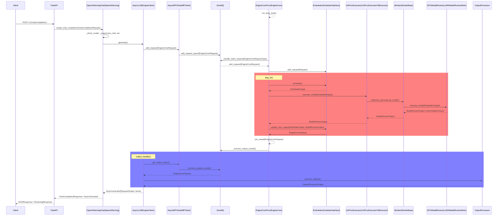

# Introduction

In the [previous article](https://zerohertz.github.io/vllm-openai-1/), I explored why vLLM is gaining popularity and the process of setting up an OpenAI-compatible server when using `vllm serve`.
While the first article focused on the architectural foundations and server initialization process, in this article, I want to dive deeper into the runtime behavior and request processing pipeline.

The `/v1/chat/completions` endpoint has become the de facto standard for conversational AI applications, powering everything from customer service chatbots to sophisticated AI assistants.
Unlike the legacy `/v1/completions` endpoint, which operates on simple text completion, the chat completions endpoint provides structured message handling, role-based conversations, and built-in context management.

Through this deep dive, I'll walk you through:

- **Endpoint Comparison**: Detailed comparison between `/v1/completions` and `/v1/chat/completions`
- **Request Processing**: Step-by-step breakdown of how chat messages are preprocessed and transformed
- **Chat Template System**: How vLLM applies model-specific chat templates to structure conversations
- **Internal Pipeline**: Deep dive into the inference process, from message parsing to response generation
- **Performance Considerations**: Understanding token efficiency and memory management in chat contexts

By examining vLLM's implementation of the OpenAI-compatible chat completions endpoint, I'll uncover the sophisticated engineering that enables high-performance conversational AI serving while maintaining full API compatibility.

<!-- More -->

---

# Theoretical Background

## `/v1/completions` vs. `/v1/chat/completions`

As seen in the previous article, the OpenAI compatible server provides two endpoints as shown below.

```bash
$ vllm serve Qwen/Qwen3-0.6B --max-model-len 8192
...
INFO 06-09 23:16:17 [launcher.py:36] Route: /v1/chat/completions, Methods: POST
INFO 06-09 23:16:17 [launcher.py:36] Route: /v1/completions, Methods: POST
...
```

Let me walk you through the differences between these two endpoints.

| Aspect                      | `/v1/completions` $\_[$[$\_{1}$](https://platform.openai.com/docs/api-reference/completions/create)$\_]$ | `/v1/chat/completions` $\_[$[$\_{2}$](https://platform.openai.com/docs/api-reference/chat/create)$\_]$ |
| --------------------------- | -------------------------------------------------------------------------------------------------------- | ------------------------------------------------------------------------------------------------------ |
| **Purpose**                 | Text Completion                                                                                          | Conversational Chat                                                                                    |
| **Input Format**            | Single string (`prompt`)                                                                                 | Array of messages (`messages`)                                                                         |
| **Message Structure**       | `{"prompt": "Hello, World!"}`                                                                            | `{"messages": [{"role": "user", "content": "Hello, World!"}]}`                                         |
| **Role Support**            | None (plain text)                                                                                        | `system`, `user`, `assistant`, etc.                                                                    |
| **Context Management**      | Manual inclusion in prompt                                                                               | Automatic management via message history                                                               |
| **Conversation Continuity** | Requires manual implementation                                                                           | Built-in support                                                                                       |
| **Response Format**         | `choices[].text`                                                                                         | `choices[].message.content`                                                                            |
| **Use Cases**               | - Code generation<br/>- Text completion<br/>- One-shot tasks                                             | - Chatbots<br/>- Conversational assistants<br/>- Multi-turn dialogues                                  |
| **Token Efficiency**        | Low (full context retransmission)                                                                        | High (message-level management)                                                                        |
| **Legacy Status**           | Legacy (not recommended)                                                                                 | Currently recommended approach                                                                         |

As officially documented by OpenAI, `/v1/completions` is legacy and not recommended.

Let's test them in practice and compare the output and logs provided by vLLM.

```bash
$ curl http://localhost:8000/v1/completions \
 -H "Content-Type: application/json" \
 -d '{"prompt": "Hello, World!"}' | jq
```

```bash
INFO 06-16 21:27:19 [logger.py:43] Received request cmpl-bc9fa340e282468eb41d47ea9db57bfd-0: prompt: 'Hello, World!', params: SamplingParams(n=1, presence_penalty=0.0, frequency_penalty=0.0, repetition_penalty=1.0, temperature=0.6, top_p=0.95, top_k=20, min_p=0.0, seed=None, stop=[], stop_token_ids=[], bad_words=[], include_stop_str_in_output=False, ignore_eos=False, max_tokens=16, min_tokens=0, logprobs=None, prompt_logprobs=None, skip_special_tokens=True, spaces_between_special_tokens=True, truncate_prompt_tokens=None, guided_decoding=None, extra_args=None), prompt_token_ids: [9707, 11, 4337, 0], prompt_embeds shape: None, lora_request: None, prompt_adapter_request: None.
INFO 06-16 21:27:19 [engine.py:317] Added request cmpl-bc9fa340e282468eb41d47ea9db57bfd-0.
INFO:     127.0.0.1:59189 - "POST /v1/completions HTTP/1.1" 200 OK
```

From the logs, we can see that `/v1/completions` feeds the sentence from the `"prompt"` directly to the LLM.

```json
{
  "id": "cmpl-bc9fa340e282468eb41d47ea9db57bfd",
  "object": "text_completion",
  "created": 1750076839,
  "model": "Qwen/Qwen3-0.6B",
  "choices": [
    {
      "index": 0,
      "text": " My name is Alex. I am a software engineer with a passion for coding and",
      "logprobs": null,
      "finish_reason": "length",
      "stop_reason": null,
      "prompt_logprobs": null
    }
  ],
  "usage": {
    "prompt_tokens": 4,
    "total_tokens": 20,
    "completion_tokens": 16,
    "prompt_tokens_details": null
  },
  "kv_transfer_params": null
}
```

As a result, it responds with an extended sentence based on the input `"prompt"`, rather than a chat-style response.

```bash
$ curl http://localhost:8000/v1/chat/completions \
 -H "Content-Type: application/json" \
 -d '{"messages": [{"role": "user", "content": "Hello, World!"}]}' | jq
```

```bash
INFO 06-16 21:29:16 [logger.py:43] Received request chatcmpl-dab79c6ebcb24ff58b4e032f6f83b888: prompt: '<|im_start|>user\nHello, World!<|im_end|>\n<|im_start|>assistant\n', params: SamplingParams(n=1, presence_penalty=0.0, frequency_penalty=0.0, repetition_penalty=1.0, temperature=0.6, top_p=0.95, top_k=20, min_p=0.0, seed=None, stop=[], stop_token_ids=[], bad_words=[], include_stop_str_in_output=False, ignore_eos=False, max_tokens=8180, min_tokens=0, logprobs=None, prompt_logprobs=None, skip_special_tokens=True, spaces_between_special_tokens=True, truncate_prompt_tokens=None, guided_decoding=None, extra_args=None), prompt_token_ids: None, prompt_embeds shape: None, lora_request: None, prompt_adapter_request: None.
INFO 06-16 21:29:16 [engine.py:317] Added request chatcmpl-dab79c6ebcb24ff58b4e032f6f83b888.
INFO:     127.0.0.1:59198 - "POST /v1/chat/completions HTTP/1.1" 200 OK
```

In contrast, `/v1/chat/completions`, as shown in the server log above, applies a chat template according to the user's input format and feeds that value to the LLM.

```json
{
  "id": "chatcmpl-dab79c6ebcb24ff58b4e032f6f83b888",
  "object": "chat.completion",
  "created": 1750076956,
  "model": "Qwen/Qwen3-0.6B",
  "choices": [
    {
      "index": 0,
      "message": {
        "role": "assistant",
        "reasoning_content": null,
        "content": "<think>\nOkay, the user said \"Hello, World!\" and I need to respond. First, I should acknowledge their message. Since it's a simple greeting, a straightforward response is best. I can say \"Hello, World!\" as well, but maybe add a friendly note to keep it engaging. Let me check if there's any context I'm missing, but the message is pretty basic. Just a greeting. Alright, I'll respond with a friendly message to reinforce the exchange.\n</think>\n\nHello, World! 😊 What's interesting about you?",
        "tool_calls": []
      },
      "logprobs": null,
      "finish_reason": "stop",
      "stop_reason": null
    }
  ],
  "usage": {
    "prompt_tokens": 12,
    "total_tokens": 125,
    "completion_tokens": 113,
    "prompt_tokens_details": null
  },
  "prompt_logprobs": null,
  "kv_transfer_params": null
}
```

As a result, the response appears in chat format.
The chat template applied in the above result uses the `chat_template` in `tokenizer_config.json` by default, unless a separate `--chat-template` option is specified.

```json Qwen/Qwen3-0.6B/tokenizer_config.json https://huggingface.co/Qwen/Qwen3-0.6B/blob/main/tokenizer_config.json#L230
...
  "chat_template": "\n    {{- '<|im_start|>system\\n' }}\n    \n        {{- messages[0].content + '\\n\\n' }}\n    \n    {{- \"# Tools\\n\\nYou may call one or more functions to assist with the user query.\\n\\nYou are provided with function signatures within <tools></tools> XML tags:\\n<tools>\" }}\n    \n        {{- \"\\n\" }}\n        {{- tool | tojson }}\n    \n    {{- \"\\n</tools>\\n\\nFor each function call, return a json object with function name and arguments within <tool_call></tool_call> XML tags:\\n<tool_call>\\n{\\\"name\\\": <function-name>, \\\"arguments\\\": <args-json-object>}\\n</tool_call><|im_end|>\\n\" }}\n\n    \n        {{- '<|im_start|>system\\n' + messages[0].content + '<|im_end|>\\n' }}\n    \n\n\n\n    \n    \n        \n        \n    \n\n\n    \n        \n    \n        \n    \n    \n        {{- '<|im_start|>' + message.role + '\\n' + content + '<|im_end|>' + '\\n' }}\n    \n        \n        \n            \n        \n            \n                \n                \n            \n        \n        \n            \n                {{- '<|im_start|>' + message.role + '\\n<think>\\n' + reasoning_content.strip('\\n') + '\\n</think>\\n\\n' + content.lstrip('\\n') }}\n            \n                {{- '<|im_start|>' + message.role + '\\n' + content }}\n            \n        \n            {{- '<|im_start|>' + message.role + '\\n' + content }}\n        \n        \n            \n                \n                    {{- '\\n' }}\n                \n                \n                    \n                \n                {{- '<tool_call>\\n{\"name\": \"' }}\n                {{- tool_call.name }}\n                {{- '\", \"arguments\": ' }}\n                \n                    {{- tool_call.arguments }}\n                \n                    {{- tool_call.arguments | tojson }}\n                \n                {{- '}\\n</tool_call>' }}\n            \n        \n        {{- '<|im_end|>\\n' }}\n    \n        \n            {{- '<|im_start|>user' }}\n        \n        {{- '\\n<tool_response>\\n' }}\n        {{- content }}\n        {{- '\\n</tool_response>' }}\n        \n            {{- '<|im_end|>\\n' }}\n        \n    \n\n\n    {{- '<|im_start|>assistant\\n' }}\n    \n        {{- '<think>\\n\\n</think>\\n\\n' }}\n    \n",
...
```

Chat template testing can be performed as follows:

```python
>>> import transformers
>>> tokenizer=transformers.AutoTokenizer.from_pretrained("Qwen/Qwen3-0.6B")
>>> messages = [
...   { "role": "system", "content": "You are a helpful assistant." },
...   { "role": "user", "content": "What is the capital of France?" },
...   { "role": "assistant", "content": "The capital of France is Paris." },
...   { "role": "user", "content": "Tell me more about it." }
... ]
>>> print(tokenizer.apply_chat_template(messages, tokenize=False))
<|im_start|>system
You are a helpful assistant.<|im_end|>
<|im_start|>user
What is the capital of France?<|im_end|>
<|im_start|>assistant
The capital of France is Paris.<|im_end|>
<|im_start|>user
Tell me more about it.<|im_end|>
```

## Request/Response Schema of `/v1/chat/completions`

Now that I understand the fundamental differences between the endpoints, let me examine the detailed structure of the `/v1/chat/completions` request and response schemas.
Understanding these schemas is crucial for effective API integration and troubleshooting, as they define the contract between client applications and vLLM's serving infrastructure.

My analysis here is based on vLLM's source code implementation, providing insights into both OpenAI-compatible fields and vLLM-specific extensions that enhance functionality beyond the standard API specification.

### Request Schema

The `ChatCompletionRequest` class in vLLM implements the complete OpenAI Chat Completions API specification while adding several vLLM-specific extensions for advanced sampling and optimization features.

The schema is carefully organized to match the official OpenAI API documentation order, ensuring maximum compatibility with existing OpenAI client libraries and tools.

```python vllm/entrypoints/openai/protocol.py https://github.com/vllm-project/vllm/blob/v0.9.0.1/vllm/entrypoints/openai/protocol.py#L218-L269
...
class ChatCompletionRequest(OpenAIBaseModel):
    # Ordered by official OpenAI API documentation
    # https://platform.openai.com/docs/api-reference/chat/create
    messages: list[ChatCompletionMessageParam]
    model: Optional[str] = None
    frequency_penalty: Optional[float] = 0.0
    logit_bias: Optional[dict[str, float]] = None
    logprobs: Optional[bool] = False
    top_logprobs: Optional[int] = 0
    # TODO(#9845): remove max_tokens when field is removed from OpenAI API
    max_tokens: Optional[int] = Field(
        default=None,
        deprecated=
        'max_tokens is deprecated in favor of the max_completion_tokens field')
    max_completion_tokens: Optional[int] = None
    n: Optional[int] = 1
    presence_penalty: Optional[float] = 0.0
    response_format: Optional[AnyResponseFormat] = None
    seed: Optional[int] = Field(None, ge=_LONG_INFO.min, le=_LONG_INFO.max)
    stop: Optional[Union[str, list[str]]] = Field(default_factory=list)
    stream: Optional[bool] = False
    stream_options: Optional[StreamOptions] = None
    temperature: Optional[float] = None
    top_p: Optional[float] = None
    tools: Optional[list[ChatCompletionToolsParam]] = None
    tool_choice: Optional[Union[
        Literal["none"],
        Literal["auto"],
        Literal["required"],
        ChatCompletionNamedToolChoiceParam,
    ]] = "none"

    # NOTE this will be ignored by vLLM -- the model determines the behavior
    parallel_tool_calls: Optional[bool] = False
    user: Optional[str] = None

    # --8<-- [start:chat-completion-sampling-params]
    best_of: Optional[int] = None
    use_beam_search: bool = False
    top_k: Optional[int] = None
    min_p: Optional[float] = None
    repetition_penalty: Optional[float] = None
    length_penalty: float = 1.0
    stop_token_ids: Optional[list[int]] = Field(default_factory=list)
    include_stop_str_in_output: bool = False
    ignore_eos: bool = False
    min_tokens: int = 0
    skip_special_tokens: bool = True
    spaces_between_special_tokens: bool = True
    truncate_prompt_tokens: Optional[Annotated[int, Field(ge=1)]] = None
    prompt_logprobs: Optional[int] = None
    # --8<-- [end:chat-completion-sampling-params]
...
```

| Field                           | Type                                        | Required | Default  | Description                                                                                                  |
| ------------------------------- | ------------------------------------------- | -------- | -------- | ------------------------------------------------------------------------------------------------------------ |
| `messages`                      | `list[ChatCompletionMessageParam]`          | ✅       | -        | Array of conversation messages                                                                               |
| `model`                         | `Optional[str]`                             | ❌       | `None`   | Model name to use ([vllm-project/vllm#13568](https://github.com/vllm-project/vllm/pull/13568) made optional) |
| `frequency_penalty`             | `Optional[float]`                           | ❌       | `0.0`    | Frequency-based token penalty (-2.0 ~ 2.0)                                                                   |
| `logit_bias`                    | `Optional[dict[str, float]]`                | ❌       | `None`   | Bias for specific tokens' logits                                                                             |
| `logprobs`                      | `Optional[bool]`                            | ❌       | `False`  | Whether to return log probabilities                                                                          |
| `top_logprobs`                  | `Optional[int]`                             | ❌       | `0`      | Number of top log probabilities to return (0-20)                                                             |
| `max_tokens`                    | `Optional[int]`                             | ❌       | `None`   | Maximum number of tokens to generate                                                                         |
| `n`                             | `Optional[int]`                             | ❌       | `1`      | Number of completions to generate                                                                            |
| `presence_penalty`              | `Optional[float]`                           | ❌       | `0.0`    | Presence-based token penalty (-2.0 ~ 2.0)                                                                    |
| `response_format`               | `Optional[AnyResponseFormat]`               | ❌       | `None`   | Response format specification (JSON mode)                                                                    |
| `seed`                          | `Optional[int]`                             | ❌       | `None`   | Seed for reproducible output                                                                                 |
| `stop`                          | `Optional[Union[str, list[str]]]`           | ❌       | `[]`     | Stop strings for generation                                                                                  |
| `stream`                        | `Optional[bool]`                            | ❌       | `False`  | Whether to stream responses                                                                                  |
| `temperature`                   | `Optional[float]`                           | ❌       | `None`   | Sampling temperature (0.0 ~ 2.0)                                                                             |
| `top_p`                         | `Optional[float]`                           | ❌       | `None`   | Nucleus sampling probability                                                                                 |
| `tools`                         | `Optional[list[ChatCompletionToolsParam]]`  | ❌       | `None`   | Function call tool definitions                                                                               |
| `tool_choice`                   | `Optional[Union[Literal, NamedToolChoice]]` | ❌       | `"none"` | Tool selection strategy                                                                                      |
| `user`                          | `Optional[str]`                             | ❌       | `None`   | User identifier                                                                                              |
| `best_of`                       | `Optional[int]`                             | ❌       | `None`   | Number of generations to select best from                                                                    |
| `use_beam_search`               | `bool`                                      | ❌       | `False`  | Whether to use beam search                                                                                   |
| `top_k`                         | `Optional[int]`                             | ❌       | `None`   | Consider only top k tokens                                                                                   |
| `min_p`                         | `Optional[float]`                           | ❌       | `None`   | Minimum probability threshold                                                                                |
| `repetition_penalty`            | `Optional[float]`                           | ❌       | `None`   | Repetition penalty                                                                                           |
| `min_tokens`                    | `int`                                       | ❌       | `0`      | Minimum number of tokens to generate                                                                         |
| `skip_special_tokens`           | `bool`                                      | ❌       | `True`   | Whether to skip special tokens in output                                                                     |
| `spaces_between_special_tokens` | `bool`                                      | ❌       | `True`   | Whether to add spaces between special tokens                                                                 |
| `truncate_prompt_tokens`        | `Optional[int]`                             | ❌       | `None`   | Truncate prompt to specified token count                                                                     |
| `prompt_logprobs`               | `Optional[int]`                             | ❌       | `None`   | Number of prompt log probabilities to return                                                                 |

#### Message Object

The message object structure supports both simple text conversations and complex multimodal interactions. vLLM extends the standard OpenAI message format to support custom roles and enhanced tool integration.

```python vllm/entrypoints/chat_utils.py https://github.com/vllm-project/vllm/blob/v0.9.0.1/vllm/entrypoints/chat_utils.py#L135-L158
...
class CustomChatCompletionMessageParam(TypedDict, total=False):
    """Enables custom roles in the Chat Completion API."""
    role: Required[str]
    """The role of the message's author."""

    content: Union[str, list[ChatCompletionContentPartParam]]
    """The contents of the message."""

    name: str
    """An optional name for the participant.

    Provides the model information to differentiate between participants of the
    same role.
    """

    tool_call_id: Optional[str]
    """Tool call that this message is responding to."""

    tool_calls: Optional[Iterable[ChatCompletionMessageToolCallParam]]
    """The tool calls generated by the model, such as function calls."""


ChatCompletionMessageParam = Union[OpenAIChatCompletionMessageParam,
                                   CustomChatCompletionMessageParam]
...
```

| Field          | Type                                                     | Required | Description                                         |
| -------------- | -------------------------------------------------------- | -------- | --------------------------------------------------- |
| `role`         | `Required[str]`                                          | ✅       | Message role: `system`, `user`, `assistant`, `tool` |
| `content`      | `Union[str, list[ChatCompletionContentPartParam]]`       | ✅       | Message content (text or multimodal array)          |
| `name`         | `str`                                                    | ❌       | Message author name                                 |
| `tool_call_id` | `Optional[str]`                                          | ❌       | Tool call ID (required when role is `tool`)         |
| `tool_calls`   | `Optional[Iterable[ChatCompletionMessageToolCallParam]]` | ❌       | Assistant's tool calls                              |

### Response Schema

The response schema follows the OpenAI specification closely while incorporating vLLM-specific enhancements for advanced use cases like KV caching optimization and detailed logging.

```python vllm/entrypoints/openai/protocol.py https://github.com/vllm-project/vllm/blob/v0.9.0.1/vllm/entrypoints/openai/protocol.py#L1429-L1438
...
class ChatCompletionResponse(OpenAIBaseModel):
    id: str = Field(default_factory=lambda: f"chatcmpl-{random_uuid()}")
    object: Literal["chat.completion"] = "chat.completion"
    created: int = Field(default_factory=lambda: int(time.time()))
    model: str
    choices: list[ChatCompletionResponseChoice]
    usage: UsageInfo
    prompt_logprobs: Optional[list[Optional[dict[int, Logprob]]]] = None
    kv_transfer_params: Optional[dict[str, Any]] = Field(
        default=None, description="KVTransfer parameters.")
...
```

| Field                | Type                                           | Description                                                |
| -------------------- | ---------------------------------------------- | ---------------------------------------------------------- |
| `id`                 | `str`                                          | Unique identifier for the completion request               |
| `object`             | `Literal["chat.completion"]`                   | Object type (`chat.completion` or `chat.completion.chunk`) |
| `created`            | `int`                                          | Creation time represented as Unix timestamp                |
| `model`              | `str`                                          | Model name used                                            |
| `choices`            | `list[ChatCompletionResponseChoice]`           | Array of generated completion choices                      |
| `usage`              | `UsageInfo`                                    | Token usage information                                    |
| `prompt_logprobs`    | `Optional[list[Optional[dict[int, Logprob]]]]` | Prompt log probability information                         |
| `kv_transfer_params` | `Optional[dict[str, Any]]`                     | KVTransfer parameters                                      |

#### Choice Object

Each choice represents a single completion generated by the model. The choice object contains the actual generated content along with metadata about the generation process.

```python vllm/entrypoints/openai/protocol.py https://github.com/vllm-project/vllm/blob/v0.9.0.1/vllm/entrypoints/openai/protocol.py#L1419-L1426
...
class ChatCompletionResponseChoice(OpenAIBaseModel):
    index: int
    message: ChatMessage
    logprobs: Optional[ChatCompletionLogProbs] = None
    # per OpenAI spec this is the default
    finish_reason: Optional[str] = "stop"
    # not part of the OpenAI spec but included in vLLM for legacy reasons
    stop_reason: Optional[Union[int, str]] = None
...
```

```python vllm/entrypoints/openai/protocol.py https://github.com/vllm-project/vllm/blob/v0.9.0.1/vllm/entrypoints/openai/protocol.py#L1395-L1399
...
class ChatMessage(OpenAIBaseModel):
    role: str
    reasoning_content: Optional[str] = None
    content: Optional[str] = None
    tool_calls: list[ToolCall] = Field(default_factory=list)
...
```

| Field           | Type                               | Description                                                                                      |
| --------------- | ---------------------------------- | ------------------------------------------------------------------------------------------------ |
| `index`         | `int`                              | Index of the choice                                                                              |
| `message`       | `ChatMessage`                      | Message generated by the assistant                                                               |
| `logprobs`      | `Optional[ChatCompletionLogProbs]` | Log probability information                                                                      |
| `finish_reason` | `Optional[str]`                    | Completion termination reason: `stop`, `length`, `function_call`, `content_filter`, `tool_calls` |
| `stop_reason`   | `Optional[Union[int, str]]`        | vLLM legacy field (outside OpenAI spec, provides similar info to `finish_reason`)                |

#### Usage Object

The usage object provides detailed token consumption metrics, essential for billing, monitoring, and optimization purposes.

```python vllm/entrypoints/openai/protocol.py https://github.com/vllm-project/vllm/blob/v0.9.0.1/vllm/entrypoints/openai/protocol.py#L108-L112
class UsageInfo(OpenAIBaseModel):
    prompt_tokens: int = 0
    total_tokens: int = 0
    completion_tokens: Optional[int] = 0
    prompt_tokens_details: Optional[PromptTokenUsageInfo] = None
```

| Field                   | Type                             | Description                              |
| ----------------------- | -------------------------------- | ---------------------------------------- |
| `prompt_tokens`         | `int`                            | Number of tokens used in prompt          |
| `total_tokens`          | `int`                            | Total tokens (prompt + completion)       |
| `completion_tokens`     | `Optional[int]`                  | Number of tokens generated in completion |
| `prompt_tokens_details` | `Optional[PromptTokenUsageInfo]` | Detailed prompt token usage information  |

---

# Router

vLLM's OpenAI-compatible server is built on FastAPI, providing a robust and high-performance web framework for serving LLM requests.
When a user sends a `POST` request to `/v1/chat/completions`, FastAPI's routing system directs the request to the following function, which serves as the main entry point for chat completion requests.

```python vllm/entrypoints/openai/api_server.py https://github.com/vllm-project/vllm/blob/v0.9.0.1/vllm/entrypoints/openai/api_server.py#L532-L568
...
@router.post("/v1/chat/completions",
             dependencies=[Depends(validate_json_request)],
             responses={
                 HTTPStatus.OK.value: {
                     "content": {
                         "text/event-stream": {}
                     }
                 },
                 HTTPStatus.BAD_REQUEST.value: {
                     "model": ErrorResponse
                 },
                 HTTPStatus.NOT_FOUND.value: {
                     "model": ErrorResponse
                 },
                 HTTPStatus.INTERNAL_SERVER_ERROR.value: {
                     "model": ErrorResponse
                 }
             })
@with_cancellation
@load_aware_call
async def create_chat_completion(request: ChatCompletionRequest,
                                 raw_request: Request):
    handler = chat(raw_request)
    if handler is None:
        return base(raw_request).create_error_response(
            message="The model does not support Chat Completions API")

    generator = await handler.create_chat_completion(request, raw_request)

    if isinstance(generator, ErrorResponse):
        return JSONResponse(content=generator.model_dump(),
                            status_code=generator.code)

    elif isinstance(generator, ChatCompletionResponse):
        return JSONResponse(content=generator.model_dump())

    return StreamingResponse(content=generator, media_type="text/event-stream")
...
```

## Request Handler

I can see that the `handler` is defined through the `chat()` function.
This function retrieves the `openai_serving_chat` instance that was registered in the `app.state` during server initialization, as shown below.

```python vllm/entrypoints/openai/api_server.py https://github.com/vllm-project/vllm/blob/v0.9.0.1/vllm/entrypoints/openai/api_server.py#L373-L374
...
def chat(request: Request) -> Optional[OpenAIServingChat]:
    return request.app.state.openai_serving_chat
...
```

## Starlette Request Object

The `Request` object is a class included in the Starlette framework, and it inherits the `app` property from its parent class `HTTPConnection`.
This design provides access to the application state and configuration throughout the request lifecycle.

```python starlette/requests.py https://github.com/encode/starlette/blob/739ea4928b11d4b4cb2b366ccad11405ef3034c4/starlette/requests.py#L199-L199
...
class Request(HTTPConnection):
...
```

The `app` property provides access to the FastAPI application instance, while `scope` contains ASGI (Asynchronous Server Gateway Interface) information about the current request.
This architecture follows the ASGI specification, enabling efficient handling of asynchronous web requests.

```python starlette/requests.py https://github.com/encode/starlette/blob/739ea4928b11d4b4cb2b366ccad11405ef3034c4/starlette/requests.py#L96-L98
...
class HTTPConnection(Mapping[str, Any]):
    """
    A base class for incoming HTTP connections, that is used to provide
    any functionality that is common to both `Request` and `WebSocket`.
    """
...
    @property
    def app(self) -> Any:
        return self.scope["app"]
...
```

## Application State Initialization

Looking at the initialization of `state.openai_serving_chat`, it occurs in the `init_app_state()` function as follows.
This initialization happens during server startup, ensuring that all necessary components are ready before handling incoming requests.

```python vllm/entrypoints/openai/api_server.py https://github.com/vllm-project/vllm/blob/v0.9.0.1/vllm/entrypoints/openai/api_server.py#L1200-L1213
...
async def init_app_state(
    engine_client: EngineClient,
    vllm_config: VllmConfig,
    state: State,
    args: Namespace,
) -> None:
...
    state.openai_serving_chat = OpenAIServingChat(
        engine_client,
        model_config,
        state.openai_serving_models,
        args.response_role,
        request_logger=request_logger,
        chat_template=resolved_chat_template,
        chat_template_content_format=args.chat_template_content_format,
        return_tokens_as_token_ids=args.return_tokens_as_token_ids,
        enable_auto_tools=args.enable_auto_tool_choice,
        tool_parser=args.tool_call_parser,
        reasoning_parser=args.reasoning_parser,
        enable_prompt_tokens_details=args.enable_prompt_tokens_details,
    ) if model_config.runner_type == "generate" else None
...
```

## Testing `app.state`

The `app.state` mechanism can be tested with the following example.
This demonstrates how FastAPI's application state works in practice and how components are shared across request handlers.

```python
from random import random
from typing import Optional

import uvicorn
import uvloop
from fastapi import FastAPI, Request
from fastapi.datastructures import State
from loguru import logger
from pydantic import BaseModel

app = FastAPI()


class OpenAIServingChat:
    def __init__(self) -> None:
        logger.info("Init: OpenAIServingChat")

    def create_chat_completion(self, *args, **kwargs) -> float:
        logger.info("Run: OpenAIServingChat.create_chat_completion")
        return random()


async def init_app_state(state: State):
    state.openai_serving_chat = OpenAIServingChat()


def chat(request: Request) -> Optional[OpenAIServingChat]:
    return request.app.state.openai_serving_chat


class ChatCompletionRequest(BaseModel):
    id: int


@app.post("/v1/chat/completions")
async def create_chat_completion(request: ChatCompletionRequest, raw_request: Request):
    handler = chat(raw_request)
    logger.info(f"{raw_request=}")
    return {"id": request.id, "chat_completion": handler.create_chat_completion()}


async def main():
    await init_app_state(app.state)
    config = uvicorn.Config(app, host="0.0.0.0", port=8000)
    server = uvicorn.Server(config)
    await server.serve()


if __name__ == "__main__":
    uvloop.run(main())
```

```bash
$ curl -X 'POST' \
 'http://localhost:8000/v1/chat/completions' \
 -H 'accept: application/json' \
 -H 'Content-Type: application/json' \
 -d '{
  "id": 0
}' | jq
{
  "id": 0,
  "chat_completion": 0.7867811845314955
}
```

Examining the server logs reveals the initialization sequence: the `OpenAIServingChat` instance is initialized before FastAPI starts running.
When a request arrives, the `handler` is retrieved from `request.app.state.openai_serving_chat` and executed.

This pattern demonstrates FastAPI's application lifecycle management, where:

1. **Initialization Phase**: Critical components are set up during server startup
2. **Request Phase**: Pre-initialized components are accessed through the application state
3. **Processing Phase**: The actual request handling occurs with the retrieved handler

```bash
2025-06-16 23:38:46.972 | INFO     | __main__:__init__:16 - Init: OpenAIServingChat
INFO:     Started server process [52024]
INFO:     Waiting for application startup.
INFO:     Application startup complete.
INFO:     Uvicorn running on http://0.0.0.0:8000 (Press CTRL+C to quit)
2025-06-16 23:38:49.021 | INFO     | __main__:create_chat_completion:38 - raw_request=<starlette.requests.Request object at 0x105a80a50>
2025-06-16 23:38:49.021 | INFO     | __main__:create_chat_completion:19 - Run: OpenAIServingChat.create_chat_completion
INFO:     127.0.0.1:61279 - "POST /v1/chat/completions HTTP/1.1" 200 OK
```

```python vllm/entrypoints/openai/serving_chat.py https://github.com/vllm-project/vllm/blob/v0.9.0.1/vllm/entrypoints/openai/serving_chat.py#L120-L132
...
class OpenAIServingChat(OpenAIServing):
...
    async def create_chat_completion(
        self,
        request: ChatCompletionRequest,
        raw_request: Optional[Request] = None,
    ) -> Union[AsyncGenerator[str, None], ChatCompletionResponse,
               ErrorResponse]:
        """
        Chat Completion API similar to OpenAI's API.

        See https://platform.openai.com/docs/api-reference/chat/create
        for the API specification. This API mimics the OpenAI
        Chat Completion API.
        """
...
```

---

# Chat Completion Processing Pipeline

As I observed in the router's `create_chat_completion()` function above, all preprocessing, LLM inference, and postprocessing for `/v1/chat/completions` requests are performed within the following method.

```python vllm/entrypoints/openai/serving_chat.py https://github.com/vllm-project/vllm/blob/v0.9.0.1/vllm/entrypoints/openai/serving_chat.py#L120-L132
...
class OpenAIServingChat(OpenAIServing):
...
    async def create_chat_completion(
        self,
        request: ChatCompletionRequest,
        raw_request: Optional[Request] = None,
    ) -> Union[AsyncGenerator[str, None], ChatCompletionResponse,
               ErrorResponse]:
        """
        Chat Completion API similar to OpenAI's API.

        See https://platform.openai.com/docs/api-reference/chat/create
        for the API specification. This API mimics the OpenAI
        Chat Completion API.
        """
...
```

How does the complete processing flow work?
Let's examine the step-by-step process:

```python vllm/entrypoints/openai/serving_chat.py https://github.com/vllm-project/vllm/blob/v0.9.0.1/vllm/entrypoints/openai/serving_chat.py#L133-L136
...
class OpenAIServingChat(OpenAIServing):
...
    async def create_chat_completion(
...
        error_check_ret = await self._check_model(request)
        if error_check_ret is not None:
            logger.error("Error with model %s", error_check_ret)
            return error_check_ret
...
```

1. **Model Validation**: The [`OpenAIServing._check_model()`](https://github.com/vllm-project/vllm/blob/v0.9.0.1/vllm/entrypoints/openai/serving_engine.py#L421-L450) method validates that the request's `"model"` name is correctly configured.

```python vllm/entrypoints/openai/serving_chat.py https://github.com/vllm-project/vllm/blob/v0.9.0.1/vllm/entrypoints/openai/serving_chat.py#L133-L136
...
class OpenAIServingChat(OpenAIServing):
...
    async def create_chat_completion(
...
        error_check_ret = await self._check_model(request)
        if error_check_ret is not None:
            logger.error("Error with model %s", error_check_ret)
            return error_check_ret
...
```

2. **Engine Health Check**: The [`AsyncLLM(EngineClient).errored`](https://github.com/vllm-project/vllm/blob/v0.9.0.1/vllm/v1/engine/async_llm.py#L540-L542) property performs a health check of the engine client.

```python vllm/entrypoints/openai/serving_chat.py https://github.com/vllm-project/vllm/blob/v0.9.0.1/vllm/entrypoints/openai/serving_chat.py#L138-L142
...
class OpenAIServingChat(OpenAIServing):
...
    async def create_chat_completion(
...
        # If the engine is dead, raise the engine's DEAD_ERROR.
        # This is required for the streaming case, where we return a
        # success status before we actually start generating text :).
        if self.engine_client.errored:
            raise self.engine_client.dead_error
...
```

3. **Component Preparation**: Prepares [LoRA adapter-related requests (`lora_request`, `prompt_adapter_request`)](https://github.com/vllm-project/vllm/blob/v0.9.0.1/vllm/entrypoints/openai/serving_engine.py#L452-L465), [`model_name`](https://github.com/vllm-project/vllm/blob/v0.9.0.1/vllm/entrypoints/openai/serving_engine.py#L963-L970), [`tokenizer`](https://github.com/vllm-project/vllm/blob/v0.9.0.1/vllm/v1/engine/async_llm.py#L457-L461), and [`tool_parser`](https://github.com/vllm-project/vllm/blob/v0.9.0.1/vllm/entrypoints/openai/serving_chat.py#L96-L109).

```python vllm/entrypoints/openai/serving_chat.py https://github.com/vllm-project/vllm/blob/v0.9.0.1/vllm/entrypoints/openai/serving_chat.py#L144-L154
...
class OpenAIServingChat(OpenAIServing):
...
    async def create_chat_completion(
...
        try:
            (
                lora_request,
                prompt_adapter_request,
            ) = self._maybe_get_adapters(request)

            model_name = self._get_model_name(request.model, lora_request)

            tokenizer = await self.engine_client.get_tokenizer(lora_request)

            tool_parser = self.tool_parser
...
```

4. **Mistral Tokenizer Handling**: For `v0.9.0.1`, there are Pydantic-related issues with `MistralTokenizer` ([vllm-project/vllm#9951](https://github.com/vllm-project/vllm/pull/9951), [pydantic/pydantic#9467](https://github.com/pydantic/pydantic/issues/9467), [pydantic/pydantic#9541](https://github.com/pydantic/pydantic/issues/9541)), which require special handling as shown below.

```python vllm/entrypoints/openai/serving_chat.py https://github.com/vllm-project/vllm/blob/v0.9.0.1/vllm/entrypoints/openai/serving_chat.py#L156-L162
...
class OpenAIServingChat(OpenAIServing):
...
    async def create_chat_completion(
...
        try:
...
            if isinstance(tokenizer, MistralTokenizer):
                # because of issues with pydantic we need to potentially
                # re-serialize the tool_calls field of the request
                # for more info: see comment in `maybe_serialize_tool_calls`
                maybe_serialize_tool_calls(request)
                truncate_tool_call_ids(request)
                validate_request_params(request)
...
```

5. **Tool Configuration**: When the request's `tool_choice` is `"auto"`, it undergoes validation and generates `tool_dicts`.

```python vllm/entrypoints/openai/serving_chat.py https://github.com/vllm-project/vllm/blob/v0.9.0.1/vllm/entrypoints/openai/serving_chat.py#L164-L176
...
class OpenAIServingChat(OpenAIServing):
...
    async def create_chat_completion(
...
        try:
...
            if (request.tool_choice == "auto" and
                    not (self.enable_auto_tools and tool_parser is not None)
                    and not isinstance(tokenizer, MistralTokenizer)):
                # for hf tokenizers, "auto" tools requires
                # --enable-auto-tool-choice and --tool-call-parser
                return self.create_error_response(
                    "\"auto\" tool choice requires "
                    "--enable-auto-tool-choice and --tool-call-parser to be set"
                )

            tool_dicts = None if request.tools is None else [
                tool.model_dump() for tool in request.tools
            ]
...
```

6. **Request Preprocessing**: Uses the [`OpenAIServingChat(OpenAIServing)._preprocess_chat()`](https://github.com/vllm-project/vllm/blob/v0.9.0.1/vllm/entrypoints/openai/serving_engine.py#L760-L859) method to preprocess the request.

```python vllm/entrypoints/openai/serving_chat.py https://github.com/vllm-project/vllm/blob/v0.9.0.1/vllm/entrypoints/openai/serving_chat.py#L178-L196
...
class OpenAIServingChat(OpenAIServing):
...
    async def create_chat_completion(
...
        try:
...
            (
                conversation,
                request_prompts,
                engine_prompts,
            ) = await self._preprocess_chat(
                request,
                tokenizer,
                request.messages,
                chat_template=request.chat_template or self.chat_template,
                chat_template_content_format=self.chat_template_content_format,
                add_generation_prompt=request.add_generation_prompt,
                continue_final_message=request.continue_final_message,
                tool_dicts=tool_dicts,
                documents=request.documents,
                chat_template_kwargs=request.chat_template_kwargs,
                tool_parser=tool_parser,
                truncate_prompt_tokens=request.truncate_prompt_tokens,
                add_special_tokens=request.add_special_tokens,
            )
...
```

7. **Request ID Generation**: The [`OpenAIServingChat(OpenAIServing)._base_request_id()`](https://github.com/vllm-project/vllm/blob/v0.9.0.1/vllm/entrypoints/openai/serving_engine.py#L936-L944) method generates a random `request_id` and stores it as metadata in the `state`.

```python vllm/entrypoints/openai/serving_chat.py https://github.com/vllm-project/vllm/blob/v0.9.0.1/vllm/entrypoints/openai/serving_chat.py#L202-L207
...
class OpenAIServingChat(OpenAIServing):
...
    async def create_chat_completion(
...
        request_id = "chatcmpl-" \
                     f"{self._base_request_id(raw_request, request.request_id)}"

        request_metadata = RequestResponseMetadata(request_id=request_id)
        if raw_request:
            raw_request.state.request_metadata = request_metadata
...
```

8. **Sampling Parameters Setup**: For the preprocessed `engine_prompts`, prepares [`BeamSearchParams`](https://github.com/vllm-project/vllm/blob/v0.9.0.1/vllm/entrypoints/openai/protocol.py#L421-L450) if using beam search, or [`SamplingParams`](https://github.com/vllm-project/vllm/blob/v0.9.0.1/vllm/entrypoints/openai/protocol.py#L452-L548) otherwise.

```python vllm/entrypoints/openai/serving_chat.py https://github.com/vllm-project/vllm/blob/v0.9.0.1/vllm/entrypoints/openai/serving_chat.py#L209-L223
...
class OpenAIServingChat(OpenAIServing):
...
    async def create_chat_completion(
...
        # Schedule the request and get the result generator.
        generators: list[AsyncGenerator[RequestOutput, None]] = []
        try:
            for i, engine_prompt in enumerate(engine_prompts):
                sampling_params: Union[SamplingParams, BeamSearchParams]
                default_max_tokens = self.max_model_len - len(
                    engine_prompt["prompt_token_ids"])
                if request.use_beam_search:
                    sampling_params = request.to_beam_search_params(
                        default_max_tokens, self.default_sampling_params)
                else:
                    sampling_params = request.to_sampling_params(
                        default_max_tokens,
                        self.model_config.logits_processor_pattern,
                        self.default_sampling_params)
...
```

9. **Request Logging**: Uses [`OpenAIServingChat(OpenAIServing)._log_inputs()`](https://github.com/vllm-project/vllm/blob/v0.9.0.1/vllm/entrypoints/openai/serving_engine.py#L890-L920) to log the request and prepare `trace_headers`. (However, `trace_headers` [do not work in V1 engine-based `vllm serve`](https://github.com/vllm-project/vllm/blob/v0.9.0.1/vllm/v1/engine/async_llm.py#L463-L464))

```python vllm/entrypoints/openai/serving_chat.py https://github.com/vllm-project/vllm/blob/v0.9.0.1/vllm/entrypoints/openai/serving_chat.py#L225-L232
...
class OpenAIServingChat(OpenAIServing):
...
    async def create_chat_completion(
...
        try:
            for i, engine_prompt in enumerate(engine_prompts):
...
                self._log_inputs(request_id,
                                 request_prompts[i],
                                 params=sampling_params,
                                 lora_request=lora_request,
                                 prompt_adapter_request=prompt_adapter_request)

                trace_headers = (None if raw_request is None else await
                                 self._get_trace_headers(raw_request.headers))
...
```

10. **Inference Execution**: For the preprocessed `engine_prompts`, uses the [`EngineClient.beam_search()`](https://github.com/vllm-project/vllm/blob/v0.9.0.1/vllm/engine/protocol.py#L63-L202) method if using beam search, or the [`AsyncLLM(EngineClient).generate()`](https://github.com/vllm-project/vllm/blob/v0.9.0.1/vllm/v1/engine/async_llm.py#L263-L347) method for inference.

```python vllm/entrypoints/openai/serving_chat.py https://github.com/vllm-project/vllm/blob/v0.9.0.1/vllm/entrypoints/openai/serving_chat.py#L234-L251
...
class OpenAIServingChat(OpenAIServing):
...
    async def create_chat_completion(
...
        try:
            for i, engine_prompt in enumerate(engine_prompts):
...
                if isinstance(sampling_params, BeamSearchParams):
                    generator = self.engine_client.beam_search(
                        prompt=engine_prompt,
                        request_id=request_id,
                        params=sampling_params,
                    )
                else:
                    generator = self.engine_client.generate(
                        engine_prompt,
                        sampling_params,
                        request_id,
                        lora_request=lora_request,
                        trace_headers=trace_headers,
                        prompt_adapter_request=prompt_adapter_request,
                        priority=request.priority,
                    )

                generators.append(generator)
...
```

11. **Response Generation**: For streaming requests, uses the [`OpenAIServingChat(OpenAIServing).chat_completion_stream_generator()`](https://github.com/vllm-project/vllm/blob/v0.9.0.1/vllm/entrypoints/openai/serving_chat.py#L394-L888) method; for non-streaming requests, uses the [`OpenAIServingChat(OpenAIServing).chat_completion_full_generator()`](https://github.com/vllm-project/vllm/blob/v0.9.0.1/vllm/entrypoints/openai/serving_chat.py#L890-L1092) method to generate the response.

```python vllm/entrypoints/openai/serving_chat.py https://github.com/vllm-project/vllm/blob/v0.9.0.1/vllm/entrypoints/openai/serving_chat.py#L256-L271
...
class OpenAIServingChat(OpenAIServing):
...
    async def create_chat_completion(
...
        assert len(generators) == 1
        result_generator, = generators

        # Streaming response
        if request.stream:
            return self.chat_completion_stream_generator(
                request, result_generator, request_id, model_name,
                conversation, tokenizer, request_metadata)

        try:
            return await self.chat_completion_full_generator(
                request, result_generator, request_id, model_name,
                conversation, tokenizer, request_metadata)
        except ValueError as e:
            # TODO: Use a vllm-specific Validation Error
            return self.create_error_response(str(e))
...
```

Now that I've examined the overall chat completion processing pipeline, let me dive into the important core logic components.

## Preprocessing

For this analysis, I'll assume that beam search is not being used and examine the code accordingly.

As I saw above, request preprocessing uses the [`OpenAIServingChat(OpenAIServing)._preprocess_chat()`](https://github.com/vllm-project/vllm/blob/v0.9.0.1/vllm/entrypoints/openai/serving_engine.py#L760-L859) method.
Let me examine how this method works step by step.

1. **Content Format and Conversation Setup**: Prepares [`resolved_content_format`](https://github.com/vllm-project/vllm/blob/v0.9.0.1/vllm/entrypoints/chat_utils.py#L437-L463) (determines the content format for chat templates based on tools and model configuration), [`conversation`](https://github.com/vllm-project/vllm/blob/v0.9.0.1/vllm/entrypoints/chat_utils.py#L1185-L1205) (parsed conversation messages with multimodal data handling), and [`mm_data_future`](https://github.com/vllm-project/vllm/blob/v0.9.0.1/vllm/entrypoints/chat_utils.py#L1185-L1205) (future object for asynchronous multimodal data processing), then updates the `chat_template_kwargs` (user-specified chat template settings) into `_chat_template_kwargs` (internal chat template configuration dictionary).

```python vllm/entrypoints/openai/serving_engine.py https://github.com/vllm-project/vllm/blob/v0.9.0.1/vllm/entrypoints/openai/serving_engine.py#L760-L800
...
class OpenAIServing:
...
    async def _preprocess_chat(
        self,
        request: ChatLikeRequest,
        tokenizer: AnyTokenizer,
        messages: list[ChatCompletionMessageParam],
        chat_template: Optional[str],
        chat_template_content_format: ChatTemplateContentFormatOption,
        add_generation_prompt: bool = True,
        continue_final_message: bool = False,
        tool_dicts: Optional[list[dict[str, Any]]] = None,
        documents: Optional[list[dict[str, str]]] = None,
        chat_template_kwargs: Optional[dict[str, Any]] = None,
        tool_parser: Optional[Callable[[AnyTokenizer], ToolParser]] = None,
        truncate_prompt_tokens: Optional[Annotated[int, Field(ge=1)]] = None,
        add_special_tokens: bool = False,
    ) -> tuple[list[ConversationMessage], Sequence[RequestPrompt],
               list[EngineTokensPrompt]]:
        model_config = self.model_config

        resolved_content_format = resolve_chat_template_content_format(
            chat_template,
            tool_dicts,
            chat_template_content_format,
            tokenizer,
            model_config=model_config,
        )
        conversation, mm_data_future = parse_chat_messages_futures(
            messages,
            model_config,
            tokenizer,
            content_format=resolved_content_format,
        )

        _chat_template_kwargs: dict[str, Any] = dict(
            chat_template=chat_template,
            add_generation_prompt=add_generation_prompt,
            continue_final_message=continue_final_message,
            tools=tool_dicts,
            documents=documents,
        )
        _chat_template_kwargs.update(chat_template_kwargs or {})
...
```

2. **Obtain the `request_prompt` based on the tokenizer type**: for models using `MistralTokenizer`, the [`apply_mistral_chat_template()`](https://github.com/vllm-project/vllm/blob/v0.9.0.1/vllm/entrypoints/chat_utils.py#L1257-L1295) function is used, while for other models, the [`apply_hf_chat_template()`](https://github.com/vllm-project/vllm/blob/v0.9.0.1/vllm/entrypoints/chat_utils.py#L1208-L1255) function is used to generate the `request_prompt`.

```python vllm/entrypoints/openai/serving_engine.py https://github.com/vllm-project/vllm/blob/v0.9.0.1/vllm/entrypoints/openai/serving_engine.py#L802-L817
...
class OpenAIServing:
...
    async def _preprocess_chat(
...
        request_prompt: Union[str, list[int]]
        if isinstance(tokenizer, MistralTokenizer):
            request_prompt = apply_mistral_chat_template(
                tokenizer,
                messages=messages,
                **_chat_template_kwargs,
            )
        else:
            request_prompt = apply_hf_chat_template(
                tokenizer=tokenizer,
                conversation=conversation,
                model_config=model_config,
                **_chat_template_kwargs,
            )

        mm_data = await mm_data_future
...
```

3. **Process tool parsing if enabled**: When a tool parser is configured and the tool choice is not `"none"`, the system determines whether tool parsing should be performed. If tools are being used, the request is adjusted through the tool parser to handle function calling capabilities. This step ensures that the model can correctly interpret and respond to tool-related requests.

```python vllm/entrypoints/openai/serving_engine.py https://github.com/vllm-project/vllm/blob/v0.9.0.1/vllm/entrypoints/openai/serving_engine.py#L819-L831
...
class OpenAIServing:
...
    async def _preprocess_chat(
...
        # tool parsing is done only if a tool_parser has been set and if
        # tool_choice is not "none" (if tool_choice is "none" but a tool_parser
        # is set, we want to prevent parsing a tool_call hallucinated by the LLM
        should_parse_tools = tool_parser is not None and (hasattr(
            request, "tool_choice") and request.tool_choice != "none")

        if should_parse_tools:
            if not isinstance(request, ChatCompletionRequest):
                msg = "Tool usage is only supported for Chat Completions API"
                raise NotImplementedError(msg)

            request = tool_parser(tokenizer).adjust_request(  # type: ignore
                request=request)
...
```

4. **Tokenize the request prompt**: Convert the string-based prompt into token format for model processing. For string prompts, the system uses asynchronous tokenization with optional prompt truncation and special token handling through the [`OpenAIServing._tokenize_prompt_input_async()`](https://github.com/vllm-project/vllm/blob/v0.9.0.1/vllm/entrypoints/openai/serving_engine.py#L712-L759) method, which performs tokenization in a thread pool to prevent blocking the main event loop. For `MistralTokenizer`, token IDs are already provided, so the system creates a [`TextTokensPrompt`](https://github.com/vllm-project/vllm/blob/v0.9.0.1/vllm/entrypoints/openai/serving_engine.py#L107-L109) object containing both the decoded text and the token IDs.

```python vllm/entrypoints/openai/serving_engine.py https://github.com/vllm-project/vllm/blob/v0.9.0.1/vllm/entrypoints/openai/serving_engine.py#L833-L847
...
class OpenAIServing:
...
    async def _preprocess_chat(
...
        if isinstance(request_prompt, str):
            prompt_inputs = await self._tokenize_prompt_input_async(
                request,
                tokenizer,
                request_prompt,
                truncate_prompt_tokens=truncate_prompt_tokens,
                add_special_tokens=add_special_tokens,
            )
        else:
            # For MistralTokenizer
            assert is_list_of(request_prompt, int), (
                "Prompt has to be either a string or a list of token ids")
            prompt_inputs = TextTokensPrompt(
                prompt=tokenizer.decode(request_prompt),
                prompt_token_ids=request_prompt)
...
```

5. **Create the engine prompt**: Construct the final [`EngineTokensPrompt`](https://github.com/vllm-project/vllm/blob/v0.9.0.1/vllm/inputs/data.py#L38-L64) object that will be passed to the inference engine. This includes the tokenized prompt, multimodal data (if present), multimodal processor kwargs, and cache salt for caching optimization. The function returns the processed conversation, request prompt, and engine prompt for the next stage of processing.

```python vllm/entrypoints/openai/serving_engine.py https://github.com/vllm-project/vllm/blob/v0.9.0.1/vllm/entrypoints/openai/serving_engine.py#L849-L859
...
class OpenAIServing:
...
    async def _preprocess_chat(
...
        engine_prompt = EngineTokensPrompt(
            prompt_token_ids=prompt_inputs["prompt_token_ids"])
        if mm_data is not None:
            engine_prompt["multi_modal_data"] = mm_data
        if request.mm_processor_kwargs is not None:
            engine_prompt["mm_processor_kwargs"] = request.mm_processor_kwargs

        if hasattr(request, "cache_salt") and request.cache_salt is not None:
            engine_prompt["cache_salt"] = request.cache_salt

        return conversation, [request_prompt], [engine_prompt]
...
```

## Inferencing

Inference is performed through the `OpenAIServingChat(OpenAIServing).engine_client.generate()` method.
In this document, I'm using [`AsyncLLM(EngineClient)`](https://github.com/vllm-project/vllm/blob/v0.9.0.1/vllm/v1/engine/async_llm.py#L44-L44) as the `engine_client`, so let me examine the `AsyncLLM(EngineClient).generate()` method.

### Engine Client

1. **Initialize output handler**: `AsyncLLM(EngineClient).output_handler` is executed by running the `AsyncLLM(EngineClient)._run_output_handler()` method.

```python vllm/v1/engine/async_llm.py https://github.com/vllm-project/vllm/blob/v0.9.0.1/vllm/v1/engine/async_llm.py#L268-L297
...
class AsyncLLM(EngineClient):
...
    async def generate(
        self,
        prompt: PromptType,
        sampling_params: SamplingParams,
        request_id: str,
        lora_request: Optional[LoRARequest] = None,
        trace_headers: Optional[Mapping[str, str]] = None,
        prompt_adapter_request: Optional[PromptAdapterRequest] = None,
        priority: int = 0,
    ) -> AsyncGenerator[RequestOutput, None]:
        """
        Main function called by the API server to kick off a request
            * 1) Making an AsyncStream corresponding to the Request.
            * 2) Processing the Input.
            * 3) Adding the Request to the Detokenizer.
            * 4) Adding the Request to the EngineCore (separate process).

        A separate output_handler loop runs in a background AsyncIO task,
        pulling outputs from EngineCore and putting them into the
        per-request AsyncStream.

        The caller of generate() iterates the returned AsyncGenerator,
        returning the RequestOutput back to the caller.
        """
        try:

            # We start the output_handler on the first call to generate() so
            # we can call __init__ before the event loop, which enables us
            # to handle startup failure gracefully in the OpenAI server.
            self._run_output_handler()
...
```

- The `output_handler` executes in the following order:
  1. **Pull `EngineCoreOutputs` from the `EngineCore`**: Continuously polls the engine core for outputs using `await engine_core.get_output_async()` and processes them in chunks to avoid blocking the event loop.
  2. **Process `EngineCoreOutputs`**: Each output chunk is processed through `output_processor.process_outputs()` which converts raw engine outputs into formatted request outputs and pushes them to appropriate async streams.
  3. **Handle request aborts**: Processes any requests that need to be aborted due to stop strings or other completion conditions via `await engine_core.abort_requests_async()`.
  4. **Performance logging**: Records scheduler statistics and iteration metrics for monitoring and debugging purposes.

```python vllm/v1/engine/async_llm.py https://github.com/vllm-project/vllm/blob/v0.9.0.1/vllm/v1/engine/async_llm.py#L349-L411
...
class AsyncLLM(EngineClient):
...
    def _run_output_handler(self):
        """Background loop: pulls from EngineCore and pushes to AsyncStreams."""

        if self.output_handler is not None:
            return

        # Ensure that the task doesn't have a circular ref back to the AsyncLLM
        # object, or else it won't be garbage collected and cleaned up properly.
        engine_core = self.engine_core
        output_processor = self.output_processor
        log_stats = self.log_stats
        stat_loggers = self.stat_loggers if log_stats else None

        async def output_handler():
            try:
                while True:
                    # 1) Pull EngineCoreOutputs from the EngineCore.
                    outputs = await engine_core.get_output_async()
                    num_outputs = len(outputs.outputs)

                    iteration_stats = IterationStats() if (
                        log_stats and num_outputs) else None

                    # Split outputs into chunks of at most
                    # VLLM_V1_OUTPUT_PROC_CHUNK_SIZE, so that we don't block the
                    # event loop for too long.
                    if num_outputs <= VLLM_V1_OUTPUT_PROC_CHUNK_SIZE:
                        slices = (outputs.outputs, )
                    else:
                        slices = np.array_split(
                            outputs.outputs,
                            cdiv(num_outputs, VLLM_V1_OUTPUT_PROC_CHUNK_SIZE))

                    for i, outputs_slice in enumerate(slices):
                        # 2) Process EngineCoreOutputs.
                        processed_outputs = output_processor.process_outputs(
                            outputs_slice, outputs.timestamp, iteration_stats)
                        # NOTE: RequestOutputs are pushed to their queues.
                        assert not processed_outputs.request_outputs

                        # Allow other asyncio tasks to run between chunks
                        if i + 1 < len(slices):
                            await asyncio.sleep(0)

                        # 3) Abort any reqs that finished due to stop strings.
                        await engine_core.abort_requests_async(
                            processed_outputs.reqs_to_abort)

                    # 4) Logging.
                    # TODO(rob): make into a coroutine and launch it in
                    # background thread once Prometheus overhead is non-trivial.
                    if stat_loggers:
                        assert outputs.scheduler_stats is not None
                        AsyncLLM._record_stats(
                            stat_loggers[outputs.engine_index],
                            scheduler_stats=outputs.scheduler_stats,
                            iteration_stats=iteration_stats,
                        )
            except Exception as e:
                logger.exception("AsyncLLM output_handler failed.")
                output_processor.propagate_error(e)

        self.output_handler = asyncio.create_task(output_handler())
...
```

2. **Send inference request**: The inference request is sent to the core engine through the `AsyncLLM(EngineClient).add_request()` method.

```python vllm/v1/engine/async_llm.py https://github.com/vllm-project/vllm/blob/v0.9.0.1/vllm/v1/engine/async_llm.py#L299-L307
...
class AsyncLLM(EngineClient):
...
    async def generate(
...
        try:
...
            q = await self.add_request(
                request_id,
                prompt,
                sampling_params,
                lora_request=lora_request,
                trace_headers=trace_headers,
                prompt_adapter_request=prompt_adapter_request,
                priority=priority,
            )
...
```

- `AsyncLLM(EngineClient).add_request()` operates as follows:
  1. **Process input and create request**: Converts the input prompt and parameters into an internal request object using `self.processor.process_inputs()`, which handles tokenization, parameter validation, and request formatting.
  2. **Send request to core engine**: The `AsyncLLM(EngineClient)._add_request()` method calls the [`AsyncMPClient(MPClient).add_request_async()`](https://github.com/vllm-project/vllm/blob/v0.9.0.1/vllm/v1/engine/core_client.py#L861-L863) method to send an `EngineCoreRequestType.ADD` request to the core engine, enabling asynchronous communication between the client and the engine process for efficient request queuing and processing.

```python vllm/v1/engine/async_llm.py https://github.com/vllm-project/vllm/blob/v0.9.0.1/vllm/v1/engine/async_llm.py#L204-L246
...
class AsyncLLM(EngineClient):
...
    async def add_request(
        self,
        request_id: str,
        prompt: PromptType,
        params: Union[SamplingParams, PoolingParams],
        arrival_time: Optional[float] = None,
        lora_request: Optional[LoRARequest] = None,
        tokenization_kwargs: Optional[dict[str, Any]] = None,
        trace_headers: Optional[Mapping[str, str]] = None,
        prompt_adapter_request: Optional[PromptAdapterRequest] = None,
        priority: int = 0,
    ) -> RequestOutputCollector:
        """Add new request to the AsyncLLM."""

        if self.errored:
            raise EngineDeadError()

        assert isinstance(params, SamplingParams), \
            "Pooling is not supported in V1"

        # Create a new output collector for the request.
        queue = RequestOutputCollector(output_kind=params.output_kind)

        # Convert Input --> Request.
        prompt_str, request = self.processor.process_inputs(
            request_id, prompt, params, arrival_time, lora_request,
            tokenization_kwargs, trace_headers, prompt_adapter_request,
            priority)

        if params.n == 1:
            await self._add_request(request, prompt_str, None, 0, queue)
            return queue

        # Fan out child requests (for n>1).
        parent_request = ParentRequest(request_id, params)
        for idx in range(params.n):
            request_id, params = parent_request.get_child_info(idx)
            child_request = request if idx == params.n - 1 else copy(request)
            child_request.request_id = request_id
            child_request.sampling_params = params
            await self._add_request(child_request, prompt_str, parent_request,
                                    idx, queue)
        return queue
...
```

### Engine Core

3. **Process request through busy loop**: The request sent in this way is processed through `EngineCoreProc` via a busy loop as shown below and scheduled in the [`EngineCoreProc(EngineCore).scheduler`](https://github.com/vllm-project/vllm/blob/v0.9.0.1/vllm/v1/core/sched/scheduler.py#L37-L37).

```python vllm/v1/engine/core.py https://github.com/vllm-project/vllm/blob/v0.9.0.1/vllm/v1/engine/core.py#L512-L575
...
class EngineCore:
    """Inner loop of vLLM's Engine."""
...
    def run_busy_loop(self):
        """Core busy loop of the EngineCore."""

        # Loop until process is sent a SIGINT or SIGTERM
        while True:
            # 1) Poll the input queue until there is work to do.
            self._process_input_queue()
            # 2) Step the engine core and return the outputs.
            self._process_engine_step()

    def _process_input_queue(self):
        """Exits when an engine step needs to be performed."""

        waited = False
        while not self.engines_running and not (self.scheduler.has_requests()):
            if logger.isEnabledFor(DEBUG) and self.input_queue.empty():
                logger.debug("EngineCore waiting for work.")
                waited = True
            req = self.input_queue.get()
            self._handle_client_request(*req)

        if waited:
            logger.debug("EngineCore loop active.")

        # Handle any more client requests.
        while not self.input_queue.empty():
            req = self.input_queue.get_nowait()
            self._handle_client_request(*req)

    def _process_engine_step(self):
        """Called only when there are unfinished local requests."""

        # Step the engine core.
        outputs = self.step_fn()
        # Put EngineCoreOutputs into the output queue.
        if outputs is not None:
            self.output_queue.put_nowait(outputs)

    def _handle_client_request(self, request_type: EngineCoreRequestType,
                               request: Any) -> None:
        """Dispatch request from client."""

        if request_type == EngineCoreRequestType.ADD:
            self.add_request(request)
        elif request_type == EngineCoreRequestType.ABORT:
            self.abort_requests(request)
        elif request_type == EngineCoreRequestType.UTILITY:
            call_id, method_name, args = request
            output = UtilityOutput(call_id)
            try:
                method = getattr(self, method_name)
                output.result = method(
                    *self._convert_msgspec_args(method, args))
            except BaseException as e:
                logger.exception("Invocation of %s method failed", method_name)
                output.failure_message = (f"Call to {method_name} method"
                                          f" failed: {str(e)}")
            self.output_queue.put_nowait(
                EngineCoreOutputs(utility_output=output))
        elif request_type == EngineCoreRequestType.EXECUTOR_FAILED:
            raise RuntimeError("Executor failed.")
        else:
            logger.error("Unrecognized input request type encountered: %s",
                         request_type)
...
```

```python vllm/v1/engine/core.py https://github.com/vllm-project/vllm/blob/v0.9.0.1/vllm/v1/engine/core.py#L171-L194
...
class EngineCore:
    """Inner loop of vLLM's Engine."""
...
    def add_request(self, request: EngineCoreRequest):
        """Add request to the scheduler."""

        if request.mm_hashes is not None:
            # Here, if hash exists for a multimodal input, then it will be
            # fetched from the cache, else it will be added to the cache.
            # Note that the cache here is mirrored with the client cache, so
            # anything that has a hash must have a HIT cache entry here
            # as well.
            assert request.mm_inputs is not None
            request.mm_inputs = self.mm_input_cache_server.get_and_update_p1(
                request.mm_inputs, request.mm_hashes)

        req = Request.from_engine_core_request(request)
        if req.use_structured_output:
            # Start grammar compilation asynchronously
            self.structured_output_manager.grammar_init(req)

        if req.kv_transfer_params is not None and (
                not self.scheduler.get_kv_connector()):
            logger.warning("Got kv_transfer_params, but no KVConnector found. "
                           "Disabling KVTransfer for this request.")

        self.scheduler.add_request(req)
...
```

- The busy loop is created through the following process:
  1. [`AsyncLLM(EngineClient).__init__()`](https://github.com/vllm-project/vllm/blob/v0.9.0.1/vllm/v1/engine/async_llm.py#L118-L127)
  2. [`AsyncMPClient(MPClient).__init__()`](https://github.com/vllm-project/vllm/blob/v0.9.0.1/vllm/v1/engine/core_client.py#L400-L413)
  3. [`CoreEngineProcManager.__init__()`](https://github.com/vllm-project/vllm/blob/v0.9.0.1/vllm/v1/utils.py#L116-L146)
  4. [`EngineCoreProc(EngineCore).run_engine_core()`](https://github.com/vllm-project/vllm/blob/v0.9.0.1/vllm/v1/engine/core.py#L456-L507)

### Scheduler

4. **Add request to scheduler queue**: The request is added to the `Scheduler(SchedulerInterface).waiting` queue through the [`Scheduler(SchedulerInterface).add_request()`](https://github.com/vllm-project/vllm/blob/v0.9.0.1/vllm/v1/core/sched/scheduler.py#L842-L846) method.
5. **Determine step function and execute scheduling**: Based on the `EngineCoreProc(EngineCore).model_executor.max_concurrent_batches` value, the [`EngineCoreProc(EngineCore).step_fn`](https://github.com/vllm-project/vllm/blob/v0.9.0.1/vllm/v1/engine/core.py#L393-L394) is determined as one of the two methods below, and the [`Scheduler(SchedulerInterface).schedule()`](https://github.com/vllm-project/vllm/blob/v0.9.0.1/vllm/v1/core/sched/scheduler.py#L151-L576) method is internally executed by the `EngineCoreProc(EngineCore)._process_engine_step()` method.
6. **Scheduling logic**: The scheduler determines which requests to process next based on factors like priority, available resources, sequence length, and batching constraints. It creates batched sequences for efficient GPU utilization and manages the transition of requests between different states (waiting, running, swapped).

```python vllm/v1/engine/core.py https://github.com/vllm-project/vllm/blob/v0.9.0.1/vllm/v1/engine/core.py#L215-L277
...
class EngineCore:
...
    def step(self) -> EngineCoreOutputs:
        """Schedule, execute, and make output."""

        # Check for any requests remaining in the scheduler - unfinished,
        # or finished and not yet removed from the batch.
        if not self.scheduler.has_requests():
            return EngineCoreOutputs(
                outputs=[],
                scheduler_stats=self.scheduler.make_stats(),
            )
        scheduler_output = self.scheduler.schedule()
        model_output = self.execute_model(scheduler_output)
        engine_core_outputs = self.scheduler.update_from_output(
            scheduler_output, model_output)  # type: ignore

        return engine_core_outputs

    def step_with_batch_queue(self) -> Optional[EngineCoreOutputs]:
        """Schedule and execute batches with the batch queue.
        Note that if nothing to output in this step, None is returned.

        The execution flow is as follows:
        1. Try to schedule a new batch if the batch queue is not full.
        If a new batch is scheduled, directly return an empty engine core
        output. In other words, fulfilling the batch queue has a higher priority
        than getting model outputs.
        2. If there is no new scheduled batch, meaning that the batch queue
        is full or no other requests can be scheduled, we block until the first
        batch in the job queue is finished.
        3. Update the scheduler from the output.
        """
        assert self.batch_queue is not None

        engine_core_outputs = None
        scheduler_output = None
        # Try to schedule a new batch if the batch queue is not full, but
        # the scheduler may return an empty batch if all requests are scheduled.
        # Note that this is not blocking.
        if not self.batch_queue.full():
            scheduler_output = self.scheduler.schedule()
            if scheduler_output.total_num_scheduled_tokens > 0:
                future = self.model_executor.execute_model(scheduler_output)
                self.batch_queue.put_nowait(
                    (future, scheduler_output))  # type: ignore

        scheduled_batch = (scheduler_output is not None
                           and scheduler_output.total_num_scheduled_tokens > 0)

        # If no more requests can be scheduled and the job queue is not empty,
        # block until the first batch in the job queue is finished.
        # TODO(comaniac): Ideally we should peek the first batch in the
        # job queue to check if it's finished before scheduling a new batch,
        # but peeking the first element in a queue is not thread-safe,
        # so we need more work.
        if not scheduled_batch and not self.batch_queue.empty():
            future, scheduler_output = self.batch_queue.get_nowait()
            # Blocking until the first result is available.
            model_output = future.result()
            self.batch_queue.task_done()
            engine_core_outputs = self.scheduler.update_from_output(
                scheduler_output, model_output)

        return engine_core_outputs
...
```

### Executor

7. **Execute model with scheduler output**: The `EngineCoreProc(EngineCore).model_executor.execute_model()` method is executed using the `SchedulerOutput` (which contains batched sequences, execution metadata, and resource allocation information) from the `Scheduler(SchedulerInterface).schedule()` method output.

```python vllm/v1/engine/core.py https://github.com/vllm-project/vllm/blob/v0.9.0.1/vllm/v1/engine/core.py#L205-L213
...
class EngineCore:
...
    def execute_model(self, scheduler_output: SchedulerOutput):
        try:
            return self.model_executor.execute_model(scheduler_output)
        except BaseException as err:
            # NOTE: This method is exception-free
            dump_engine_exception(self.vllm_config, scheduler_output,
                                  self.scheduler.make_stats())
            # Re-raise exception
            raise err
...
```

8. **Send model inference request**: The model inference request is sent through the `UniProcExecutor(UniProcExecutorV0, Executor).collective_rpc()` method.

```python vllm/v1/executor/abstract.py https://github.com/vllm-project/vllm/blob/v0.9.0.1/vllm/v1/executor/abstract.py#L82-L88
...
class Executor(ExecutorBase):
...
    def execute_model(
        self,
        scheduler_output,
    ) -> Union[ModelRunnerOutput, Future[ModelRunnerOutput]]:
        output = self.collective_rpc("execute_model",
                                     args=(scheduler_output, ))
        return output[0]
...
```

```python vllm/executor/uniproc_executor.py https://github.com/vllm-project/vllm/blob/v0.9.0.1/vllm/executor/uniproc_executor.py#L49-L57
...
class UniProcExecutor(ExecutorBase):
...
    def collective_rpc(self,
                       method: Union[str, Callable],
                       timeout: Optional[float] = None,
                       args: Tuple = (),
                       kwargs: Optional[Dict] = None) -> List[Any]:
        if kwargs is None:
            kwargs = {}
        answer = run_method(self.driver_worker, method, args, kwargs)
        return [answer]
...
```

### Worker & Model Runner

9. **Execute model inference**: The `Worker(WorkerBase)` that receives the request executes the `execute_model()` method and performs actual model inference through the [`GPUModelRunner(LoRAModelRunnerMixin).execute_model()`](https://github.com/vllm-project/vllm/blob/v0.9.0.1/vllm/v1/worker/gpu_model_runner.py#L1111-L1444) method.

```python vllm/v1/worker/gpu_worker.py https://github.com/vllm-project/vllm/blob/v0.9.0.1/vllm/v1/worker/gpu_worker.py#L265-L286
...
class Worker(WorkerBase):
...
    @torch.inference_mode()
    def execute_model(
        self,
        scheduler_output: "SchedulerOutput",
    ) -> Optional[ModelRunnerOutput]:
        intermediate_tensors = None
        if not get_pp_group().is_first_rank:
            intermediate_tensors = IntermediateTensors(
                get_pp_group().recv_tensor_dict(
                    all_gather_group=get_tp_group()))

        output = self.model_runner.execute_model(scheduler_output,
                                                 intermediate_tensors)
        parallel_config = self.vllm_config.parallel_config
        if parallel_config.distributed_executor_backend != "external_launcher" \
            and not get_pp_group().is_last_rank:
            assert isinstance(output, IntermediateTensors)
            get_pp_group().send_tensor_dict(output.tensors,
                                            all_gather_group=get_tp_group())
            return None
        assert isinstance(output, ModelRunnerOutput)
        return output if self.is_driver_worker else None
...
```

### Engine Core

10. **Update inference results**: The inference results output from the model runner are finally updated using the [`Scheduler(SchedulerInterface).update_from_output()`](https://github.com/vllm-project/vllm/blob/v0.9.0.1/vllm/v1/core/sched/scheduler.py#L692-L840) method.
11. **Add results to output queue**: The results are added to the `EngineCoreProc(EngineCore).output_queue`.

### Engine Client

12. **Yield outputs until completion**: The queue ([`RequestOutputCollector`](https://github.com/vllm-project/vllm/blob/v0.9.0.1/vllm/v1/engine/output_processor.py#L20-L62)) yields outputs until the inference is `finished`.

```python vllm/v1/engine/async_llm.py https://github.com/vllm-project/vllm/blob/v0.9.0.1/vllm/v1/engine/async_llm.py#L309-L320
...
class AsyncLLM(EngineClient):
...
    async def generate(
...
        try:
...
            # The output_handler task pushes items into the queue.
            # This task pulls from the queue and yields to caller.
            finished = False
            while not finished:
                # Note: drain queue without await if possible (avoids
                # task switching under load which helps performance).
                out = q.get_nowait() or await q.get()

                # Note: both OutputProcessor and EngineCore handle their
                # own request cleanup based on finished.
                finished = out.finished
                yield out
...
```

## Postprocessing

The process of preparing the response that users will receive is very complex, so the code for this section has been excluded.

### [Buffered Response](https://github.com/vllm-project/vllm/blob/v0.9.0.1/vllm/entrypoints/openai/serving_chat.py#L890-L1092)

1. Method Initialization
   - The method accepts parameters including `ChatCompletionRequest`, `AsyncIterator[RequestOutput]`, request metadata, etc.
   - Records the current timestamp with `created_time = int(time.time())`
   - Initializes `final_res: Optional[RequestOutput] = None` to store the final result
2. Result Generation Loop
   - Iterates through `result_generator` using `async for res in result_generator:`
   - Continuously updates `final_res = res` to get the final output
   - Handles exceptions:
     - `asyncio.CancelledError`: Returns error response for client disconnection
     - `ValueError`: Returns error response with the exception message
3. Response Processing Initialization
   - Asserts that `final_res` is not None
   - Initializes empty `choices: list[ChatCompletionResponseChoice] = []`
   - Gets the response role using `self.get_chat_request_role(request)`
4. Output Processing Loop
   For each output in `final_res.outputs`:
   - Log Probabilities Handling
     - Extracts `token_ids` and `out_logprobs` from output
     - If `request.logprobs` is requested, creates chat logprobs using `self._create_chat_logprobs()`
     - Sets `auto_tools_called = False` as initial state
   - Reasoning Parser Processing
     - If `self.reasoning_parser` exists:
       - Creates reasoning parser instance: `reasoning_parser = self.reasoning_parser(tokenizer)`
       - Extracts reasoning content: `reasoning_parser.extract_reasoning_content()`
     - Otherwise, sets `reasoning_content = None` and `content = output.text`
5. Message Type Determination
   The method determines message type based on tool configuration:
   - Standard Chat Message
     - When auto tools are disabled and no named tool choice
     - Creates `ChatMessage` with role, reasoning_content, and content
   - Named Tool Choice
     - When `request.tool_choice` is `ChatCompletionNamedToolChoiceParam`
     - Determines tool call class: `MistralToolCall` or `ToolCall` based on tokenizer type
     - Creates `ChatMessage` with tool_calls containing `FunctionCall`
   - Required Tool Choice
     - When `request.tool_choice == "required"`
     - Parses tool calls using `TypeAdapter(list[FunctionDefinition]).validate_json()`
     - Creates message with multiple tool calls
   - No Tool Choice
     - When tool choice is None or "none"
     - Creates standard `ChatMessage`
   - Auto Tool Choice
     - When tools exist and tool_choice is "auto" or None
     - Creates tool parser: `tool_parser = self.tool_parser(tokenizer)`
     - Extracts tool calls: `tool_parser.extract_tool_calls()`
     - Sets `auto_tools_called` based on whether tools were called
     - Creates appropriate message based on tool call results
   - Fallback Case
     - Handles undetermined cases with error logging
     - Creates standard `ChatMessage` as fallback
6. Choice Creation
   - Creates `ChatCompletionResponseChoice` with:
     - `index`, `message`, `logprobs`
     - `finish_reason`: "tool_calls" if auto tools called, otherwise output's finish reason
     - `stop_reason`: from output
   - Appends to `choices` list
7. Echo Processing
   - If `request.echo is True`:
     - Extracts last message content from conversation
     - Concatenates with generated content for each choice
     - Updates `choice.message.content`
8. Usage Statistics Calculation
   - Calculates token counts:
     - `num_prompt_tokens`: from prompt_token_ids and encoder_prompt_token_ids
     - `num_generated_tokens`: sum of all output token_ids
   - Creates `UsageInfo` object with token statistics
   - Adds prompt token details if enabled and cached tokens exist
9. Final Response Creation
   - Sets `request_metadata.final_usage_info = usage`
   - Creates `ChatCompletionResponse` with:
     - `request_id`, `created_time`, `model_name`
     - `choices`, `usage`, `prompt_logprobs`
     - `kv_transfer_params`
   - Returns the complete response

### [Streaming Responses](https://github.com/vllm-project/vllm/blob/v0.9.0.1/vllm/entrypoints/openai/serving_chat.py#L394-L888)

1. Method Initialization
   - Method signature accepts `ChatCompletionRequest`, `AsyncIterator[RequestOutput]`, and metadata
   - Sets up initial values:
     - `created_time = int(time.time())`: Current timestamp
     - `chunk_object_type = "chat.completion.chunk"`: Fixed chunk type for streaming
     - `first_iteration = True`: Flag for first iteration handling
2. Choice and Token Tracking Setup
   - Determines number of choices: `num_choices = 1 if request.n is None else request.n`
   - Initializes tracking arrays:
     - `previous_num_tokens = [0] * num_choices`: Token count per choice
     - `finish_reason_sent = [False] * num_choices`: Completion status per choice
     - `num_prompt_tokens = 0` and `num_cached_tokens = None`: Token counters
3. Tool Choice Configuration
   - Extracts tool choice function name:
     - If `ChatCompletionNamedToolChoiceParam`: gets specific function name
     - Otherwise: sets to `None`
   - Determines auto tool choice: `tool_choice_auto` using `self._should_stream_with_auto_tool_parsing(request)`
4. State Management Arrays Setup
   Based on tool choice configuration:
   - For auto tools or reasoning parser:
     - Creates `previous_texts`, `all_previous_token_ids` arrays
     - Sets up `added_content_delta_arr`, `reasoning_end_arr` for reasoning parser
   - For required tool choice: Creates `previous_texts` only
   - For standard chat: Sets arrays to `None`
5. Parser Initialization
   - Reasoning Parser Setup:
     - Creates `reasoning_parser = self.reasoning_parser(tokenizer)`
     - On error: yields streaming error response and returns
   - Tool Parser Setup:
     - If auto tools enabled: creates `tool_parsers` array with `self.tool_parser(tokenizer)`
     - Otherwise: sets to `[None] * num_choices`
     - On error: yields streaming error response and returns
6. Streaming Options Configuration
   - Extracts `stream_options` from request
   - Sets flags:
     - `include_usage`: Whether to include usage statistics
     - `include_continuous_usage`: Whether to include continuous usage stats
7. Main Streaming Loop
   - Result Processing Loop
     Iterates through `result_generator` with `async for res in result_generator`:
     - Token Count Calculation
       - Updates `num_prompt_tokens` from `res.prompt_token_ids`
       - Adds encoder prompt tokens if present
     - First Iteration Processing
       When `first_iteration = True`:
       - Sets `num_cached_tokens = res.num_cached_tokens`
       - Gets response role: `role = self.get_chat_request_role(request)`
       - Initial Response Sending:
         - Creates `ChatCompletionResponseStreamChoice` with role and empty content
         - Creates `ChatCompletionStreamResponse` chunk
         - Adds usage info if `include_continuous_usage is True`
         - Yields formatted response: `f"data: {data}\n\n"`
       - Echo Processing: If `request.echo is True`, sends echoed input content
       - Sets `first_iteration = False`
     - Output Processing Loop
       For each `output in res.outputs`:
       - Basic Setup
         - Gets output index and tool parser
         - Skips if finish reason already sent
         - Creates logprobs if requested using `self._create_chat_logprobs()`
         - Gets `delta_text = output.text`
         - Skips empty chunks in chunked prefill case
       - Text and Token State Update
         - If auto tools or reasoning parser enabled:
           - Updates `previous_text`, `current_text`, `previous_token_ids`, `current_token_ids`
       - Delta Message Processing Based on Tool Choice
         - Named Tool Choice:
           - If reasoning parser active and not at reasoning end:
             - Uses `reasoning_parser.extract_reasoning_content_streaming()`
           - Otherwise:
             - Creates `DeltaToolCall` with function name and arguments
             - Uses `random_tool_call_id()` for tool call ID
         - Required Tool Choice:
           - Uses `self.extract_tool_call_required_streaming()` to extract tool calls
           - Updates previous text state
         - Auto Tool Choice + Reasoning Parser:
           - If reasoning not ended: processes reasoning content
           - After reasoning ends: processes tool calls using `tool_parser.extract_tool_calls_streaming()`
         - Auto Tool Choice Only:
           - Uses `tool_parser.extract_tool_calls_streaming()` directly
         - Reasoning Parser Only:
           - Uses `reasoning_parser.extract_reasoning_content_streaming()`
         - Standard Content:
           - Creates simple `DeltaMessage(content=delta_text)`
       - State Updates
         - Updates `previous_texts` and `all_previous_token_ids` arrays
         - Increments `previous_num_tokens[i]` with token count
         - Skips iteration if `delta_message` is None
       - Response Generation
         - Ongoing Generation:
           - Creates `ChatCompletionResponseStreamChoice` with delta message
         - Completion Handling:
           - Detects auto tools called: `auto_tools_called = len(tool_parser.prev_tool_call_arr) > 0`
           - Unstreamed Token Check:
             - Uses `self._should_check_for_unstreamed_tool_arg_tokens()`
             - Compares expected vs actual streamed arguments
             - Sends remaining arguments if needed
           - Creates final choice with appropriate `finish_reason`
           - Sets `finish_reason_sent[i] = True`
       - Chunk Creation and Yielding
         - Creates `ChatCompletionStreamResponse` chunk
         - Adds continuous usage stats if requested
         - Yields formatted chunk: `f"data: {data}\n\n"`
8. Final Usage Statistics
   - If `include_usage is True`:
     - Calculates total completion tokens
     - Creates `UsageInfo` with final statistics
     - Adds prompt token details if enabled
     - Yields final usage chunk
9. Metadata and Error Handling
   - Sets `request_metadata.final_usage_info` with aggregate usage
   - Exception Handling: Catches all exceptions and yields error response
   - Final Response: Yields `"data: [DONE]\n\n"` to signal completion

---

# Conclusion

This comprehensive analysis of vLLM's `/v1/chat/completions` endpoint reveals the sophisticated architecture powering OpenAI-compatible inference serving.
The journey from a simple HTTP request to a complete chat response involves multiple layers of abstraction, each meticulously optimized for performance, scalability, and reliability.

Below is a sequence diagram summarizing this article:



The structure turned out to be much more complex than I expected, making this article quite lengthy with many parts omitted.
In future articles, I'll take a closer look at core components like `EngineCoreProc(EngineCore)`, `Scheduler(SchedulerInterface)`, and `GPUModelRunner(LoRAModelRunnerMixin)`.

---



1. [OpenAI Platform: Create completion](https://platform.openai.com/docs/api-reference/completions/create) <!-- f552c6eb-bf89-4121-bf60-2c42b9fa20c1 -->
2. [OpenAI Platform: Create chat completion](https://platform.openai.com/docs/api-reference/chat/create) <!-- f76096f7-4e43-4cf9-939c-65511ac58128 -->


